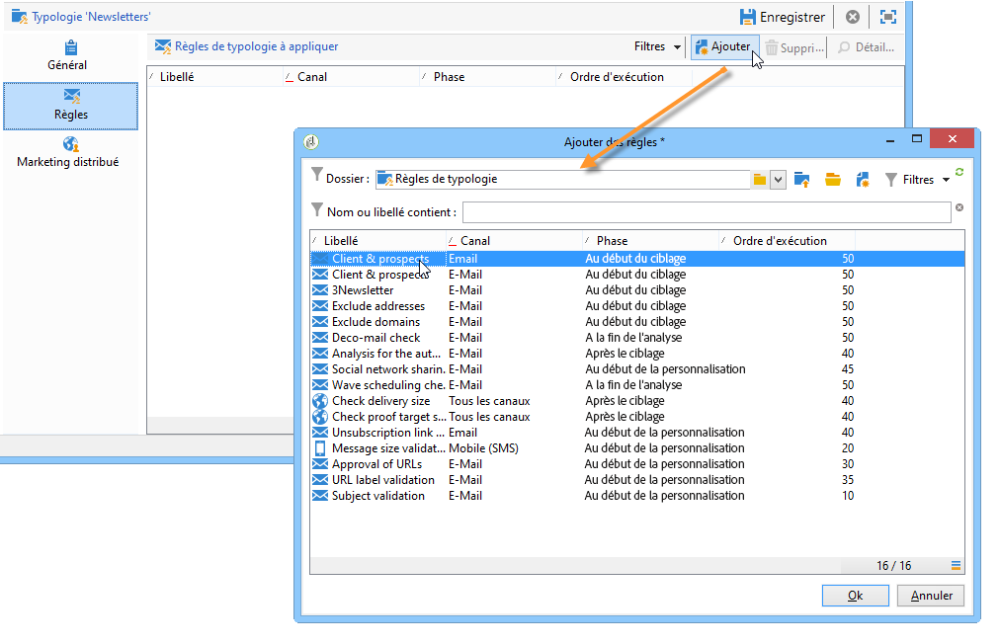

# Application de règles de typologie{#applying-rules}

## Application dʼune typologie à une diffusion {#apply-a-typology-to-a-delivery}

Pour appliquer les règles de typologie que vous avez créées, associez-les à une typologie, puis référencez cette typologie dans votre diffusion.

Pour ce faire, procédez comme suit :

1. Créez une typologie de campagne.

   Accédez aux typologies dans le dossier **[!UICONTROL Administration > Gestion de campagne > Gestion des typologies]** > **[!UICONTROL Typologies]** de l’explorateur Campaign.

1. Accédez à l&#39;onglet **[!UICONTROL Règles]**, cliquez sur le bouton **[!UICONTROL Ajouter]** et sélectionnez les règles à appliquer avec cette typologie.

   

1. Enregistrez la typologie : elle est alors ajoutée à la liste des typologies existantes.
1. Ouvrez la diffusion à laquelle vous souhaitez appliquer les règles.
1. Accédez aux propriétés de la diffusion et ouvrez l’onglet **[!UICONTROL Typologie]**.
1. Sélectionnez la typologie dans la liste déroulante.

   

   >[!NOTE]
   >
   >La typologie peut être définie au niveau du modèle de diffusion afin d&#39;être appliquée automatiquement à toutes les diffusions créées à partir de ce modèle.

## Définition des conditions d’application {#define-application-conditions}

Vous pouvez restreindre le champ d&#39;application d&#39;une règle selon vos besoins (sauf pour les règles de contrôle).

En effet, les règles de typologie peuvent ne concerner que certaines diffusions auxquelles elles sont associées, ou certains destinataires parmi la cible d&#39;une diffusion.

Pour définir les critères d&#39;application d&#39;une règle, cliquez sur le lien **[!UICONTROL Editer les critères d&#39;application de la règle...]**, dans l&#39;onglet **[!UICONTROL Général]**.

Utilisez alors le requêteur pour définir les conditions de filtrage. Dans l&#39;exemple ci-dessous, seules les diffusions contenant le terme &#39;offre&#39; dans leur libellé, et celles créées avant le 1er avril 2013, sont concernées par la règle de capacité.

>[!NOTE]
>
>Pour les règles de filtrage, vous pouvez sélectionner le contexte d&#39;application des critères de filtrage : ils peuvent dépendre de la diffusion ou de la composition de diffusion. [En savoir plus](filtering-rules.md#condition-a-filtering-rule).

## Réglage de la fréquence des calculs {#adjust-calculation-frequency}

Les arbitrages sont automatiquement ré-exécutés chaque nuit, via le workflow de nettoyage de la base de données. Vous pouvez toutefois conserver les valeurs calculées au-delà de ce délai.

En effet, certains calculs utilisent des valeurs qui ne sont pas modifiées tous les jours. Il est donc inutile de recalculer les données chaque jour et de surcharger inutilement la base de données. Par exemple, si un processus enrichit la base de données marketing avec des informations relatives aux affinités et aux achats des clients et des clientes sur une base hebdomadaire, les données basées sur ces valeurs n’ont pas besoin d’être recalculées tous les jours.

Pour ce faire, la variable **[!UICONTROL Fréquence]** du champ **[!UICONTROL Général]** vous permet de définir une période maximale pendant laquelle le ciblage est enregistré. Par défaut, la valeur **0** indique que le calcul reste valide jusqu’à la prochaine exécution du ré-arbitrage quotidien.

Pour conserver les résultats au-delà de cette limite, indiquez une valeur supérieure à 12h dans le champ **[!UICONTROL Fréquence]** : une fois ce délai expiré, toutes les règles sont réappliquées.

L&#39;option **[!UICONTROL Réappliquer la règle au début de la personnalisation]** permet d&#39;appliquer systématiquement la règle lors de la phase de personnalisation, y compris si le délai indiqué dans le champ **[!UICONTROL Fréquence]** n&#39;a pas expiré.

## Sélectionner la phase d&#39;application de la règle {#selecting-the-rule-application-phase}

Les règles de typologies sont exécutées dans un ordre précis lors des phases de ciblage, d&#39;analyse et de personnalisation des diffusions auxquelles elles s&#39;appliquent.

### Ordre d&#39;exécution {#execution-order}

Dans un fonctionnement standard, les règles sont appliquées dans l&#39;ordre suivant :

1. Règles de contrôle, si elles s&#39;appliquent au début du ciblage.
1. Règles de filtrage :

   * Règles d&#39;application natives pour la qualification des adresses : adresse définie/adresse non vérifiée/adresse sur liste bloquée/adresse mise en quarantaine/qualité de l&#39;adresse.
   * Règles de filtrage définies par l&#39;utilisateur.
   * Règle de déduplication sur l&#39;adresse ou sur l&#39;identifiant (appliquée si nécessaire).

1. Règles de pression.
1. Règles de capacité.
1. Règles de contrôle, si elles s&#39;appliquent à la fin du ciblage.
1. Règles de contrôle, si elles s’appliquent au début de la personnalisation. Si les règles utilisateurs (filtrage/pression/capacitif) sont à recalculer du fait de leur expiration, elles sont réappliquées à cette étape.
1. Règles de contrôle, si elles s&#39;appliquent à la fin de la personnalisation.

>[!NOTE]
>
>Si vous utilisez le module Interaction de Campaign, les règles d&#39;éligibilité aux offres sont appliquées avec les règles de filtrage (pour les offres présentes dans les compositions de diffusion) ou lors de la phase de personnalisation, lors de l&#39;appel au moteur d&#39;offres.

Vous pouvez adapter l&#39;ordre d&#39;exécution des règles du même type à partir du champ correspondant dans la **[!UICONTROL Général]** de la règle. Lorsque plusieurs règles sont exécutées lors de la même phase de traitement des messages, vous pouvez paramétrer leur ordre d&#39;exécution dans la variable **[!UICONTROL Ordre d&#39;exécution]** champ .

Par exemple, une règle de pression dont l’ordre d’exécution est positionné à 20 sera exécutée avant une règle de pression dont l’ordre d’exécution est positionné à 30.

### Règles de contrôle {#control-rules}

Pour les règles de **[!UICONTROL contrôle]**, vous pouvez choisir l’étape du cycle de vie des diffusions à laquelle la règle sera appliquée : avant ou après le ciblage, au début de la personnalisation ou à la fin de l’analyse. Sélectionnez la valeur à appliquer dans la liste déroulante du champ **[!UICONTROL Phase]**, sous l’onglet **[!UICONTROL Général]** de la règle de typologie.

Les valeurs possibles sont les suivantes :

* **[!UICONTROL Au début du ciblage]**

  La règle de contrôle peut être appliquée à cette phase afin de ne pas exécuter l&#39;étape de personnalisation en cas d&#39;erreur.

* **[!UICONTROL Après le ciblage]**

  Lorsqu&#39;il est utile de connaître le volume de la cible pour appliquer la règle de contrôle, sélectionnez cette phase.

  Par exemple, la règle de contrôle **[!UICONTROL Vérification de la taille des BAT]** s&#39;applique obligatoirement après l&#39;étape de ciblage : cette règle permet de ne pas préparer la personnalisation des messages si les destinataires du BAT sont trop nombreux.

* **[!UICONTROL Au début de la personnalisation]**

  Cette phase doit être sélectionnée lorsque le contrôle porte sur la validation de la personnalisation des messages. La personnalisation des messages est réalisée au cours de la phase d&#39;analyse.

* **[!UICONTROL A la fin de l&#39;analyse]**

  Lorsqu&#39;un contrôle nécessite que la personnalisation des messages soit terminée, sélectionnez cette phase.

## Configurations supplémentaires {#additional-configurations}

### Contrôle du trafic SMTP sortant {#control-outgoing-smtp-traffic}

Vous pouvez utiliser le champ **[!UICONTROL Gestion des affinités avec les adresses IP]** pour associer les diffusions au serveur de diffusions (MTA) qui gère l&#39;affinité en question. Ainsi, il est possible de limiter l&#39;envoi d&#39;emails pour des diffusions spécifiques, vers certaines machines ou adresses de sortie.

>[!NOTE]
>
>La gestion des affinités ne s&#39;applique pas pour les typologies de type **[!UICONTROL Filtrage]**.

<!--
>Affinities are defined in the instance configuration file, on the Adobe Campaign server. For more on this, refer to [this section](../../installation/using/about-initial-configuration.md).-->

### Campaign Optimization et le Marketing Distribué {#campaign-optimization-and-distributed-marketing}

L&#39;onglet **[!UICONTROL Marketing Distribué]** permet de définir le paramétrage d&#39;une opération collaborative et les entités locales impliquées par cette opération lors de la commande de celle-ci. Les typologies/règles définies pour une entité locale (associées aux typologies/règles définies pour le central) remplacent les règles/typologies associées au central. Le remapping permet d&#39;adapter les règles du central aux règles des entités locales qui ont commandé l&#39;opération.

>[!NOTE]
>
>Dans les typologies et règles de typologie, l&#39;onglet **[!UICONTROL Marketing Distribué]** est proposé si votre licence inclut cette option : vérifiez votre contrat de licence.\
>Pour plus d&#39;informations sur le marketing distribué, consultez [cette section](../distributed-marketing/about-distributed-marketing.md).
