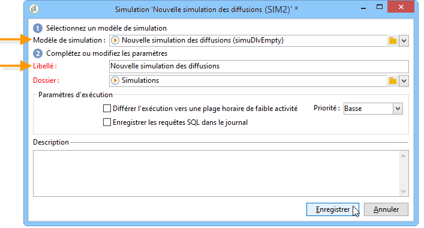

# Simulations de campagnes{#campaign-simulations}

Campaign Optimization permet de tester l&#39;efficacité d&#39;un plan de campagne au travers des simulations. Vous pouvez ainsi mesurer le succès potentiel d&#39;une campagne : le revenu généré, le volume de la cible en fonction des règles de typologies appliquées, etc.

La simulation permet de suivre et de comparer l&#39;impact des diffusions les unes par rapport aux autres.

## Configurer une simulation {#set-up-a-simulation}

### Attention

Les diffusions préparées en mode **Test** n&#39;ont pas d&#39;impact les unes sur les autres, par exemple lors de l&#39;évaluation d&#39;une campagne dans le cadre du marketing distribué, ou tant que l&#39;inscription des diffusions au calendrier prévisionnel n&#39;est pas validée.

Cela signifie que les règles de pression et de capacité ne s&#39;appliquent qu&#39;aux diffusions dans le mode **[!UICONTROL Estimation de la cible et personnalisation des messages]**. Les diffusions des modes **[!UICONTROL Estimation et validation de la cible prévisionnelle]** et **[!UICONTROL Évaluation de la cible]** ne sont pas prises en compte.

Le mode de diffusion est sélectionné dans les propriétés de la diffusion, sous l&#39;onglet **[!UICONTROL Typologie]**.

### Création dʼune simulation {#create-a-simulation}

Pour créer une simulation, les étapes sont les suivantes :

1. Ouvrez l’onglet **[!UICONTROL Campagnes]**, cliquez sur le lien **[!UICONTROL Autres choix]** de la section **[!UICONTROL Créer]** et choisissez l’option **[!UICONTROL Simulation]**.

   

1. Indiquez le modèle et le nom de la simulation. Cliquez sur le bouton **[!UICONTROL Enregistrer]** pour créer la simulation.

   

1. Cliquez sur l&#39;onglet **[!UICONTROL Edition]** pour la paramétrer.

   

1. Dans l&#39;onglet **[!UICONTROL Périmètre]**, indiquez les diffusions à considérer dans cette simulation. Pour cela, cliquez sur le bouton **[!UICONTROL Ajouter]** et indiquez le mode de sélection des diffusions à prendre en compte.

   

   Vous pouvez sélectionner unitairement chaque diffusion ou considérer celles appartenant à une ou plusieurs opérations, programmes ou plans.

   >[!NOTE]
   >
   >Si vous sélectionnez les diffusions d&#39;un plan, d&#39;un programme ou d&#39;une opération, Adobe Campaign peut réactualiser automatiquement la liste des diffusions à prendre en compte à chaque lancement de la simulation. Pour cela, cochez l&#39;option **[!UICONTROL Réactualiser la sélection des diffusions à chaque démarrage de la simulation]**.
   >  
   >Dans le cas contraire, seules les diffusions présentes dans le plan, le programme et la ou les opérations au moment de la création de la simulation seront prises en comptes : les diffusions ajoutées ultérieurement seront ignorées.

   

1. Sélectionnez les éléments à inclure dans le périmètre de la simulation. Au besoin, vous pouvez effectuer une multi-sélection en utilisant les touches MAJ et CTRL du clavier.

   

   Cliquez sur le bouton **[!UICONTROL Terminer]** pour valider la sélection.

   Il est possible de combiner des diffusions sélectionnées manuellement avec celles appartenant à un ou plusieurs plans, programmes ou opérations.

   

   Au besoin, vous pouvez utiliser une condition dynamique à partir du lien **[!UICONTROL Modifier la condition dynamique…]**

   Cliquez sur le bouton **[!UICONTROL Enregistrer]** pour valider ce paramétrage.

   >[!NOTE]
   >
   >Seules les diffusions dont la cible a été calculée sont prises en compte dans les calculs des simulations (états : **Cible prête** ou **Prête à être diffusée**).

1. Dans l&#39;onglet **[!UICONTROL Calculs]**, sélectionnez une dimension d&#39;analyse comme, par exemple, le schéma des destinataires.

   

1. Vous pouvez ensuite ajouter des expressions.

   

### Paramètres d&#39;exécution {#execution-settings}

Dans l&#39;onglet **[!UICONTROL Général]** de la simulation, vous pouvez indiquer ses paramètres d&#39;exécution :

* **[!UICONTROL Différer l&#39;exécution vers une plage horaire de faible activité]** reporte le lancement de la simulation vers une plage horaire moins chargée, en fonction du degré de priorité choisie. Une simulation est très coûteuse en termes de ressources sur le moteur de base de données. A ce titre, il est souvent utile de décaler l&#39;exécution des simulations non urgentes vers une plage de faible activité (la nuit par exemple).
* La **[!UICONTROL Priorité]** est le niveau appliqué à la simulation pour en différer le déclenchement.
* **[!UICONTROL Enregistrer les requêtes SQL dans le journal]**. Les journaux SQL permettent de diagnostiquer une simulation si elle se termine par des erreurs. Ils peuvent également vous aider à comprendre pourquoi une simulation est trop lente. Ces messages seront visibles après la simulation dans le sous-onglet **[!UICONTROL Logs SQL]** de l&#39;onglet **[!UICONTROL Suivi]**.

## Exécution dʼune simulation {#execute-a-simulation}

### Démarrage dʼune simulation {#start-a-simulation}

Une fois le périmètre de la simulation défini, vous pouvez l&#39;exécuter.

Pour cela, ouvrez le tableau de bord de la simulation et cliquez sur le bouton **[!UICONTROL Démarrer la simulation]**.

Une fois l&#39;exécution terminée, ouvrez la simulation et cliquez sur l&#39;onglet **[!UICONTROL Résultats]** pour visualiser les cibles calculées pour chacune des diffusions considérées.

1. Le sous-onglet **[!UICONTROL Diffusions]** liste les diffusions prises en compte par la simulation. Il présente deux comptages :

   * Le **[!UICONTROL Comptage initial]** correspond à la cible telle qu&#39;elle a été calculée lors de son estimation, au niveau de la diffusion.
   * Le **[!UICONTROL Comptage final]** affiche le nombre de destinataires comptabilisés après l&#39;exécution de la simulation.

     Le delta entre comptage initial et final reflète l&#39;application des différentes règles ou filtrages paramétrés en amont de la simulation.

     Pour comprendre ce calcul, éditez le sous-onglet **[!UICONTROL Exclusions]**.

1. Le sous-onglet **[!UICONTROL Exclusions]** permet de visualiser la répartition des exclusions par diffusions.

   

1. Le sous-onglet **[!UICONTROL Alertes]** regroupe tous les messages d&#39;alerte générés lors de la simulation. Ainsi, les messages d&#39;alerte peuvent avertir l&#39;utilisateur d&#39;un dépassement de capacité (par exemple : trop de destinataires ciblés par rapport à la capacité fixée).
1. Le sous-onglet **[!UICONTROL Exploration des exclusions]** permet de créer un tableau d&#39;analyse des résultats. L&#39;utilisateur doit indiquer des variables dans les axes des abscisses/ordonnées.

   Pour obtenir un exemple de création de table d&#39;analyse, reportez-vous à la fin de [cette section](#explore-results).

### Affichage des résultats {#view-results}

#### Journal {#audit}

L&#39;onglet **[!UICONTROL Journal]** sert à suivre l&#39;exécution de la simulation. Le sous-onglet **[!UICONTROL Logs SQL]** est utile aux utilisateurs experts. Il répertorie les logs d&#39;exécution, en langage SQL. Ces logs ne s&#39;affichent que si l&#39;option **[!UICONTROL Enregistrer les requêtes SQL dans le journal]** a été sélectionnée dans l&#39;onglet **[!UICONTROL Général]** avant l&#39;exécution de la simulation.

#### Exploration des résultats {#explore-results}

Le sous-onglet **[!UICONTROL Exploration des exclusions]** permet d&#39;analyser les données issues de la simulation.

<!--
Descriptive analysis is detailed in [this section](../../reporting/using/about-adobe-campaign-reporting-tools.md).
-->

## Résultats d’une simulation {#results-of-a-simulation}

Les indicateurs présentés dans l&#39;onglet **[!UICONTROL Résultats]** donnent un premier aperçu du résultat de la simulation. **** Pour obtenir une vue plus détaillée des résultats, ouvrez l&#39;onglet **[!UICONTROL Rapports]**.

### Rapports  {#reports}

Pour analyser le résultat d&#39;une simulation, éditez les rapports qui lui sont associés: ils présentent les exclusions de la simulation et leurs causes.

Par défaut, les rapports suivants sont proposés :

* **[!UICONTROL Détail des exclusions de la simulation]** : ce rapport propose un tableau détaillé de toutes les causes d&#39;exclusion, pour toutes les diffusions concernées par cette simulation.
* **[!UICONTROL Résumé de la simulation]** : ce rapport résume les volumes de populations exclues par la simulation, dans les différentes diffusions concernées.
* **[!UICONTROL Synthèse des exclusions dues à la simulation]** : ce rapport affiche un tableau des exclusions dues à la simulation, avec la règle de typologie appliquée, et un graphique représentant la proportion d&#39;exclusion par règle.

<!--
>[!NOTE]
>
>You can create new reports and add them to the ones offered. For more on this, refer to [this section](../../reporting/using/about-adobe-campaign-reporting-tools.md).
-->

Pour accéder aux rapports, cliquez sur le lien **[!UICONTROL Rapports]** de la simulation visée à partir de son tableau de bord.

Vous pouvez également éditer les rapports à partir du lien **[!UICONTROL Rapports]** accessible depuis le tableau de bord de la simulation.

### Comparaison des simulations {#compare-simulations-}

A nouvelle exécution d&#39;une simulation, le résultat calculé remplace le résultat antérieur : vous ne pouvez pas afficher et comparer les résultats d&#39;une exécution à l&#39;autre.

Pour comparer les résultats, vous devez utiliser les rapports. En effet, Adobe Campaign permet d&#39;enregistrer un historique de rapport afin de le ré-afficher ultérieurement : cet historique est conservé tout au long du cycle de vie de la simulation.

**Exemple:**

1. Créez une simulation sur une diffusion à laquelle la typologie **A** est appliquée.
1. Dans l&#39;onglet **[!UICONTROL Rapports]**, éditez un des rapports disponibles, par exemple **[!UICONTROL Détail des exclusions de la simulation]**.
1. Dans la section supérieure droite du rapport, cliquez sur l&#39;icône de création d&#39;un nouvel historique.

   

1. Fermez cette simulation et modifiez le paramétrage de la typologie **A**.
1. Exécutez à nouveau la simulation et comparez le résultat obtenu à celui affiché dans le rapport dont vous avez créé l&#39;historique.

   

   Vous pouvez enregistrer autant d&#39;historiques de rapports que nécessaire.

### Axes de reporting {#reporting-axes}

L&#39;onglet **[!UICONTROL Calculs]** vous permet de définir des axes de reporting sur la cible. Ces axes seront utilisés pendant l&#39;[analyse des résultats](#explore-results).

>[!NOTE]
>
>Il est recommandé de définir des axes de calculs dans un modèle de simulation plutôt que dans chaque simulation.\
>Les modèles de simulation sont enregistrés dans le dossier **[!UICONTROL Ressources > Modèles > Modèles de simulation]** de l’explorateur Campaign.

**Exemple:**

Dans l&#39;exemple suivant, nous allons créer un axe de reporting supplémentaire portant sur le statut du destinataire (&quot;Client&quot;, &quot;Prospect&quot; ou aucun).

1. Pour définir un axe de reporting, sélectionnez la table contenant les informations à exploiter dans le champ **[!UICONTROL Dimension d&#39;analyse]**. Cette information est obligatoire.
1. Ici, nous allons sélectionner le champ Segment de la table des destinataires.

   

1. Les options disponibles sont les suivantes :

   * **[!UICONTROL Générer les statistiques de recouvrement des cibles]** afin d&#39;obtenir toutes les statistiques de recouvrement dans le rapport de simulation. Le recouvrement correspond aux destinataires ciblés dans au moins deux diffusions d&#39;une même simulation.

     >[!CAUTION]
     >
     >Le choix de cette option augmente considérablement le temps d&#39;exécution de la simulation.

   * **[!UICONTROL Conserver la table de travail de la simulation]** afin de garder des traces de la simulation.

     >[!CAUTION]
     >
     >La conservation systématique de ces tables requiert une capacité de stockage élevée : assurez-vous que la taille de la base de données le permet.

A l&#39;affichage des résultats de la simulation, les informations relatives à l&#39;expression sélectionnée seront affichées dans le sous-onglet **[!UICONTROL Recouvrements]**.

Les recouvrements des cibles de diffusions indiquent les destinataires ciblés dans au moins deux des diffusions d&#39;une simulation.

>[!NOTE]
>
>Ce sous-onglet n&#39;est affiché que si l&#39;option **[!UICONTROL Générer les statistiques de recouvrement des cibles]** a été activée.

Les informations relatives aux axes de reporting peuvent être exploitées dans les rapports d&#39;analyse des exclusions, créés sous le sous-onglet **[!UICONTROL Exploration des exclusions]**. [En savoir plus](#explore-results).
