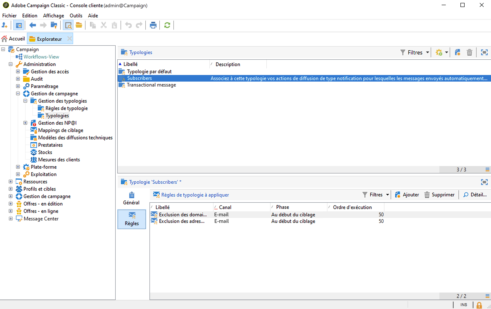

# Prise en main des typologies de campagne{#about-campaign-typologies}

**Le module d’optimisation des campagnes** d’Adobe Campaign permet de contrôler, de filtrer et de surveiller l’envoi des diffusions. Pour éviter les conflits entre les campagnes, Adobe Campaign peut tester différentes combinaisons en appliquant des règles de contrainte spécifiques. Elles permettent de s’assurer que les messages envoyés répondent aux attentes et aux besoins des clients et des stratégies de communication de l’entreprise.

 [Découvrez cette fonctionnalité en vidéo](#typologies-video)

>[!NOTE]
>
>Selon votre offre, Campaign Optimization peut être inclus ou proposé sous la forme d&#39;un composant additionnel. Vérifiez votre contrat de licence.

## Règles de typologie et typologies {#typology-rules}

Par défaut, Campaign est fourni avec des typologies et des règles de typologie intégrées.

Une typologie est un ensemble de règles de vérification appliquées à tous les messages lors de l’analyse de la diffusion.

Une typologie de campagne peut contenir plusieurs règles de typologie, mais une diffusion ne peut référencer qu’une seule typologie.

Les règles de typologies intégrées et les typologies sont disponibles dans le dossier **[!UICONTROL Administration > Gestion de campagne > Gestion des typologies]** de l’explorateur Campaign.

Pour chaque typologie, l’onglet **[!UICONTROL Règles]** vous permet d’ajouter, de supprimer ou de visualiser les règles de typologie à appliquer.

Une fois créées, les règles de typologie sont regroupées dans les **typologies** de campagne, qui sont référencées dans les diffusions. [En savoir plus](#apply-typologies).

Campaign est fourni avec un ensemble de règles de **filtrage** et de **contrôle** par défaut :

* Les règles de **filtrage** permettent d’exclure une partie de la cible en fonction des critères. [En savoir plus](filtering-rules.md).
* Les règles de **contrôle** vous permettent de vérifier la validité des messages avant leur envoi. [En savoir plus](control-rules.md).

Le module complémentaire Optimisation de campagne propose deux types supplémentaires de **règles de typologie** :

* Les règles de **pression** qui vous permettent de contrôler la lassitude marketing. [En savoir plus](pressure-rules.md).
* Les règles de **capacité** qui vous permettent de limiter les charges pour garantir des conditions de traitement optimales. [En savoir plus](consistency-rules.md#controlling-capacity).

>[!NOTE]
>
>Si vous utilisez le module **Interaction** pour gérer des offres, vous pouvez également créer des règles de typologie de **présentation des offres** pour contrôler le flux des propositions d’offres à l’aide des règles de présentation. [En savoir plus](../../v8/interaction/interaction-offer.md#offer-presentation).

## Étapes clés de création et d’utilisation des typologies {#apply-typologies}

Pour créer et utiliser une typologie pour vos diffusions, procédez comme suit :

1. Créez des règles de typologie et créez une typologie pour les y référencer.
Des étapes détaillées sont répertoriées dans la section suivante :

   * [Règles de filtrage](filtering-rules.md)
   * [Règles de contrôle](control-rules.md)
   * [Règles de pression](pressure-rules.md)
   * [Règles de capacité](consistency-rules.md)

1. Configurez votre diffusion pour utiliser la typologie que vous avez créée. [En savoir plus](apply-rules.md#apply-a-typology-to-a-delivery).
1. Testez et contrôlez le comportement par le biais de simulations de campagne. [En savoir plus](campaign-simulations.md).

Lors de la préparation de la diffusion, les destinataires sont exclus lorsque le critère est satisfait. Vous pouvez consulter les logs pour surveiller les exclusions.

Des exemples de cas d’utilisation des règles de typologie de pression sont disponibles dans [cette page](pressure-rules.md#use-cases-on-pressure-rules).

## Tutoriels vidéo {#typologies-video}

### Configurer la gestion de la lassitude à l&#39;aide de règles de typologie

Cette vidéo explique comment implémenter la gestion de la fatigue dans Adobe Campaign en utilisant les règles de typologie.

>[!VIDEO](https://video.tv.adobe.com/v/333787?quality=12)

### Configurer la gestion de la lassitude à l&#39;aide de filtres prédéfinis

La gestion de la lassitude contrôle la fréquence et le nombre des messages afin d&#39;éviter une sollicitation excessive des destinataires. Si votre instance ne contient pas le module d&#39;optimisation de campagne, vous pouvez configurer un filtre prédéfini qui filtrera la population cible en fonction du nombre de messages reçus.
Cette vidéo explique comment implémenter la gestion de la fatigue dans Adobe Campaign à l&#39;aide de filtres.

>[!VIDEO](https://video.tv.adobe.com/v/333778?quality=12)
