# Règles de cohérence{#consistency-rules}

Adobe Campaign permet d&#39;assurer la cohérence des communications au travers d&#39;un ensemble de règles regroupées dans des typologies de campagne. Ces règles ont pour objectif d&#39;assurer un contrôle sur les diffusions envoyées aux destinataires, leur volume, leur nature, leur pertinence, etc.

Des règles de **capacité** peuvent par exemple éviter de surcharger la plateforme concernée par la diffusion. Par exemple, une offre spéciale contenant un lien de téléchargement ne doit pas s’adresser au même moment à une population trop nombreuse afin de ne pas saturer le serveur, une campagne téléphonique ne doit pas excéder la capacité de traitement du centre d’appels, etc.

## Contrôle de la capacité {#control-capacity}

Avant de diffuser des messages, vous devez vous assurer que votre organisation a la capacité (infrastructure matérielle) de traiter la diffusion, les réponses que la diffusion peut générer (messages entrants) et le nombre d’appels à assurer pour contacter les personnes abonnées (capacité de traitement du centre d’appel), etc.

Pour cela, créez des règles de typologie de type **[!UICONTROL Capacité]**.

Dans l’exemple suivant, nous créons une règle de typologie pour une campagne de fidélité par téléphone. Nous limitons le nombre des messages à 20 par jour, ce qui correspond à la capacité de traitement quotidienne d’un centre d’appel. Une fois la règle appliquée à deux diffusions, nous pouvons suivre la consommation via les journaux.

Pour créer une règle de capacité, procédez comme suit :

1. Dans le dossier **[!UICONTROL Administration > Gestion de campagne > Gestion des typologies > Règles de typologie]**, cliquez sur **[!UICONTROL Nouveau]**.
1. Sélectionnez un type de règle **[!UICONTROL Capacité]**.

   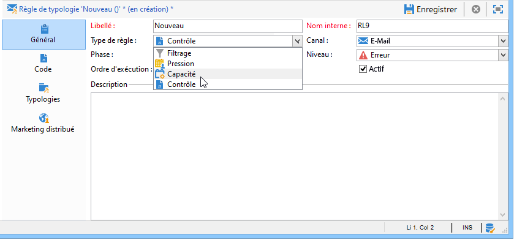

1. Dans l&#39;onglet **[!UICONTROL Capacité]**, créez les lignes de disponibilité : dans notre exemple, elles correspondent à des périodes pendant lesquelles les appels peuvent être passés. Sélectionnes 24 heures et saisissez 150 dans la quantité initiale, ce qui indique que le centre d&#39;appels peut traiter 150 appels par jour.

   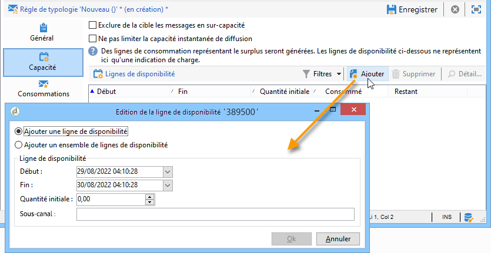

   >[!NOTE]
   >
   >Les lignes de disponibilité n&#39;ont qu&#39;un caractère indicatif. Si vous devez exclure des messages lorsque la limite de capacité est atteinte, reportez-vous à [cette section](#exclude-messages-when-capacity-limit-reached).

1. Associez cette règle à une typologie, puis référencez cette typologie au niveau de la diffusion pour appliquer cette règle de capacité. Pour plus d’informations, consultez [cette section](apply-rules.md#apply-a-typology-to-a-delivery).
1. Vous pouvez suivre la consommation dans les onglets **[!UICONTROL Consommations]** et **[!UICONTROL Capacité]**.

   Lorsqu&#39;une règle est utilisée dans une diffusion, les colonnes **[!UICONTROL Consommé]** et **[!UICONTROL Restant]** indiquent la charge utilisée, comme dans l&#39;exemple ci-dessous :

   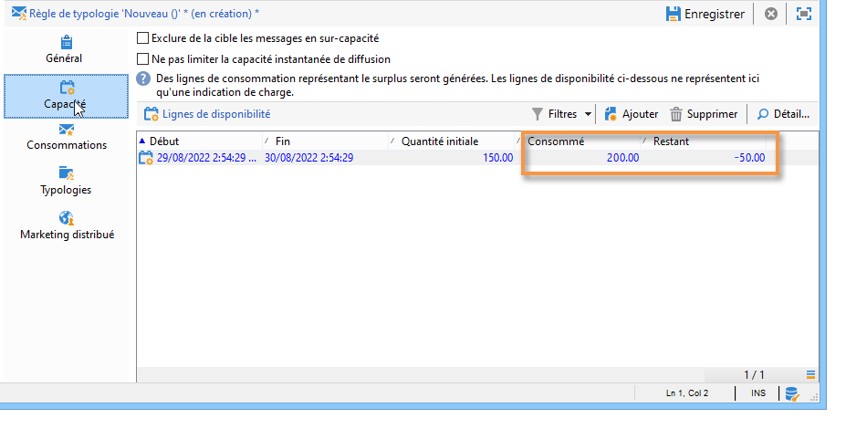

   Pour plus d’informations, consultez [cette section](#monitor-consumption).

## Définition de la charge maximale {#define-the-maximum-load}

Pour définir la charge maximale, vous devez définir les lignes de disponibilité. Pour ce faire, deux options sont disponibles : vous pouvez manuellement [créer une ou plusieurs lignes de disponibilité](#add-availability-lines-one-by-one) ou créer des plages de disponibilité. La fréquence de ces périodes peut être automatisée. [En savoir plus](#add-a-set-of-availability-lines).

### Ajout de lignes de disponibilité une par une {#add-availability-lines-one-by-one}

Pour créer unitairement une ligne de disponibilité, cliquez sur le bouton **[!UICONTROL Ajouter]** et sélectionnez l&#39;option **[!UICONTROL Ajouter une ligne de disponibilité]**. Renseignez la plage de disponibilité et la charge disponible.

Vous pouvez ajouter autant de lignes que nécessaires pour correspondre à votre capacité de traitement.

### Ajouter un ensemble de lignes de disponibilité {#add-a-set-of-availability-lines}

Pour définir des plages de disponibilité sur une période donnée, cliquez sur le bouton **[!UICONTROL Ajouter]** et sélectionnez l&#39;option **[!UICONTROL Ajouter un ensemble de lignes de disponibilité]**. Indiquez la durée de chaque plage et le nombre de plages à créer.

Pour automatiser la fréquence de création des plages, cliquez sur le bouton **[!UICONTROL Changer]** et définissez la planification des plages.

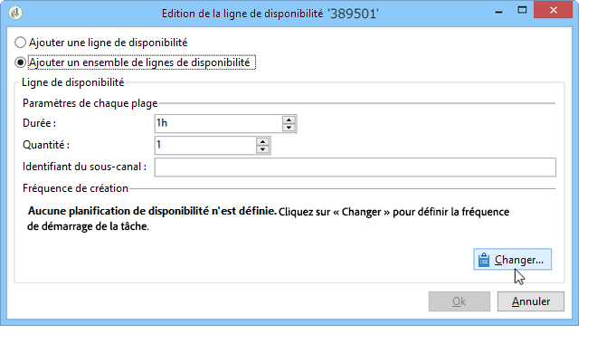

Par exemple, nous allons définir un planning afin de créer les plages de disponibilité pour tous les jours ouvrés, pour 10 appels par heure, entre 9h et 17h. Pour cela, les étapes de configuration sont les suivantes :

1. Sélectionnez le type de périodicité et les jours et heures de validité :

   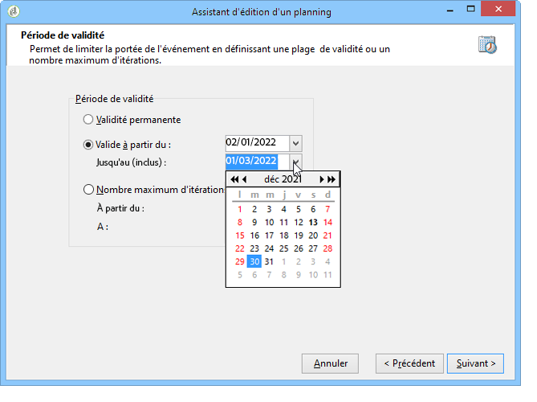

1. Indiquez les dates de validité :

   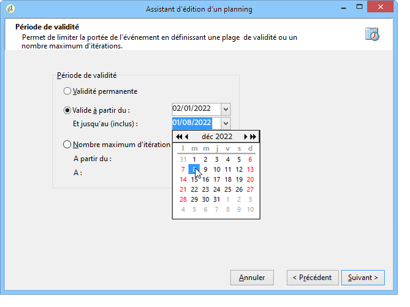

1. Vérifiez ce planning avant de le valider :

   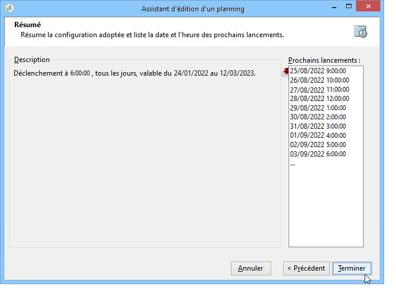

Le workflow **[!UICONTROL Prévisionnel]** crée automatiquement toutes les lignes correspondantes.

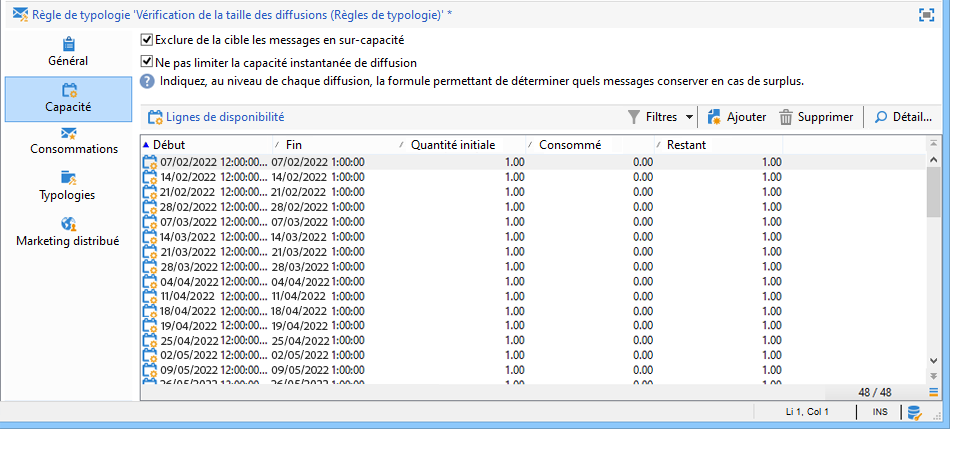

>[!NOTE]
>
>Il est recommandé de créer les lignes de disponibilité à partir d&#39;un import de fichier. Cet onglet permet alors de visualiser et contrôler les lignes de consommation.

## Exclure des messages lorsque la limite de capacité est atteinte {#exclude-messages-when-capacity-limit-reached}

Les lignes de disponibilité n’ont qu’un caractère indicatif. Pour exclure les messages excédentaires, cochez l’option **[!UICONTROL Exclure de la cible les messages en sur-capacité]**. Dans ce cas, la capacité ne pourra pas être dépassée. Pour la même population que dans l’exemple précédent, la consommation et la capacité restante ne pourront pas excéder la quantité initiale :

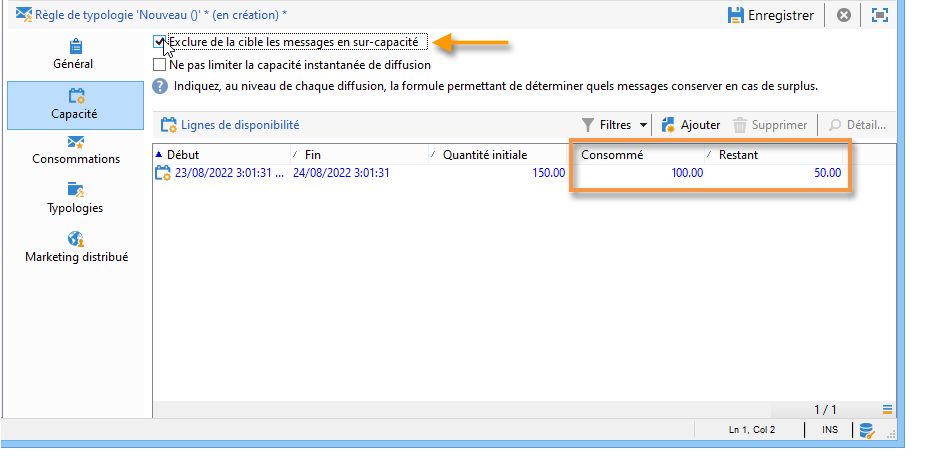

Le nombre maximum de messages qui peuvent être traités est réparti proportionnellement sur l’ensemble de la plage de disponibilité définie. Cela est particulièrement adapté aux centres d’appels, car leur nombre maximum d’appels par jour est limité. Dans le cas de diffusions par e-mail, l’option **[!UICONTROL Ne pas limiter la capacité instantanée de diffusion]** vous permet d’ignorer cette plage de disponibilité et d’envoyer vos e-mails en même temps.

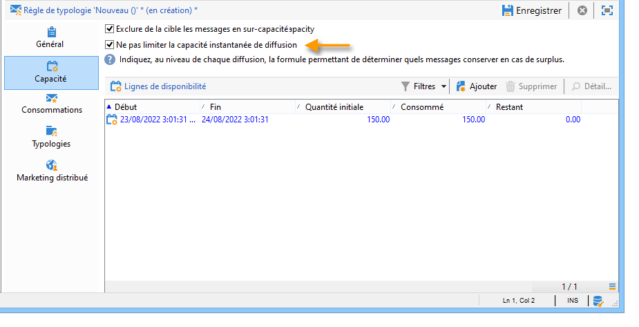

>[!NOTE]
>
>En cas de surcharge, les messages conservés sont sélectionnés selon la formule définie au niveau des propriétés de la diffusion.

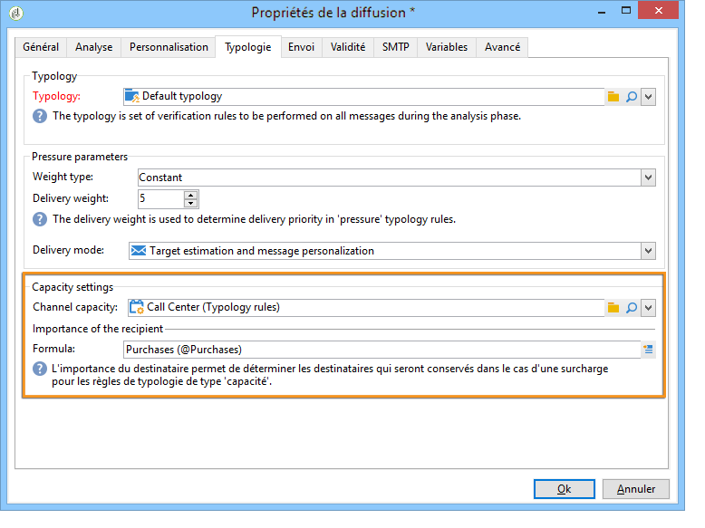

## Suivi de la consommation {#monitoring-consumption}

Par défaut, les règles de capacité n&#39;ont qu&#39;un caractère indicatif. Sélectionnez l&#39;option **[!UICONTROL Exclure de la cible les messages en sur-capacité]** pour que la charge définie ne puisse pas être dépassée. Dans ce cas, les messages excédentaires seront automatiquement exclus des diffusions utilisant cette règle de typologie.

Pour suivre les consommations, consultez les valeurs affichées dans la colonne **[!UICONTROL Consommé]** de l&#39;onglet **[!UICONTROL Capacité]** de la règle de typologie.

Pour visualiser les lignes de consommation, cliquez sur l&#39;onglet **[!UICONTROL Consommations]** de la règle.
