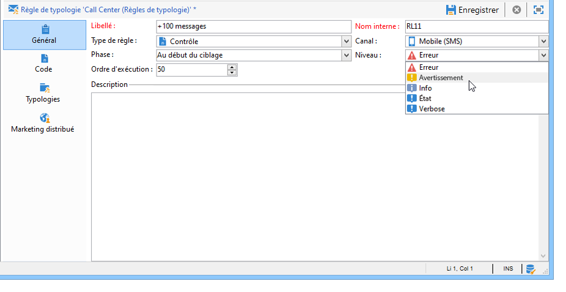
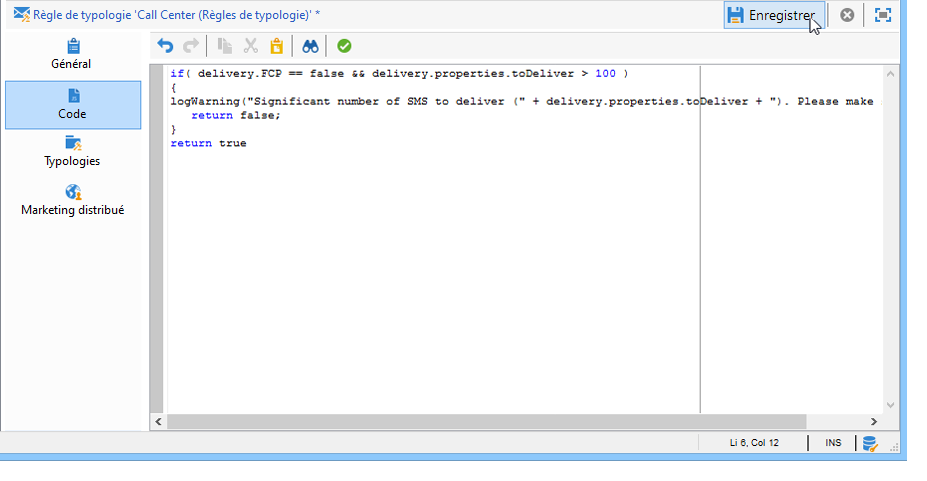
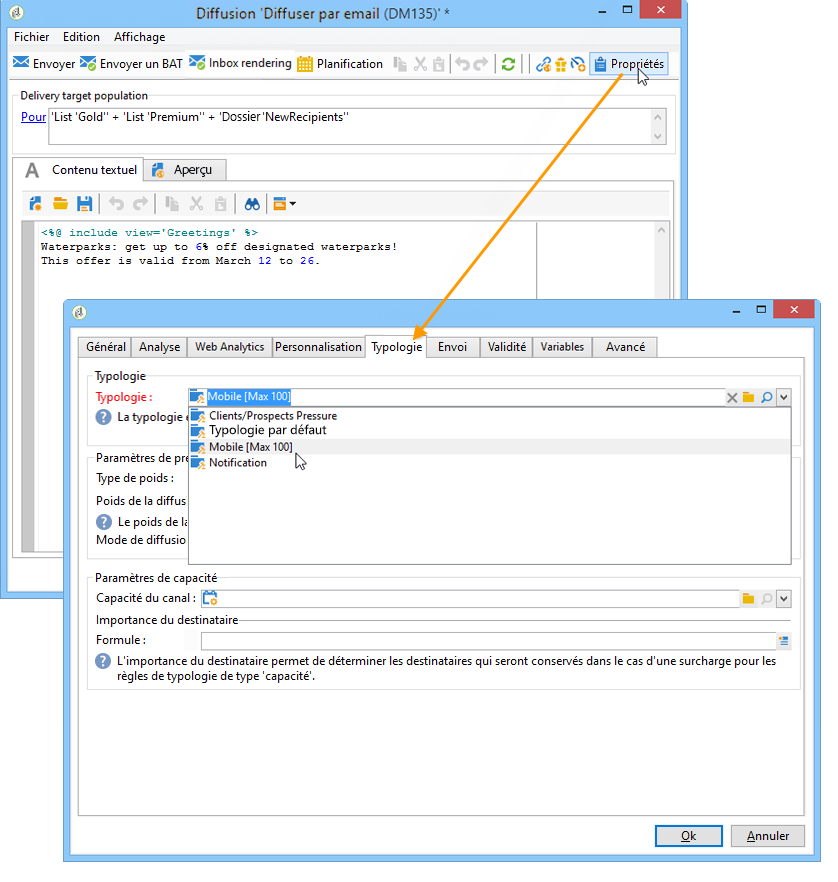
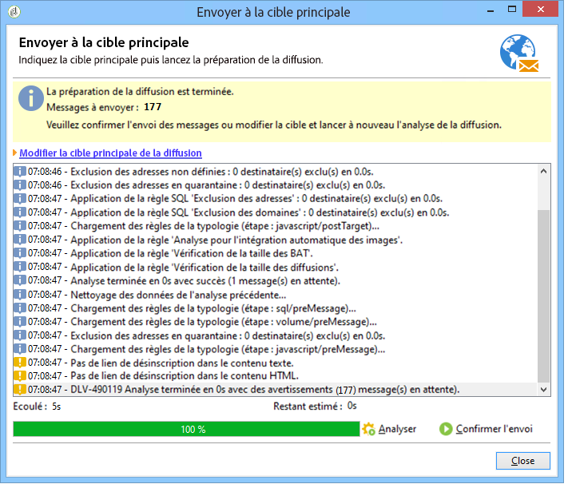
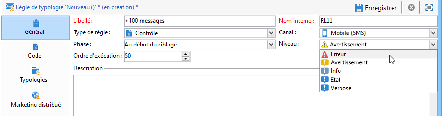
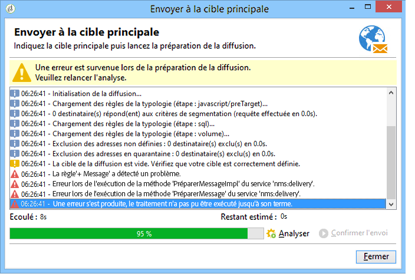

# Règles de contrôle{#control-rules}

Les règles de contrôle permettent de s&#39;assurer de la validité et la qualité des messages avant leur diffusion : bon affichage des caractères, taille des SMS, format des adresses, etc.

Un ensemble de règles livrées d&#39;usine assurent les contrôles usuels. Ces règles, qui apparaissent en gras dans l&#39;interface, sont les suivantes :

* **[!UICONTROL Validation du sujet]** (email) : vérifie que le sujet et l&#39;adresse de l&#39;expéditeur du message ne contiennent pas de caractères spéciaux, susceptibles de poser des problèmes sur certains agents mail.
* **[!UICONTROL Validation des libellés d&#39;URL]** (email) : vérifie la présence d&#39;un libellé pour chaque URL de tracking.
* **[!UICONTROL Validation des URL]** (email) : vérifie les URL de tracking (présence du caractère &quot;&amp;&quot;).
* **[!UICONTROL Validation de la taille du message]** (mobile) : vérifie la taille des messages SMS.
* **[!UICONTROL Vérification de la durée de validité]** (email) : vérifie que la durée de validité de la diffusion est suffisante pour l&#39;envoi de tous les messages.
* **[!UICONTROL Vérification de la taille des BAT]** (tous les canaux) : génère un message d&#39;erreur si la population cible d&#39;un BAT dépasse 100 destinataires.
* **[!UICONTROL Vérification de la planification des vagues]** (email) : vérifie que la dernière vague d&#39;envoi est planifiée avant la fin de validité de la diffusion, lorsque la diffusion est envoyée en plusieurs vagues.
* **[!UICONTROL Validation du lien de désinscription]** (email) : vérifie la présence d&#39;au moins une URL de désinscription (URL de type opt-out) dans chacun des contenus (HTML et Texte).

## Créer une règle de contrôle {#create-a-control-rule}

Afin de répondre à vos besoins, vous pouvez définir de nouvelles règles de contrôle. Pour cela, créez une règle de typologie de type **[!UICONTROL Contrôle]** et saisissez la formule de contrôle en SQL dans l&#39;onglet **[!UICONTROL Code]**.

**Exemple:**

Dans l&#39;exemple suivant, nous allons créer une règle afin de ne pas diffuser une offre par SMS à plus de 100 destinataires. Cette règle sera référencée dans une typologie de campagne qui sera associée aux diffusions SMS proposant l&#39;offre concernée.

Les étapes sont les suivantes :

1. Créez une règle de typologie de type **[!UICONTROL Contrôle]**. Sélectionnez un niveau d&#39;alerte de type Avertissement (**[!UICONTROL Warning]**).

   

1. Dans l&#39;onglet **[!UICONTROL Code]**, saisissez le script permettant d&#39;appliquer la limite souhaitée, comme dans l&#39;exemple suivant :

   

   Ce script permet de générer un avertissement lorsque la cible de la diffusion excède 100 contacts :

   ```
   if( delivery.FCP == false && delivery.properties.toDeliver > 100 ) { logWarning("Significant number of SMS to deliver (" + delivery.properties.toDeliver + "). Please make sure the target is correct.") return false; } return true
   ```

1. Associez cette règle à une typologie de campagne et référencez cette typologie dans la diffusion SMS concernée.

   

1. Lors de la phase d&#39;analyse de la diffusion, la règle est appliquée et un avertissement est généré, s&#39;il y a lieu.

   

   La diffusion est toutefois prête à être envoyée.

   Si vous augmentez le niveau d&#39;alerte, la diffusion ne pourra pas être démarrée.

   

   A la fin de l&#39;analyse, le bouton **[!UICONTROL Confirmer l&#39;envoi]** ne sera pas disponible.

   
