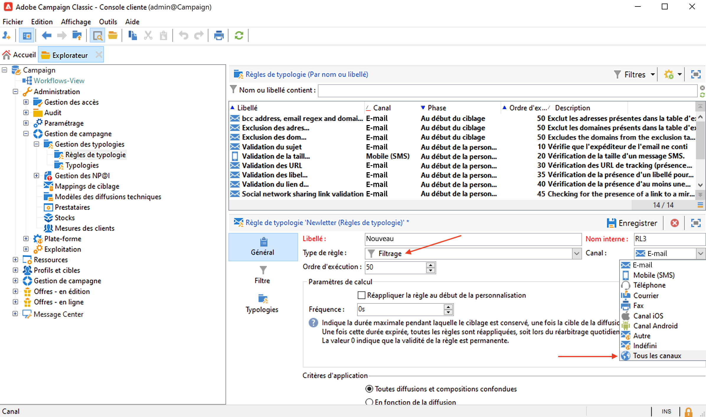
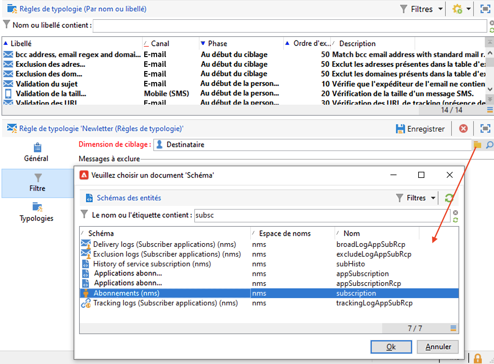
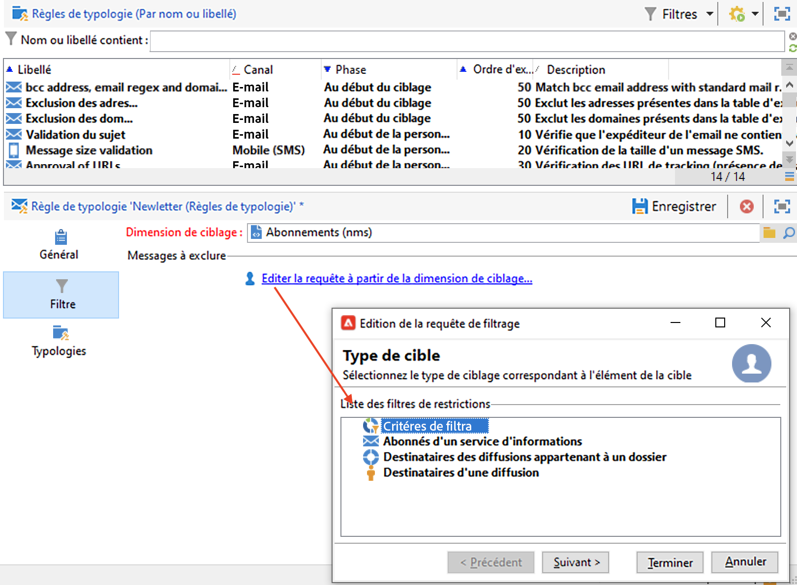
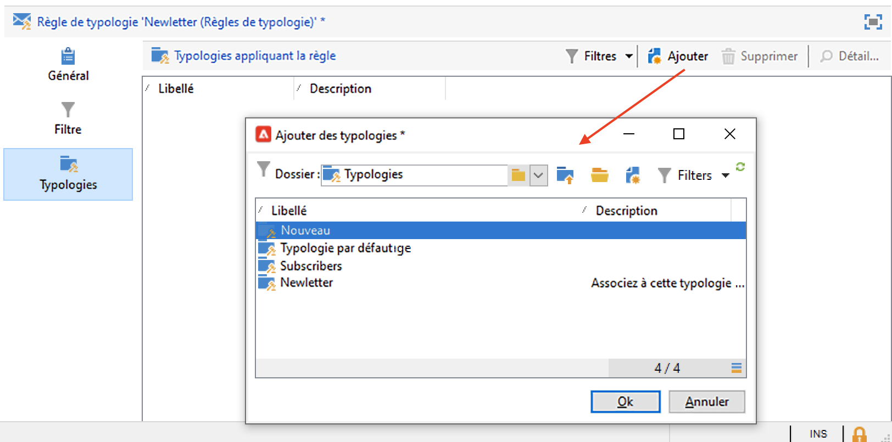
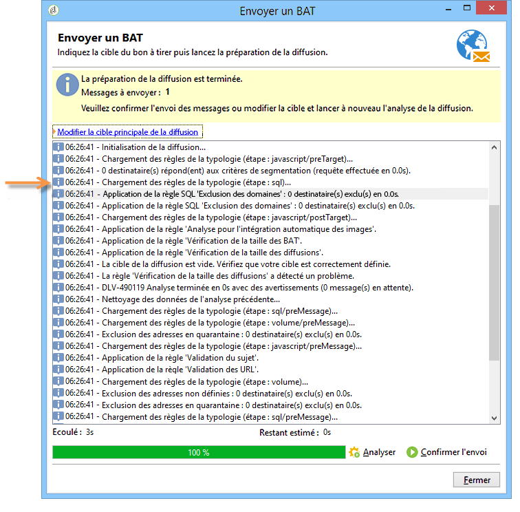
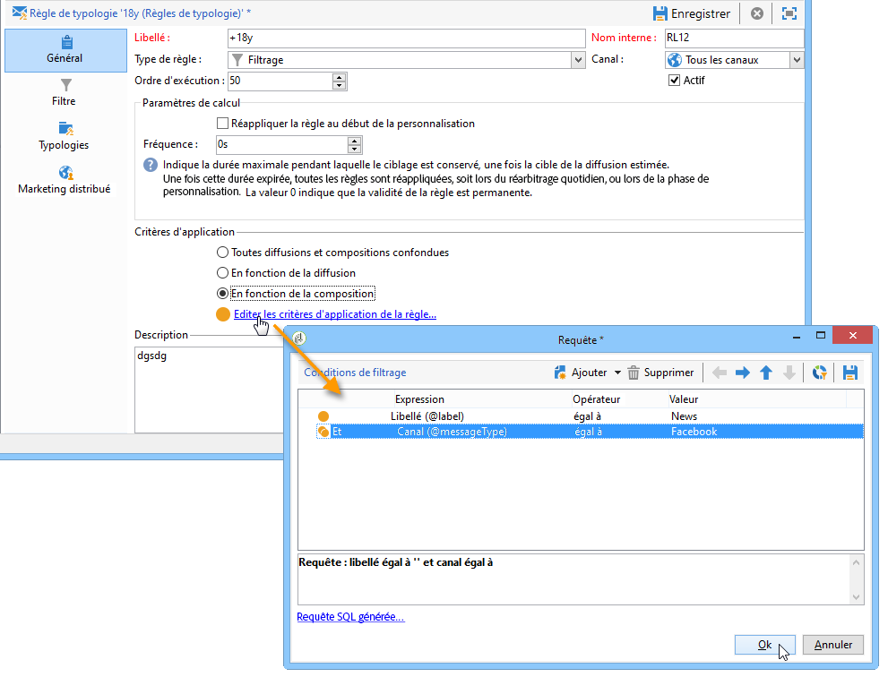
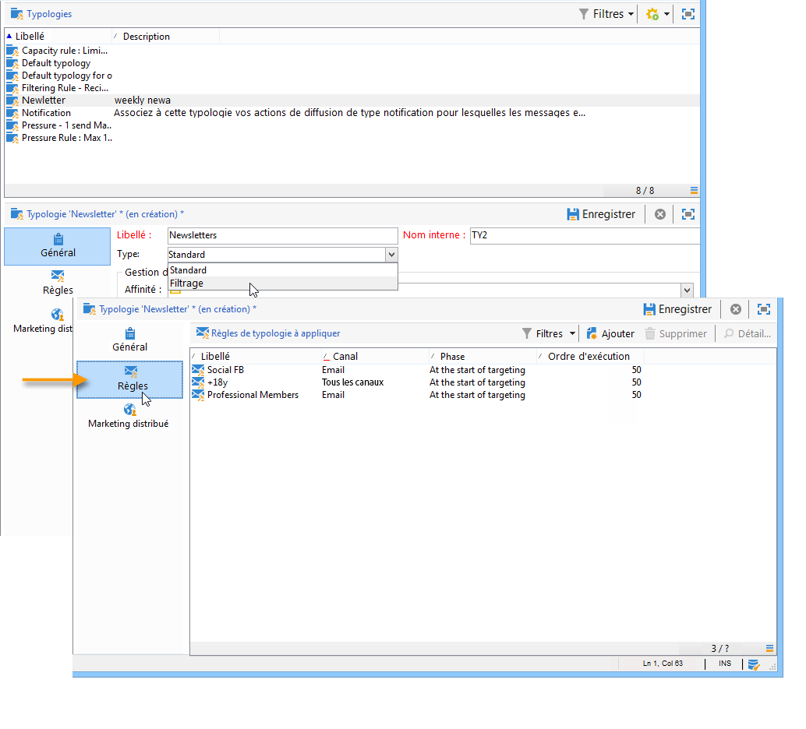
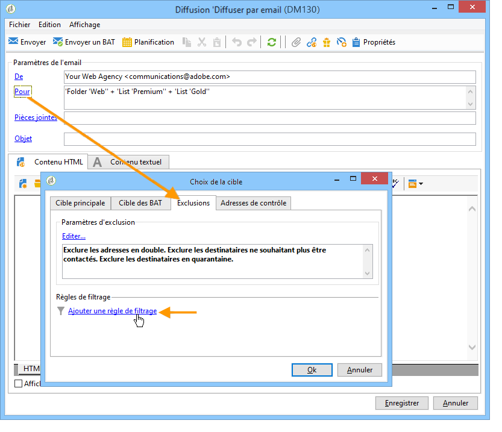
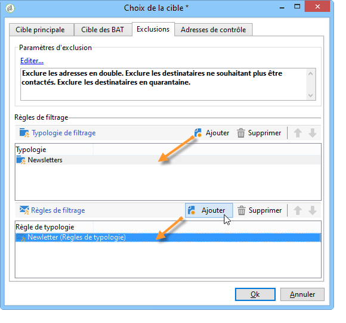

# Règles de filtrage{#filtering-rules}

Utilisez les règles de filtrage pour sélectionner les messages à exclure en fonction des critères définis dans une requête. Ces règles sont liées à une dimension de ciblage.

Les règles de filtrage peuvent être associées à d’autres types de règles (contrôle, pression, etc.) dans des typologies, ou regroupées dans une typologie dédiée de type **Filtrage**. [En savoir plus](#create-and-use-a-filtering-typology).

## Création dʼune règle de filtrage {#create-a-filtering-rule}

Vous pouvez par exemple filtrer les abonnés à vos newsletters afin de ne jamais adresser de communications aux inscrits mineurs.

Pour définir ce filtrage, les étapes sont les suivantes :

1. Accédez au dossier **[!UICONTROL Administration > Gestion de campagne > Gestion des typologies > Règles de typologie]** de l’explorateur Campaign, puis cliquez sur l’icône **Nouveau** pour créer une règle de typologie.
1. Créez une règle de typologie de type **[!UICONTROL Filtrage]**, applicable à tous les canaux.

   

1. Sous l’onglet **Filtre**, modifiez la dimension de ciblage par défaut en **Abonnements** (**nms:subscription**).

   

1. Créez le filtre à partir du lien **[!UICONTROL Éditer la requête à partir de la dimension de ciblage...]**.

   

1. Filtrez par âge des destinataires et enregistrez la condition de filtrage.

   

1. Sous l’onglet **Typologies**, liez cette règle à une typologie de campagne et enregistrez-la.

   

Lorsque cette règle est utilisée dans une diffusion, les abonnés mineurs sont automatiquement exclus. Un message spécifique indique à quel moment la règle est appliquée :

## Traitement dʼune règle de filtrage {#condition-a-filtering-rule}

Vous pouvez restreindre le champ d’application de la règle de filtrage en fonction de la diffusion ou de la composition de diffusion associée.

Pour ce faire, accédez à l’onglet **[!UICONTROL Général]** de la règle de typologie, sélectionnez le type de restriction à appliquer et créez le filtre.
<!--

-->

Dans ce cas, même si la règle est associée à toutes les diffusions, elle ne sera appliquée qu’aux diffusions répondant aux critères du filtre défini.

>[!NOTE]
>
>Les typologies et les règles de filtrage peuvent être utilisées dans un workflow, dans l&#39;activité **[!UICONTROL Composition de diffusion]**. [En savoir plus](../workflow/delivery-outline.md).

## Création et utilisation dʼune typologie de filtrage {#create-and-use-a-filtering-typology}

Vous pouvez créer des typologies de **[!UICONTROL Filtrage]** : elles ne contiennent que des règles de filtrage.

Ces typologies spécifiques peuvent être associées à une diffusion lors du choix de la cible : dans l&#39;assistant de diffusion, cliquez sur le lien **[!UICONTROL Pour]**, puis sur l&#39;onglet **[!UICONTROL Exclusions]**.

Sélectionnez ensuite la ou les typologies de filtrage à appliquer à la diffusion. Pour cela, cliquez sur le bouton **[!UICONTROL Ajouter]** et sélectionner la typologie à appliquer.

Vous pouvez également associer directement des règles de filtrage depuis cet onglet, sans qu&#39;elles soient regroupées dans une typologie. Pour cela, utilisez la section inférieure de la fenêtre.

>[!NOTE]
>
>Seules les typologies et règles de filtrage sont proposées dans la fenêtre de sélection.
>
>Ces paramétrages peuvent être définis au niveau du modèle de diffusion afin de les appliquer automatiquement à toute nouvelle diffusion créée à partir de ce modèle.

## Règles d&#39;exclusion de délivrabilité par défaut      {#default-deliverability-exclusion-rules}

Deux règles de filtrage sont disponibles par défaut : **[!UICONTROL Exclusion des adresses]** (**[!UICONTROL addressExclusions]**) et **[!UICONTROL Exclusion des domaines]** (**[!UICONTROL domainExclusions]**). Pendant l&#39;analyse de l&#39;e-mail, ces règles comparent les adresses e-mail des destinataires aux adresses ou noms de domaine interdits contenus dans une liste de suppression globale chiffrée, gérée dans l&#39;instance de délivrabilité. S&#39;il existe une correspondance, le message n&#39;est pas envoyé au destinataire concerné.

Ces règles d’exclusion permettent d’éviter toute mise en liste bloquée liée à une activité malveillante, notamment l’utilisation d’un spam trap (piège à spam). Si un spam trap est par exemple utilisé pour s’abonner par le biais de l’un de vos formulaires web, un email de confirmation lui est automatiquement envoyé. Votre adresse est alors automatiquement mise en liste bloquée.

>[!NOTE]
>
>Les adresses et les noms de domaine contenus dans la liste de suppression globale sont masqués. Seul le nombre des destinataires exclus est indiqué dans les logs d&#39;analyse de diffusion.
