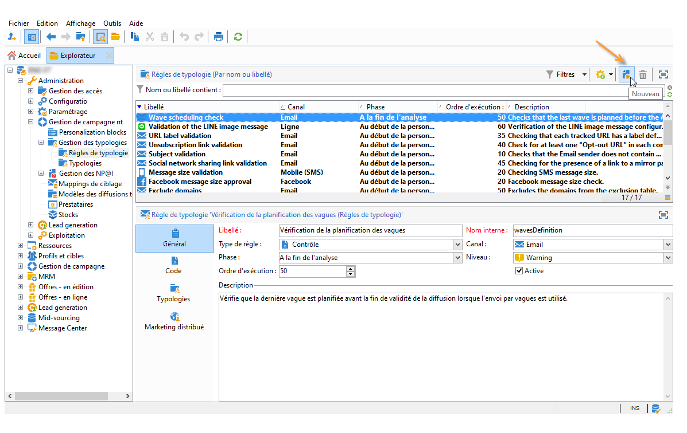
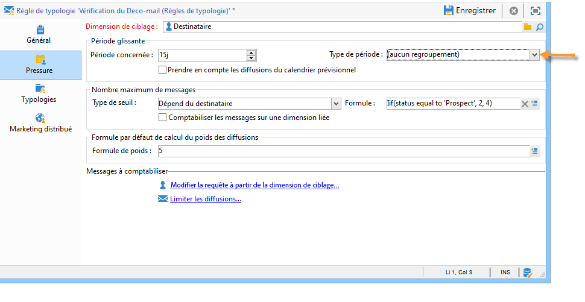

# Règles de pression{#pressure-rules}

La mise en place de la gestion de la pression commerciale permet de ne pas sur-solliciter la population de la base de données (fatigue marketing). Pour cela, vous pouvez définir le nombre de messages maximum par destinataire. Elle permet également la mise en place de règles d&#39;arbitrage entre les campagnes, afin d&#39;envoyer le message le mieux adapté à la population ciblée.

Les règles de **Pression** permettent de gérer la fatigue marketing, en limitant par exemple à deux le nombre de lettres envoyées à une population, en sélectionnant les communications qui répondront le mieux aux centres d&#39;intérêt d&#39;un groupe d&#39;abonnés, en évitant d&#39;envoyer un SMS à un client ayant manifesté son mécontentement, etc.

Les campagnes sont ainsi choisies en fonction des seuils définis et du poids de chaque message.

* Le seuil est le nombre maximal de diffusions autorisées pour un destinataire pendant une période donnée. Il peut être fixe ou variable. Il est fixé ou calculé dans les paramètres de la règle de typologie. [En savoir plus](#maximum-number-of-messages).
* Le poids des diffusions permet d’identifier les diffusions prioritaires dans le cadre de la gestion de la pression. Les messages dont le poids est le plus important sont prioritaires. [En savoir plus](#message-weight).

L&#39;arbitrage consiste à s&#39;assurer que les campagnes planifiées ayant un poids supérieur à la campagne en cours ne déclencheront pas une sur-sollicitation du profil : si tel est le cas, le profil est exclu de l&#39;action de diffusion.

Les critères d&#39;arbitrage (poids du message et/ou seuil du nombre de messages) peuvent varier selon deux types d&#39;information :

* les préférences des destinataires, qui correspondent à des informations déclaratives : abonnements à des newsletters, statut du destinataire (client ou prospect),
* les comportements des destinataires : achats, liens visités, etc.

La règle d&#39;arbitrage pour définir les messages éligibles est appliquée lors de l&#39;étape d&#39;analyse. Pour chaque destinataire et pour la période concernée, le message sera envoyé si la formule suivante est vraie : **(nombre de messages envoyés) + (nombre de messages ayant un poids supérieur) &lt; seuil**.

Dans le cas contraire, la personne destinataire sera **[!UICONTROL Exclue par arbitrage]**. [En savoir plus](#exclusion-after-arbitration).

## Créer une règle de pression {#create-a-pressure-rule}

Pour mettre en place l’arbitrage entre les campagnes sous Adobe Campaign, vous devez d’abord créer des typologies de campagnes et définir les règles de typologies associées. Ces règles seront de type **Pression**.

>[!NOTE]
>
>Pour appliquer correctement une règle de pression, la dimension de ciblage de la règle doit correspondre à celle du mapping de diffusion.

Pour créer et paramétrer une règle de typologie de type **[!UICONTROL Pression]**, les étapes sont les suivantes :

1. Dans la liste des règles de typologie de campagne, cliquez sur l&#39;icône **[!UICONTROL Nouveau]** située au-dessus de la liste.

   

1. Dans l’onglet **[!UICONTROL Général]** de la nouvelle règle, sélectionnez une règle de type **Pression** et saisissez son nom et sa description.

   

1. Changez l&#39;ordre d&#39;exécution en cas de besoin. Lorsque plusieurs règles de typologie sont appliquées en tant qu’ensemble de **[!UICONTROL typologies]**, les règles dont l’ordre est le plus bas sont appliquées en premier. [En savoir plus](apply-rules.md#execution-order).
1. Dans la section **[!UICONTROL Paramètres de calcul]**, définissez une fréquence si vous souhaitez enregistrer le ciblage au-delà de la prochaine exécution de réarbitrage quotidienne. [En savoir plus](apply-rules.md#adjust-calculation-frequency).
1. Cliquez sur l&#39;onglet **[!UICONTROL Pression]** et sélectionnez la période calendaire dans laquelle s&#39;inscrit la règle de typologie.

   

   La règle sera appliquée aux diffusions dont la date de contact est comprise dans la période concernée.

   >[!NOTE]
   >
   >Dans le contexte d’un [Déploiement Entreprise (FFDA)](../../v8/architecture/enterprise-deployment.md) dans Campaign, les diffusions planifiées ne sont pas prises en compte.

1. Indiquez le mode de calcul du nombre maximum de messages.

   Le seuil représente le nombre maximum de messages pouvant être envoyés à un même destinataire pendant la période concernée.

   Par défaut, le seuil est constant et vous devez indiquer le nombre maximum de messages autorisés par la règle.

   

   Pour définir un seuil variable, sélectionnez la valeur **[!UICONTROL Dépend du destinataire]** dans le champ **[!UICONTROL Type de seuil]**, et utilisez l&#39;icône située à droite du champ pour ouvrir l&#39;éditeur d&#39;expression.

   

   Pour plus d&#39;informations, reportez-vous à la section [Nombre maximum de messages](#maximum-number-of-messages).

1. Indiquez le mode de calcul du poids de la diffusion.

   Chaque diffusion a un poids, c&#39;est-à-dire une valeur qui correspond à son degré de priorité : il permet d&#39;arbitrer entre les campagnes. Le poids est calculé selon la formule définie dans la règle de typologie et/ou directement dans ses propriétés. [En savoir plus](#message-weight).

1. Par défaut, tous les messages sont pris en compte pour le calcul du seuil. L’onglet **[!UICONTROL Restriction]** vous permet de filtrer les messages concernés par la règle de typologie :

   * La section supérieure de cet onglet permet de restreindre les destinataires concernés.
   * La section inférieure de cet onglet permet de filtrer les messages à comptabiliser.

     Dans l&#39;exemple ci-dessous, seuls les destinataires enregistrés dans le dossier **NewContacts** sont pris en compte et seules les diffusions commençant par **Newsletter** sont concernées.

   

1. L&#39;onglet **[!UICONTROL Typologies]** permet de consulter les typologies de campagne qui appliquent cette règle de typologie et d&#39;associer cette règle à une ou plusieurs typologies existantes. [En savoir plus](campaign-typologies.md#apply-typologies).

## Définition des seuils et poids {#define-thresholds-and-weights}

### Nombre maximum de messages {#maximum-number-of-messages}

Chaque règle de pression définit un seuil, c&#39;est-à-dire le nombre maximum de messages pouvant être envoyés à chaque destinataire sur une période. Une fois ce seuil atteint, aucune campagne ne sera plus envoyée jusqu&#39;à la fin de la période concernée. Ce mode de fonctionnement permet d&#39;exclure automatiquement un destinataire d&#39;une diffusion si l&#39;envoi du message provoquait le dépassement du seuil défini, et ainsi une sur-sollicitation.

La valeur de ce seuil peut être constante ou calculée par une formule qui peut contenir des variables. Pour une même période, le seuil peut donc varier d&#39;un destinataire à l&#39;autre, et même pour un même destinataire.

>[!CAUTION]
>
>Un seuil de **0** interdit toute diffusion à la population cible pendant la période concernée.

**Exemple:**

Vous pouvez indexer le nombre de messages autorisés en fonction du segment auquel appartient le destinataire. Ainsi, il se peut qu’un destinataire appartenant au segment web reçoive davantage de messages que les autres destinataires. Une formule de type **[!UICONTROL Iif (@origin=&#39;Web&#39;, 5, 3)]** permet d’autoriser la diffusion de 5 messages à ces destinataires contre seulement 3 messages pour les destinataires des autres segments. La configuration sera donc la suivante :

Vous pouvez utiliser une dimension liée à la dimension de ciblage pour définir le seuil : par exemple, pour inclure les messages envoyés aux profils de destinataires stockés dans la [tableau des visiteurs](../../v8/audiences/target-mappings.md) ou pour éviter d’envoyer plus d’un message par semaine à un même foyer (qui peut potentiellement référencer plusieurs adresses e-mail), identifié dans une dimension liée à celle des destinataires.

Pour cela, sélectionnez l&#39;option **[!UICONTROL Comptabiliser les messages sur une dimension liée]**, puis sélectionnez la table des visiteurs ou celle des contrats.

### Poids du message {#message-weight}

Chaque diffusion a un poids qui représente son niveau de priorité. Par défaut, le poids d&#39;une diffusion est fixé à 5. Les règles de pression permettent de définir le poids des diffusions auxquelles elles sont appliquées.

Le poids peut être fixe ou calculé au travers d&#39;une formule afin de l&#39;adapter en fonction du destinataire. Par exemple, vous pouvez définir le poids d&#39;une diffusion en fonction des centres d&#39;intérêt d&#39;un destinataire.

>[!CAUTION]
>
>Le poids défini dans une règle de typologie peut être surchargé unitairement pour chaque diffusion, au niveau des **[!UICONTROL Propriétés]** de la diffusion. Cliquez sur l&#39;onglet **[!UICONTROL Typologie]** pour sélectionner la typologie de campagne et indiquez au besoin le poids à appliquer.\
>Par contre, un poids déclaré dans une règle de typologie A sera ignoré dans les calculs d&#39;une règle de typologie B : ce poids ne concerne que les diffusions utilisant la règle A.

**Exemple:**

Dans l&#39;exemple suivant, nous allons faire dépendre le poids des newsletters consacrées à la musique du niveau d&#39;appétence des destinataires pour ce sujet. Pour cela :

1. Créez un nouveau champ afin de stocker les scores de propension des destinataires. Ce champ, ici, **@Music** pourra être alimenté par des réponses aux enquêtes et questionnaires en ligne, les données de tracking collectées, etc.
1. Créez une règle de typologie afin de calculer le poids des messages en fonction de ce champ.

   

1. Appliquez cette règle aux messages sur ce sujet : newsletters, offres spéciales, etc. Le poids de ces diffusions, donc leur niveau priorité, dépendra ainsi du niveau d&#39;appétence de chaque destinataire.

## Définition de la période {#setting-the-period}

Les règles de pression sont définies par périodes glissantes de **n** jours.

La période est paramétrée dans l&#39;onglet **[!UICONTROL Pression]** de la règle. Vous pouvez y indiquer le nombre de jours et, au besoin, sélectionner le type de regroupement à appliquer (par jour, semaine, mois, trimestre, etc.).

Le type de regroupement permet d&#39;étendre la valeur du champ **[!UICONTROL Période concernée]** à l&#39;ensemble de la journée, de la semaine calendaire, du mois calendaire ou de l&#39;année calendaire des dates de la période.

Par exemple, une règle de pression qui définit un seuil de 2 messages par semaine, avec un regroupement au mois calendaire, empêchera l&#39;envoi de plus de deux diffusions dans la même semaine ET dans le même mois calendaire pour l&#39;ensemble de la période concernée. Attention, si la période chevauche deux mois, le calcul du seuil prendra en compte les diffusions de ces deux mois calendaires et pourrait donc empêcher toute nouvelle diffusion pendant le deuxième mois.

>[!CAUTION]
>
>Seules les diffusions déjà envoyées sont prises en compte dans le calcul du seuil.

Pour limiter les diffusions prises en compte pendant une période de 2 semaines, saisissez la valeur **15 j** dans le champ **[!UICONTROL Période concernée]** : les diffusions envoyées jusqu&#39;à 15 jours avant à la date de la diffusion à laquelle la règle est appliquée seront prises en compte dans le calcul.

Le jour de début de la période dépend du paramétrage de la base de données.

Ainsi, si l&#39;on applique à une diffusion du 11/11 une règle de pression s&#39;appliquant sur 15 jours et sans regroupement, la période pendant laquelle les diffusions seront prises en compte s&#39;étendra du 27/10 au 12/11. Si la règle de pression prend en compte les diffusions du calendrier prévisionnel, les diffusions comptabilisées seront celles dont la date de diffusion est comprise entre le 27/10 et le 27/11. Enfin, si l&#39;on paramètre au niveau de la règle un regroupement au mois calendaire, toutes les diffusions des mois d&#39;octobre et novembre seront prises en compte dans le calcul du seuil (du 1/10 au 30/11).

**Cas fréquent**

Pour ne prendre en compte que les diffusions de la semaine calendaire en cours et ne pas risquer de prendre également celles de la semaine précédente pour le calcul du seuil, définissez la **[!UICONTROL Période concernée]** à &#39;0&#39; et sélectionnez le **[!UICONTROL Type de période]** &#39;Regroupement à la semaine calendaire&#39;.

Dans le cas d&#39;une période supérieure à 0 (par exemple 1), le calcul du seuil pourrait prendre en compte les diffusions de la veille. Or, si la veille correspond à la semaine calendaire précédente et que le type de période sélectionné est &#39;Regroupement à la semaine calendaire&#39;, alors l&#39;ensemble de la semaine précédente serait prise en compte pour le calcul du seuil.

**Exemple:**

Nous allons créer une règle de pression qui limite la sollicitation à 3 messages sur une période de 15 jours, avec un regroupement au mois calendaire.

Soient 6 newsletters, d&#39;un poids équivalent, planifiées pour les 30/04, 3/05, 8/05, 12/05, 22/05 et 30/05.

Les diffusions des 12 et 30/05 ne seront pas envoyées : en effet, la diffusion du 12/05 excéderait le seuil autorisé de 3 messages par quinzaine, et la diffusion du 30 vient en sur-nombre par rapport au nombre de communications autorisées dans le mois calendaire.

Tous les destinataires de ces diffusions sont exclus par arbitrage lors de la phase d&#39;analyse :

Pour la même règle, si l&#39;on applique un regroupement des diffusions par trimestre, alors les destinataires de la **newsletter n°5** seront également exclus et elle ne sera pas envoyée.

Enfin, si aucun groupement n&#39;est sélectionné, seule la **newsletter n°4** ne sera pas envoyée, puisqu&#39;elle est planifiée dans la même quinzaine que les trois premières.

>[!NOTE]
>
>Lorsque vous modifiez la définition d&#39;une règle de typologie, vous pouvez créer une **Simulation** afin de contrôler son impact sur les diffusions auxquelles elle est appliquée et suivre l&#39;impact des diffusions entre elles. [En savoir plus](campaign-simulations.md).

## Exclusion par un arbitrage {#exclusion-after-arbitration}

L&#39;arbitrage est ré-appliqué chaque nuit via le workflow technique **[!UICONTROL Prévisionnel]** et le workflow **[!UICONTROL Traitement des opérations]**.

Le workflow **[!UICONTROL Prévisionnel]** pré-calcule les données sur la période écoulée (depuis la date de début de la période jusqu&#39;à maintenant) qui permettent à l&#39;analyse d&#39;appliquer les règles de typologie. Il re-calcule aussi chaque nuit les compteurs d&#39;exclusion pour les arbitrages.

Ainsi, pour chaque destinataire, Adobe Campaign vérifie que le nombre de messages à envoyer ne dépasse pas le seuil, en prenant en compte le nombre de messages déjà envoyés pour la période concernée. Ces informations ne sont que des **indicateurs** car tous les calculs sont mis à jour au moment de l&#39;envoi.

Si ce nombre est supérieur au seuil, les règles d&#39;arbitrage définies dans la typologie de campagne sont appliquées et les destinataires seront exclus par arbitrage des campagnes d&#39;un poids inférieur.

>[!NOTE]
>
>En cas d&#39;égalité entre plusieurs actions de diffusion, c&#39;est la campagne la plus proche dans le temps qui sera envoyée.

## Cas pratiques de règles de pression {#use-cases-on-pressure-rules}

### Adaptation du seuil selon un critère {#adapt-the-threshold-based-on-criterion}

Nous allons créer une règle de typologie afin de ne pas envoyer plus de 4 messages par semaine aux clients et pas plus de 2 messages par semaine aux prospects.

Pour identifier les clients et les prospects, nous allons utiliser le champ **[!UICONTROL Statut]** qui contient la valeur 0 pour les prospects et la valeur 1 pour les clients.

Les étapes de création de cette règle sont les suivantes :

1. Créez une nouvelle règle de typologie de type **Pression**.
1. Editez l&#39;onglet **[!UICONTROL Pression]** : dans la section **[!UICONTROL Nombre maximum de messages]**, nous allons créer une formule de calcul du seuil qui dépendra de chaque destinataire. Sélectionnez la valeur **[!UICONTROL Dépend du destinataire]** dans le champ **[!UICONTROL Type de seuil]** puis cliquez sur l&#39;icône **[!UICONTROL Editer l&#39;expression]** située à droite du champ **[!UICONTROL Formule]**.

   Cliquez sur le bouton **[!UICONTROL Sélection avancée]** pour définir la formule de calcul.

   

1. Choisissez l&#39;option **[!UICONTROL Editer la formule à partir d&#39;une expression]** et cliquez sur **[!UICONTROL Suivant]**.

   

1. Dans la liste des fonctions, double-cliquez sur la fonction **Iif**, dans le noeud **[!UICONTROL Autres]**.

   Sélectionnez ensuite le **Statut** du destinataire, dans la section **[!UICONTROL Champs disponibles]**.

   

   Complétez la formule comme suit : **Iif(@status=0,2,4)**

   

   Cette formule permet d&#39;attribuer la valeur 2 si le statut est égal à 0, et la valeur 4 pour tout autre statut.

   Cliquez sur **[!UICONTROL Terminer]** pour valider cette formule.

1. Indiquez la période concernée pour l&#39;application de la règle : ici 7 jours pour comptabiliser les messages à la semaine.

   

1. Enregistrez la règle pour en valider la création.

Vous devez maintenant associer la règle que vous venez de créer à une typologie afin de pouvoir l&#39;appliquer aux diffusions. Pour cela :

1. Créez une typologie de campagne.
1. Cliquez sur l&#39;onglet **[!UICONTROL Règles]**, puis sur le bouton **[!UICONTROL Ajouter]** et sélectionnez la règle que vous venez de créer.

   

1. Enregistrez la typologie : elle est alors ajoutée à la liste des typologies existantes.

Pour utiliser cette typologie dans vos diffusions, sélectionnez-la dans les propriétés de la diffusion, dans **[!UICONTROL Typologie]**, comme ci-dessous :

>[!NOTE]
>
>La typologie peut être définie au niveau du modèle de diffusion afin d&#39;être appliquée automatiquement à toutes les diffusions créées à partir de ce modèle.

Lors de l&#39;analyse de la diffusion, les destinataires des diffusions sont exclus ou non de la diffusion, selon le nombre de diffusions qui leur ont déjà été adressées. Pour visualiser cette information, vous pouvez :

* Observer le résultat de l&#39;analyse :

  

* Editer la diffusion et cliquer sur l&#39;onglet **[!UICONTROL Diffusion]**, puis sur le sous-onglet **[!UICONTROL Exclusions]** :

  

* Cliquer sur l&#39;onglet **[!UICONTROL Suivi]** puis sur le sous-onglet **[!UICONTROL Causes d&#39;exclusions]** pour afficher le nombre d&#39;exclusions et les règles de typologies appliquées :

  

### Calcul du poids de la diffusion en fonction du comportement {#calculate-the-delivery-weight-based-on-behavior}

Vous pouvez définir des règles de pression selon le comportement des destinataires : ainsi, le poids d&#39;une diffusion peut s&#39;adapter à des critères variables d&#39;un destinataire à l&#39;autre. Vous pouvez par exemple favoriser l&#39;envoi de tel ou tel message selon qu&#39;un destinataire ait visité ou non votre site internet, cliqué dans une rubrique spécifique de la dernière newsletter, qu&#39;il soit abonné ou non à un service d&#39;information ou en fonction des réponses fournies à une enquête ou un jeu en ligne, etc.

Dans l&#39;exemple suivant, nous allons créer une diffusion avec un poids de 5. A ce poids, seront ajoutées des valeurs d&#39;appétence selon le comportement des destinataires : ainsi, un client ayant déjà passé commande sur le site aura une valeur d&#39;appétence de 5, tandis qu&#39;un client n&#39;ayant jamais commandé en ligne aura une valeur d&#39;appétence de 4.

Pour effectuer ce type de configuration, vous devez utiliser une formule afin de définir le poids des messages. Les informations relatives aux scores de propension et les réponses fournies aux questionnaires doivent être accessibles dans le modèle de données. Dans notre exemple, le champs **Appétence** a été ajouté.

Les étapes de paramétrage sont les suivantes :

1. Créez une nouvelle règle de typologie de type **Pression**.
1. Editez l&#39;onglet **[!UICONTROL Pression]**. Nous allons créer une formule de calcul du seuil qui dépendra de chaque destinataire : cliquez sur l&#39;icône **[!UICONTROL Editer l&#39;expression]** située à droite du champ **[!UICONTROL Formule de poids]**.

   

1. Par défaut, la valeur **5** est renseignée dans la section supérieure de l&#39;éditeur d&#39;expression. Nous allons ajouter à ce poids la valeur d&#39;appétence de chaque destinataire : positionnez le pointeur à droite du chiffre 5, saisissez le caractère **+** au clavier et sélectionnez le champ **Appétence**.

   

1. Ajoutez ensuite une valeur supérieure pour les destinataires ayant déjà réalisé des achats. Pour ceux-là, le poids de la diffusion doit être augmenté de 5, contre seulement 4 pour les autres.

   

1. Cliquez sur le bouton **[!UICONTROL Terminer]** et enregistrez cette règle.
1. Associez la règle à une typologie de campagne et référencez cette typologie au niveau d&#39;une diffusion pour en valider le fonctionnement.

### Envoi uniquement des messages dont le poids est le plus élevé {#send-only-the-highest-weighted-messages}

Vous ne souhaitez pas envoyer plus de 2 messages au cours de la même semaine, avec une limite de 2 messages par jour, à chaque destinataire, et vous voulez uniquement que les messages de poids supérieur soient diffusés.

Pour cela, vous devez planifier plusieurs diffusions avec des poids différents pour le même destinataire et appliquer une règle de pression pour exclure les livraisons de poids inférieurs.

Tout d&#39;abord, configurez la règle de pression.

1. Créez une règle de pression. [En savoir plus](#create-a-pressure-rule).
1. Dans l&#39;onglet **[!UICONTROL Général]**, sélectionnez l&#39;option **[!UICONTROL Réappliquer la règle au début de la personnalisation]**.

   

   Cette option annule la valeur définie dans le champ **[!UICONTROL Fréquence]** et applique automatiquement la règle pendant la phase de personnalisation. [En savoir plus](apply-rules.md#adjust-calculation-frequency).

1. Dans l&#39;onglet **[!UICONTROL Pression]**, sélectionnez **[!UICONTROL 7 j]** pour la **[!UICONTROL Période concernée]** et **[!UICONTROL Regroupement à la journée]** pour le **[!UICONTROL Type de période]**.
1. Dans l&#39;onglet **[!UICONTROL Typologies]**, associez la règle à une typologie de campagne.
1. Enregistrez vos modifications.

Créez et configurez maintenant un workflow pour chaque diffusion à laquelle la règle de pression doit être appliquée.

1. Créez une campagne. [En savoir plus](../campaigns/marketing-campaign-create.md#create-a-campaign).
1. Dans l’onglet **[!UICONTROL Ciblages et workflows]** de la campagne, ajoutez une activité **Requête** à votre workflow. Pour plus d’informations sur cette activité, consultez [cette section](../workflow/query.md).
1. Ajoutez une activité **[!UICONTROL Diffusion e-mail]** au workflow et ouvrez-la. Pour plus d’informations sur cette activité, consultez [cette section](../workflow/delivery.md).
1. Accédez à l&#39;onglet **[!UICONTROL Validations]** des **[!UICONTROL Propriétés de la diffusion]** et désactivez toutes les validations.

   

1. Dans l&#39;onglet **[!UICONTROL Typologie]** des **[!UICONTROL Propriétés de la diffusion]**, référencez la typologie de campagne à laquelle appliquer la règle. Définissez un poids pour la diffusion.

   

1. Dans la diffusion, cliquez sur **[!UICONTROL Planification]** et sélectionnez **[!UICONTROL Planifier la diffusion (exécution automatique à la date prévue)]**. Dans cet exemple, sélectionnez l&#39;option **[!UICONTROL Utiliser une formule de calcul]**.
1. Définissez la date d&#39;extraction sur 10 minutes (date actuelle + 10 minutes).
1. Définissez la date de contact sur le jour suivant (date actuelle + 1 jour).

   

   Pour que les exclusions de règle de pression soient implémentées avec succès, veillez à définir la date et l&#39;heure d&#39;extraction avant la date et l&#39;heure de contact, ainsi qu&#39;avant la réapplication de l&#39;arbitrage de nuit. [En savoir plus](#exclusion-after-arbitration).

1. Désélectionnez l&#39;option **[!UICONTROL Confirmer la diffusion avant l&#39;envoi]** et enregistrez vos modifications.
1. Procédez de la même manière pour chaque diffusion à envoyer. Veillez à définir le poids souhaité pour chaque diffusion.
1. Exécutez les workflows adéquats pour préparer et envoyer les diffusions.

Lorsque l&#39;arbitrage de nuit est appliqué, les diffusions dont les poids sont les plus faibles pour le même destinataire sont exclues. Seules les diffusions avec le poids le plus élevé seront prises en compte pour l&#39;envoi. [En savoir plus](#message-weight).

Etant donné qu&#39;un email a déjà été envoyé aux destinataires concernés plus tôt dans la semaine, le tableau ci-dessous montre un exemple des configurations pouvant être appliquées à deux autres diffusions.

<table> 
 <thead> 
  <tr> 
   <th> Diffusion  </th> 
   <th> Validations  </th> 
   <th> Poids  </th> 
   <th> Date/heure d'extraction  </th> 
   <th> Date de contact  </th> 
   <th> Date/heure de début de diffusion  </th> 
   <th> Date/heure d'exécution du workflow d'arbitration  </th> 
   <th> Etat de la diffusion  </th> 
   <th> Diffusion envoyée (date/heure)  </th> 
  </tr> 
 </thead> 
 <tbody> 
  <tr> 
   <td> Diffusion 1  </td> 
   <td> Désactivé  </td> 
   <td> 5  </td> 
   <td> 15h00  </td> 
   <td> 8h00 (jour suivant)  </td> 
   <td> 14h00  </td> 
   <td> De nuit  </td> 
   <td> Exclu  </td> 
   <td> Exclu  </td> 
  </tr> 
  <tr> 
   <td> Diffusion 2  </td> 
   <td> Désactivé  </td> 
   <td> 10  </td> 
   <td> 16h00  </td> 
   <td> 9h00 (jour suivant)  </td> 
   <td> 14h00  </td> 
   <td> De nuit  </td> 
   <td> Envoyés  </td> 
   <td> 9h00 (jour suivant)  </td> 
  </tr> 
 </tbody> 
</table>

Une fois la date d&#39;extraction passée pour les deux diffusions, l&#39;arbitrage de nuit est réappliqué avant les dates de contact des deux diffusions. Cela permet de rechercher toutes les diffusions déjà envoyées (destinataires pour lesquels une diffusion est traitée, enregistrés dans les broadlogs) ou planifiées pour être envoyées (destinataires pouvant recevoir une diffusion, enregistrés dans les logs prévisionnels).

Une fois que toutes les diffusions envoyées et potentielles ont été répertoriées pour la période définie dans la règle de pression, Adobe Campaign les trie par poids, en commençant par le plus élevé. Lorsque le seuil défini dans la règle de pression est atteint (dans ce cas, pas plus de 2 emails au cours de la même semaine), les destinataires sont exclus de la livraison.
