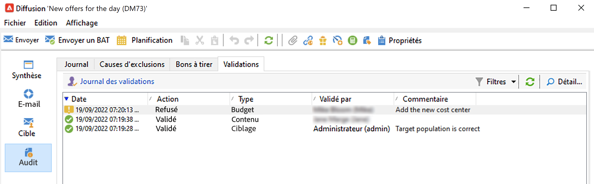

# Configuration et gestion du processus de validation {#approval-marketing-campaigns}

Les méthodes et les personnes impliquées dans la création et la validation des campagnes marketing sont spécifiques à chaque organisation. Le processus de validation de la campagne implique la coordination de plusieurs parties prenantes à savoir des spécialistes marketing digital, des responsables de la diffusion, des gestionnaires de contenu et des propriétaires externes tels que des partenaires ou des fournisseurs.

Grâce à Adobe Campaign, vous pouvez configurer un flux de validation pour vos campagnes et notifier les opérateurs lorsqu&#39;une action est requise. Vous pouvez définir les validations pour chaque étape d&#39;une diffusion : ciblage, contenu, budget, extraction et envoi de BAT. Au fur et à mesure que vos diffusions de campagne passent par les différentes étapes de validation, Adobe Campaign compile un historique des modifications et d&#39;approbations, y compris les feedbacks, commentaires, demandes de modification et commentaires.

Des messages de notification sont envoyés aux opérateurs Adobe Campaign désignés comme réviseurs dans le but de les informer d&#39;une demande de validation.

Les opérateurs peuvent valider les demandes de plusieurs manières :

* À partir du message de notification. Le lien contenu dans l&#39;e-mail permet à l&#39;opérateur d&#39;accéder à Campaign à partir d&#39;un navigateur web. Une fois connecté, le réviseur peut choisir de valider ou non le contenu.
  

* À partir du tableau de bord de la campagne.
  

* À partir du tableau de bord de la diffusion.
  

Les opérateurs peuvent accéder à la campagne ainsi qu&#39;à la diffusion à partir de la fenêtre de validation. Ils peuvent également saisir un commentaire.

Une fois la validation effectuée par un opérateur, les informations sont affichées dans les tableaux de bord de la campagne et de la diffusion, ainsi que dans les logs.

Les informations sont également disponibles dans les logs de validation de la diffusion, ainsi que dans le log de validation de la campagne. Ces logs sont accessibles à partir des onglets **[!UICONTROL Modifier > Audit > Validations]**.

## Activer les validations{#enable-approvals}

Ces notifications de validation sont envoyées aux opérateurs spécifiés pour chaque traitement pour lequel la validation a été activée.

Elles peuvent être activées au niveau du modèle de campagne, au niveau de chaque campagne ou de la diffusion.

Tous les traitements qui doivent faire l&#39;objet d&#39;une validation sont sélectionnés dans le modèle de campagne, à partir de l&#39;onglet **[!UICONTROL Propriétés]** > **[!UICONTROL Paramètres avancés de la campagne...]** > **[!UICONTROL Validations]**. Les réviseurs ou groupes de réviseurs sont sélectionnés dans cet onglet. Ils reçoivent des notifications, sauf si cette option n&#39;est pas activée. [En savoir plus](#approving-processes).

Ces paramètres peuvent être remplacés pour chaque campagne créée à partir de ce modèle, et individuellement pour chaque diffusion. Parcourez le bouton **[!UICONTROL Propriétés]** de la diffusion, puis l&#39;onglet **[!UICONTROL Validations]**.

Dans l&#39;exemple ci-dessous, le contenu de cette diffusion ne fera l&#39;objet d&#39;aucune validation :

>[!CAUTION]
>
>Vérifiez que les validants disposent des **autorisations appropriées** pour la validation et que leur zone de sécurité est correctement définie. [En savoir plus](#selecting-reviewers).

Le processus de validation des diffusions est détaillé dans [cette section](#review-and-approve-deliveries).

## Sélection des validants {#select-reviewers}

Pour chaque type de validation, les opérateurs ou groupes d’opérateurs chargés de la validation sont sélectionnés dans la liste déroulante de la diffusion. Vous pouvez ajouter d’autres opérateurs à l’aide du lien **[!UICONTROL Modifier...]**. Cette fenêtre vous permet également de modifier la date limite de validation. Par défaut, les réviseurs disposent de trois jours à partir de la date de soumission pour valider un processus. Pour ajouter un rappel automatique, utilisez le lien **[!UICONTROL Ajouter un rappel]**.

Si aucun réviseur n&#39;est spécifié, le propriétaire de la campagne est responsable des validations et reçoit les notifications. Le propriétaire de la campagne est indiqué dans l&#39;onglet **[!UICONTROL Modifier > Propriétés]** de la campagne :

Tous les autres opérateurs Adobe Campaign ayant des droits **[!UICONTROL Administrateur]** sont également habilités à valider les traitements. En revanche, ils ne reçoivent pas de notifications.

>[!NOTE]
>
>Par défaut, le propriétaire de la campagne ne peut pas effectuer de validation ni démarrer les diffusions si des opérateurs de validation ont été définis. En tant qu&#39;administrateur Adobe Campaign, vous pouvez modifier ce comportement et permettre aux propriétaires de campagnes de valider/démarrer des diffusions en créant l&#39;option **NmsCampaign_Activate_OwnerConfirmation**, définie sur **1**.

Si une liste de réviseurs est définie, un traitement est validé lorsqu&#39;un réviseur le valide. Le lien de validation n&#39;est alors plus disponible dans les tableaux de bord de la campagne et de la diffusion. Lorsque l&#39;envoi de notifications est activé et qu&#39;un autre réviseur clique sur le lien de validation du message de notification, il est alors averti qu&#39;un autre opérateur a déjà validé le traitement.

## Réviser et valider des diffusions {#review-and-approve-deliveries}

Pour chaque campagne, vous pouvez valider la cible de diffusion, le [contenu de diffusion](#approving-content) et les coûts. Les opérateurs et opératrices Adobe Campaign en charge de l’approbation peuvent être avertis par e-mail et accepter ou refuser l’approbation à partir de la console cliente ou via un navigateur web. [En savoir plus](#approving-processes).

Pour les diffusions par publipostage direct, les opérateurs Adobe Campaign peuvent visualiser le fichier d&#39;extraction avant l&#39;envoi au routeur et, au besoin, modifier le format et relancer l&#39;extraction. [En savoir plus](#approve-an-extraction-file).

Une fois ces phases de validation achevées, la diffusion peut être lancée. [En savoir plus](marketing-campaign-deliveries.md#starting-a-delivery).

>[!NOTE]
>
>Les processus qui nécessitent une validation sont sélectionnés dans le modèle de campagne. [En savoir plus](marketing-campaign-templates.md).
>

### Étapes de validation d’une diffusion {#approving-processes}

Les étapes qui doivent être approuvées apparaissent dans le tableau de bord de la campagne (dans la console cliente ou un navigateur web). Elles apparaissent également dans la table de tracking des diffusions et dans le tableau de bord des diffusions.

Pour chaque diffusion de l&#39;opération, il est possible de valider les traitements suivants :

* **Valider le ciblage, le contenu, le budget**

  Lorsque les options **[!UICONTROL Activer la validation de la cible]**, **[!UICONTROL Activer la validation du contenu]** ou **[!UICONTROL Activer la validation du budget]** sont sélectionnées dans la fenêtre de paramétrage de la validation, les liens correspondants s&#39;affichent dans les tableaux de bord de la campagne et des diffusions.

  

  >[!NOTE]
  >
  >La validation du budget n&#39;est disponible que si celle de la cible est activée dans la fenêtre de paramétrage de la validation. Le lien de la validation du budget ne s&#39;affiche qu&#39;une fois la cible analysée.

  Lorsque les options **[!UICONTROL Assigner l&#39;édition du contenu]** ou **[!UICONTROL Validation externe du contenu]** sont sélectionnées dans la fenêtre de paramétrage de la validation des traitements, le tableau de bord propose respectivement les liens **[!UICONTROL Contenu disponible]** et **[!UICONTROL Validation externe du contenu]**.

  La validation du contenu permet d&#39;accéder aux BAT envoyés.

* **Valider l&#39;extraction (diffusion courrier)**

  Lorsque l&#39;option **[!UICONTROL Activer la validation de l&#39;extraction]** est sélectionnée dans la fenêtre de paramétrage de la validation des traitements, le fichier extrait doit être validé avant que le routeur puisse être notifié.

  L&#39;option **[!UICONTROL Valider le fichier]** est disponible dans les tableaux de bord des campagnes et des diffusions.

  

  Vous pouvez prévisualiser le fichier de sortie avant la validation. La prévisualisation du fichier d&#39;extraction affiche uniquement un modèle de données. Le fichier entier n&#39;est pas chargé.

* **Valider les diffusions associées**

  L&#39;option **[!UICONTROL Activer la validation individuelle de chaque diffusion associée]** est utilisée pour une diffusion principale associée à des diffusions secondaires. Par défaut, cette option n&#39;est pas sélectionnée afin d&#39;effectuer une validation globale de la diffusion principale. Si cette option est sélectionnée, chaque diffusion doit être validée individuellement.

  

>[!NOTE]
>
>Dans un workflow de ciblage, si une erreur liée à un problème de configuration se produit lors de la préparation du message, le lien **[!UICONTROL Redémarrer la préparation des messages]** s&#39;affiche sur le tableau de bord. Corrigez l&#39;erreur et utilisez ce lien pour relancer la préparation des messages tout en contournant l&#39;étape de ciblage.

### Valider un contenu {#approve-content}

>[!CAUTION]
>
>Pour valider un contenu, un cycle de BAT est obligatoire. Les BAT vous permettent de valider l&#39;affichage des informations, les données de personnalisation et de vérifier que les liens fonctionnent.
>
>Les fonctionnalités de validation du contenu décrites ci-dessous se rapportent à la diffusion du BAT.

Il est possible de configurer un cycle de validation du contenu. Pour ce faire, sélectionnez l’option **[!UICONTROL Activer la validation du contenu]** dans la fenêtre des paramètres de validation. Les étapes principales du processus de validation de contenu sont les suivantes :

1. Après la création d&#39;une nouvelle diffusion, le responsable de l&#39;opération clique sur le lien **[!UICONTROL Soumettre le contenu]**, dans le tableau de bord de l&#39;opération, pour lancer le cycle de validation du contenu.

   >[!NOTE]
   >
   >Si vous avez sélectionné, dans la fenêtre de paramétrage de la validation des traitements, l&#39;option **[!UICONTROL Activer l&#39;envoi des BAT]** (pour une diffusion email) ou **[!UICONTROL Activer l&#39;envoi et la validation des BAT]** (pour une diffusion courrier), l&#39;envoi des BAT se fait automatiquement.

1. Un email de notification est envoyé au responsable du contenu. Celui-ci choisit alors de valider ou non le contenu :

   * à travers l&#39;e-mail de notification : l&#39;e-mail de notification contient un lien vers les BAT déjà envoyés, et éventuellement vers un rendu du message dans les différents webmails, si l&#39;option **Délivrabilité** est activée pour cette instance.

   * à partir de la console cliente ou d’un navigateur web, du tracking des diffusions, du tableau de bord des diffusions ou du tableau de bord de la campagne. Ce tableau de bord de la campagne permet de visualiser la liste des BAT envoyés, en cliquant sur le lien **[!UICONTROL Inbox rendering…]**. Pour afficher leur contenu, cliquez sur l’icône **[!UICONTROL Détail]** situé à droite de la liste.

1. Un e-mail de notification est envoyé à la personne responsable de la campagne pour l’informer de la validation ou de la non-validation du contenu. La personne responsable de la campagne peut à tout moment relancer le cycle de validation du contenu. Pour ce faire, cliquez sur le lien de la ligne **[!UICONTROL Statut du contenu]** du tableau de bord de la campagne (au niveau de la diffusion), puis cliquez sur **[!UICONTROL Réinitialiser la validation du contenu pour la soumettre à nouveau]**.

#### Assigner l’édition du contenu {#assign-content-editing}

Cette option vous permet de définir une personne responsable de l’édition du contenu, par exemple un ou une webmaster. Si l’option **[!UICONTROL Assigner l’édition du contenu]** est sélectionnée dans la fenêtre de paramétrage de la validation, plusieurs étapes de validation sont ajoutées entre la création de la diffusion et la diffusion de l’e-mail de notification à la personne responsable du contenu :

1. Après la création d&#39;une nouvelle diffusion, le responsable de l&#39;opération clique sur le lien **[!UICONTROL Soumettre l&#39;édition du contenu]**, dans le tableau de bord de l&#39;opération, pour lancer le cycle d&#39;édition du contenu.

1. Le responsable de l&#39;édition du contenu reçoit un email l&#39;informant de la mise à disposition du contenu.

1. La personne se connecte à la console cliente, ouvre la diffusion et la modifie via un assistant simplifié, qui lui permet de modifier l’objet, le contenu HTML et texte, ainsi que d’envoyer des BAT.

   >[!NOTE]
   >
   >Si vous avez sélectionné, dans la fenêtre de paramétrage de la validation des traitements, l&#39;option **[!UICONTROL Activer l&#39;envoi des BAT]** (pour une diffusion email) ou **[!UICONTROL Activer l&#39;envoi et la validation des BAT]** (pour une diffusion courrier), l&#39;envoi des BAT se fait automatiquement.

1. Lorsqu&#39;il a terminé l&#39;édition du contenu de la diffusion, le responsable de l&#39;édition du contenu peut mettre le contenu à disposition.

   Pour cela, ils peuvent :

   * utiliser le lien **[!UICONTROL Contenu disponible]** dans la console cliente Adobe Campaign, ou
   * le lien contenu dans le message de notification.
L&#39;opérateur peut ajouter un commentaire avant de soumettre le contenu au responsable de la campagne.
Le message de notification permet au réviseur de valider ou refuser le contenu qui lui a été soumis.

#### Validation externe du contenu {#external-content-approval}

Cette option permet de définir une personne externe chargée de la validation du rendu des diffusions, comme la cohérence dans la communication de la marque, les tarifs, etc. Lorsque l’option **[!UICONTROL Validation externe du contenu]** est sélectionnée dans la fenêtre de paramétrage de la validation, plusieurs étapes de validation sont ajoutées entre la validation du contenu et l’envoi de la notification à la personne responsable de la campagne :

1. Le responsable externe du contenu reçoit un email de notification l&#39;informant que le contenu a été validé et que la validation externe doit être effectuée.
1. L&#39;email de notification propose des liens vers les BAT envoyés, lui permettant de visualiser le rendu de la diffusion, et un bouton pour valider ou refuser le contenu de la diffusion.

Ces liens ne sont disponibles que si un ou plusieurs BAT ont été envoyés. Dans le cas contraire, le rendu de la diffusion n’est disponible que via la console cliente ou un navigateur web.

### Validation d’un fichier d’extraction {#approve-an-extraction-file}

Pour les diffusions offline, Adobe Campaign génère un fichier d&#39;extraction qui, selon le paramétrage, est transmis au routeur. Le contenu du fichier dépend du modèle d&#39;export utilisé.

Une fois le contenu, le ciblage et le budget validés, la diffusion passe à l&#39;état **[!UICONTROL Extraction en attente]**, en attendant le lancement du workflow d&#39;extraction pour les opérations.

A la date de la demande d&#39;extraction, le fichier d&#39;extraction est créé et la diffusion passe à l&#39;état **[!UICONTROL Fichier à valider]**.

Vous pouvez visualiser le contenu du fichier extrait (en cliquant sur son nom), le valider, ou, au besoin, modifier le format et relancer l&#39;extraction, via les liens proposés dans le tableau de bord.

Une fois le fichier validé, vous pouvez envoyer l’e-mail de notification au routeur. [En savoir plus](marketing-campaign-deliveries.md#start-an-offline-delivery).

## Modes de validation {#approval-modes}

Les traitements peuvent être validés dans le tableau de bord de la campagne, dans l&#39;onglet Tracking des diffusions, dans le tableau de bord de la diffusion ou dans l&#39;e-mail de notification envoyé aux réviseurs.

### Valider dans le tableau de bord {#approval-via-the-dashboard}

Pour approuver un traitement à partir de la console cliente ou d’un navigateur web, cliquez sur le lien adéquat dans le tableau de bord de la campagne.

Par exemple, une fois l&#39;analyse de diffusion exécutée :

1. Sélectionnez **[!UICONTROL Valider le ciblage]**.

1. Dans la fenêtre contextuelle, vérifiez les informations à valider.
1. Sélectionnez **[!UICONTROL Accepter]** ou **[!UICONTROL Refuser]** et saisissez éventuellement un commentaire. Ce commentaire s&#39;affiche dans les logs de validation.
1. Confirmez votre choix en utilisant le bouton **[!UICONTROL Validation de la cible]**.

Lorsqu&#39;un traitement a déjà été validé par un opérateur, le lien de validation n&#39;est pas proposé.

Si un traitement a été rejeté, les informations sont affichées dans le tableau de bord de la diffusion de la manière suivante :

### Valider depuis les messages de notification {#approval-via-notification-messages}

Pour approuver un traitement à partir d&#39;un [message de notification](#notifications) :

1. Cliquez sur le lien dans la notification.
1. Connectez-vous à Adobe Campaign.
1. Vérifiez les informations à approuver.
1. Sélectionnez **[!UICONTROL Accepter]** ou **[!UICONTROL Refuser]** et saisissez éventuellement un commentaire.
1. Validez. Votre choix et votre commentaire s&#39;affichent dans les logs de validation.

>[!NOTE]
>
>Si des alertes ont été générées durant le processus, un message d&#39;avertissement est affiché dans la notification.

### Suivre la validation{#approval-tracking}

Les logs de validation sont disponibles dans l&#39;interface utilisateur :

* Dans le log des validations de la campagne, sous-onglet **[!UICONTROL Validations]** de l&#39;onglet **[!UICONTROL Modifier > Audit]** :

  

* Dans le log des diffusions de la campagne, sous-onglet **[!UICONTROL Diffusions]** de l&#39;onglet **[!UICONTROL Modifier > Audit]** :

  

* Au niveau de chaque diffusion, le statut des validations peut être consulté en cliquant sur l&#39;option **[!UICONTROL Afficher/cacher le journal]** de l&#39;onglet **[!UICONTROL Résumé]** :

  

* Ces informations sont également accessibles depuis l&#39;onglet **[!UICONTROL Audit > Validations]** de chaque diffusion :

  

>[!NOTE]
>
>Une fois qu&#39;un opérateur a validé ou refusé un traitement, les autres réviseurs ne peuvent plus le modifier.

### Validations automatiques/manuelles {#automatic-and-manual-approval}

Lors de la création d&#39;un workflow de ciblage, lorsque la validation est automatique (mode par défaut), Adobe Campaign propose le lien de validation ou envoie une notification dès qu&#39;un ciblage est à valider.

Pour sélectionner le mode de validation (manuelle ou automatique), cliquez sur l&#39;onglet **[!UICONTROL Modifier > Propriétés]** de la campagne ou du modèle de campagne, puis sur l&#39;option **[!UICONTROL Paramètres avancés de campagne...]**, et enfin sur l&#39;onglet **[!UICONTROL Validations]**.
par

>[!NOTE]
>
>Le mode de validation sélectionné sera appliqué à toutes les diffusions de la campagne.

Lorsqu’un workflow de ciblage est en cours de construction, la validation manuelle permet d’éviter de créer des liens de validation ou d’envoyer automatiquement des notifications. Le tableau de bord de la campagne propose alors un lien **[!UICONTROL Soumettre le ciblage pour validation]** afin de lancer manuellement le processus de validation.

Un message de confirmation permet d&#39;autoriser les validations sur les traitements sélectionnés pour cette diffusion.

Les boutons de validation sont alors affichés dans le tableau de bord de l&#39;opération (au niveau de cette diffusion), dans le tableau de bord de la diffusion et dans le tracking des diffusions. Si les notifications sont activées, elles seront parallèlement envoyées.

Ce mode d&#39;activation des validations permet de travailler sur des recherches de ciblage sans notifier les opérateurs validants de façon intempestive.

## Notifications {#notifications}

Les notifications sont des emails spécifiques envoyés aux opérateurs validants afin de les avertir qu&#39;un traitement est en attente de validation. Lorsque l&#39;opérateur clique sur le lien contenu dans le message, il accède à une page d&#39;authentification. Après connexion, il peut consulter les éléments concernés puis valider ou non le traitement. Il peut également saisir un commentaire dans la fenêtre de validation.

Le contenu des emails de notification peut être personnalisé. Voir [Contenu des notifications](#notification-content).

### Activation/désactivation de la notification {#enabling-disabling-notification}

Par défaut, les messages de notification sont envoyés si l’approbation du traitement correspondant est activée dans le modèle de campagne, la campagne ou la diffusion. Toutefois, les notifications peuvent être désactivées afin d’autoriser les validations à partir de la console cliente uniquement.

Pour cela, modifiez la fenêtre de validation de la campagne ou du modèle de campagne concerné (onglet **[!UICONTROL Modifier > Propriétés]** > **[!UICONTROL Paramètres avancés de la campagne...]** > **[!UICONTROL Validations]**) et cochez l&#39;option **[!UICONTROL Ne pas activer l&#39;envoi des notifications]**.

### Contenu des messages de notification {#notification-content}

Le contenu des notifications est défini dans un modèle spécifique : **[!UICONTROL Notification des validations pour la campagne marketing]**. Ce modèle est enregistré dans le dossier **[!UICONTROL Administration > Gestion de campagne > Modèles des diffusions techniques]** de l’arborescence Adobe Campaign.
