# Gérer les ressources et les documents {#manage-assets-documents}

Vous pouvez associer divers documents à une opération : rapports, photos, pages web, diagrammes et bien d&#39;autres. Peu importe le format de ces documents.

Dans une campagne, vous pouvez également faire référence à d’autres éléments, tels que des coupons promotionnels, des offres spéciales relatives à une marque ou à un magasin spécifique et bien plus. Lorsque ces éléments sont inclus dans une composition, ils peuvent être associés à une diffusion courrier. [En savoir plus](#associating-and-structuring-resources-linked-via-a-delivery-outline).

>[!CAUTION]
>
>Cette fonctionnalité est conçue pour les petites ressources et documents.

<!--
>[!NOTE]
>
>If you are using Campaign Marketing Resource Management module, you can also manage a library of marketing resources that are available for several users for collaborative work. [Learn more](../../mrm/using/managing-marketing-resources.md).
-->

## Ajout de documents {#add-documents}

Des documents peuvent être associés au niveau de l&#39;opération (documents contextuels) ou au niveau du programme (documents généraux).

Pour une opération, l&#39;onglet **[!UICONTROL Documents]** contient :

* la liste de tous les documents nécessaires au contenu (maquette, images, etc.) qui pourront être téléchargés en local par les opérateurs Adobe Campaign possédant les droits adéquats,
* les documents contenant des informations destinées au routeur, s&#39;ils existent.

Les documents sont rattachés au programme ou à l&#39;opération via leur onglet **[!UICONTROL Edition > Documents]**.

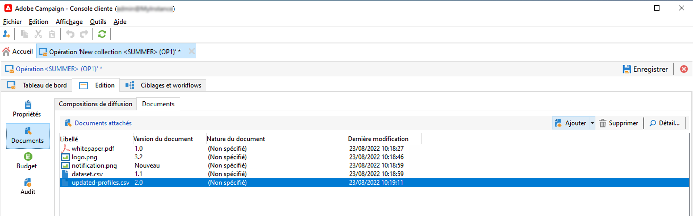

Vous pouvez également ajouter un document dans une opération via le lien dédié de son tableau de bord.

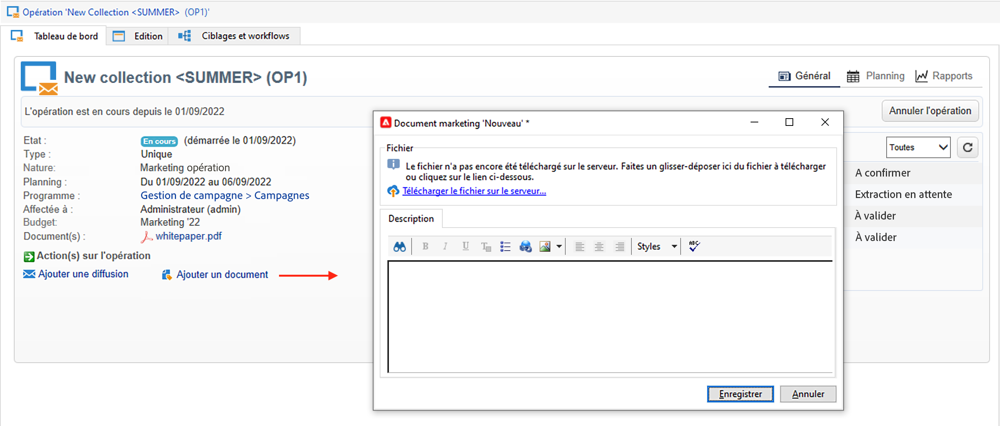

Cliquez sur l&#39;icône **[!UICONTROL Détails...]** pour afficher le contenu d&#39;un fichier et y ajouter des informations complémentaires :

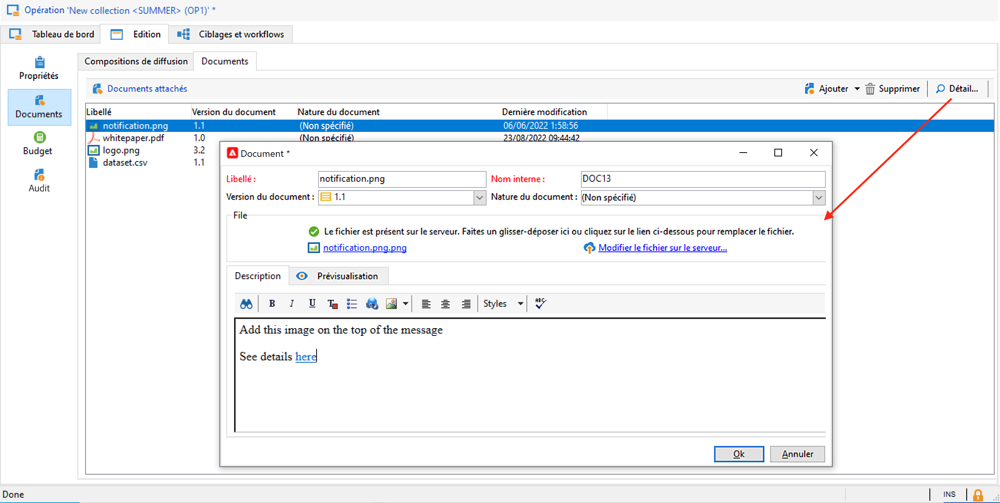

Au niveau du tableau de bord, les documents associés à l&#39;opération sont regroupés dans la section **[!UICONTROL Document(s)]**, comme dans l&#39;exemple ci-dessous :

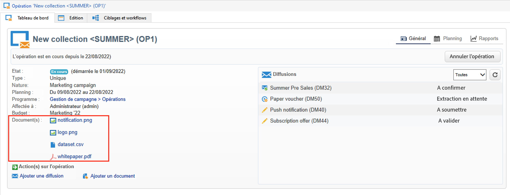

Ils peuvent également être édités et modifiés depuis cette vue.

## Utiliser les compositions de diffusion {#delivery-outlines}

Une composition de diffusion est un ensemble structuré d&#39;éléments (documents, magasins, coupons promotionnels et autres) créé par la société et pour une opération particulière. Il est utilisé dans le cadre de diffusions par publipostage direct.

Ces éléments sont regroupés au sein de compositions de diffusions, chacune associée à une diffusion. La composition de diffusion sera référencée dans le fichier d&#39;extraction envoyé au **fournisseur** afin d&#39;être jointe à la diffusion. Par exemple, vous pouvez créer une composition de diffusion faisant référence à une unité et aux brochures marketing qu&#39;elle utilise.

Les compositions de diffusions permettent, au niveau de l&#39;opération, de structurer des éléments externes qui seront associés à la diffusion en fonction de certains critères : entité de rattachement, offre promotionnelle accordée, invitation à un événement local, etc.

>[!CAUTION]
>
>Les compositions de diffusion sont limitées aux campagnes par publipostage direct.

### Créer une composition de diffusion {#create-an-outline}

Pour créer une composition de diffusion, cliquez sur le sous-onglet **[!UICONTROL Compositions de diffusion]** proposé sous l&#39;onglet **[!UICONTROL Modifier > Documents]** de l&#39;opération concernée.

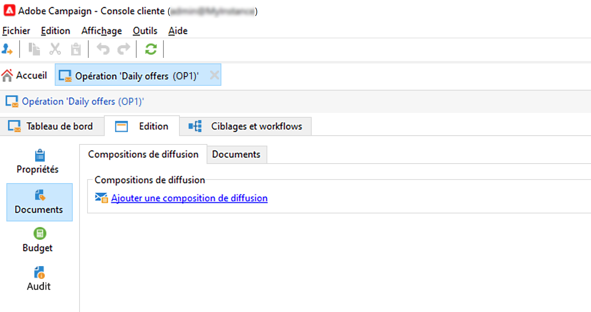

>[!NOTE]
>
>Si cet onglet n&#39;est pas visible, cette fonctionnalité n&#39;est pas disponible pour cette opération ou alors la diffusion par publipostage direct n&#39;est pas activée dans votre instance. Reportez-vous à la section [configuration du modèle de campagne](marketing-campaign-templates.md#campaign-templates) ou référez-vous à votre contrat de licence.

Cliquez ensuite sur **[!UICONTROL Ajouter une composition de diffusion]** et créez l&#39;arborescence des compositions pour l&#39;opération :

1. Cliquez avec le bouton droit sur la racine de l&#39;arborescence et choisissez **[!UICONTROL Nouveau > Compositions de diffusion]**.
1. Cliquez avec le bouton droit de la souris sur la composition que vous venez de créer et choisissez **[!UICONTROL Nouveau > Article]** ou **[!UICONTROL Nouveau > Champs de personnalisation]**.

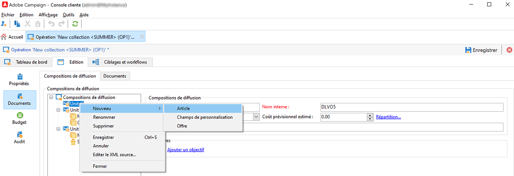

Une composition peut contenir des articles, des champs de personnalisation et des offres :

* Les articles sont par exemple des documents physiques qui sont ici référencés et décrits, et seront joints à la diffusion.
* Les champs de personnalisation permettent de créer des éléments de personnalisation liés aux diffusions plutôt qu’aux destinataires. Il est ainsi possible de créer des valeurs à utiliser dans les diffusions pour une cible spécifique (offre de bienvenue, réduction, etc.) Ils sont créés dans Adobe Campaign et importés dans la composition via le lien **[!UICONTROL Importer des champs de personnalisation]**.

  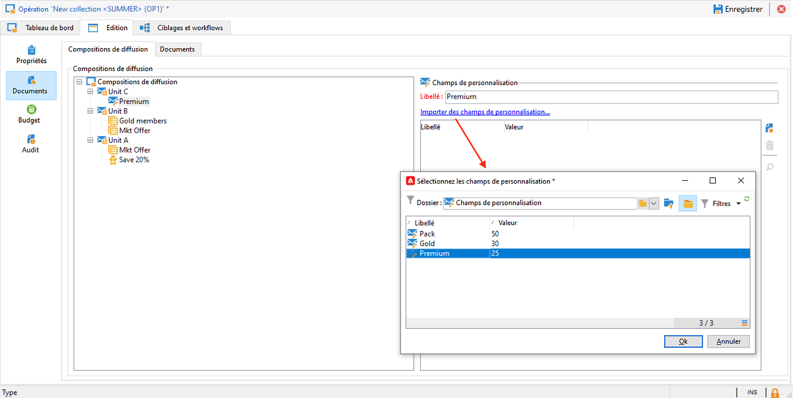

  Ils peuvent également être créés directement dans la composition, en cliquant sur l&#39;icône **[!UICONTROL Ajouter]** située à droite de la zone de liste.

  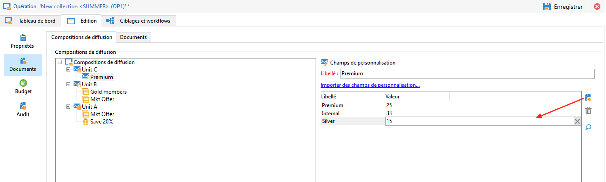

### Sélection d’une composition {#select-an-outline}

Pour chaque diffusion, vous pouvez sélectionner la composition à associer à partir de la section réservée à la configuration de l&#39;extraction, comme dans l&#39;exemple ci-dessous :

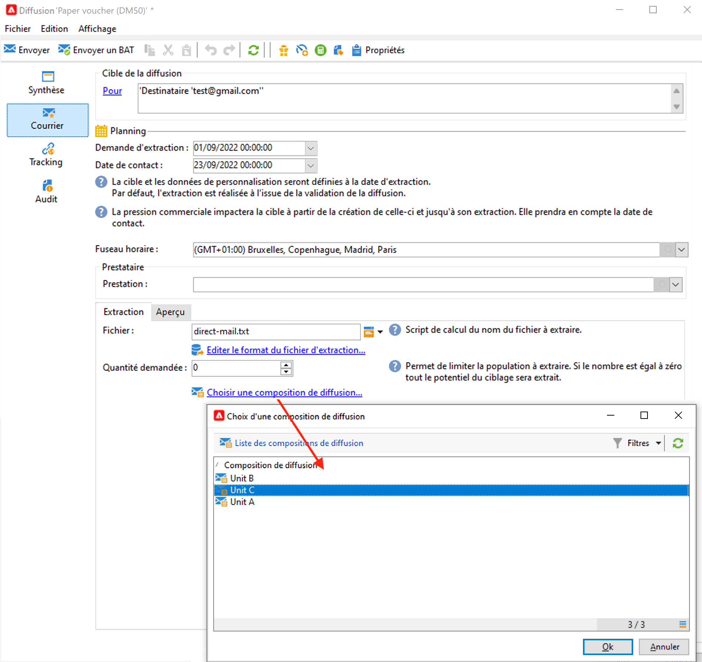

La composition sélectionnée est alors affichée dans la section inférieure de la fenêtre. Elle peut être éditée à partir de l&#39;icône située à droite du champ ou modifiée en utilisant la liste déroulante :

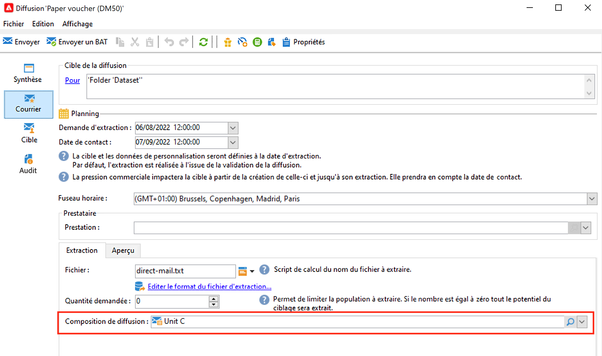

L&#39;onglet **[!UICONTROL Résumé]** de la diffusion affiche également cette information :

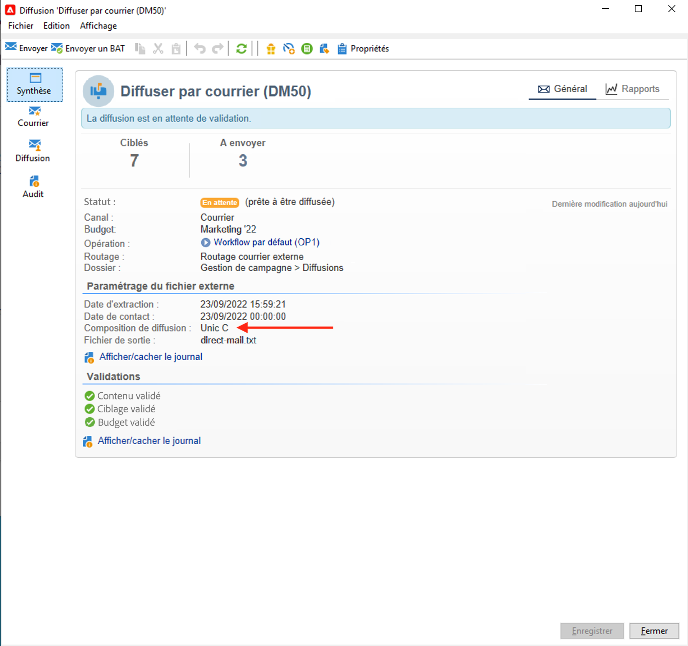

### Résultat de l&#39;extraction {#extraction-result}

Dans le fichier extrait et transmis au prestataire, le nom de la composition et éventuellement ses caractéristiques (coût, description, etc.) sont ajoutés au contenu, selon les informations présentes dans le modèle d&#39;export associé au prestataire.

Dans l&#39;exemple suivant, le libellé, le coût prévisionnel estimé et la description de la composition associée à la diffusion seront ajoutés dans le fichier d&#39;extraction.

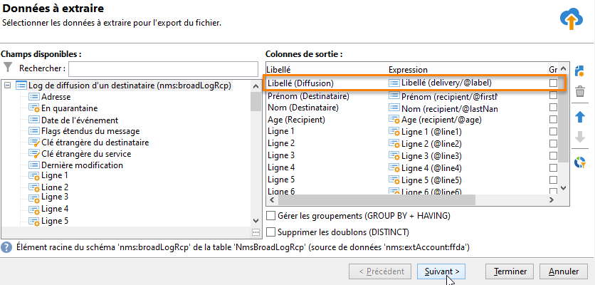

Le modèle d&#39;export doit être associé au prestataire sélectionné pour la diffusion concernée. Consultez [cette section](providers-stocks-and-budgets.md#creating-service-providers-and-their-cost-structures).
