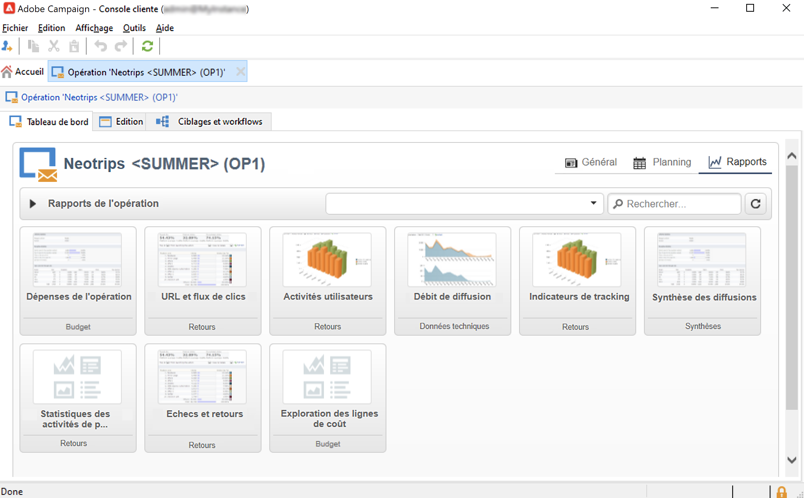

# Créer des programmes et des campagnes{#create-programs-and-campaigns}

Les composants d’orchestration de campagne se trouvent dans la variable **[!UICONTROL Campagnes]** tab : vous y trouverez un aperçu des programmes et campagnes marketing, ainsi que des éléments qui leur sont associés.

Un programme marketing est composé de campagnes, composées de diffusions, de ressources, etc. Toutes les informations relatives aux diffusions, budgets, validants et documents associés sont regroupées au sein de l&#39;opération.

 [Découvrir les programmes et les campagnes en vidéo](#video)

## Travail avec les programmes et les plans{#work-with-plan-and-program}

### Créer la hiérarchie des plans et programmes {#create-plan-and-program}

Chaque opération s&#39;inscrit dans un programme qui appartient à un plan. Tous les plans, programmes et opérations sont disponibles à partir du **[!UICONTROL Calendrier des campagnes]** dans le menu **Campagnes** .

Avant de commencer à créer vos campagnes et diffusions, configurez l&#39;arborescence de vos dossiers pour les plans marketing et les programmes.

1. Cliquez sur l&#39;icône **Explorateur** dans la page d&#39;accueil.
1. Cliquez avec le bouton droit de la souris sur le dossier dans lequel vous souhaitez créer le plan.
1. Sélectionnez **Ajouter un dossier > Gestion de campagne > Plan**.

   

1. Renommez le plan.
1. Cliquez avec le bouton droit de la souris sur le plan nouvellement créé et sélectionnez **Propriétés...**.
1. Dans l&#39;onglet **Général**, modifiez le **nom interne** pour éviter les doublons lors des exports de package.

   

1. Cliquez sur **Enregistrer**.
1. Cliquez avec le bouton droit de la souris sur le plan nouvellement créé et sélectionnez **Ajouter un dossier &#39;Programme&#39;**.

   

1. Répétez les étapes décrites ci-dessus pour renommer le nouveau dossier de programmes et modifier le nom interne.

### Configuration d’un programme {#edit-a-program}

Lorsque vous éditez un programme, utilisez les onglets présentés ci-dessous pour naviguer et le paramétrer.

* L&#39;onglet **Planning** affiche le calendrier du programme sur un mois, une semaine ou une journée selon que vous cliquez sur l&#39;un des onglets dans l&#39;en-tête du calendrier. Vous pouvez créer une campagne, un programme ou une tâche à partir de cette page. [En savoir plus](#campaign-calendar)

* L&#39;onglet **Edition** vous permet de modifier le programme : son nom, ses dates de début et fin, son budget, ses documents associés, etc.

   

## Utilisation des campagnes{#work-with-campaigns}

### Créer une campagne {#create-a-campaign}

Vous pouvez créer une opération à partir de la liste des opérations. Pour afficher cette vue, sélectionnez la **[!UICONTROL Campagnes]** dans le menu **[!UICONTROL Campagnes]** tableau de bord, puis cliquez sur **[!UICONTROL Créer]**.

Le champ **[!UICONTROL Programme]** permet de sélectionner le programme auquel sera rattachée l&#39;opération. Cette information est obligatoire.

Les opérations peuvent également être créées à partir du calendrier des campagnes ou des programmes. [En savoir plus](#campaign-calendar)

Dans la fenêtre de création de campagne, sélectionnez le modèle de campagne et ajoutez un nom et une description de la campagne. Vous pouvez également spécifier les dates de début et de fin de la campagne.

Cliquez sur **[!UICONTROL OK]** pour créer la campagne. Il est ajouté au planning du programme, ainsi qu&#39;à la liste des opérations.

Vous pouvez ensuite éditer l&#39;opération que vous venez de créer et en définir les paramètres. Pour ouvrir et configurer cette campagne, vous pouvez :

1. Parcourez le calendrier des campagnes et sélectionnez la campagne à afficher, puis cliquez sur le bouton **[!UICONTROL Ouvrir]** lien.
1. Parcourez les **[!UICONTROL Planification]** dans l&#39;onglet du programme, sélectionnez l&#39;opération et ouvrez-la.
1. Parcourez la liste des campagnes et cliquez sur le nom de la campagne à éditer.

Toutes ces actions permettent d&#39;accéder au tableau de bord de l&#39;opération.

Accédez aux sections suivantes pour savoir comment configurer votre campagne :

* [Ajout de diffusions](marketing-campaign-deliveries.md)
* [Gestion des ressources et des documents](marketing-campaign-assets.md)
* [Création de l’audience cible](marketing-campaign-target.md)
* [Configuration du processus de validation](marketing-campaign-approval.md)
* [Gestion des stocks et des budgets](providers--stocks-and-budgets.md)

### Modification des paramètres de campagne {#campaign-settings}

Les campagnes sont créées à partir de modèles d&#39;opération. Vous pouvez configurer des modèles réutilisables pour lesquels certaines options sont sélectionnées et d’autres paramètres sont déjà enregistrés.

Pour chaque campagne, les fonctionnalités suivantes sont disponibles :

* Documents de référence et ressources : vous pouvez associer des documents à l&#39;opération (brief, compte-rendu, images, etc.). Tous les formats de document sont pris en charge. [En savoir plus](marketing-campaign-deliveries.md#manage-associated-documents).
* Définir les coûts : pour chaque opération, Adobe Campaign permet de définir les postes de coût et les structures de calcul des coûts qui pourront être utilisés lors de la création de la campagne marketing. Par exemple : coûts d&#39;impression, utilisation d&#39;une agence externe, location de salle, etc. [En savoir plus](providers--stocks-and-budgets.md#defining-cost-categories).
* Définir des objectifs : vous pouvez définir des objectifs quantifiables pour une opération, par exemple le nombre d&#39;abonnés, le volume commercial, etc. Ces informations sont ensuite utilisées dans les rapports de campagne.
* gérer les adresses de contrôle et les populations témoin ; [En savoir plus](marketing-campaign-deliveries.md#defining-a-control-group).
* Gérer les validations : vous pouvez sélectionner les traitements à valider et, au besoin, sélectionner les opérateurs ou groupes d&#39;opérateurs validants. [En savoir plus](marketing-campaign-approval.md#checking-and-approving-deliveries).

>[!NOTE]
>
>Pour accéder aux paramètres de l&#39;opération et les mettre à jour, accédez à la **[!UICONTROL Paramètres avancés de l&#39;opération...]** dans le **[!UICONTROL Modifier]** .

### Surveillance d’une campagne {#monitor-a-campaign}

Pour chaque opération, les traitements, ressources et diffusions sont centralisés dans le tableau de bord. Cette interface vous permet de gérer et d’orchestrer des actions marketing.

Avec Adobe Campaign, vous pouvez mettre en place des processus collaboratifs pour la création et la validation des différentes étapes de vos campagnes : validation du budget, de la cible, du contenu, etc. Cette orchestration est présentée dans la section [cette section](marketing-campaign-approval.md).

>[!NOTE]
>
>Les composants disponibles dans une opération dépendent de son modèle. Le paramétrage du modèle d&#39;opération est présenté dans la section [cette section](marketing-campaign-templates.md#campaign-templates).

Une fois la campagne réalisée, utilisez la variable **[!UICONTROL Rapports]** pour accéder aux rapports de l&#39;opération.

## Calendrier des campagnes {#campaign-calendar}

Le calendrier des campagnes affiche tous les programmes, plans, campagnes et diffusions.

Pour éditer un plan, un programme, une opération ou une diffusion, accédez à son nom dans le calendrier, puis utilisez le **[!UICONTROL Ouvrir]** lien. Il s’affiche alors dans un nouvel onglet, comme dans l’exemple ci-dessous :

Vous pouvez filtrer les informations affichées dans le calendrier des campagnes. Pour cela, cliquez sur le lien **[!UICONTROL Filtrer]** et sélectionnez les critères de filtrage.

>[!NOTE]
>
>Lorsque vous filtrez sur une date, toutes les campagnes dont la date de début est postérieure à la date spécifiée et/ou dont la date de fin est antérieure à la date spécifiée sont affichées. Les dates sont sélectionnées à l’aide des calendriers proposés à droite de chaque champ.

Vous pouvez également utiliser le champ **[!UICONTROL Rechercher]** pour filtrer les éléments affichés.

Les icônes associées à chaque élément vous permettent de visualiser son statut : terminé, en cours, en édition, etc.

Pour filtrer les opérations à afficher, cliquez sur le lien **[!UICONTROL Filtrer]** et sélectionnez le statut des opérations à afficher

Lorsque vous parcourez le calendrier, vous pouvez également créer un programme ou une campagne.

Lorsque vous créez une opération à partir de l&#39;onglet **[!UICONTROL Planning]** d&#39;un programme, l&#39;opération est automatiquement rattachée au programme concerné. Le champ **[!UICONTROL Programme]** est alors masqué.

## Utilisation de l’interface web {#use-the-web-interface-}

Vous pouvez accéder aux écrans de la console Adobe Campaign par l&#39;intermédiaire d&#39;un navigateur Internet pour visualiser l&#39;ensemble des opérations et leurs diffusions, les rapports et les informations relatives aux profils de votre base. Cet accès ne vous permet pas de créer des enregistrements. Vous pouvez cependant consulter et, selon les permissions associées à votre profil d&#39;opérateur, agir sur les données de la base. Ainsi, vous pouvez par exemple valider les contenus et ciblages de vos opérations, relancer ou interrompre une diffusion, etc.

1. Connectez-vous comme vous le faites habituellement à l&#39;aide de l&#39;adresse https://`<your instance>:<port>/view/home`.
1. Utilisez les menus pour accéder aux vues d&#39;ensemble.

   

Outre la navigation dans les campagnes et leur affichage, vous pouvez effectuer les tâches suivantes :

* Surveillance de l’activité sur une instance
* Participation aux processus de validation, par exemple, validation ou refus du contenu d’une diffusion
* Exécution d’autres actions rapides, par exemple mis en pause d’un workflow
* Accès à toutes les fonctionnalités de rapport
* Participation aux discussions de forum

Ce tableau résume les actions que vous pouvez effectuer sur les campagnes à partir d’un navigateur :

| Page  | Action |
| --- | --- |
| Liste des campagnes, diffusions, offres, etc. | Suppression d’un élément de liste |
| Campagne | Annulation d’une campagne |
| Diffusion | Valider le contenu et la cible de la diffusion Envoyer le contenu de la diffusion Confirmer une diffusion Mettre en pause et arrêter une diffusion |
| Application web | Créer une application web Modifier le contenu et les propriétés de l’application Enregistrer le contenu de l’application en tant que modèle Publier l’application |
| Offre | Valider le contenu et l’éligibilité de l’offre Désactiver une offre en ligne |
| Tâche | Terminer une tâche Annuler une tâche |
| Ressource marketing | Approuver une ressource Verrouiller et déverrouiller une ressource |
| Package de campagnes | Soumettre un package pour validation Valider ou refuser un package Annuler un package |
| Commande de campagne | Créer une commande Accepter ou refuser une commande |
| Stock | Supprimer des données de stock |
| Simulation d’offres | Démarrer et arrêter une simulation |
| Workflow de ciblage | Démarrer, mettre en pause et arrêter un workflow |
| Rapport | Enregistrer les données actives dans l’historique du rapport |
| Forum | Ajouter une discussion Répondre à un message dans une discussion Suivre une discussion et s’en désabonner |

### Gestion des validations

Les validations d&#39;une cible ou d&#39;un contenu de diffusion peuvent être réalisées via un accès web.

Vous pouvez également utiliser le lien contenu dans les messages de notification. Pour plus d’informations, consultez [cette section](marketing-campaign-approval.md#checking-and-approving-deliveries).

## Tutoriel vidéo {#video}

Cette vidéo explique comment créer un plan marketing, des programmes et des campagnes.

>[!VIDEO](https://video.tv.adobe.com/v/333810?quality=12)

