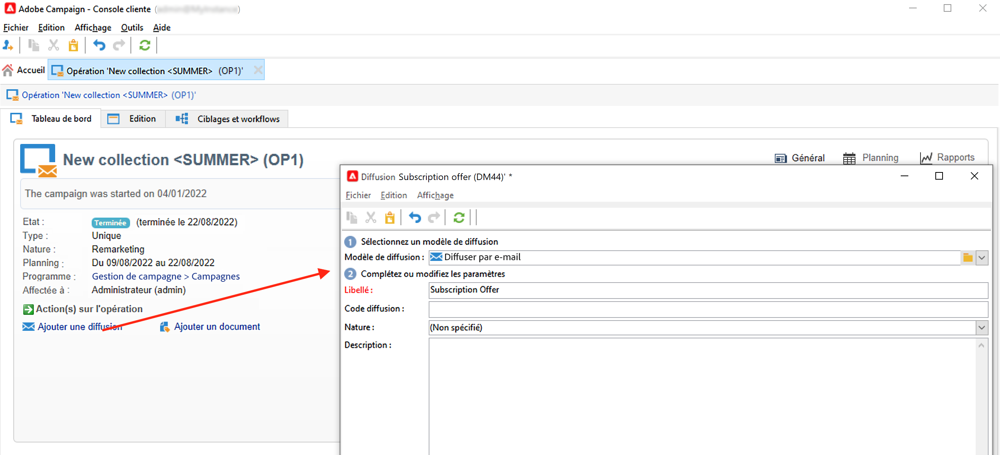
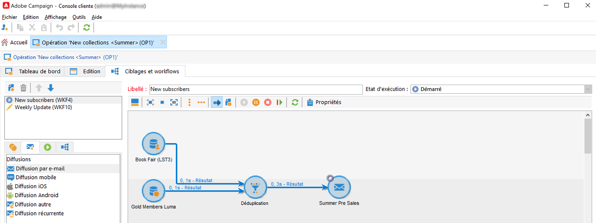
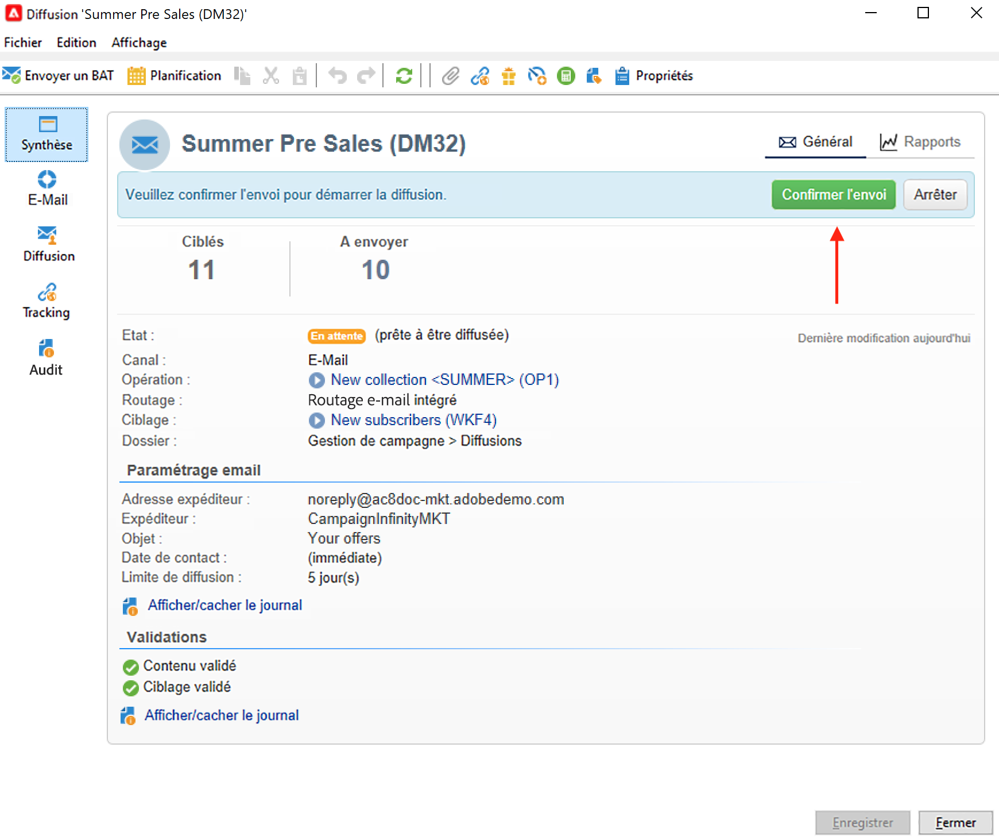
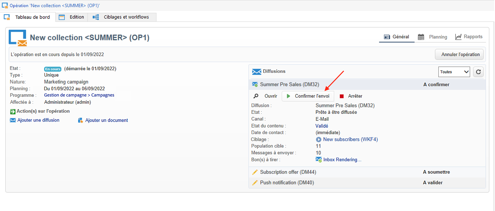
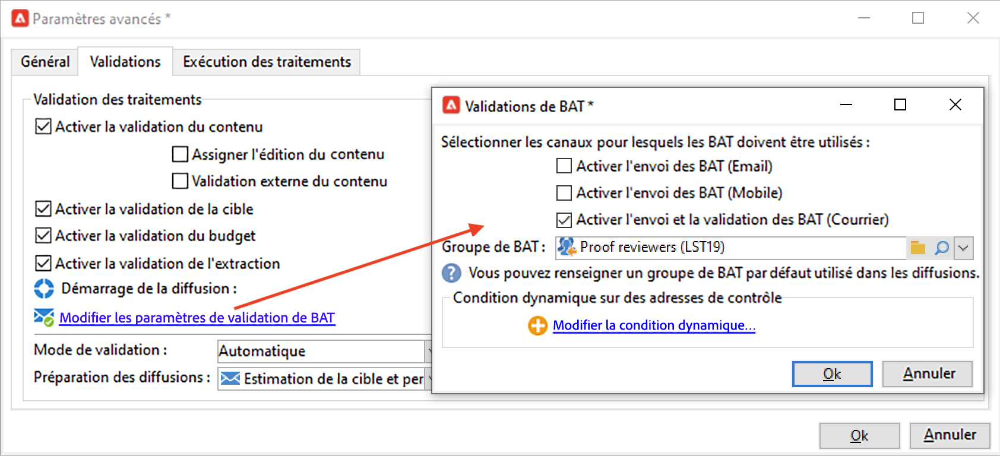
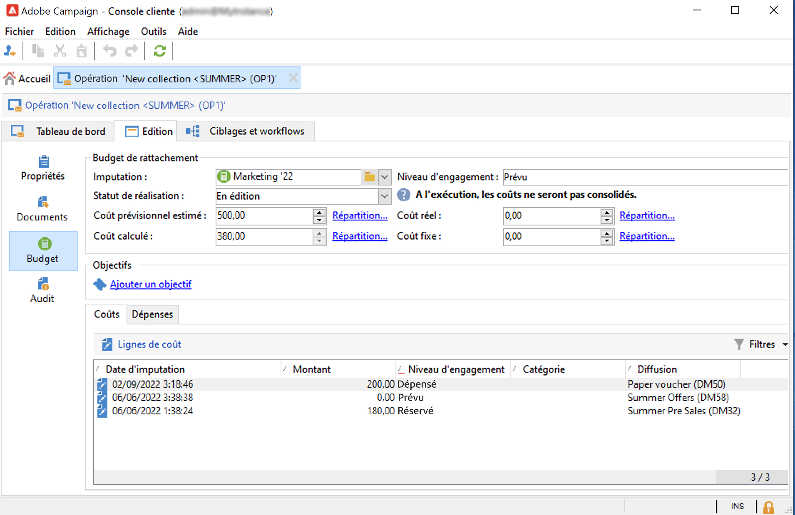
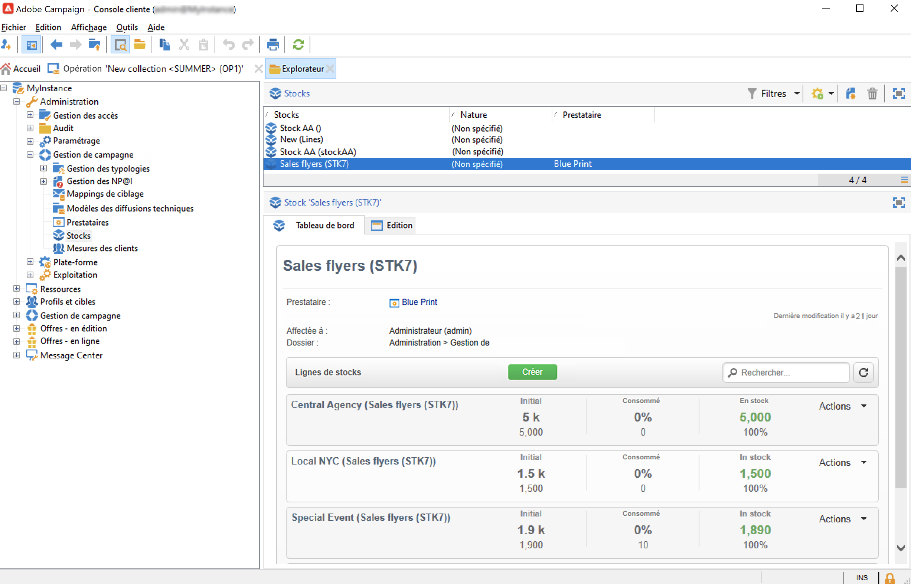
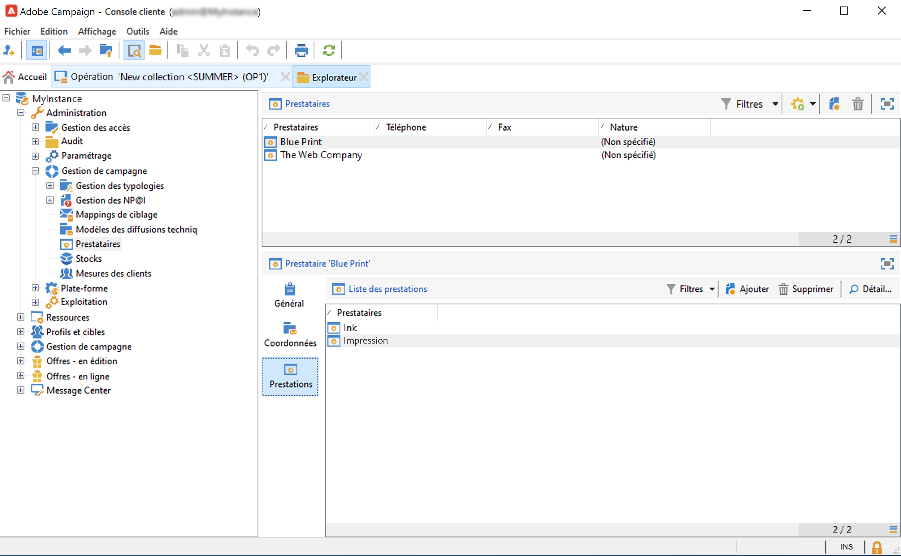

# Diffusions de campagnes marketing {#marketing-campaign-deliveries}

Orchestrer vos diffusions cross-canal dans vos campagnes : rationalisez vos communications avec Adobe Campaign par le biais d&#39;e-mails personnalisés, de SMS, de notifications push et de messages in-app. Vous pouvez utiliser des médias riches tels que des vidéos, des émoticônes ou des GIF et les intégrer directement.

Les diffusions peuvent être créées depuis le tableau de bord d&#39;une campagne, un workflow de campagne ou directement à partir de la vue d&#39;ensemble des diffusions. Une fois créées à partir d&#39;une campagne, les diffusions y sont liées et sont consolidées au niveau de cette campagne.

## Créer des diffusions {#create-deliveries}

Vous pouvez ajouter des diffusions à vos campagnes marketing de deux façons :

* À partir du lien **[!UICONTROL Ajouter une diffusion]** dans le tableau de bord de la campagne.

Une fois enregistrée, la diffusion est ajoutée dans le tableau de bord de la campagne.

* À partir d&#39;un workflow de campagne, sous l&#39;onglet **[!UICONTROL Ciblage et workflows]** en ajoutant la diffusion.

  

  Une fois le workflow démarré, la diffusion est ajoutée dans le tableau de bord de la campagne.

Découvrez comment configurer et exécuter le flux de validation de diffusion [dans cette page](marketing-campaign-approval.md).

## Démarrer une diffusion {#start-a-delivery}

Une diffusion peut être envoyée une fois toutes les validations accordées. Le processus d&#39;exécution de la diffusion dépend du canal.

* Pour les diffusions par e-mail ou sur les canaux mobiles, reportez-vous à [cette section](#start-an-online-delivery).

* Pour les diffusions par publipostage direct, reportez-vous à [cette section](#start-an-offline-delivery).

### Démarrer une diffusion e-mail ou mobile {#start-an-online-delivery}

Une fois toutes les demandes de validation approuvées, la diffusion passe au statut **[!UICONTROL Confirmation en attente]** et peut être démarrée. Les réviseurs pouvant démarrer la diffusion reçoivent une notification signifiant qu&#39;une diffusion est prête à être démarrée.

Les informations s&#39;affichent également dans le tableau de bord de l&#39;opération. La variable **[!UICONTROL Confirmer l&#39;envoi]** lien permet de lancer la diffusion.

La confirmation de la diffusion est réservée aux administrateurs, ainsi qu&#39;à l&#39;opérateur ou au groupe d&#39;opérateurs explicitement mentionnés dans les propriétés de la diffusion ou de la campagne. Si aucun opérateur n&#39;est désigné, les administrateurs et le propriétaire de la campagne peuvent valider.

Cependant, vous pouvez également permettre au propriétaire de la campagne de confirmer l&#39;envoi, même si des réviseurs spécifiques ont été définis dans les propriétés de la diffusion ou de la campagne. Pour ce faire, en tant qu&#39;administrateur, créez l&#39;option **NmsCampaign_Activate_OwnerConfirmation** et définissez la valeur sur **1**. Les options se trouvent dans le dossier **[!UICONTROL Administration]** > **[!UICONTROL Platform]** > **[!UICONTROL Options]** de l’explorateur Campaign.

### Démarrer une diffusion par publipostage direct {#start-an-offline-delivery}

Une fois toutes les validations accordées, le statut de la diffusion passe à **[!UICONTROL En attente d&#39;extraction]**. Les fichiers d&#39;extraction sont créés via un [workflow technique](../workflow/technical-workflows.md) spécifique qui, selon sa configuration par défaut, démarre automatiquement lorsqu&#39;une diffusion par publipostage direct est en attente d&#39;extraction. Lorsqu&#39;un processus est en cours, il est affiché dans le tableau de bord et peut être modifié à partir de son lien.

Une fois le workflow d&#39;extraction exécuté correctement, le fichier d&#39;extraction doit être validé (sous réserve que la validation du fichier d&#39;extraction ait été sélectionnée dans le paramétrage de la diffusion). [En savoir plus](marketing-campaign-approval.md#approving-an-extraction-file).

Suivez les étapes ci-dessous pour valider le contenu et envoyer le fichier au fournisseur :

1. Une fois le fichier d&#39;extraction validé, vous pouvez générer le BAT de l&#39;e-mail de notification au routeur. Ce message e-mail est construit à partir d&#39;un modèle de diffusion. Il doit être approuvé.

   Cette étape n&#39;est disponible que si l&#39;option **[!UICONTROL Activer l&#39;envoi et la validation des BAT (publipostage direct)]** est activée sous l&#39;onglet **[!UICONTROL Validations]** des paramètres avancés de la campagne.

   

1. Cliquez sur le bouton **[!UICONTROL Envoyer un BAT]** pour lancer la création des BAT.

   La cible des BAT doit avoir été préalablement définie.

   Vous pouvez créer autant de BAT que nécessaire. Elles sont accessibles via le **[!UICONTROL Courrier...]** lien du détail de la diffusion.

1. La diffusion passe alors à l’état **[!UICONTROL Pour envoyer]**. Cliquez sur le bouton **[!UICONTROL Envoyer un bon à tirer]** pour lancer le processus de validation.

1. La diffusion passe à l&#39;état **[!UICONTROL BAT à valider]** et un bouton permet d&#39;accepter ou refuser la validation.

   Vous pouvez alors accepter ou refuser cette validation, ou revenir à l&#39;étape d&#39;extraction

1. Une fois le BAT validé, le fichier d&#39;extraction est envoyé au routeur et la diffusion est terminée.

### Calcul des budgets et des coûts {#compute-costs-and-stocks}

L&#39;extraction du fichier lance deux processus : le calcul du budget et celui du stock. Les entrées de budget sont mises à jour.

* L&#39;onglet **[!UICONTROL Budget]** vous permet de gérer les budgets de la campagne. Le total des postes de coût est affiché dans le champ **[!UICONTROL Coût calculé]** de l&#39;onglet principal de la campagne et du programme auquel elle appartient. Les montants sont également répercutés dans le budget de la campagne.

  

  Le coût réel sera calculé au final en fonction des informations fournies par le routeur : seuls les courriers réellement envoyés sont facturés.

* Les stocks sont définis à partir du nœud **[!UICONTROL Administration > Gestion de campagnes > Stocks]** de l&#39;arborescence.

  

  Structures de coûts dans le nœud **[!UICONTROL Administration > Gestion de campagnes > Fournisseurs]**.

  

  Au niveau des stocks, vous pouvez visualiser les lignes de stocks. Pour définir le stock initial, vous devez ouvrir une ligne de stock. Le stock est décrémenté au fur et à mesure des diffusions. Vous pouvez définir un niveau d&#39;alerte et des notifications.

  >[!NOTE]
  >
  >Apprenez-en davantage sur les budgets [dans cette section](providers-stocks-and-budgets.md).
