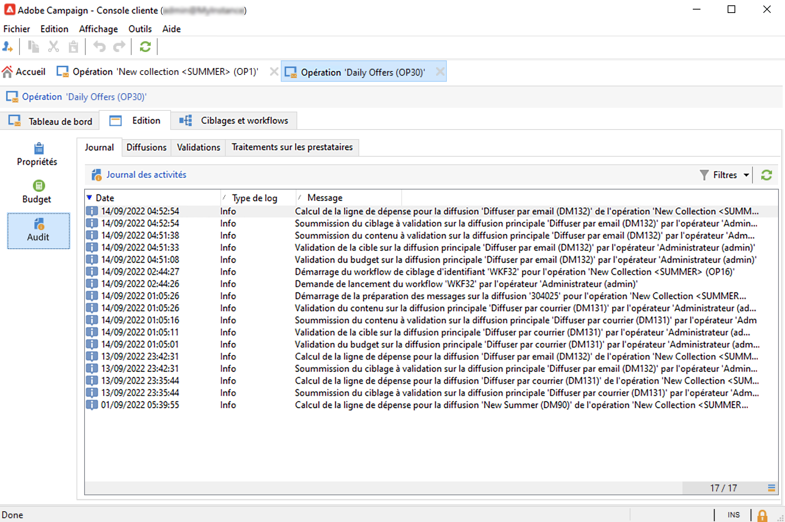
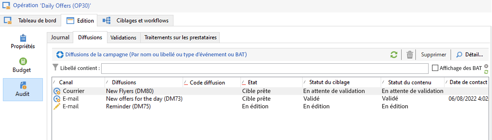
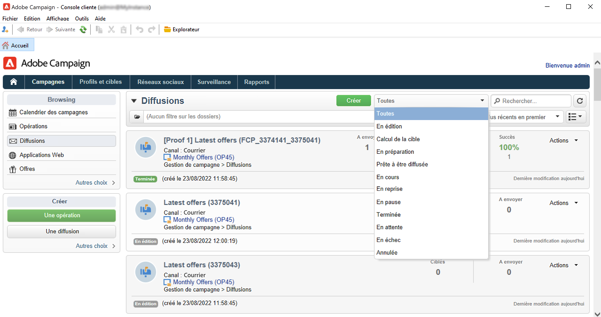

# Surveillance des campagnes marketing {#monitor-marketing-campaigns}

## Suivi d’une campagne {#tracking-a-campaign}

Pour chaque campagne, l&#39;onglet **[!UICONTROL Tracking]** vous permet de visualiser tous les traitements et leur statut.

Les informations accessibles à partir de ce sous-onglet sont les suivantes :

* Le sous-onglet **[!UICONTROL Audit]** affiche le journal des activités. Il contient les traitements exécutés lors de la campagne : création ou démarrage d&#39;un workflow, validation, extraction, gestion des stocks, etc.

  

* Le sous-onglet **[!UICONTROL Diffusions]** contient toutes les diffusions de la campagne. Elles peuvent être modifiées à partir de cet affichage. Pour cela, sélectionnez la diffusion et cliquez sur l&#39;icône **[!UICONTROL Détail]**.

  

* Le sous-onglet **[!UICONTROL Validations]** contient l&#39;ensemble du processus de validation de la campagne. Vous pouvez vérifier les détails et les commentaires.

* Les workflows créés pour générer les messages aux prestataires sont affichés dans le sous-onglet **[!UICONTROL Traitements sur les prestataires]**. Cliquez sur l’icône **[!UICONTROL Détail]** pour afficher le workflow sélectionné.

## Suivre les diffusions {#delivery-tracking}

La liste des diffusions peut être affichée à partir du lien **[!UICONTROL Diffusions]** de l&#39;univers des Campagnes.

Pour chaque diffusion, vous pouvez accéder depuis cette liste aux indicateurs-clés : état, nombre de destinataires ciblés, opération de rattachement, etc.

Pour contrôler l&#39;état d&#39;une diffusion, éditez-la et consultez son tableau de bord et ses onglets.

<!--
>[!NOTE]
>
>Information concerning delivery details is available in [this section](../../delivery/using/about-message-tracking.md) section.
-->

## Suivre l&#39;exécution {#execution-tracking}

Vous pouvez consulter le statut des diffusions en cliquant sur le lien **[!UICONTROL Diffusions]** accessible sur la page d&#39;accueil d&#39;Adobe Campaign.

Les détails des processus exécutés lors d&#39;une campagne sont collectés dans l&#39;onglet **[!UICONTROL Modifier > Audit]** de la campagne. Vous pouvez visualiser la liste des diffusions de la campagne. [En savoir plus](#tracking-a-campaign).
