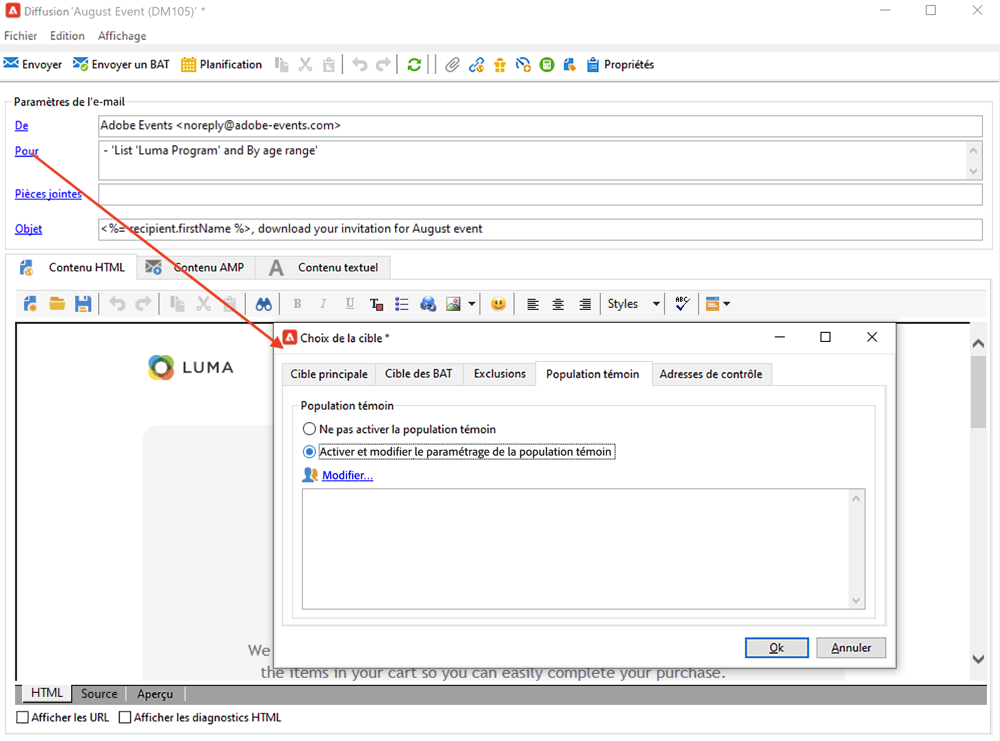
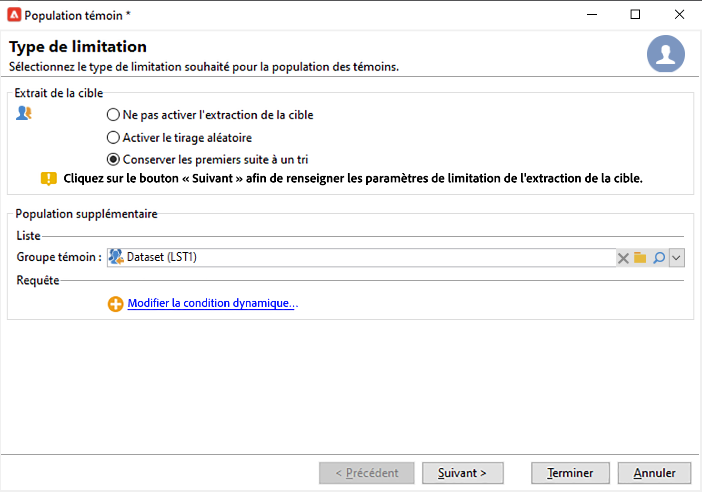

# Sélection de l’audience de vos campagnes {#marketing-campaign-deliveries}

Dans une campagne marketing, pour chaque diffusion, vous pouvez définir :

* L&#39;audience cible. Vous pouvez envoyer des messages à une [liste des destinataires](#send-to-a-group) ou créer une [audience dans un workflow](#build-the-main-target-in-a-workflow).
* Une population témoin. Vous pouvez [ajouter une population témoin](#add-a-control-group) pour surveiller le comportement des destinataires après diffusion du message.
* Adresses de contrôle : en savoir plus dans [cette section](../../v8/audiences/test-profiles.md).-->

Certaines de ces informations sont héritées du [modèle de campagne](marketing-campaign-templates.md#campaign-templates).

<!--
To build the delivery target, you can define filtering criteria for the recipients in the database. This recipient selection mode is presented in [this section](../../delivery/using/steps-defining-the-target-population.md).
-->

## Envoi à un groupe{#send-to-a-group}

Vous pouvez importer une population dans une liste puis cibler cette liste dans les diffusions. Pour ce faire, procédez comme suit :

1. Modifiez la diffusion et cliquez sur le lien **[!UICONTROL Pour]** pour modifier la population ciblée.
1. Dans l&#39;onglet **[!UICONTROL Cible principale]**, choisissez l&#39;option **[!UICONTROL Définie depuis la base de données]** et cliquez sur **[!UICONTROL Ajouter]** pour sélectionner les destinataires.

   

1. Choisissez **[!UICONTROL Une liste de destinataires]**.

   

1. Cliquez sur **[!UICONTROL Suivant]** pour sélectionner la liste.

   

   Vous pouvez affiner la cible en ajoutant de nouveaux critères de filtrage.

1. Cliquez sur **[!UICONTROL Terminer]** une fois tous les critères définis et enregistrez la cible principale.

## Création de l’audience dans un workflow de campagne {#build-the-main-target-in-a-workflow}

La cible principale d’une diffusion peut également être définie au travers d’un workflow de campagne : cet environnement graphique permet de créer une cible via des requêtes, des tests et des opérateurs tels que des unions, déduplications, partages, etc.

>[!IMPORTANT]
>
>Vous ne devez pas ajouter plus de 28 workflows dans une campagne. Au-delà de cette limite, les autres workflows sont invisibles dans l’interface et peuvent générer des erreurs.

### Créer le workflow {#create-a-targeting-workflow}

Le ciblage peut être créé en combinant des critères de filtrage, enchaînés graphiquement dans un workflow. Vous pouvez créer des populations et des sous-populations qui seront ciblées suivant vos besoins. Pour afficher l&#39;éditeur de workflows, cliquez sur l&#39;onglet **[!UICONTROL Ciblage et workflows]** dans le tableau de bord des campagnes.

La population cible est extraite de la base de données d&#39;Adobe Campaign via une ou plusieurs requêtes qui sont positionnées dans un workflow. Découvrez comment construire une requête dans [cette section](../workflow/query.md).

Il est possible de lancer des requêtes puis de partager les populations via des boîtes de type Union, Intersection, Partage, Exclusion, etc.

Sélectionnez les objets dans les listes situées à gauche de l&#39;espace de travail et enchaînez-les pour construire la cible.

Dans le diagramme, reliez ainsi entre elles les requêtes de ciblage et d&#39;ordonnancement nécessaires à la construction de la cible : vous pouvez exécuter le ciblage en cours de construction afin de contrôler la population extraite de la base de données.

>[!NOTE]
>
>Les exemples et la procédure pour définir des requêtes sont présentés dans [cette section](../workflow/query.md).

La section gauche de l&#39;éditeur contient une bibliothèque d&#39;objets graphiques qui représentent des activités. Le premier onglet regroupe les activités de ciblage et le deuxième onglet regroupe les activités d&#39;ordonnancement, qui sont utilisées plus occasionnellement afin de coordonner les activités de ciblage.

La barre d&#39;outils de l&#39;éditeur de diagramme permet d&#39;accéder aux fonctions de mise en page et d&#39;exécution du workflow de ciblage.

>[!NOTE]
>
>Les activités disponibles pour la construction du diagramme, ainsi que toutes les problématiques d&#39;affichage et de mise en page, sont présentées dans [cette section](../workflow/about-workflows.md).

Vous pouvez créer plusieurs workflows de ciblage pour une même campagne. Pour ajouter un workflow :

1. Positionnez le pointeur de la souris dans la section supérieure gauche de la zone de création des workflows, cliquez avec le bouton droit et choisissez **[!UICONTROL Ajouter]**. Vous pouvez également utiliser le bouton **[!UICONTROL Nouveau]** situé au-dessus de cette zone.

   

1. Sélectionnez le modèle de workflow **[!UICONTROL Nouveau workflow]** et nommez ce workflow.
1. Cliquez sur **[!UICONTROL Ok]** pour valider la création du workflow, puis créez le diagramme pour ce workflow.

### Exécuter le workflow {#execute-a-workflow}

Les workflows de ciblage peuvent être lancés manuellement via le bouton **[!UICONTROL Démarrer]** de la barre d&#39;outils, sous réserve que vous disposiez des droits adéquats.

Le ciblage peut être planifié afin de s&#39;exécuter automatiquement selon un planning (planificateur) ou un événement (signal externe, import d&#39;un fichier, etc.).

Les actions relatives à l&#39;exécution du workflow de ciblage (lancement, arrêt, pause, etc.) sont des processus **asynchrones** : la commande est enregistrée et sera effective dès que le serveur sera disponible pour l&#39;appliquer.

Les icônes de la barre d&#39;outils permettent d&#39;agir sur l&#39;exécution du workflow de ciblage.

* Démarrer ou redémarrer

   * L&#39;icône **[!UICONTROL Démarrer]** permet de lancer le workflow de ciblage. Lorsque vous cliquez sur cette icône, toutes les activités qui n&#39;ont pas de transition entrante sont activées (sauf les sauts de type &#39;arrivée&#39;).

     

     Le serveur prend la demande en compte, comme indiqué par son statut : **[!UICONTROL Démarrer dès que possible]**.

   * Vous pouvez redémarrer le workflow de ciblage à partir de l’icône correspondante de la barre d’outils. Cette commande peut être utile si l&#39;icône **[!UICONTROL Démarrer]** n&#39;est pas disponible, par exemple lorsque l&#39;arrêt du workflow de ciblage est en cours. Dans ce cas, cliquez sur l&#39;icône **[!UICONTROL Redémarrer]** pour anticiper le démarrage. La demande est prise en compte par le serveur, comme le notifie son état : **[!UICONTROL Redémarrage demandé]**.

* Arrêter ou suspendre

   * Les icônes de la barre d&#39;outils permettent d&#39;arrêter ou suspendre un workflow de ciblage en cours d&#39;exécution.

     Lorsque vous cliquez sur licône **[!UICONTROL Pause]**, les opérations en cours **[!UICONTROL ne sont pas]** suspendues, mais aucune autre activité nest lancée jusquau prochain redémarrage.

     

     La commande est prise en compte par le serveur, comme indiqué par son statut : **[!UICONTROL Pause demandée]**.

     Vous pouvez également suspendre automatiquement un workflow de ciblage lorsque l’exécution arrive à une activité spécifique. Pour cela, cliquez avec le bouton droit sur l&#39;activité à partir de laquelle le workflow de ciblage sera suspendu et choisissez **[!UICONTROL Activer mais ne pas exécuter]**.

     

     Une icône spécifique matérialise ce paramétrage.

     

     >[!NOTE]
     >
     >Cette option est utile lors des phases de conception et de test d&#39;une opération de ciblage.

     Cliquez sur **[!UICONTROL Démarrer]** pour reprendre l&#39;exécution.

   * Cliquez sur l&#39;icône **[!UICONTROL Arrêter]** pour stopper l&#39;exécution en cours.

     

     La commande est prise en compte par le serveur, comme indiqué par son statut : **[!UICONTROL Arrêt demandé]**.

  Vous pouvez également arrêter automatiquement un workflow de ciblage lorsque l’exécution arrive à une activité. Pour cela, cliquez avec le bouton droit sur l&#39;activité à partir de laquelle le workflow de ciblage sera suspendu et choisissez **[!UICONTROL Ne pas activer]**.

  

  Une icône spécifique matérialise ce paramétrage.

  

  >[!NOTE]
  >
  >Cette option est utile lors des phases de conception et de test d&#39;une opération de ciblage.

* Arrêt inconditionnel

  Dans l&#39;Explorateur, sélectionnez **[!UICONTROL Administration > Exploitation > Objets créés automatiquement > Workflows des opérations]** pour accéder aux workflows des opérations et agir sur ces derniers.

  Vous pouvez effectuer un arrêt conditionnel de votre workflow en cliquant sur l&#39;icône **[!UICONTROL Actions]** et en sélectionnant **[!UICONTROL Arrêt inconditionnel]**. Cette action arrête votre workflow d&#39;opération.

  

  >[!CAUTION]
  >
  >L’arrêt inconditionnel est réservé aux personnes disposant de droits d’administration uniquement.

## Ajout d’une population témoin {#add-a-control-group}

La population témoin est une population qui ne recevra pas la diffusion : elle est utilisée pour suivre les comportements après diffusion et l&#39;impact de la campagne, par comparaison du comportement de la population cible, qui, elle, a reçu la diffusion.

La population témoin peut être extraite de la cible principale et/ou issue d&#39;un groupe ou d&#39;une requête spécifique.

### Activation de la population témoin pour une campagne {#activate-the-control-group-for-a-campaign}

Vous pouvez définir une population témoin au niveau de l&#39;opération : elle sera alors appliquée à chaque diffusion de l&#39;opération concernée.

1. Éditez l&#39;opération concernée et cliquez sur l&#39;onglet **[!UICONTROL Edition]**.
1. Cliquez sur **[!UICONTROL Paramètres avancés de la campagne...]**.

   

1. Sélectionnez l&#39;option **[!UICONTROL Activer et éditer le paramétrage de la population témoin]**.
1. Cliquez sur **[!UICONTROL Editer...]** pour paramétrer la population témoin.

   

La procédure complète est présentée dans [cette section](#extract-the-control-group-from-the-main-target). En savoir plus sur les populations témoins dans [cette section](#add-a-population).

### Activation de la population témoin pour une diffusion {#activate-the-control-group-for-a-delivery}

Vous pouvez définir une population témoin au niveau de la diffusion : elle sera alors appliquée à chaque diffusion de l&#39;opération concernée.

Par défaut, le paramétrage de la population témoin défini au niveau de l&#39;opération s&#39;applique pour chaque diffusion de cette opération. Vous pouvez toutefois adapter la population témoin unitairement pour une diffusion.

>[!NOTE]
>
>Si vous avez défini une population témoin au niveau d&#39;une opération et que vous la configurez également pour une diffusion liée à cette opération, seule la population témoin définie pour la diffusion sera appliquée.

1. Modifiez la diffusion concernée, puis cliquez sur le lien **[!UICONTROL Pour]**.
1. Cliquez sur l’onglet **[!UICONTROL Population témoin]**, puis sélectionnez **[!UICONTROL Activer et modifier la configuration de la population témoin]**.

   

1. Cliquez sur **[!UICONTROL Editer...]** pour paramétrer la population témoin.

La procédure complète est présentée dans [cette section](#extract-the-control-group-from-the-main-target).

### Utiliser une nouvelle population comme population témoin {#add-a-population}

Vous pouvez utiliser une population spécifique comme population témoin. Dans ce cas, sélectionnez la liste à utiliser comme population témoin dans le champ correspondant.

Cette population peut provenir d&#39;un répertoire de destinataires ou vous pouvez la définir via une requête spécifique.

>[!NOTE]
>
>L&#39;éditeur de requête d&#39;Adobe Campaign est présenté dans [cette section](../../v8/start/query-editor.md).

### Extraire la population témoin de la cible principale {#extract-the-control-group-from-the-main-target}

Vous pouvez également extraire des destinataires de la cible principale de la diffusion. Dans ce cas, les destinataires seront issus de la cible des actions de diffusion affectées par cette configuration. Cette extraction peut être aléatoire ou résulter d&#39;un tri des destinataires.

Pour extraire une population témoin, activez la population témoin au niveau de la campagne ou de la diffusion et choisissez une des options suivantes : **[!UICONTROL Activer l&#39;échantillonnage aléatoire]** ou **[!UICONTROL Conserver les premiers enregistrements suite à un tri]**.

* Utilisez l&#39;option **[!UICONTROL Activer l&#39;échantillonnage aléatoire]** pour appliquer un échantillonnage aléatoire aux destinataires de la population principale. Ensuite, si vous définissez le seuil à 100, la population témoin sera composée de 100 destinataires sélectionnés de manière aléatoire parmi la population ciblée. L&#39;échantillonnage aléatoire dépend du moteur de base de données.
* Utilisez l&#39;option **[!UICONTROL Conserver les premiers enregistrements suite à un tri]** pour définir une limite en fonction d&#39;un ou de plusieurs ordres de tri. Si vous sélectionnez le champ **[!UICONTROL Âge]** comme critère de tri et puis définissez 100 comme seuil, la population témoin sera composée des 100 destinataires les plus jeunes. Par exemple, il pourrait être intéressant de définir une population témoin qui inclut les profils qui font quelques achats ou des achats fréquents et de comparer leur comportement à celui des destinataires contactés.

Cliquez sur **[!UICONTROL Suivant]** pour définir l&#39;ordre de tri (si besoin) et sélectionnez le mode de limitation des destinataires.

Cette configuration équivaut à une activité **[!UICONTROL Partage]** dans le workflow, ce qui vous permet de diviser la cible en sous-ensembles. La population témoin est l&#39;un de ces sous-ensembles.

### Tutoriel vidéo {#create-email-video}

Cette vidéo explique comment ajouter une population témoin à une campagne.

>[!VIDEO](https://video.tv.adobe.com/v/335606?quality=12)

D’autres vidéos pratiques sur Campaign sont disponibles [ici](https://experienceleague.adobe.com/docs/campaign-learn/tutorials/getting-started/introduction-to-adobe-campaign.html?lang=fr){target="_blank"}.
