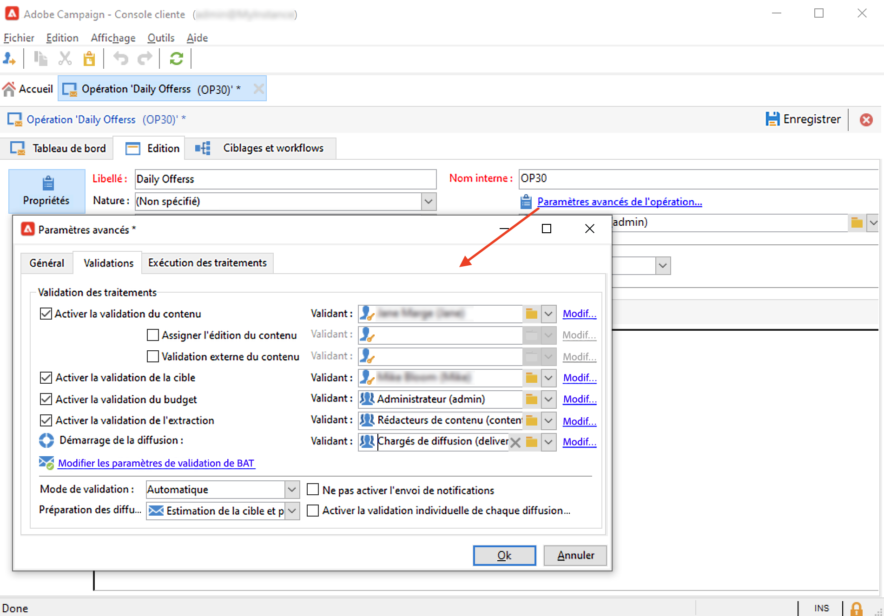

# Création et configuration de modèles d’opération {#campaign-templates}

Toutes les campagnes marketing sont basées sur un modèle qui stocke les principales caractéristiques et fonctionnalités. Campaign est fourni avec un modèle intégré qui permet de créer des campagnes. Toutes les fonctionnalités de ce modèle sont activées : documents, adresses de contrôle, validations, compositions de diffusion, etc.

Les fonctionnalités disponibles dépendent de vos autorisations, modules complémentaires et de la configuration de votre plateforme Adobe Campaign.

>[!NOTE]
>
>Vous pouvez afficher l’arborescence en cliquant sur l’icône de l’**[!UICONTROL Explorateur]** sur la page d’accueil.

Un modèle natif est fourni pour créer une opération pour laquelle aucune configuration spécifique n’a été définie. Vous pouvez créer et configurer des modèles d&#39;opération, puis créer des opérations à partir de ces modèles.

## Création d’un modèle d’opération {#create-a-campaign-template}

Pour créer un modèle de campagne, procédez comme suit :

1. Ouvrez l&#39;**Explorateur** Campaign et accédez à **Ressources > Modèles > Modèles de campagne**.
1. Cliquez sur **Nouveau** dans la barre d&#39;outils située au-dessus de la liste des modèles.

Vous pouvez également **dupliquer** le modèle par intégré afin de le réutiliser et d&#39;adapter sa configuration à vos besoins. Pour cela, faites un clic droit sur le modèle et sélectionnez **Dupliquer**.

1. Saisissez le libellé du nouveau modèle d&#39;opération.
1. Cliquez sur **Enregistrer**, puis rouvrez le modèle.
1. Dans l&#39;onglet **Modifier**, définissez les propriétés du modèle.
1. Sélectionnez le lien **Paramètres avancés de la campagne...** pour ajouter un workflow à votre modèle de campagne.

   

1. Remplacez la valeur **Ciblage et workflows** par **Oui**, puis confirmez. Découvrez comment ajouter des fonctionnalités dans [cette section](#typology-of-enabled-modules).
1. L&#39;onglet **Ciblage et workflows** est ajouté au modèle. Cliquez sur **Ajouter un workflow...**, puis saisissez un **libellé** et cliquez sur **Ok**.
1. Créez votre workflow selon vos besoins.

   

1. Cliquez sur **Enregistrer**. Votre modèle est maintenant prêt à être utilisé pour créer une nouvelle campagne.

Les divers onglets et sous-onglets du modèle de campagne vous permettent d&#39;accéder à ses paramètres, qui sont décrits dans la section [Configuration générale](#general-configuration).

## Sélection des modules {#select-modules}

Le lien **[!UICONTROL Paramètres avancés de la campagne…]** vous permet d&#39;activer et de désactiver des traitements des campagnes basées sur ce modèle. Sélectionnez les fonctionnalités à activer dans les campagnes créées à partir de ce modèle.

Si une fonctionnalité n&#39;est pas sélectionnée, les éléments relatifs au processus (menus, icônes, options, onglets, sous-onglets, etc.) n&#39;apparaissent pas dans l&#39;interface du modèle ou dans les campagnes basées sur ce modèle. Les onglets situés à gauche des détails de la campagne, ainsi que ceux disponibles, coïncident généralement avec les processus sélectionnés dans le modèle. Par exemple, si la fonctionnalité **Dépenses et objectifs** n&#39;est pas sélectionnée, l&#39;onglet **[!UICONTROL Budget]** correspondant n&#39;apparaîtra pas dans les campagnes basées sur ce modèle.

De plus, des raccourcis vers les fenêtres de configuration sont ajoutés dans le tableau de bord de la campagne : lorsqu&#39;une fonctionnalité est activée, un lien direct permet d&#39;y accéder depuis le tableau de bord de la campagne.

### Modèles de configuration

* Par exemple, avec les paramètres suivants :

  

  Le tableau de bord de la campagne affiche :

  

  Notez que l&#39;onglet **[!UICONTROL Ciblage et workflows]** est manquant.

  Les fonctionnalités suivantes sont disponibles :

  

  Notez que l&#39;onglet **[!UICONTROL Budget]** est manquant.

  Les paramètres avancés de la campagne reflètent également cette configuration.

  

  Notez que l&#39;onglet **[!UICONTROL Validations]** n&#39;est pas disponible.

* Avec cette configuration :
  

  Le tableau de bord de la campagne affiche :

  

  Notez que l&#39;onglet **[!UICONTROL Ciblage et workflows]** est disponible, mais le lien **Ajouter un document** est manquant.

  Les fonctionnalités suivantes sont disponibles :

  

  Notez que l&#39;onglet **[!UICONTROL Budget]** est disponible.

  Les paramètres avancés de la campagne reflètent également cette configuration.

  

  Notez que l&#39;onglet **[!UICONTROL Validations]** est disponible, mais les onglets **[!UICONTROL Population témoin]** et **[!UICONTROL Adresses de contrôle]** ne sont pas activés.

## Typologie des modules {#typology-of-enabled-modules}

* **Population témoin**

  Lorsque ce module est sélectionné, un onglet supplémentaire est ajouté dans les paramètres avancés du modèle et des opérations basées sur ce modèle. La configuration peut être définie à partir du modèle ou individuellement, au niveau de chaque opération. En savoir plus sur les populations témoins dans [cette section](marketing-campaign-deliveries.md#defining-a-control-group).

  

* **Adresses de contrôle**

  Lorsque ce module est sélectionné, un onglet supplémentaire est ajouté dans les paramètres avancés du modèle et des opérations basées sur ce modèle. La configuration peut être définie à partir du modèle ou individuellement, au niveau de chaque opération.

  

* **Documents**

  Lorsque ce module est sélectionné, un onglet supplémentaire est ajouté à l&#39;onglet **[!UICONTROL Modifier]** du modèle et des campagnes basées sur ce modèle. Les documents attachés peuvent être ajoutés à partir du modèle ou individuellement au niveau de chaque campagne. En savoir plus sur les documents dans [cette section](marketing-campaign-deliveries.md#manage-associated-documents).

  

* **Composition de diffusion**

  Lorsque ce module est sélectionné, un sous-onglet **[!UICONTROL Compositions de diffusion]** est ajouté à l’onglet **[!UICONTROL Documents]** afin de définir des compositions de diffusion pour l’opération. En savoir plus sur les compositions de diffusion dans [cette section](marketing-campaign-assets.md#delivery-outlines).

  

* **Ciblages et workflows**

  Lorsque vous sélectionnez le module **[!UICONTROL Ciblages et workflows]**, un onglet est ajouté pour vous permettre de créer un ou plusieurs workflows pour les opérations basées sur ce modèle. Les workflows peuvent également être configurés individuellement pour chaque opération en fonction de ce modèle. En savoir plus sur les workflows des opérations dans [cette section](marketing-campaign-deliveries.md#build-the-main-target-in-a-workflow).

  

  Lorsque ce module est activé, un onglet **[!UICONTROL Traitements]** est ajouté dans les paramètres avancés de la campagne afin de définir la séquence d&#39;exécution du processus.

* **Validations**

  Si vous sélectionnez le module **[!UICONTROL Validations]**, vous pouvez sélectionner les processus à valider et choisir les opérateurs chargés de leur validation. En savoir plus sur les validations dans [cette section](marketing-campaign-approval.md#select-reviewers).

  

  Vous pouvez choisir d&#39;activer ou non la validation du processus dans l&#39;onglet **[!UICONTROL Validations]** de la section des paramètres avancés des modèles.

* **Dépenses et objectifs**

  Lorsque ce module est sélectionné, un onglet **[!UICONTROL Budget]** est ajouté dans les détails du modèle et des opérations basées sur ce modèle afin de sélectionner le budget associé.

  

## Propriétés des modèles {#template-properties}

Lorsque vous créez un modèle de campagne, vous devez indiquer les informations suivantes :

* Saisissez le **libellé** du modèle : le libellé est obligatoire et constitue le libellé par défaut pour toutes les campagnes basées sur ce modèle.
* Sélectionnez la **nature** de la campagne dans la liste déroulante. Les valeurs proposées dans cette liste correspondent à celles enregistrées dans l’énumération **[!UICONTROL natureOp]**.

Découvrez comment accéder à vos énumérations et la manière de les configurer sur [cette page](../../v8/config/ui-settings.md#enumerations).

* Sélectionnez le **type de campagne** : unique, récurrente ou périodique. Par défaut, les modèles de campagne s&#39;appliquent aux campagnes uniques. Les opérations périodiques et récurrentes sont décrites dans [cette section](recurring-periodic-campaigns.md).
* Indiquez la durée de l&#39;opération, c&#39;est-à-dire la période sur laquelle s&#39;étalera l&#39;opération. Lors de la création d&#39;une opération basée sur ce modèle, les dates de début et de fin de l&#39;opération seront alors automatiquement renseignées.

  S&#39;il s&#39;agit d&#39;une opération récurrente, vous devez indiquer les dates de début et de fin de l&#39;opération directement dans le modèle.

* Indiquez le **programme d&#39;appartenance** du modèle : les campagnes basées sur le modèle seront associées au programme sélectionné.

<!--
## Track campaign execution{#campaign-reverse-scheduling}

You can create a schedule for a campaign and track accomplishments, for instance to prepare an event schedule for a specific date. Campaign templates now let you calculate the start date of a task based on the end date of a campaign.

In the task configuration box, go to the **[!UICONTROL Implementation schedule]** area and check the **[!UICONTROL The start date is calculated based on the campaign end date]** box. (Here, "start date" is the task start date). Go to the **[!UICONTROL Start]** field and enter an interval: the task will start this long before the campaign end date. If you enter a period which is longer than the campaign is set to last, the task will begin before the campaign.

When you create a campaign using this template, the task start date will be calculated automatically. However, you can always change it later.-->
