# Prestataires, stocks et budgets{#providers-stocks-and-budgets}

Adobe Campaign vous permet de définir des prestataires qui seront impliqués dans les traitements réalisés dans les opérations. Les informations relatives aux prestataires et les structures de coûts qui leur sont associées sont définies par l&#39;administrateur Adobe Campaign, à partir de la vue globale. Le prestataire est référencé au niveau de la diffusion : ses structures de coûts permettent le calcul des coûts liés à cette diffusion ainsi que la gestion des stocks impactés.

## Créer les fournisseurs et leurs structures de coûts {#create-service-providers-and-their-cost-structures}

Chaque prestataire est enregistré dans une fiche avec ses coordonnées, ses modèles de prestation et les traitements associés.

Les prestataires sont paramétrés dans le dossier **[!UICONTROL Administration > Gestion de campagne]** de l’explorateur Campaign.

Les traitements réalisés dans les diffusions sont assurés par des prestataires, notamment pour le courrier et les canaux mobiles. Ces prestataires peuvent par exemple intervenir dans les opérations d&#39;impression ou de distribution des messages. Ces traitements engendrent des configurations et des coûts spécifiques à chaque prestataire. La configuration des prestataires de service est composée de quatre étapes :

1. Création du prestataire dans Adobe Campaign. [En savoir plus](#add-a-service-provider)

1. Définition des postes et structures de coûts des modèles de prestation qui lui sont associés. [En savoir plus](#define-cost-categories)

1. Configuration des traitements. [En savoir plus](#configure-processes-associated-with-a-service).

1. Référencement du fournisseur au niveau des campagnes. [En savoir plus](#associate-a-service-with-a-campaign).

### Créer un fournisseur et ses postes de coûts {#create-a-service-provider-and-its-cost-categories}

#### Ajouter un fournisseur {#add-a-service-provider}

Vous pouvez créer autant de fournisseurs que nécessaire pour vos diffusions. Pour ajouter un fournisseur, les étapes sont les suivantes :

1. Cliquez sur le bouton **[!UICONTROL Nouveau]** situé au-dessus de la liste des fournisseurs.
1. Dans la section inférieure de la fenêtre, indiquez son nom et ses coordonnées.

   

1. Cliquez sur le bouton **[!UICONTROL Enregistrer]** pour ajouter le prestataire dans la liste.

#### Définir des postes de coûts {#define-cost-categories}

Vous pouvez désormais associer des modèles de service à chaque fournisseur. Dans ces modèles, vous devez d&#39;abord identifier les postes de coûts et, au besoin, le stock concerné. Vous pouvez ensuite créer les règles de calcul des coûts pour chaque poste, via les structures de coûts. [En savoir plus](#define-the-cost-structure).

Un poste de coût est une entité contenant un ensemble de coûts éligibles pour un type de diffusion (e-mail, publipostage direct, SMS, etc.). Les postes de coûts sont regroupés dans les modèles de prestations associés aux fournisseurs. Chaque fournisseur peut référencer un ou plusieurs modèles de prestation.

Pour créer un modèle de prestation et définir son contenu, procédez comme suit :

1. Sous l&#39;onglet **[!UICONTROL Prestations]** du fournisseur, cliquez sur le bouton **[!UICONTROL Ajouter]** et nommez le modèle de prestation.

   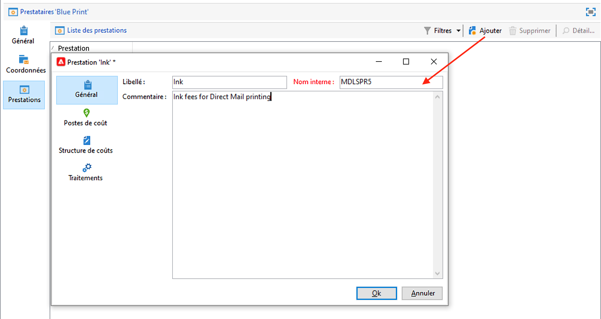

1. Créez les catégories de coûts pour chaque type de traitement (diffusion par courrier/e-mail/etc. ou tâche). Pour ce faire, cliquez sur l’onglet **[!UICONTROL Catégories de coûts]**, puis sur le bouton **[!UICONTROL Ajouter]** et renseignez les paramètres de chaque catégorie de coût.

   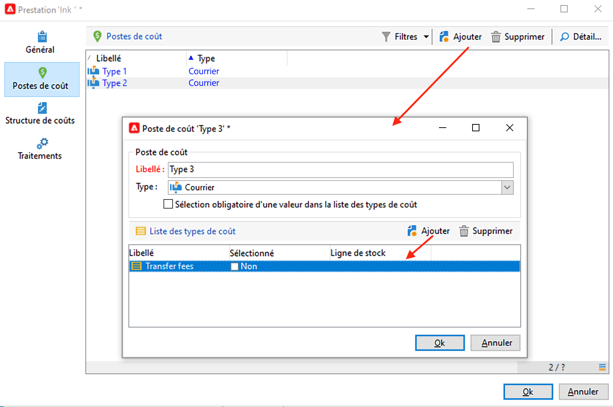

   * Saisissez un libellé pour ce poste de coût et sélectionnez le type de traitement concerné : diffusion par **[!UICONTROL Publipostage direct]**, **[!UICONTROL E-mail]**, **[!UICONTROL Mobile]**, etc.
   * Cliquez sur le bouton **[!UICONTROL Ajouter]** pour définir les types de coûts associés à ce poste.
   * Au besoin, associez une ligne de stock à chaque type de coût afin de reporter automatiquement les quantités utilisées sur les stocks existant.

     >[!NOTE]
     >
     >Les lignes de stock sont définies dans le nœud **[!UICONTROL Gestion des stocks]**. [En savoir plus](#stock-and-order-management).

1. Vous pouvez présélectionner une valeur pour ce poste de coût, qui est celle par défaut dans les postes de coûts des fournisseurs (au lieu d&#39;une valeur vide). Pour ce faire, activez l&#39;option **Oui** dans la colonne **[!UICONTROL Sélectionné]** pour le type de poste concerné :

   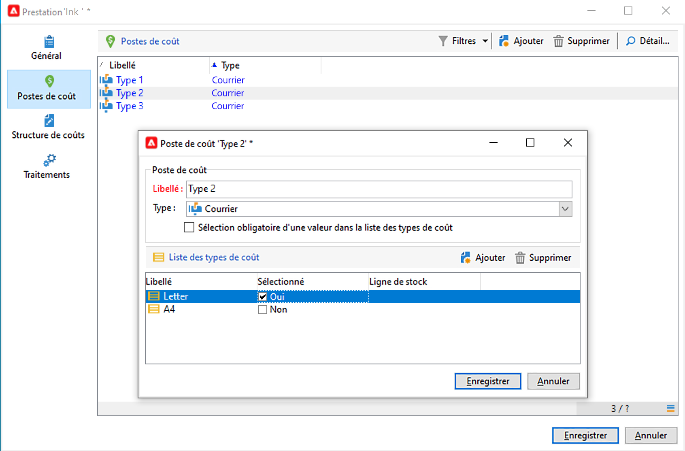

   Au niveau de la diffusion, la valeur sera sélectionnée par défaut.

### Définir la structure de coûts {#define-the-cost-structure}

Une structure de coûts indique, pour chaque type de coût, les règles de calcul à appliquer.

Cliquez sur l’onglet **[!UICONTROL Structure de coûts]** pour configurer le calcul des coûts pour chaque catégorie et type de coût. Cliquez sur **[!UICONTROL Ajouter]** et saisissez la structure de coûts.

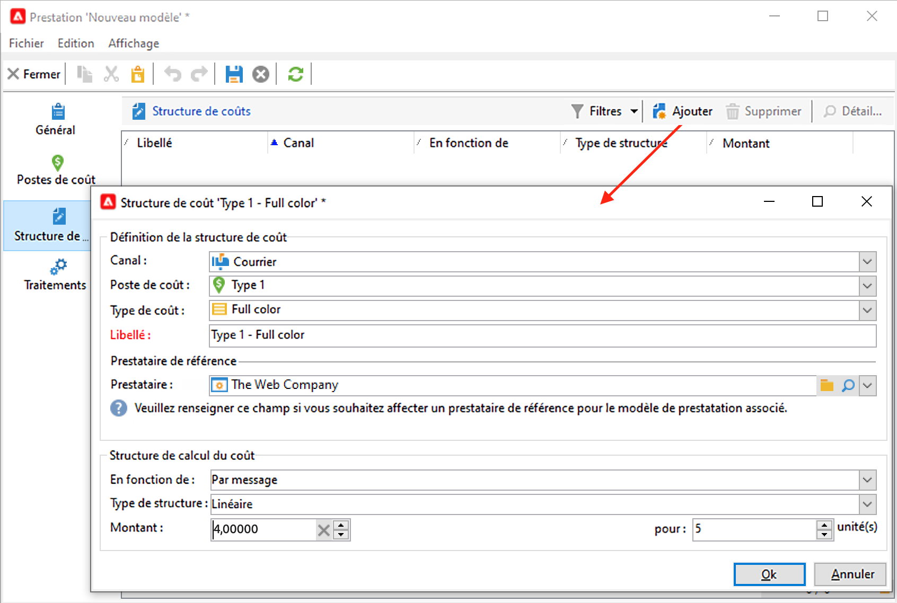

* Pour créer la structure de coûts, sélectionnez dans les listes déroulantes le type de message et la catégorie de coût concerné, ainsi que le type de coût auquel s’appliquera la règle de calcul. Le contenu de ces listes déroulantes reprend les informations renseignées à partir de l’onglet **[!UICONTROL Catégories de coût]**.

  Vous devez attribuer un libellé à la structure de coûts. Par défaut, elle présente la composition de diffusion suivante : **Catégorie de coût - Type de coût**.

  Vous pouvez toutefois le renommer : saisissez alors directement la valeur souhaitée dans le champ **[!UICONTROL Libellé]**.

* La formule de calcul du coût est définie dans la section inférieure de la fenêtre.

  Cette formule peut être fixe (quel que soit le nombre de message), ou calculée en fonction du nombre de messages.

  Lorsqu&#39;elle dépend du nombre de messages, la structure de calcul du coût peut être **[!UICONTROL Linéaire]**, **[!UICONTROL Linéaire par seuil]** ou **[!UICONTROL Constant par seuil]**.

#### Structure linéaire {#linear-structure}

Si le montant est toujours le même, pour un message (ou un lot de messages), et ce, quel que soit le nombre de messages total, sélectionnez un type de structure **[!UICONTROL Linéaire]** et saisissez le coût de chaque message.

Si ce montant s&#39;applique à un lot de messages, indiquez le nombre de messages concernés dans le champ **[!UICONTROL pour]**.

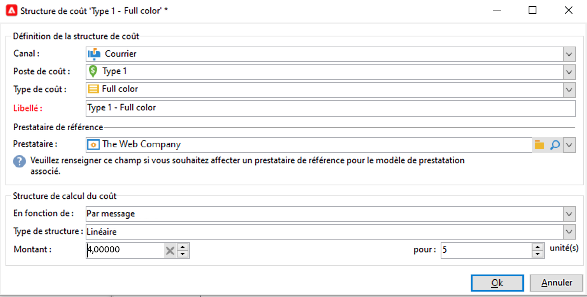

#### Structure linéaire par seuil {#linear-structure-by-threshold}

Si le montant s&#39;applique par seuil pour chaque message, vous devez alors définir une structure de calcul **[!UICONTROL Linéaire par seuil]**. Dans ce type de structure de coût, chaque message coûtera, par exemple, 0,13 si le nombre total de message se situe entre 1 et 100, puis coûtera 0,12 entre 100 et 1000 messages envoyés, et 0,11 au-delà de 1000 messages.

La configuration est la suivante :

Pour ajouter un seuil, cliquez sur le bouton **[!UICONTROL Ajouter]** situé à droite de la liste.

#### Structure constante par seuil {#constant-structure-by-threshold}

Enfin, vous pouvez configurer un calcul des coûts en fonction du nombre total de messages. Pour ce faire, sélectionnez une structure de calcul **[!UICONTROL Constante par seuil]**. Par exemple, le coût sera fixé à 12 pour 1 à 100 messages ; à 100 pour une diffusion de 101 à 1000 messages, et à 500 pour toute diffusion de plus de 1 000 messages, quel que soit le nombre total.

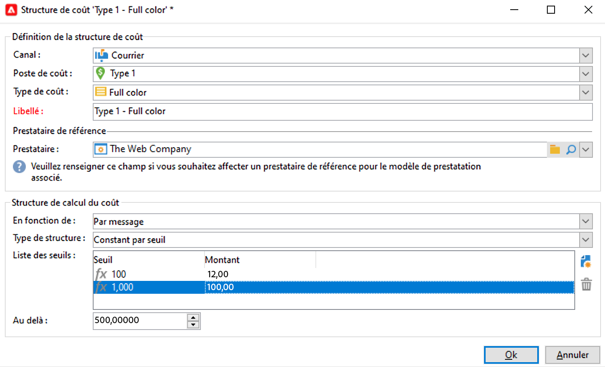

### Configurer les traitements associés à un prestataire {#configure-processes-associated-with-a-service}

Vous pouvez associer des informations sur les traitements liés à une prestation depuis l&#39;onglet **[!UICONTROL Traitements]**. Cette section permet de configurer l&#39;envoi d&#39;informations au routeur.

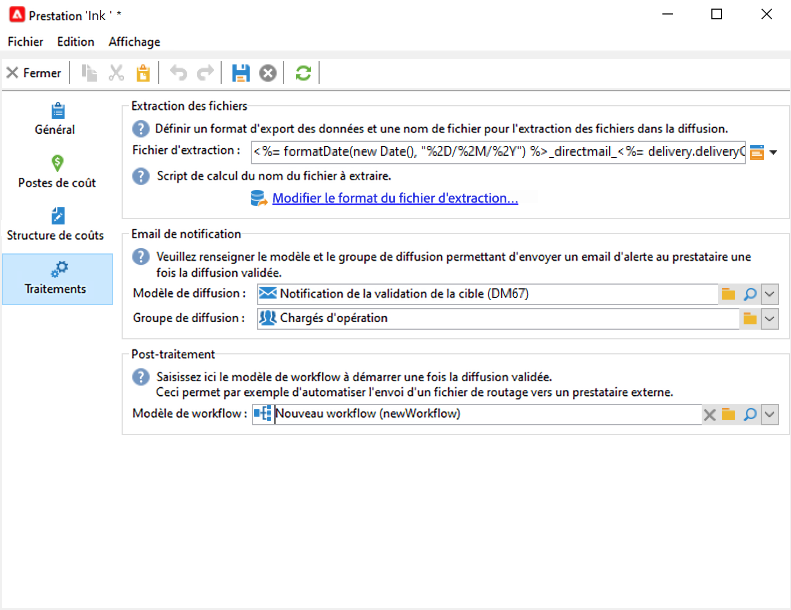

* La section **[!UICONTROL Extraction de fichier]** indique le modèle d’export utilisé pour la diffusion lorsque cette prestation est sélectionnée. Vous pouvez indiquer le nom du fichier de sortie dans le champ **[!UICONTROL Fichier d’extraction]**. Le bouton situé à droite du champ permet d’insérer des variables.

* La section **[!UICONTROL E-mail de notification]** permet d’indiquer le modèle de notification aux prestataires de service après l’envoi des fichiers. Vous devez sélectionner le modèle utilisé pour créer le message d’alerte et le groupe de destinataires.

  Par défaut, les modèles de diffusion pour les messages de notification sont enregistrés dans le dossier **[!UICONTROL Administration > Gestion de campagne > Modèles des diffusions techniques]**, accessible à partir de la vue globale.

* La section **[!UICONTROL Post-traitement]** permet de sélectionner le workflow à lancer une fois la diffusion validée. Si un modèle de workflow est renseigné, une instance de workflow sera automatiquement créée puis démarrée dès que la validation sera effective. Ce workflow peut par exemple permettre d’envoyer le fichier d’extraction vers un prestataire externe chargé de l’exploiter.

### Associer un service à une campagne {#associate-a-service-with-a-campaign}

Les fournisseurs sont associés aux diffusions de campagnes. Ils sont référencés dans les modèles de diffusion pour offrir leurs services dans les diffusions créées via ce modèle.

Lorsqu’un service est sélectionné, les catégories de coûts correspondant au type de diffusion (courrier, e-mail, etc.) sont automatiquement indiquées dans le tableau central, ainsi que les options de traitement qui ont été définies.

>[!NOTE]
>
>Si aucune catégorie de coût n’est affichée lorsqu’une prestation est sélectionnée, cela signifie qu’aucune catégorie de coût n’a été définie pour ce type de traitement. Par exemple, pour une diffusion e-mail, si aucun type de catégorie de coût **[!UICONTROL E-mail]** n’a été défini, aucune catégorie ne s’affichera et la sélection du service n’aura aucun effet.

* Pour une diffusion courrier, vous pouvez sélectionner le service à partir de la fenêtre de configuration.

  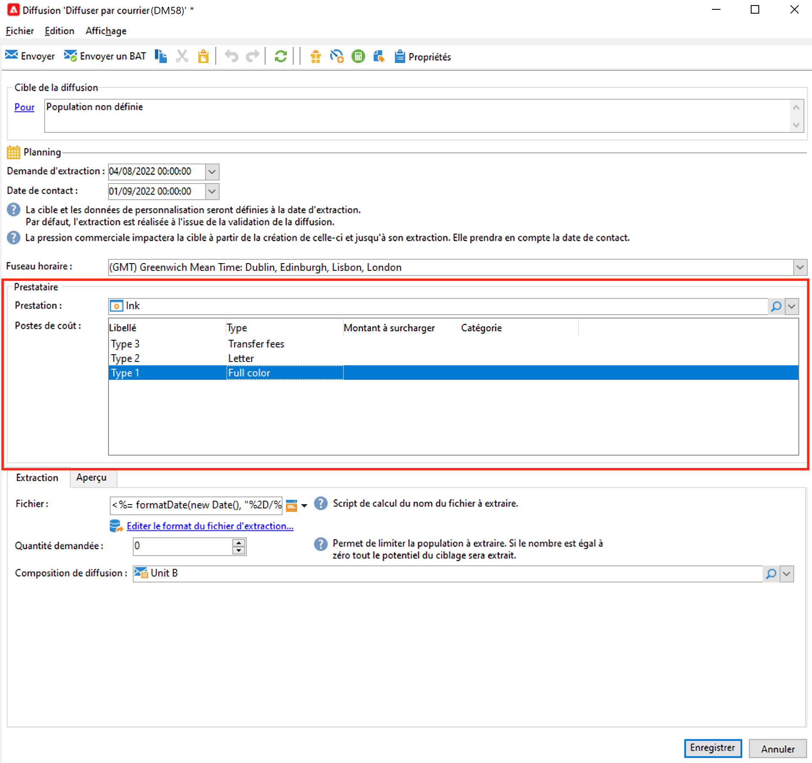

* Pour une diffusion sur canaux mobiles, le mode de sélection est le même.
* Pour une diffusion par email, la prestation est sélectionnée à partir de l&#39;onglet **[!UICONTROL Avancé]** des propriétés de la diffusion, comme dans l&#39;exemple ci-dessous :

  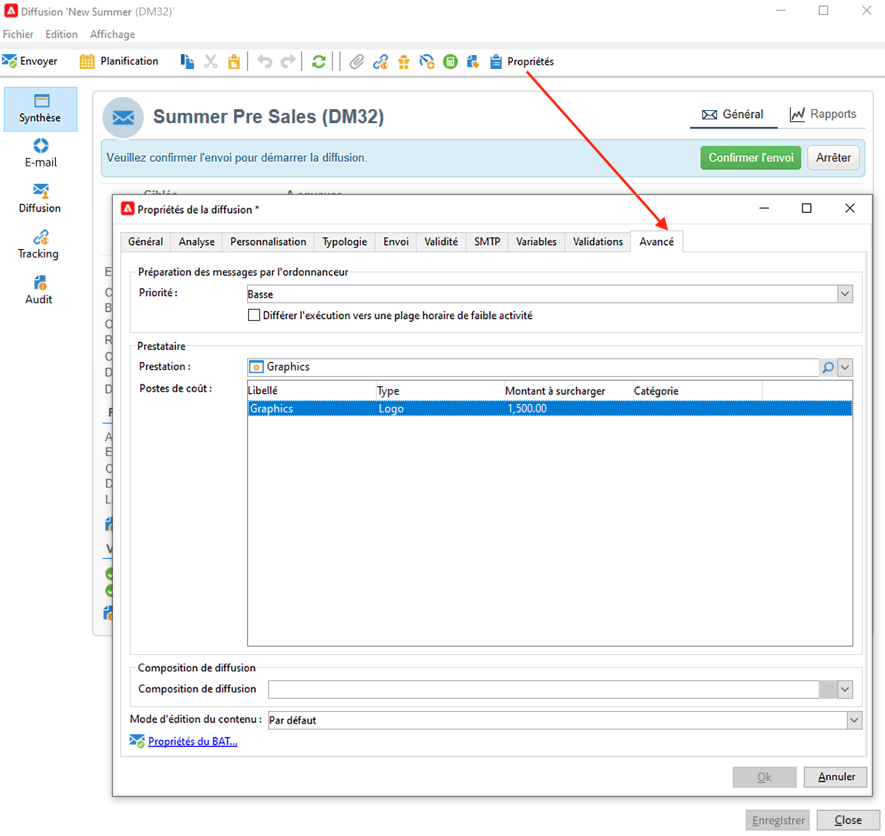

La colonne **[!UICONTROL Montant à surcharger]** permet d&#39;ajouter un coût pour ce poste dans le contexte de la diffusion ou de la tâche concernée.

Vous pouvez définir une sélection obligatoire d&#39;un type de coût lors de la définition des postes de coût pour une diffusion. Pour ce faire, sélectionnez **[!UICONTROL Un type de coût doit être sélectionné]**.

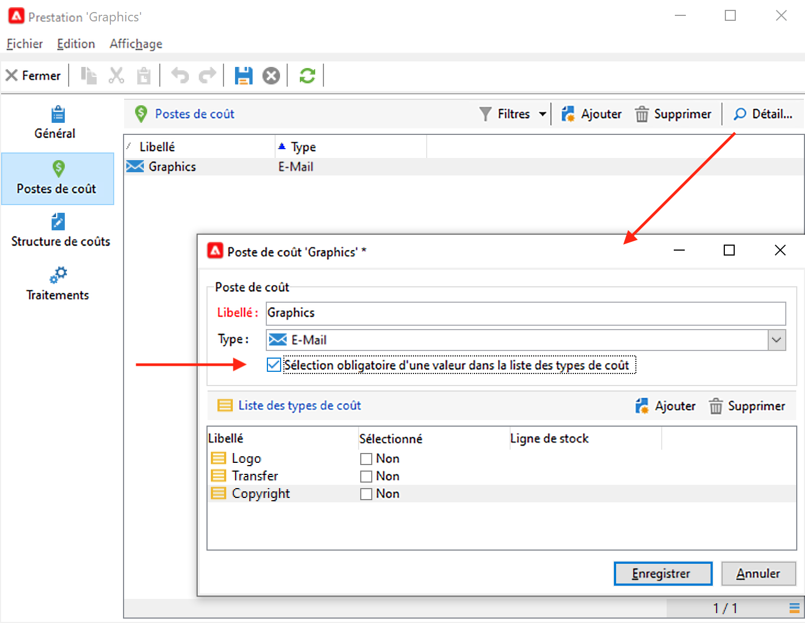

## Gestion des stocks et des commandes {#stock-and-order-management}

Les types de coûts peuvent être associés à des lignes de stocks afin de gérer les alertes, suivre les approvisionnements et lancer des commandes.

Pour mettre en place la gestion des stocks et des commandes dans Adobe Campaign, et alerter les opérateurs en cas d&#39;approvisionnement insuffisant pour la réalisation d&#39;une diffusion, les étapes sont les suivantes :

1. Création des stocks et référencement des prestataires associés. [En savoir plus](#create-a-stock).

1. Ajout des lignes de stocks. [En savoir plus](#add-stock-lines).

1. Notification des opérateurs en cas d&#39;alerte. [En savoir plus](#alert-operators).

1. Commandes et approvisionnement [En savoir plus](#orders).

### Gestion des stocks {#stock-management}

Adobe Campaign peut alerter un groupe d’utilisateurs si le stock est épuisé ou a atteint un seuil minimum. Les niveaux de stock sont accessibles via le lien **[!UICONTROL Stocks]** de l’onglet **[!UICONTROL Campagnes]** à partir du lien **[!UICONTROL Autres choix]** dans la zone de navigation.

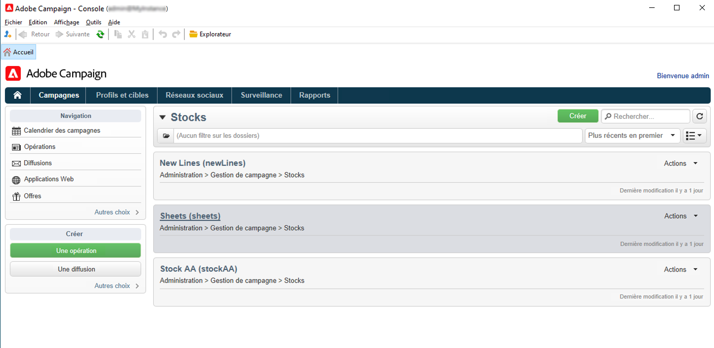

#### Créer un stock {#creating-a-stock}

Pour créer un nouveau stock, les étapes sont les suivantes :

1. Cliquez sur le bouton **[!UICONTROL Créer]** situé au-dessus de la liste des stocks.
1. Saisissez le libellé du stock et sélectionnez dans la liste déroulante le fournisseur auquel il est associé. [En savoir plus](#create-service-providers-and-their-cost-structures).

#### Ajouter des lignes de stock {#add-stock-lines}

Un stock est composé de différentes lignes de stocks. Une ligne de stock contient une quantité initiale de ressources qui seront consommées par les diffusions. Chaque ligne de stock indique aussi la quantité consommée, la quantité en stock et la quantité en commande.

Lorsque vous créez un stock, cliquez sur l&#39;onglet **[!UICONTROL Lignes de stock]** pour ajouter des lignes de stocks.

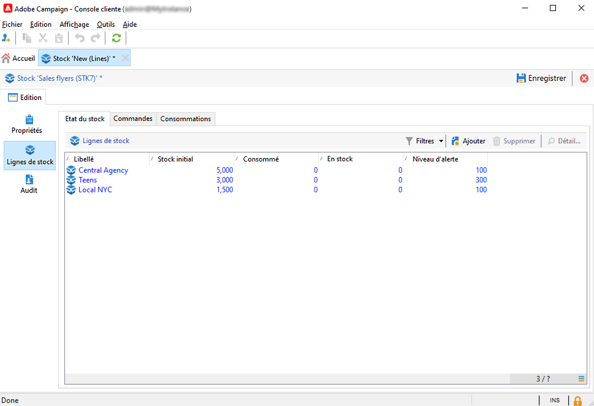

Une fois le stock créé, utilisez son tableau de bord pour créer et surveiller les lignes de stock.

Cliquez sur le bouton **[!UICONTROL Créer]** pour ajouter de nouvelles lignes de stock.

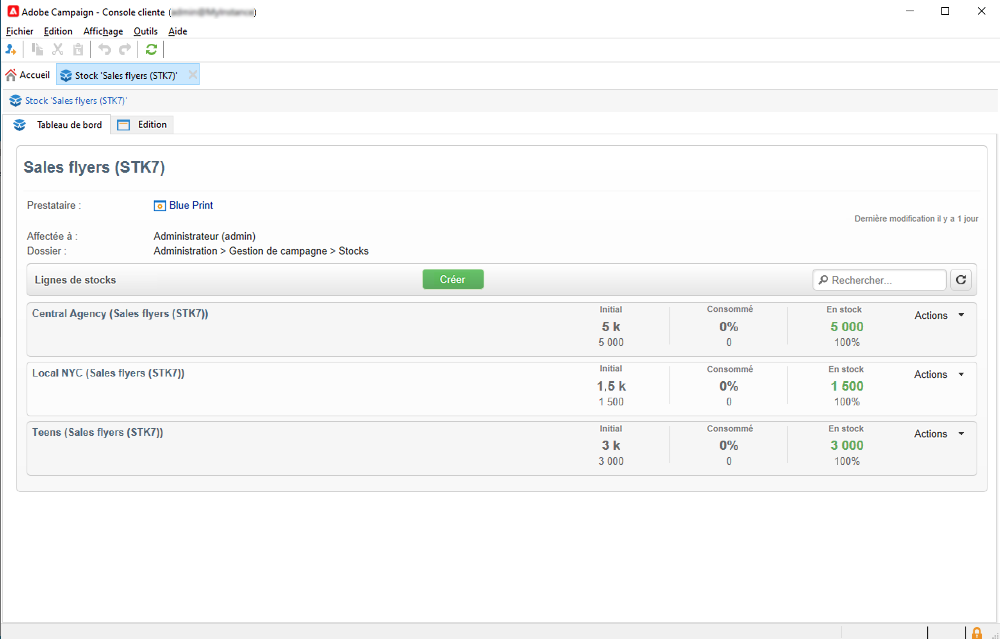

* Indiquez la quantité initialement en stock dans le champ **[!UICONTROL Stock initial]**. Les champs **[!UICONTROL Consommé]** et **[!UICONTROL En stock]** sont calculés automatiquement et mis à jour au fil des campagnes.

  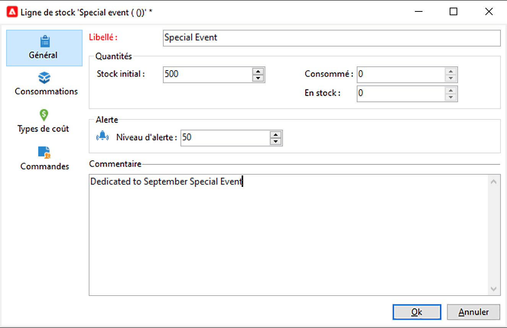

* Indiquez, dans le champ **[!UICONTROL Niveau d’alerte]**, le seuil à partir duquel il faudra alerter les opérateurs de le renouveler. Lorsque le niveau d’alerte est atteint, un avertissement est affiché dans la fenêtre de validation des diffusions qui utilisent ce stock.

#### Associer un stock à des postes de coûts {#associate-a-stock-with-cost-categories}

Au niveau du prestataire, dans une prestation, une ligne de stock peut être référencée par l&#39;un de ses postes de coûts, comme ci-dessous :

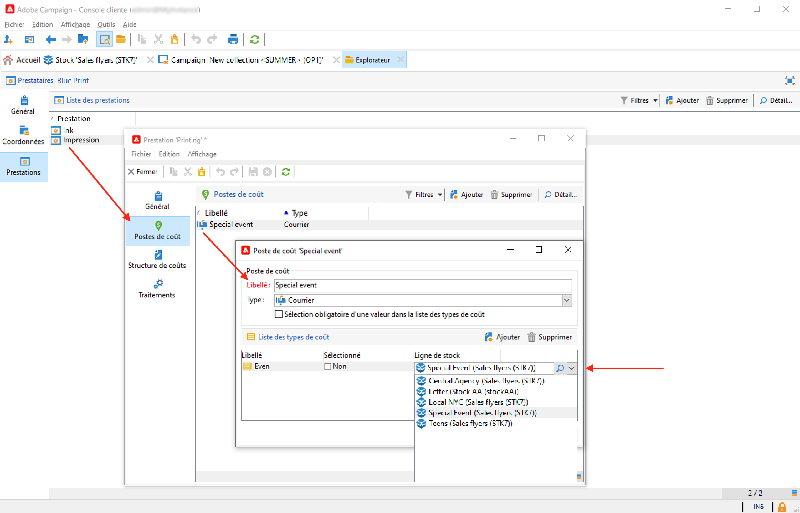

### Tracking des stocks {#stock-tracking}

#### Alerter les opérateurs {#alert-operators}

Une alerte est affichée lorsqu&#39;un stock référencé dans une diffusion est insuffisant. Par exemple, l&#39;alerte suivante sera affichée lors de la validation d&#39;un fichier d&#39;extraction :

#### Les commandes {#orders}

Le sous-onglet **[!UICONTROL Commandes]** permet de visualiser les commandes en cours et d&#39;enregistrer de nouvelles commandes.

Pour enregistrer une commande, éditez la ligne de stock visée, cliquez sur le bouton **[!UICONTROL Ajouter]** et indiquez la date de livraison et la quantité commandée.

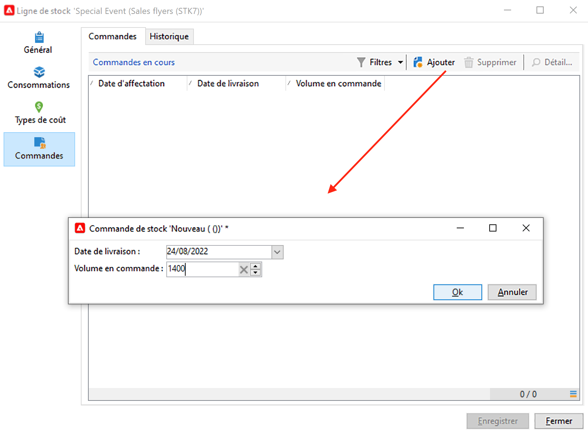

>[!NOTE]
>
>Une fois la date de livraison atteinte, la ligne de stock en commande disparaît automatiquement et la quantité renseignée dans le champ **[!UICONTROL Volume en commande]** passe dans l&#39;onglet **[!UICONTROL Tracking]**. Cette quantité est automatiquement ajoutée au volume en stock.

L’onglet **[!UICONTROL Consommations]** contient le volume consommé par campagne. Les informations de cet onglet sont automatiquement renseignées en fonction des diffusions réalisées. Cliquez sur le bouton **[!UICONTROL Modifier]** pour ouvrir la campagne concernée.

## Calculer les budgets {#calculate-budgets}

### Principe {#principle}

Les coûts sont gérés pour les diffusions et les opérations. En fonction de l&#39;état d&#39;avancement, ces coûts seront répercutés sur les budgets.

Les coûts de diffusion d&#39;une opération sont consolidés au niveau de l&#39;opération et les coûts de toutes les opérations d&#39;un programme sont répercutées au niveau du programme auquel elles sont associées. Des rapports dédiés permettent d&#39;assurer le suivi des budgets pour l&#39;ensemble de la plateforme ou au niveau de chaque plan et de chaque programme.

### Mise en œuvre {#implementation}

Dans une opération, lorsque vous sélectionnez le budget, vous devez renseigner le montant initial. Les coûts calculés seront mis à jour automatiquement en fonction du degré d&#39;engagement des montants renseignés (dépenses réalisées, prévues, réservées, engagées).

<!--
See [Calculating amounts](../../mrm/using/controlling-costs.md#calculating-amounts).

>[!NOTE]
>
>The procedure for creating budgets is presented in [Creating a budget](../../mrm/using/controlling-costs.md#creating-a-budget).
-->
