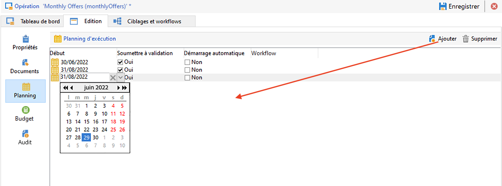
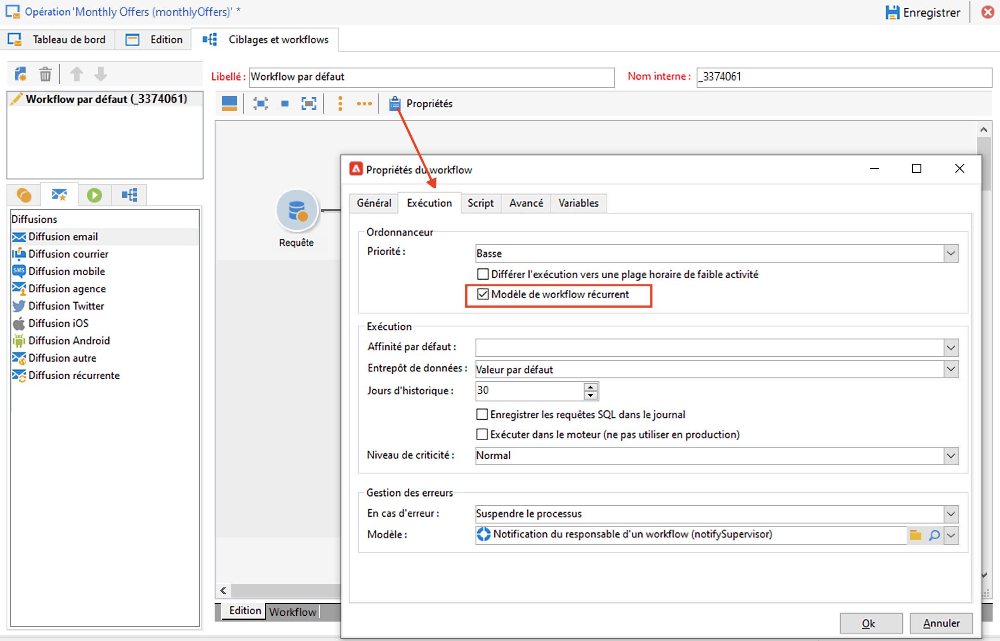
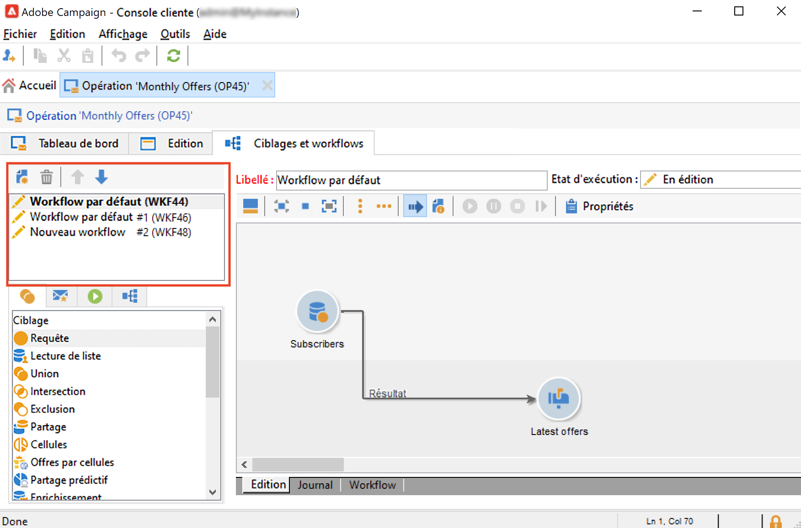
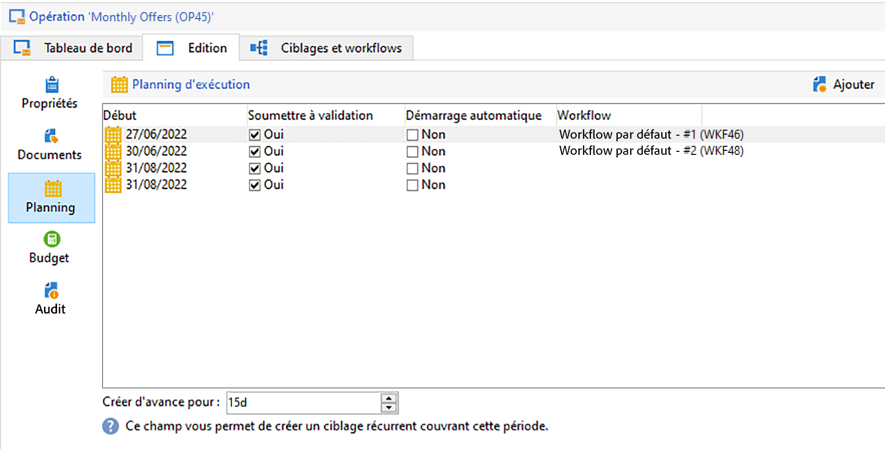

# Campagnes récurrentes et périodiques {#recurring-and-periodic-campaigns}

Une **campagne récurrente** est une campagne basée sur un modèle spécifique dont les workflows sont configurés pour être exécutés selon un planning associé. Le ciblage est dupliqué à chaque exécution et les différents processus et populations cibles sont suivis.  Une fois paramétrées, les campagnes récurrentes créent automatiquement un workflow (en dupliquant le modèle de workflow) et l&#39;exécutent. Par exemple, si vous devez envoyer un rappel mensuel à des segments ciblés, configurez une campagne récurrente afin qu&#39;au début de chaque année, elle crée 12 workflows, soit un pour chaque mois. [En savoir plus](#create-a-recurring-campaign)

Une **campagne périodique** est une campagne basée sur un modèle spécifique qui permet de créer des instances Campaign en fonction d&#39;un planning d&#39;exécution. Les instances Campaign sont créées automatiquement en fonction d&#39;un modèle de campagne périodique, selon la fréquence définie dans le planning du modèle. [En savoir plus](#create-a-periodic-campaign)

## Création d’une campagne récurrente {#create-a-recurring-campaign}

Les campagnes récurrentes sont créées à partir d’un modèle spécifique qui définit le modèle de workflow à exécuter et le planning d’exécution.

### Création d’un modèle pour les campagnes récurrentes {#create-the-campaign-template}

Pour créer un modèle pour les campagnes récurrentes, procédez de la manière suivante :

1. Ouvrez l&#39;explorateur Campaign et accédez à **[!UICONTROL Ressources > Modèles > Modèles de campagne]**.
1. Dupliquez le modèle de **[!UICONTROL Campagne récurrente]** intégré.
   
1. Saisissez le nom du modèle et renseignez la durée de la campagne.
1. Pour ce type de campagne, un onglet **[!UICONTROL Planning]** est ajouté afin de créer le planning d&#39;exécution du modèle. Utilisez cet onglet pour définir les dates d&#39;exécution des campagnes en fonction de ce modèle.
   

   Le mode de configuration du planning d&#39;exécution correspond à l&#39;objet **[!UICONTROL Planificateur]** du workflow. [En savoir plus](../workflow/scheduler.md).

   >[!CAUTION]
   >
   >La configuration du planning d&#39;exécution doit être effectuée avec précaution. Les campagnes récurrentes dupliquent le(s) workflow(s) de leur modèle selon le planning spécifié. Cette opération peut surcharger votre base de données.

1. Indiquez une valeur dans le champ **[!UICONTROL Créer d&#39;avance pour]** afin de créer les workflows correspondants pour la période indiquée.
1. Dans l&#39;onglet **[!UICONTROL Ciblages et workflows]**, concevez le modèle de workflow à utiliser lors des campagnes à partir de ce modèle. Ce workflow contient généralement les paramètres de ciblage ainsi qu&#39;une ou plusieurs diffusions.

   >[!NOTE]
   >
   >Ce workflow doit être enregistré comme un modèle de workflow récurrent. Pour cela, modifiez les propriétés du workflow et sélectionnez l&#39;option **[!UICONTROL Modèle de workflow récurrent]** dans l&#39;onglet **[!UICONTROL Exécution]**.

   

### Créer l&#39;opération récurrente {#create-the-recurring-campaign}

Pour créer la campagne récurrente et exécuter ses workflows selon le planning défini dans le modèle, vous devez effectuer les opérations suivantes :

1. Créez une opération basée sur un modèle de campagne récurrente.
1. Renseignez le planning d&#39;exécution du workflow dans l&#39;onglet **[!UICONTROL Planning]**. Le planning de l&#39;opération permet de renseigner pour chaque ligne la date de début de création ou d&#39;exécution du workflow automatique.

   Pour chaque ligne, il est possible d&#39;ajouter les options supplémentaires suivantes :

   * Activez l&#39;option **[!UICONTROL À valider]** pour forcer les demandes de validation de diffusion dans le workflow.
   * Activez l&#39;option **[!UICONTROL À démarrer]** pour démarrer le workflow une fois la date de début atteinte.

   Le champ **[!UICONTROL Créer d&#39;avance pour]** permet de créer l&#39;ensemble des workflows couvrant la période renseignée.

   A l&#39;exécution du workflow **[!UICONTROL Traitements sur les opérations]**, les workflows dédiés sont créés selon les occurrences définies dans le planning de l&#39;opération. Ainsi, un workflow est créé pour chaque date d&#39;exécution.

1. Les workflows récurrents sont créés automatiquement à partir du modèle de workflow présent dans l&#39;opération. Ils sont visibles à partir de l&#39;onglet **[!UICONTROL Ciblages et workflows]** de l&#39;opération.

   

   Le libellé d&#39;une instance de workflow récurrent est composé du libellé de son modèle et du numéro du workflow. Les deux informations sont séparées par un caractère #.

   Les workflow créés à partir du planning y sont automatiquement associés, dans la colonne **[!UICONTROL Workflow]** de l&#39;onglet **[!UICONTROL Planning]**.

   

   Chaque workflow peut être édité à partir de cet onglet.

   >[!NOTE]
   >
   >La date de début de la ligne de planning associée au workflow est disponible à partir d&#39;une variable du workflow avec la syntaxe suivante :\
   >`$date(instance/vars/@startPlanningDate)`

## Création d’une campagne périodique {#create-a-periodic-campaign}

Une campagne périodique est une opération basée sur un modèle spécifique qui permet de créer des instances de campagnes selon un planning d’exécution. Les instances de campagnes sont créées automatiquement sur la base d’un modèle de campagne périodique, selon la fréquence définie dans le planning du modèle.

### Création du modèle de campagne {#create-the-campaign-template-1}

1. Ouvrez l&#39;explorateur Campaign et accédez à **[!UICONTROL Ressources > Modèles > Modèles de campagne]**.
1. Dupliquez le modèle de **[!UICONTROL Campagne périodique]** intégré.
1. Renseignez les propriétés du modèle.

   >[!NOTE]
   >
   >L&#39;opérateur auquel est affecté le modèle doit disposer des autorisations nécessaires pour créer des campagnes dans le programme sélectionné.

1. Créez le workflow associé à ce modèle. Ce workflow est dupliqué dans chaque campagne périodique créée par le modèle.

   >[!NOTE]
   >
   >Ce workflow est un modèle de workflow. Il ne peut pas être exécuté à partir du modèle d&#39;opération.

1. Renseignez son planning d&#39;exécution selon le même mode que pour un modèle d&#39;opération récurrente : cliquez sur le bouton **[!UICONTROL Ajouter]** et définissez les dates de début et de fin, ou complétez le planning d&#39;exécution à partir du lien.

   >[!CAUTION]
   >
   >Les modèles d&#39;opérations périodiques créent de nouvelles opérations selon le planning défini ci-dessus. Il doit donc être renseigné avec précaution afin de ne pas surcharger la base Adobe Campaign.

1. Une fois la date de début d&#39;exécution atteinte, l&#39;opération correspondante est automatiquement créée. Elle reprend l&#39;ensemble des caractéristiques de son modèle.

   Chaque opération peut être éditée à partir du planning du modèle.

   Chaque opération périodique contient les mêmes éléments. Une fois créée, elle est ensuite gérée comme une opération standard.
