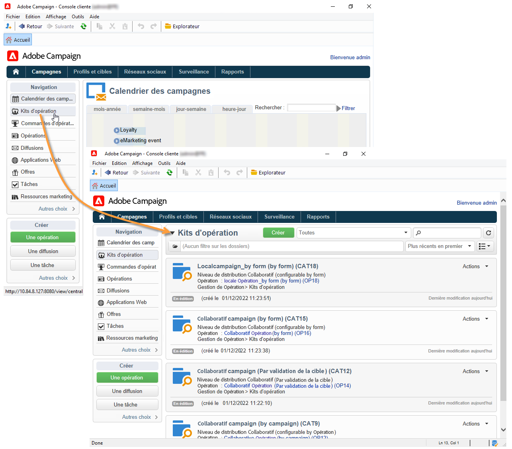
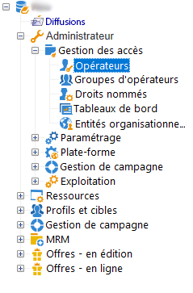
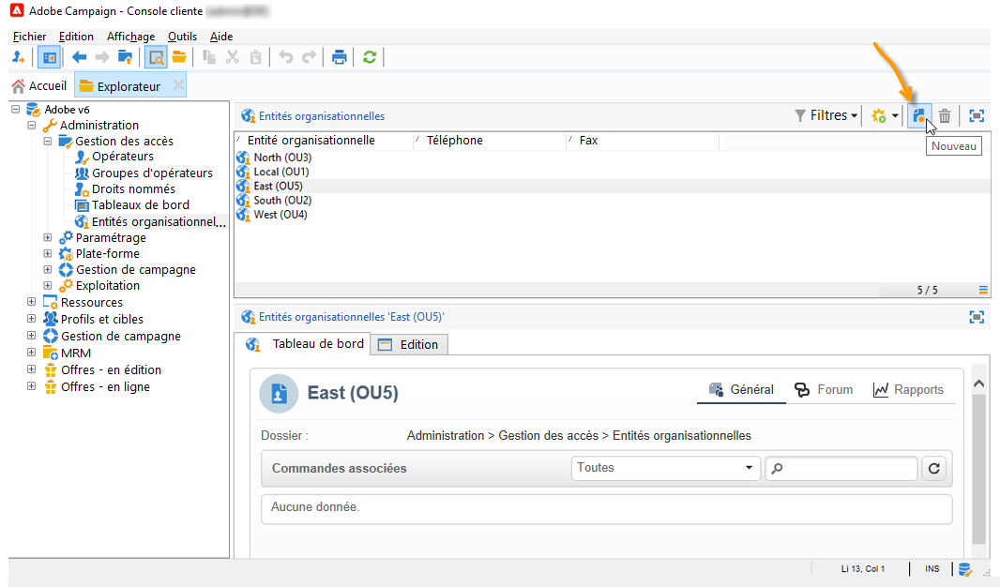
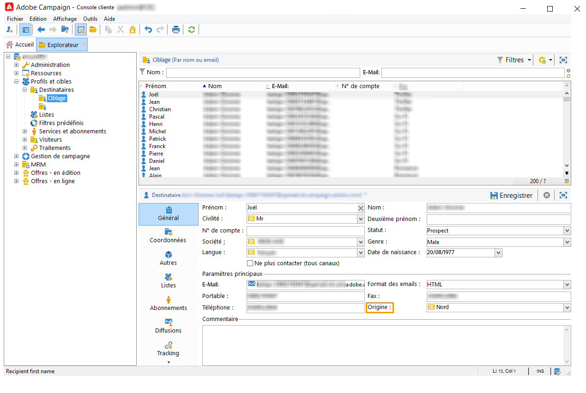

# Prise en main du marketing distribué{#about-distributed-marketing}

Adobe Campaign propose une application **Marketing Distribué** pour la mise en place de campagnes collaboratives entre les entités centrales (sièges sociaux, services marketing, etc.) et les entités locales (points de vente, agences régionales, etc.). Cette coopération repose sur un espace de travail partagé appelé la **[!UICONTROL liste des kits d&#39;opération]**, où des modèles et des instances d&#39;opération créés de manière centralisée sont proposés aux entités locales.

L&#39;entité centrale assure les opérations que les entités locales peuvent utiliser. Les campagnes sont matérialisées par des packages représentant des campagnes locales ou collaboratives. Pour utiliser une opération, l&#39;entité locale doit la commander et la commande doit être validée.

>[!CAUTION]
>
>Le module Marketing distribué est une option **Campagne**. Veuillez vérifier votre contrat de licence.

## Terminologie {#terminology}

* **Entité centrale**

  Une entité centrale regroupe les opérateurs marketing chargés de définir la communication et d&#39;assister les entités locales dans la réalisation de leur campagne marketing.

  L&#39;entité centrale peut, grâce au module de Marketing Distribué :

   * mettre en place des kits de campagne marketing à destination des entités locales,
   * favoriser l&#39;autonomie des entités locales dans le choix de leurs communications envers leurs clients/prospects, leur ciblage, leur contenu, etc.,
   * gérer et maîtriser les coûts,
   * animer un réseau d&#39;agences.

* **Entité locale**

  Une entité locale correspond à une agence, un magasin ou un groupe d&#39;opérateurs locaux spécifiques (responsables de pays ou de régions, responsables de marques, etc.).

  Le Marketing Distribué permet aux entités locales d&#39;avoir plus d&#39;autonomie tout en optimisant les coûts de réalisation.

* **Localisation**

  La localisation est la capacité pour une entité locale de modifier la cible et le contenu d&#39;une opération. Le niveau de localisation possible dépend du type de campagne et de sa mise en œuvre.

* **Liste des kits de campagne**

  La liste des kits de campagne regroupe les opérations qui sont disponibles pour les entités locales.

* **Kit de campagne**

  Modèle (ou instance d&#39;opération) créé par une entité centrale et mis à disposition d&#39;un ensemble d&#39;entités locales.

* **Opération locale**

  Une opération locale est une instance d&#39;opération créée à partir d&#39;un modèle référencé dans la liste des **[!UICONTROL kits d&#39;opération]** avec un **planning d&#39;exécution spécifique**. Son objectif est de répondre à un besoin local de communication à l&#39;aide d&#39;un modèle de campagne mis en place et paramétré par l&#39;entité centrale.

  Le degré d&#39;autonomie de l&#39;entité locale dépend de la mise en oeuvre utilisée.

  Voir [Création d&#39;une campagne locale](creating-a-local-campaign.md).

* **Opération collaborative**

  Une opération collaborative est une opération dont le **planning d&#39;exécution est défini** par l&#39;entité centrale et que l&#39;entité locale peut utiliser. Le contenu reste le même pour chaque entité locale mais les coûts sont partagés. Pour participer, les entités locales s&#39;inscrivent à l&#39;opération collaborative.

   * **[!UICONTROL Opération collaborative par formulaire)]** conseillée pour des opérations impliquant jusqu&#39;à 300 entités locales. L&#39;entité locale peut saisir des paramètres prédéfinis pour le ciblage et la personnalisation du contenu dans un formulaire web. Le formulaire peut être un formulaire Adobe Campaign ou un formulaire externe (extranet client). Un administrateur fonctionnel peut définir et configurer le formulaire en fonction d’un modèle de formulaire défini par l’intégrateur. Pour commander l&#39;opération, l&#39;entité locale a seulement besoin d&#39;un accès web.
   * **[!UICONTROL Opération collaborative par opération)]** conseillée pour des opérations visant quelques dizaines d&#39;entités locales. Ce type d&#39;opération crée des opérations filles pour chaque entité locale. Lorsque la commande d’une **[!UICONTROL Opération collaborative par opération]** est validée par l’entité centrale, l’opération est mise à disposition de l’entité locale qui peut la modifier. L’exécution est automatiquement synchronisée entre les opérations enfants et l’opération parent. L’entité locale doit avoir accès à une instance pour commander une opération et y participer.
   * **[!UICONTROL Opération collaborative par validation de la cible)]** conseillée pour des opérations visant jusqu&#39;à plusieurs milliers d&#39;entités locales. L&#39;entité locale reçoit une liste de contacts qui a été prédéfinie par l&#39;entité centrale. L&#39;entité locale décide de conserver ou non certains contacts en fonction du contenu de la campagne, via un formulaire web. Les entités locales sont déduites de la liste des contacts sélectionnés. Pour participer à la campagne, l&#39;entité locale a seulement besoin d&#39;un accès web.
   * **[!UICONTROL Opération collaborative simple]** : ce mode permet d&#39;assurer la compatibilité avec les développements spécifiques réalisés dans les versions précédentes.

  Voir [Création d’une campagne collaborative](creating-a-collaborative-campaign.md).

**Commande de kits de campagne**

L&#39;inscription d&#39;une entité locale à une opération se traduit par la création d&#39;une commande qui regroupe toutes les informations relatives à la localisation de la campagne.

## Espace de travail {#workspace}

La liste des kits de campagne est accessible à partir de l’onglet **Campagnes** : cliquez sur le lien **[!UICONTROL Kits de campagne]**.

Pour chaque opérateur local, cette fenêtre permet de visualiser les opérations disponibles pour son agence locale.

Pour les agences centrales, cette fenêtre affiche tous les kits disponibles dans la liste des kits de campagne et propose des liens supplémentaires afin d’agir sur la liste.

## Opérateurs et entités {#operators-and-entities}

Commencez par spécifier les opérateurs et opératrices des entités centrales et locales via le dossier **[!UICONTROL Gestion des accès]**.

### Les opérateurs {#operators}

Vous devez créer des opérateurs centraux et des opérateurs locaux.

Les opérateurs centraux doivent appartenir au groupe d&#39;opérateurs **[!UICONTROL Gestion en central]** ou être titulaire du droit nommé **[!UICONTROL CENTRAL]**.

Les opérateurs locaux doivent appartenir au groupe d&#39;opérateurs **[!UICONTROL Gestion locale]** ou posséder le droit nommé **[!UICONTROL LOCAL]**. Ils doivent également être liés à leur entité locale.

### Entités organisationnelles {#organizational-entities}

Pour créer une entité organisationnelle, sélectionnez le dossier **[!UICONTROL Administration > Gestion des accès > Entités organisationnelles]**, puis cliquez sur l’icône **[!UICONTROL Nouveau]** au-dessus de la liste des entités.

Chaque entité organisationnelle contient des informations d’identification (libellé, nom interne, coordonnées, etc.) et les groupes impliqués dans le processus de validation de la commande. Ils sont définis dans la section **[!UICONTROL Notifications et validations]** de l’onglet **[!UICONTROL Général]** .

* Vous devez définir un groupe de notification des kits : les opérateurs de ce groupe recevront un message de notification lorsqu’un nouveau kit sera ajouté à la liste des kits de campagne et lorsqu’une opération est disponible.
* Vous devez également sélectionner le groupe d&#39;opérateurs responsables de la validation des commandes, c&#39;est-à-dire chargés de valider les opérations commandées par l&#39;entité locale.
* Enfin, sélectionnez le groupe de validants chargé de valider l&#39;opération locale (cible, contenu, budget, etc.). Ce groupe peut être ajouté lors de la commande d’une campagne, selon le modèle.

>[!NOTE]
>
>Le processus de validation est présenté dans la section [Processus de validation](creating-a-local-campaign.md#approval-process).

## Mise en œuvre {#implementation}

Les campagnes marketing distribuées sont créées et publiées par l&#39;entité centrale. Ils peuvent être utilisés par les entités locales et centrales selon les besoins.

Les étapes de mise en oeuvre dépendent du type de kit de campagne utilisé et du niveau de délégation au niveau des entités locales.

### Tâches de l&#39;intégrateur {#integrator-side}

1. Créer les entités locales.
1. Associer les destinataires aux opérateurs en charge des entités locales.

   

1. Définir les droits et les règles de navigation pour les entités locales.
1. Définir l&#39;ensemble des champs nécessaires à la localisation des campagnes :

   * la définition de la cible et sa taille maximale,
   * la définition du contenu,
   * le planning d’exécution (date de contact et date d’extraction), **pour les opérateurs et opératrices au niveau local seulement**,
   * l&#39;extension du schéma des commandes avec l&#39;ensemble des champs additionnels nécessaires.

1. Créez un modèle de formulaire web (Adobe ou extranet) qui permet d’afficher les paramètres de localisation, d’évaluer la cible et le budget, mais aussi d’avoir un aperçu du contenu et de valider la commande.

   Pour les **opérations collaboratives par validation de la cible**, créer la table où seront enregistrées les validations pour chaque entité locale.

### Tâches de l&#39;administrateur fonctionnel {#functional-administrator-side}

Ces étapes doivent être réalisées à chaque création d&#39;opération.

1. Mettre à jour le formulaire avec les champs utilisés pour la localisation de la campagne.
1. Créer une instance à partir du modèle de campagne approprié (campagne collaborative) ou dupliquer le modèle de campagne (campagne locale).
1. Paramétrer l&#39;opération avec les champs de localisation et la référence du formulaire.
1. Publiez l&#39;opération.

### Tâches de l&#39;opérateur local {#local-operator-side}

Ces étapes doivent être réalisées à chaque opération.

1. À la réception de la notification de disponibilité du kit de campagne, définir la localisation éventuelle de l’opération.
1. Evaluer la cible, le budget, etc..
1. Prévisualiser le contenu de l&#39;opération.
1. Commander l&#39;opération.
