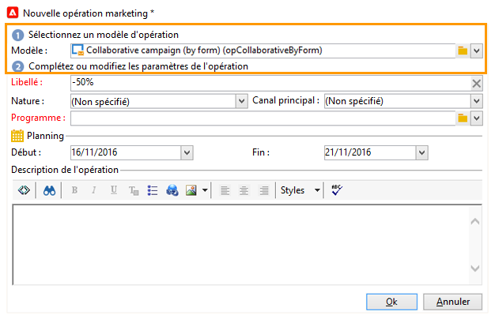
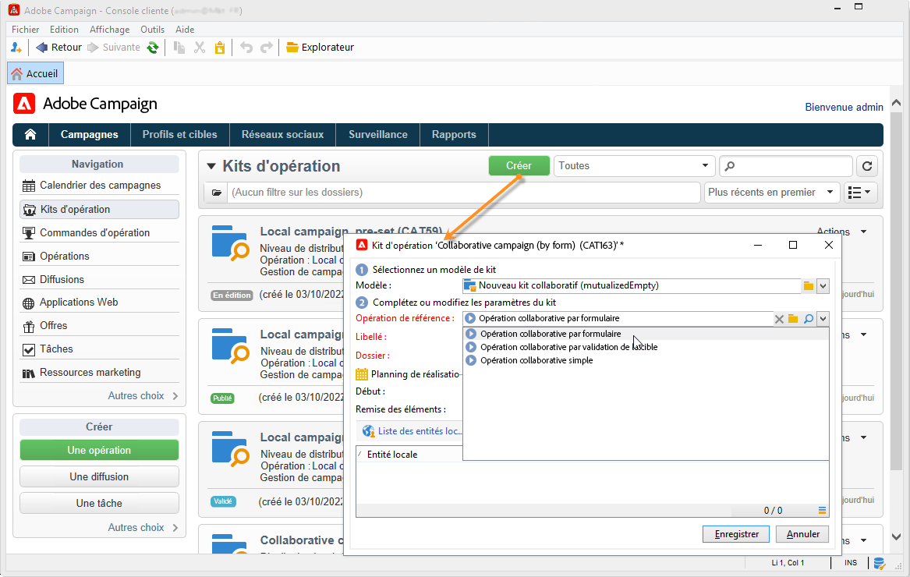
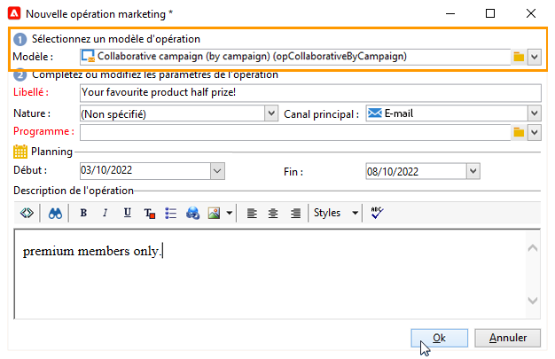
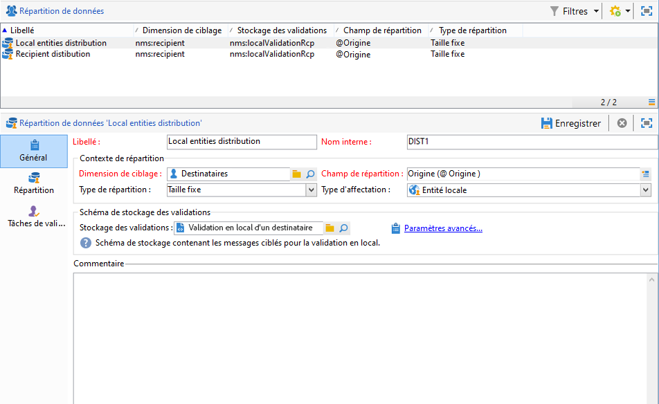
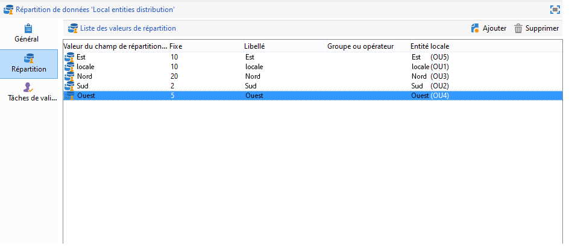
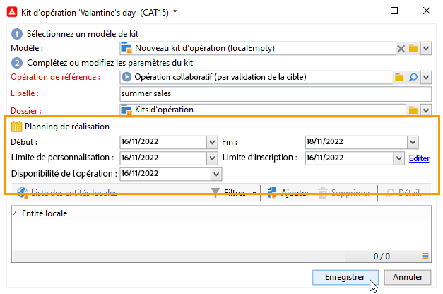
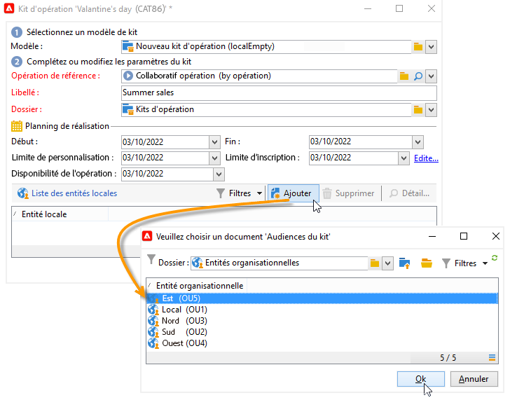
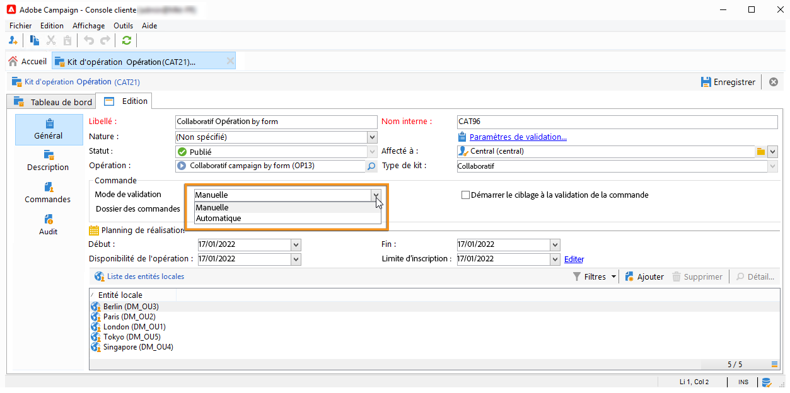

# Création d’une opération collaborative{#creating-a-collaborative-campaign-intro}

Lʼentité centrale crée les opérations collaboratives à partir des modèles dʼopération du **Marketing Distribué**. Pour en savoir, consultez [cette page](about-distributed-marketing.md#collaborative-campaign).

## Création d’une opération collaborative {#creating-a-collaborative-campaign}

Pour paramétrer une opération collaborative, cliquez sur le bouton **[!UICONTROL Gestion de campagne > Campagnes]** , puis le dossier **[!UICONTROL Nouveau]** icône .

>[!NOTE]
>
>Excepté les **[!UICONTROL opérations collaboratives par opération]**, ces opérations peuvent être paramétrées et exécutées depuis une interface Web.

Le paramétrage de base d&#39;une opération collaborative est similaire à celui d&#39;un modèle d&#39;opération locale. Les spécificités des différents types d&#39;opération collaborative sont présentées ci-dessous.

### Par formulaire {#by-form}

Pour créer une opération collaborative par formulaire, le modèle **[!UICONTROL Opération collaborative par formulaire (opCollaborativeByForm)]** doit être sélectionné.

Dans l&#39;onglet **[!UICONTROL Modifier]**, cliquez sur le lien **[!UICONTROL Paramètres avancés de l&#39;opération...]** pour accéder à l&#39;onglet **Marketing distribué**.

Sélectionnez le type d’interface web **Par formulaire**. Ce type d’interface permet la création de champs de personnalisation qui seront utilisés par les entités locales lors de la commande de l’opération. Pour plus d&#39;informations, consultez la section [Création d’une campagne locale (par formulaire)](examples.md#creating-a-local-campaign--by-form-).

Enregistrez votre campagne. Vous pouvez désormais l’utiliser depuis la vue **Kits d’opération** de l’onglet **Campagnes**, en cliquant sur le bouton **[!UICONTROL Créer]**.

La vue **[!UICONTROL Kit d&#39;opération]** vous permet d&#39;utiliser les modèles d&#39;opérations locales (d&#39;usine ou dupliqués), ainsi que les opérations de référence pour les opérations collaboratives, dans le but de créer des campagnes pour vos différentes entités organisationnelles.

### Par opération {#by-campaign}

Pour créer une opération collaborative par opération, le modèle **[!UICONTROL Opération collaborative par opération (opCollaborativeByCampaign)]** doit être sélectionné.

Lors de la commande de l&#39;opération, l&#39;entité locale peut remplir des critères prédéfinis par l&#39;entité centrale, et évaluer l&#39;opération avant de la commander.

Lorsque la commande d&#39;une **Opération collaborative par opération** est validée par l&#39;entité centrale, une opération enfant est créée pour l&#39;entité locale. La mise à disposition de l&#39;opération permet à l&#39;entité locale de modifier :

* le workflow de l&#39;opération,
* les règles de typologie,
* et les champs de personnalisation.

L&#39;exécution de l&#39;opération enfant est faite par l&#39;entité locale. L&#39;entité centrale exécute l&#39;opération parent.

L&#39;entité centrale peut visualiser toutes les opérations enfants associées à une **Opération collaborative par opération** à partir du tableau de bord de celle-ci (via le lien **[!UICONTROL Liste des opérations liées]**).

### Par validation de la cible {#by-target-approval}

Pour créer une opération collaborative par validation de la cible, le modèle **[!UICONTROL Opération collaborative par validation de la cible (opCollaborativeByValidation)]** doit être sélectionné.

>[!NOTE]
>
>Dans ce mode, l&#39;entité centrale n&#39;a pas à spécifier les entités locales.

Le workflow de l&#39;opération doit intégrer l&#39;activité de type **Validation en local**. Les paramètres de l&#39;activité sont les suivants :

* **[!UICONTROL Action à effectuer]** : Notification pour la validation de la cible.
* **[!UICONTROL Contexte de répartition]** : Explicite.
* **[!UICONTROL Répartition des données]** : Répartition pour les entités locales.

La répartition de données **Répartition pour les entités locales** doit être créée. Le modèle de répartition de données permet de limiter le nombre d&#39;enregistrements à partir d&#39;une liste de valeurs de groupement. Dans **[!UICONTROL Ressources > Gestion de campagnes > Répartition de données]**, cliquez sur l&#39;icône **[!UICONTROL Nouveau]** pour créer une **[!UICONTROL Répartition de données]**. Pour plus d&#39;informations sur la répartition de données,

Choisissez la **[!UICONTROL Dimension de ciblage]**, et le **[!UICONTROL Champ de répartition]**. Pour le **Type d&#39;affectation**, choisissez l&#39;option **Entité locale**.

Dans l&#39;onglet **[!UICONTROL Répartition]**, ajoutez un champ pour chaque entité locale et spécifiez la valeur.

Il est possible de rajouter une deuxième activité de type **Validation de la cible** après l&#39;activité de type **Diffusion** pour paramétrer un rapport sur celle-ci.

Dans le mail de notification de création de l&#39;opération, l&#39;entité locale reçoit une liste de contact prédéfinie par les paramétrages de l&#39;entité centrale.

L&#39;entité locale peut supprimer certains contacts en fonction du contenu de l&#39;opération.

### Simple {#simple}

Pour créer une opération collaborative simple, le modèle **[!UICONTROL Opération collaborative simple (opCollaborativeSimple)]** doit être sélectionné.

## Créer un kit d&#39;opération collaborative {#creating-a-collaborative-campaign-package}

Pour mettre à disposition l&#39;opération auprès des entités locales, l&#39;entité centrale doit créer un kit d&#39;opération.

Les étapes sont les suivantes :

1. Dans la section **[!UICONTROL Navigation]** de l&#39;univers **Campagnes**, cliquez sur le lien **[!UICONTROL Kits d&#39;opération]**.
1. Cliquez sur le bouton **[!UICONTROL Créer]**.
1. La section supérieure de l&#39;éditeur permet de sélectionner le modèle d&#39;opération **[!UICONTROL Nouveau kit collaboratif (mutualizedEmpty)]**.
1. Sélectionnez l&#39;opération de référence.
1. Définissez le libellé du kit d&#39;opération, son dossier d&#39;enregistrement et indiquez son planning de réalisation.

### Dates       {#dates}

Les dates de début et de fin correspondent à la période de visibilité de l&#39;opération dans la liste des kits.

Pour les **opérations collaboratives**, l&#39;entité centrale doit indiquer la date limite d&#39;inscription à l&#39;opération et éventuellement la date de remise des éléments.

>[!NOTE]
>
>L&#39;option **[!UICONTROL Remise des éléments]** permet à l&#39;entité centrale de choisir une date butoir avant laquelle les entités locales doivent lui faire parvenir des documents (tableurs, images) qui pourraient lui être utiles pour le paramétrage définitif de l&#39;opération. Cette option est facultative. Le non-respect de cette date n&#39;affecte pas la mise en oeuvre de l&#39;opération.

### Audience {#audience}

L&#39;entité centrale doit renseigner les entités locales impliquées par l&#39;opération dès la création de l&#39;opération collaborative.

>[!CAUTION]
>
>Il est impossible de valider un **[!UICONTROL kit d&#39;opération collaborative simple, par formulaire et par opération]**, si les entités locales impliquées ne sont pas indiquées.

### Modes de validation {#approval-modes}

Pour les **opérations collaboratives**, il est possible de définir le type de validation des commandes :

En mode manuel, l&#39;entité locale doit s&#39;inscrire à l&#39;opération pour pouvoir y participer.

En mode automatique, l&#39;entité locale est préinscrite à l&#39;opération et cette inscription est validée. Elle peut se désinscrire de l&#39;opération, ou en modifier le paramétrage sans qu&#39;aucune validation par l&#39;entité centrale ne soit possible.

### Notifications {#notifications}

Le paramétrage des messages de notification est identique à celui d&#39;une opération locale. Voir [cette section](creating-a-local-campaign.md#notifications).

## Commande dʼune opération {#ordering-a-campaign}

Lorsqu&#39;une opération collaborative est ajoutée dans la liste des kits d&#39;opération, les entités locales faisant partie de l&#39;audience définie par l&#39;entité centrale sont avisées par un message de notification (les **opérations collaboratives par validation de la cible** n&#39;ont pas d&#39;audience prédéfinie). Ce message propose un lien pour s&#39;inscrire à l&#39;opération, comme dans l&#39;exemple ci-dessous :

Ce message permet également aux entités locales de visualiser la description renseignée par l&#39;opérateur central qui a créé le kit, et les documents associés à l&#39;opération, s&#39;ils existent. Ces documents permettent de compléter la description de l&#39;opération mais ils n&#39;appartiennent pas à l&#39;opération.

Une fois connecté via une interface Web, l&#39;entité locale peut indiquer les informations de personnalisation pour l&#39;opération collaborative qu&#39;elle souhaite commander :

Lorsqu&#39;une entité locale enregistre sa participation, une notification est adressée par email à l&#39;entité centrale afin de valider sa commande.

Pour plus d&#39;informations, consultez la section [Processus de validation](creating-a-local-campaign.md#approval-process).

## Validation dʼune commande {#approving-an-order}

La validation dʼune commande dʼun kit dʼopération collaborative est identique à celle dʼune opération locale. Pour en savoir plus, consultez [cette section](creating-a-local-campaign.md#approving-an-order).
