# Création d’une opération collaborative{#creating-a-collaborative-campaign-intro}

L&#39;entité centrale crée les opérations collaboratives à partir des modèles d&#39;opération **Marketing Distribué**. Reportez-vous à [cette page](about-distributed-marketing.md#collaborative-campaign).

## Création d’une opération collaborative {#creating-a-collaborative-campaign}

Pour créer une campagne collaborative, sélectionnez le dossier **[!UICONTROL Gestion de campagne > Campagnes]**, puis cliquez sur l’icône **[!UICONTROL Nouveau]**.

>[!NOTE]
>
>Excepté les **[!UICONTROL opérations collaboratives par opération]**, ces opérations peuvent être paramétrées et exécutées depuis une interface Web.

Le paramétrage d&#39;une base collaborative est similaire à celui d&#39;un modèle d&#39;opération locale. Les spécifications des différents types de campagnes collaboratives sont détaillées ci-dessous.

### Par formulaire {#by-form}

Pour créer une opération collaborative par formulaire, le modèle **[!UICONTROL Opération collaborative par formulaire (opCollaborativeByForm)]** doit être sélectionné.

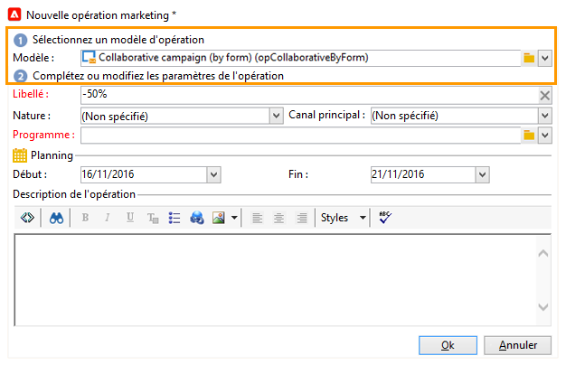

Dans l&#39;onglet **[!UICONTROL Modifier]**, cliquez sur le lien **[!UICONTROL Paramètres avancés de l&#39;opération...]** pour accéder à l&#39;onglet **Marketing distribué**.

Sélectionnez l’interface web **Par formulaire**. Ce type d&#39;interface permet de créer des champs de personnalisation qui seront utilisés par les entités locales lors de la commande d&#39;une opération. Pour plus d&#39;informations, consultez la section [Création d’une campagne locale (par formulaire)](examples.md#creating-a-local-campaign--by-form-).

Enregistrez votre campagne. Vous pouvez désormais l’utiliser depuis la vue **Kits de campagne** de l’onglet **Campagnes**, en cliquant sur le bouton **[!UICONTROL Créer]**.

La vue **[!UICONTROL Kit de campagne]** vous permet d’utiliser les modèles de campagnes locales (d’usine ou dupliqués), ainsi que les campagnes de référence pour les campagnes collaboratives, dans le but de créer des campagnes pour vos différentes entités organisationnelles.

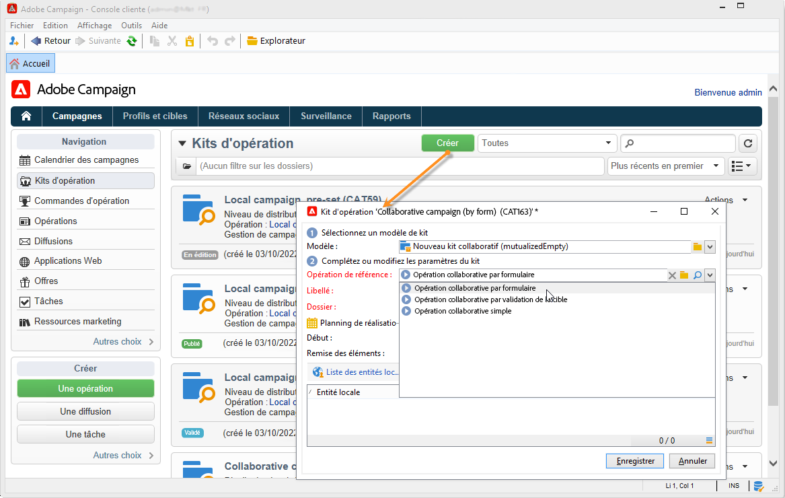

### Par opération {#by-campaign}

Pour créer une opération collaborative par opération, le modèle **[!UICONTROL Opération collaborative par opération (opCollaborativeByCampaign)]** doit être sélectionné.

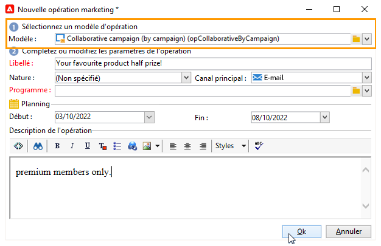

Lors de la commande de l&#39;opération, l&#39;entité locale peut remplir des critères prédéfinis par l&#39;entité centrale, et évaluer l&#39;opération avant de la commander.

Lorsqu&#39;une commande d&#39;une **Opération collaborative par opération)** est validée par l&#39;entité centrale, une opération enfant est créée pour l&#39;entité locale. Une fois disponible, l&#39;entité locale peut alors modifier :

* le workflow de l&#39;opération,
* les règles de typologie,
* et les champs de personnalisation.

L’entité locale exécute l’opération enfant. L&#39;entité centrale exécute la campagne parent.

L&#39;entité centrale peut visualiser toutes les opérations enfants associées à une **Opération collaborative par opération** à partir du tableau de bord de celle-ci (via le lien **[!UICONTROL Liste des opérations liées]**).

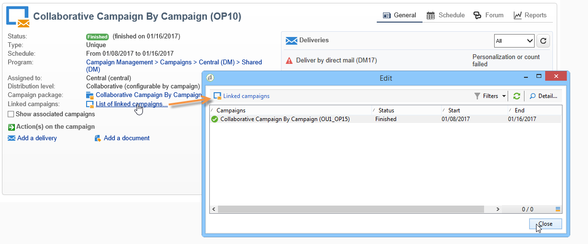

### Par validation de la cible {#by-target-approval}

Pour créer une opération collaborative par validation de la cible, le modèle **[!UICONTROL Opération collaborative par validation de la cible (opCollaborativeByValidation)]** doit être sélectionné.

>[!NOTE]
>
>Dans ce mode, l&#39;entité centrale n&#39;a pas à spécifier les entités locales.

Le workflow de l&#39;opération doit intégrer l&#39;activité de type **Validation en local**. Les paramètres de l&#39;activité sont les suivants :

* **[!UICONTROL Action à effectuer]** : notification pour la validation de la cible.
* **[!UICONTROL Contexte de répartition]** : explicite.
* **[!UICONTROL Répartition des données]** : répartition pour les entités locales.

**Répartition pour les entités locales** une répartition de données de type doit être créée. Le modèle de répartition de données permet de limiter le nombre d&#39;enregistrements à partir d&#39;une liste de valeurs de groupement. Dans **[!UICONTROL Ressources > Gestion de campagnes > Répartition de données]**, cliquez sur l&#39;icône **[!UICONTROL Nouveau]** pour créer une **[!UICONTROL Répartition de données]**. Pour plus d’informations sur la répartition des données,

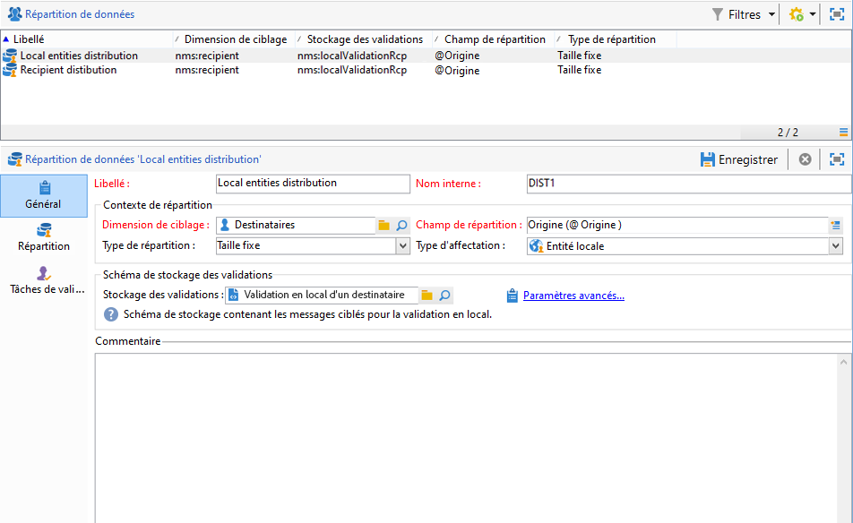

Sélectionnez la **Dimension de ciblage** et le **[!UICONTROL Champ de répartition]**. Pour le **[!UICONTROL Type d&#39;affectation]**, choisissez l&#39;option **Entité locale**.

Dans l&#39;onglet **[!UICONTROL Répartition]**, ajoutez un champ pour chaque entité locale et spécifiez la valeur.

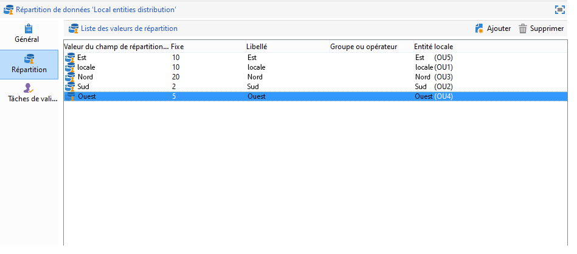

Il est possible de rajouter une deuxième activité de type **Validation de la cible** après l&#39;activité de type **Diffusion** pour paramétrer un rapport sur celle-ci.

Dans le message de notification de création de la campagne, l’entité locale reçoit une liste de contact prédéfinie par les paramètres de l’entité centrale.

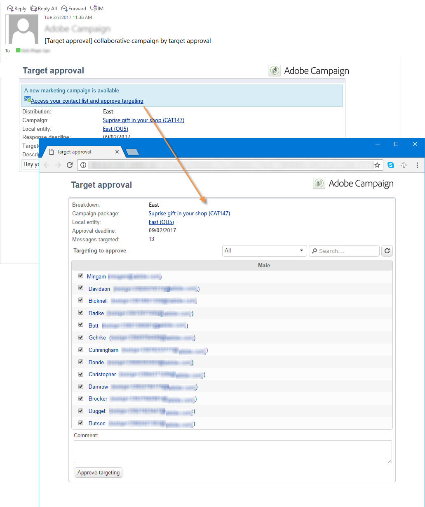

L&#39;entité locale peut supprimer certains contacts en fonction du contenu de l&#39;opération.

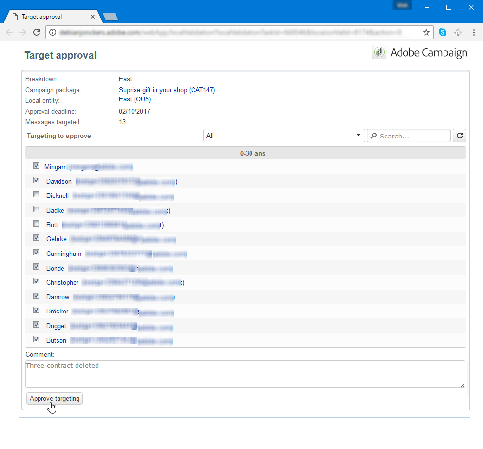

### Simple {#simple}

Pour créer une opération collaborative simple, le modèle **[!UICONTROL Opération collaborative simple (opCollaborativeSimple)]** doit être sélectionné.

## Créer un kit de campagne collaborative {#creating-a-collaborative-campaign-package}

Pour mettre à disposition l’opération auprès des entités locales, l’entité centrale doit créer un kit de campagne.

Les étapes sont les suivantes :

1. Dans la section **[!UICONTROL Navigation]** de l’univers **Campagnes**, cliquez sur le lien **[!UICONTROL Kits de campagne]**.
1. Cliquez sur le bouton **[!UICONTROL Créer]**.
1. La section supérieure de l&#39;éditeur permet de sélectionner le modèle d&#39;opération **[!UICONTROL Nouveau kit collaboratif (mutualizedEmpty)]**.
1. Sélectionnez l&#39;opération de référence.
1. Définissez le libellé du kit de campagne, son dossier d’enregistrement et indiquez son planning de réalisation.

### Dates {#dates}

Les dates de début et de fin correspondent à la période de visibilité de l’opération dans la liste des kits de campagne.

Pour les **opérations collaboratives**, l&#39;entité centrale doit indiquer la date limite d&#39;inscription à l&#39;opération et éventuellement la date de remise des éléments.

>[!NOTE]
>
>L&#39;échéance **&#x200B;**&#x200B;permet à l&#39;entité centrale de choisir une échéance à laquelle les entités locales doivent avoir remis les documents (feuilles de calcul, images) à utiliser pour paramétrer l&#39;opération. Il ne s’agit pas d’une option obligatoire. Le contournement de cette date n’affecte pas la mise en œuvre de la campagne.

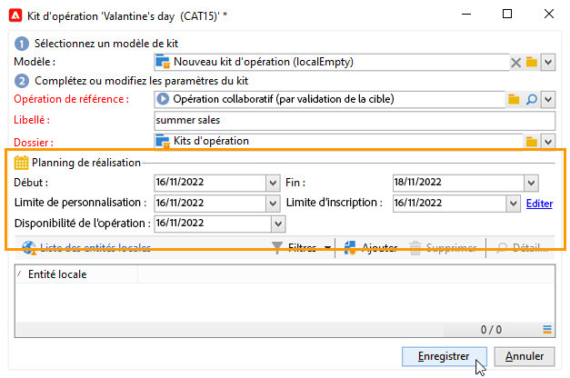

### Audience {#audience}

L&#39;entité centrale doit renseigner les entités locales impliquées par l&#39;opération dès la création de l&#39;opération collaborative.

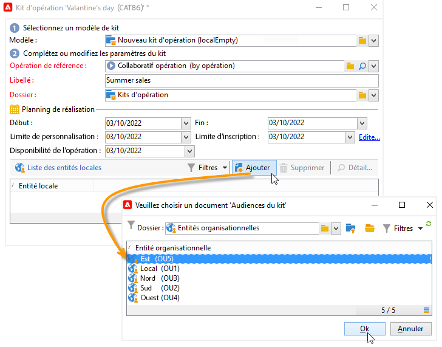

>[!CAUTION]
>
>Il est impossible de valider un **[!UICONTROL kit d&#39;opération collaborative simple, par formulaire et par opération]**, si les entités locales impliquées ne sont pas indiquées.

### Modes de validation {#approval-modes}

Pour les **opérations collaboratives**, il est possible de définir le type de validation des commandes :

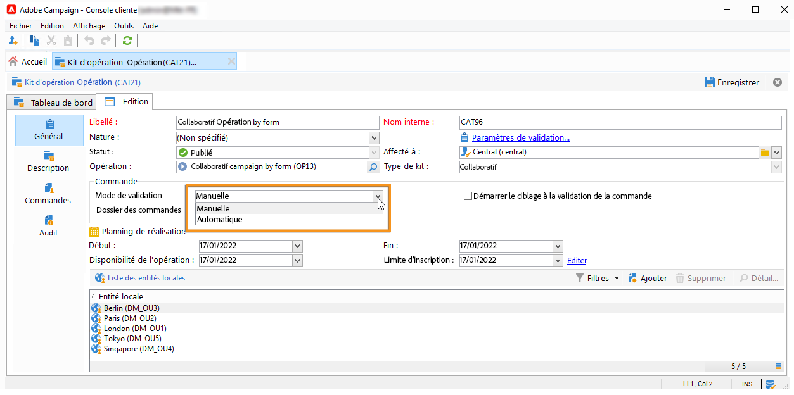

En mode manuel, l&#39;entité locale doit s&#39;inscrire à l&#39;opération pour pouvoir y participer.

En mode automatique, l&#39;entité locale est pré-abonnée pour la campagne. Il peut annuler l&#39;abonnement à la campagne ou modifier ses paramètres sans avoir besoin de l&#39;approbation de l&#39;entité centrale.

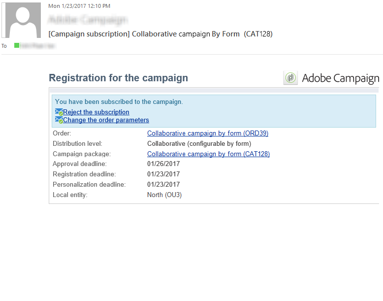

### Notifications {#notifications}

Le paramétrage des messages de notification est identique à celui d&#39;une opération locale. Consultez [cette section](creating-a-local-campaign.md#notifications).

## Commande dʼune opération {#ordering-a-campaign}

Lorsqu&#39;une opération collaborative est ajoutée dans la liste des kits d&#39;opération, les entités locales faisant partie de l&#39;audience définie par l&#39;entité centrale sont avisées par un message de notification (les **opérations collaboratives par validation de la cible)** n&#39;ont pas d&#39;audience prédéfinie). Le message envoyé contient un lien permettant de s&#39;inscrire à la campagne, comme dans l&#39;exemple ci-dessous :

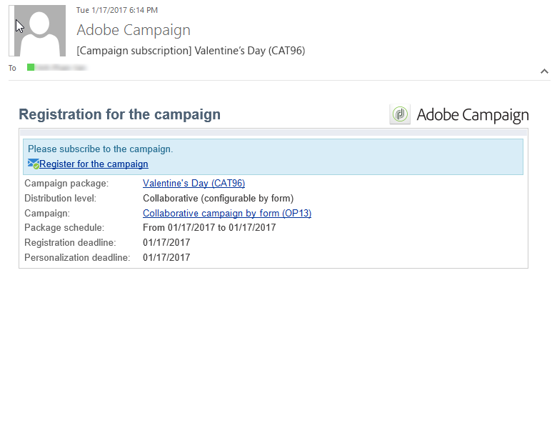

Ce message permet également aux entités locales de visualiser la description renseignée par l&#39;opérateur central créateur du kit, ainsi que les documents liés à l&#39;opération. Ils n’appartiennent pas à la campagne elle-même, bien qu’ils fournissent des informations supplémentaires à son sujet.

Une fois la connexion établie via une interface web, des informations personnalisées peuvent être saisies pour la campagne collaborative que les opérateurs et opératrices souhaitent commander :

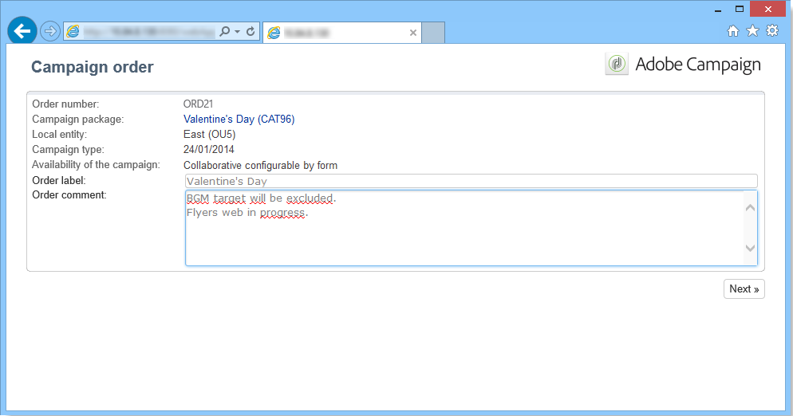

Lorsqu&#39;une entité locale enregistre sa participation, une notification est adressée par email à l&#39;entité centrale afin de valider sa commande.

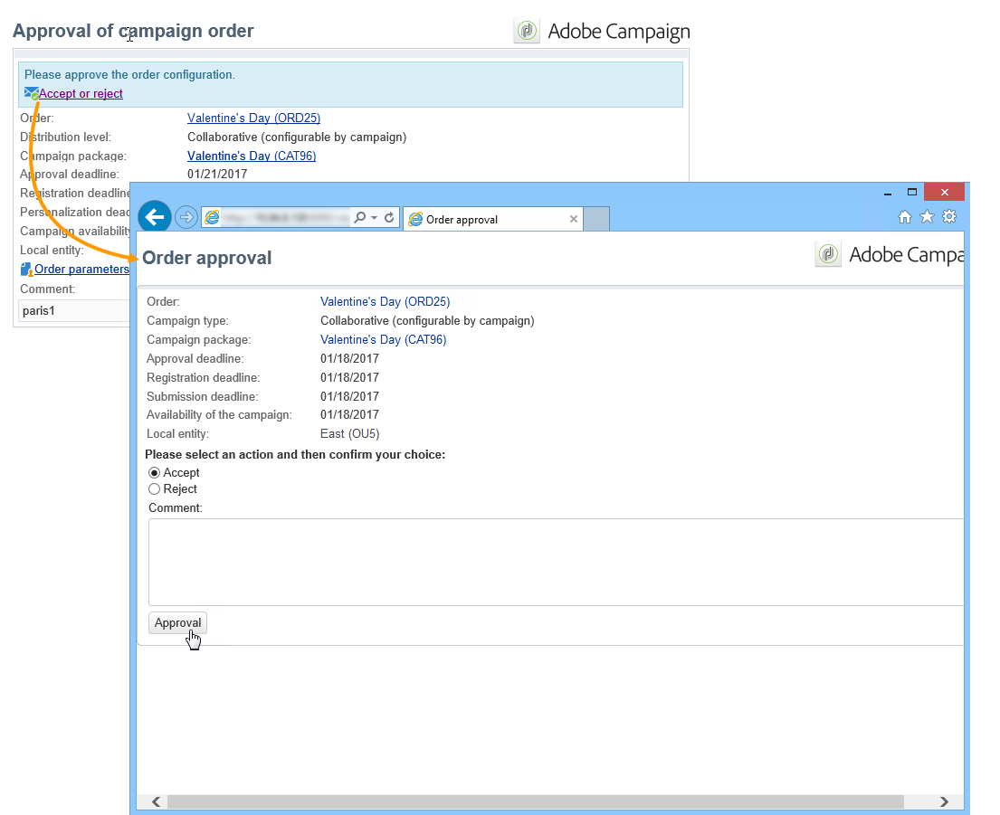

Pour plus d&#39;informations, consultez la section [Processus de validation](creating-a-local-campaign.md#approval-process).

## Validation dʼune commande {#approving-an-order}

La validation dʼune commande dʼun kit dʼopération collaborative est identique à celle dʼune opération locale. Consultez [cette section](creating-a-local-campaign.md#approving-an-order).
