# Créer une campagne locale{#creating-a-local-campaign}

Une opération locale est une instance d&#39;opération créée à partir d&#39;un modèle d&#39;opération référencé dans la liste des **[!UICONTROL kits d&#39;opération]** avec un **planning d&#39;exécution spécifique** à chaque commande de l&#39;entité locale. L&#39;objectif est de répondre à un besoin local de communication en utilisant un modèle d&#39;opération formalisé et paramétré par l&#39;entité centrale. Les grandes étapes de la mise en oeuvre d&#39;une opération locale sont les suivantes :

**Pour l&#39;entité centrale**

1. Créer un modèle d&#39;opération locale.
1. Créer un kit d&#39;opération à partir du modèle.
1. Publier le kit d&#39;opération.
1. Valider les commandes.

**Pour l&#39;entité locale**

1. Commander l&#39;opération.
1. Exécuter l&#39;opération.

## Créer un modèle d&#39;opération locale {#creating-a-local-campaign-template}

Pour créer un kit d&#39;opération, vous devez d&#39;abord créer le **modèle d&#39;opération** à partir du noeud **[!UICONTROL Ressources > Modèles]**.

Pour créer un nouveau modèle d&#39;opération locale, dupliquez le modèle par défaut **[!UICONTROL Opération locale (opLocal)]**.

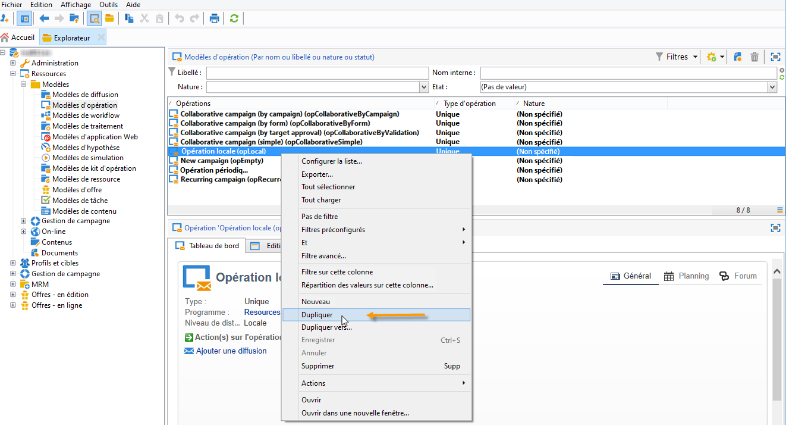

Nommez votre modèle d&#39;opération et renseignez les champs disponibles.

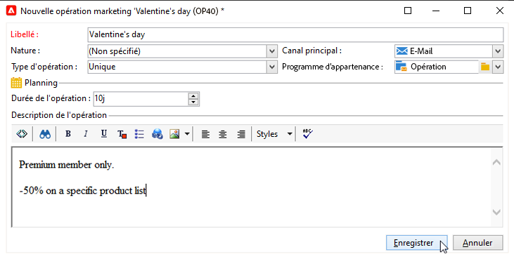

Dans la fenêtre de la campagne, cliquez sur l&#39;onglet **[!UICONTROL Modifier]**, puis sur le lien **[!UICONTROL Paramètres avancés de la campagne...]**.

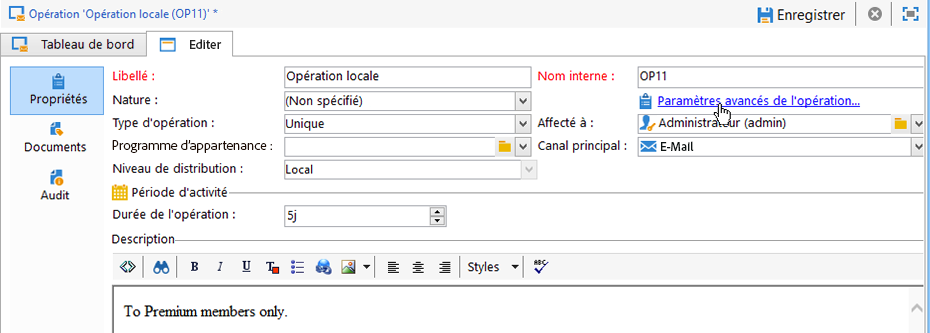

### Type d’interface {#web-interface}

Dans l’onglet **Marketing Distribué**, vous pouvez choisir le type d’interface et les valeurs par défaut, puis indiquer les paramètres avancés à saisir lors de la commande par les entités locales.

L’interface correspond à un formulaire à renseigner par l’entité locale lors de la commande de la campagne.

Sélectionnez le type d’interface à appliquer aux campagnes créées à partir du modèle :

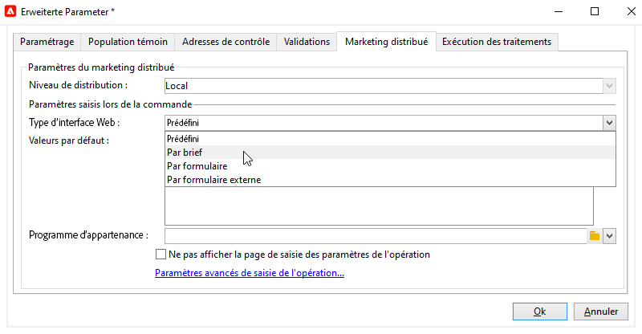

Quatre types d’interface sont disponibles :

* **[!UICONTROL Par brief]** : l’entité locale doit éditer un brief où elle peut saisir la description des paramètres de l’opération. Une fois la commande approuvée, l’entité centrale configure et exécute l’intégralité de la campagne.

  

* **[!UICONTROL Par formulaire]** : l’entité locale a accès à un formulaire web où elle peut, par exemple, modifier le contenu, la cible, la taille maximale de la cible, ainsi que les dates de création et d’extraction grâce à des champs de personnalisation, selon le modèle utilisé. Il est possible pour l’entité locale d’évaluer la cible et de prévisualiser le contenu depuis ce formulaire web.

  

  Le formulaire proposé est indiqué dans une application web qui doit être sélectionnée dans la liste déroulante du champ **[!UICONTROL Interface web]** qui se trouve dans le lien **[!UICONTROL Paramètres avancés de la campagne...]**. Pour plus d&#39;informations, consultez la section [Créer une campagne locale (par formulaire)](examples.md#creating-a-local-campaign--by-form-).

  >[!NOTE]
  >
  >L’application web utilisée ici est un exemple. Vous devez créer une application web spécifique pour pouvoir utiliser un formulaire.

  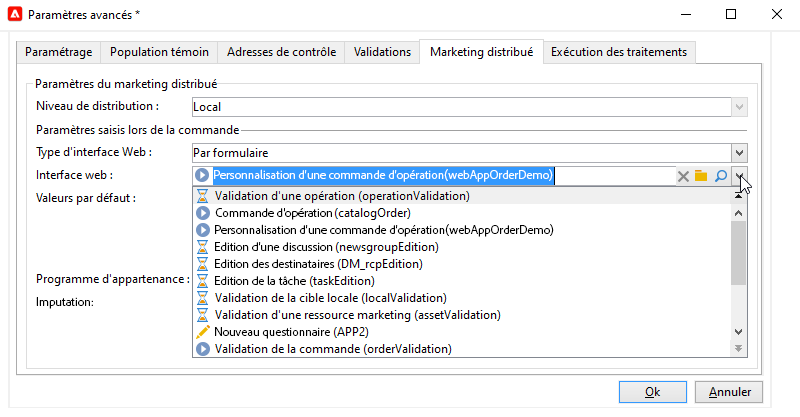

* **[!UICONTROL Par formulaire externe]** : l’entité locale a accès aux paramètres de la campagne dans son extranet (pas dans Adobe Campaign). Ces paramètres sont identiques à ceux d’une **campagne locale (par formulaire)**.
* **[!UICONTROL Prédéfini]** : l’entité locale commande la campagne en utilisant le formulaire par défaut, sans la localiser.

  

### Les valeurs par défaut {#default-values}

Sélectionnez les **[!UICONTROL Valeurs par défaut]** qui seront renseignées par les entités locales. Par exemple :

* les dates de contact et d&#39;extraction,
* les caractéristiques de la cible (segment d&#39;âge, etc.).

Sélectionnez le **[!UICONTROL Programme d&#39;appartenance]** et le **[!UICONTROL Budget]**.

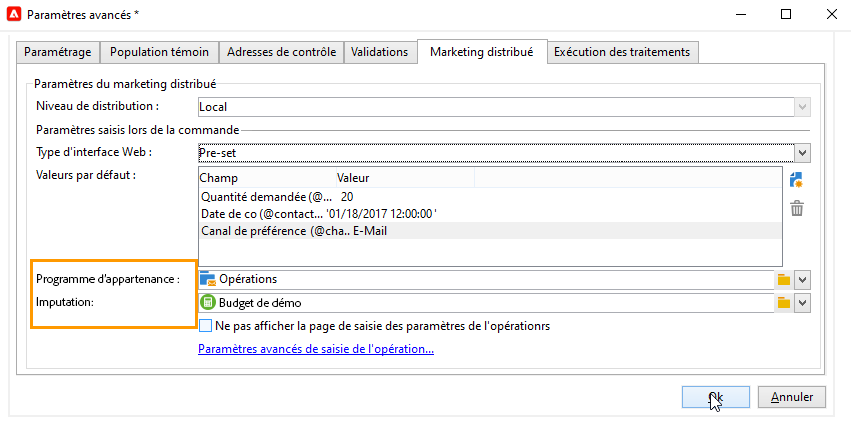

### Validations {#approvals}

A partir du lien **[!UICONTROL Paramètres avancés de saisie de l&#39;opération...]**, vous pouvez définir le nombre maximum de validants.

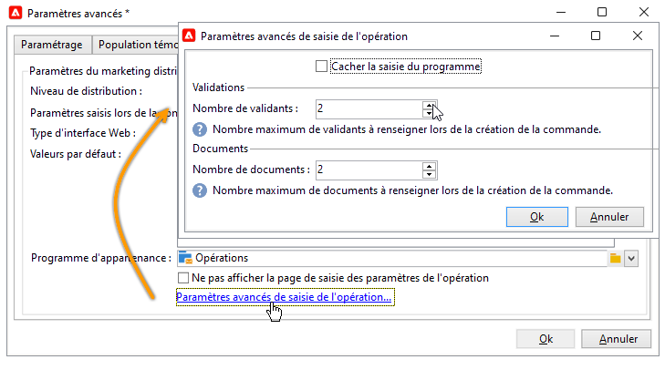

Les validants seront renseignés par l&#39;entité locale lors de la commande de l&#39;opération.

Si l&#39;on ne souhaite pas renseigner de validants pour les opérations, le nombre de validants doit être défini à 0.

### Documents {#documents}

Vous pouvez permettre aux opérateurs et opératrices de l’entité locale d’associer des documents (fichiers texte, tableurs, images, descriptions de campagnes, etc.) à la campagne locale lors de la création de la commande. Le lien **[!UICONTROL Paramètres avancés de saisie de l’opération...]** permet de limiter le nombre de documents. Pour ce faire, il vous suffit de saisir le nombre maximal autorisé dans le champ **[!UICONTROL Nombre de documents]**.

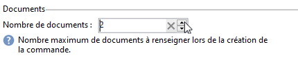

Lors de la commande d&#39;un kit d&#39;opération, le formulaire propose d&#39;associer autant de documents qu&#39;indiqué dans le champ correspondant du modèle :

Pour ne proposer aucun champ pour le téléchargement de documents, saisissez la valeur **[!UICONTROL 0]** dans le champ **[!UICONTROL Nombre de documents]**.

>[!NOTE]
>
>Les **[!UICONTROL paramètres avancés de saisie de l&#39;opération...]** peuvent être désactivés en cliquant sur **[!UICONTROL Ne pas afficher la page de saisie des paramètres de l&#39;opération]**.

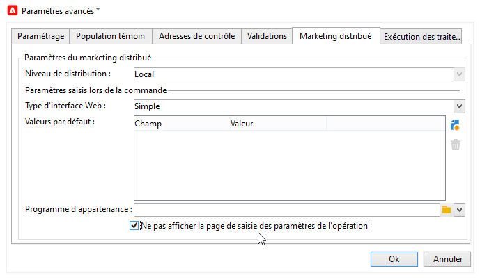

### Workflow {#workflow}

Dans l&#39;onglet **[!UICONTROL Ciblages et workflows]**, créez le workflow de la campagne qui collecte les **[!UICONTROL Valeurs par défaut]** définies dans les **[!UICONTROL Paramètres avancés de la campagne...]** et crée les diffusions.

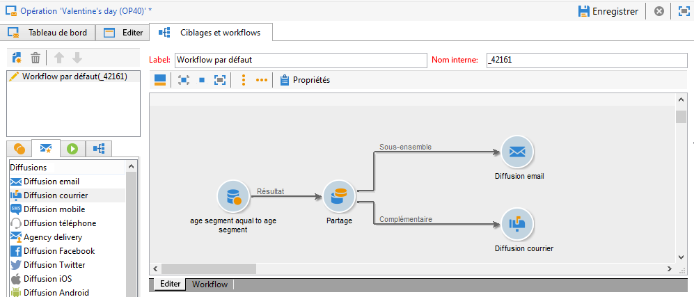

Double-cliquez sur l&#39;activité **[!UICONTROL Requête]** pour la paramétrer en fonction des **[!UICONTROL Valeurs par défaut]** définies.

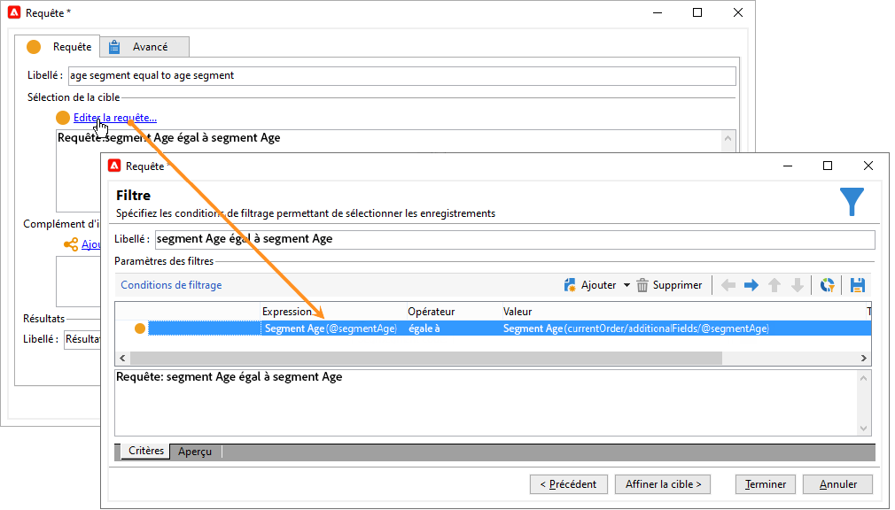

### Diffusion {#delivery}

Dans l&#39;onglet **[!UICONTROL Suivi]**, cliquez sur l&#39;icône **[!UICONTROL Détails]** pour avoir accès à la **[!UICONTROL Planification]** de la diffusion choisie.

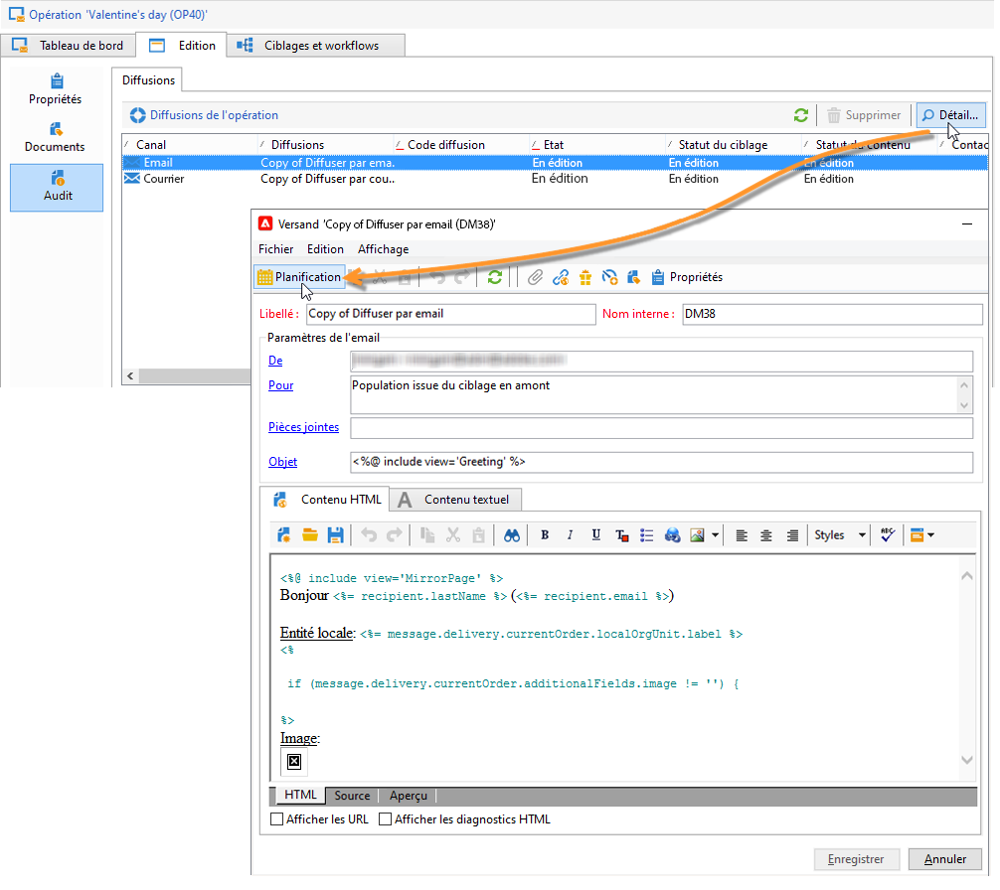

L&#39;icône **[!UICONTROL Planification]** vous permet de paramétrer la date de contact et d&#39;exécution de la diffusion.

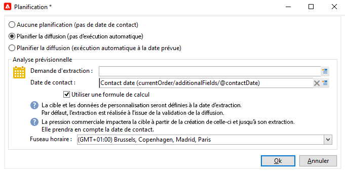

Au besoin, paramétrez la taille maximale de la diffusion :

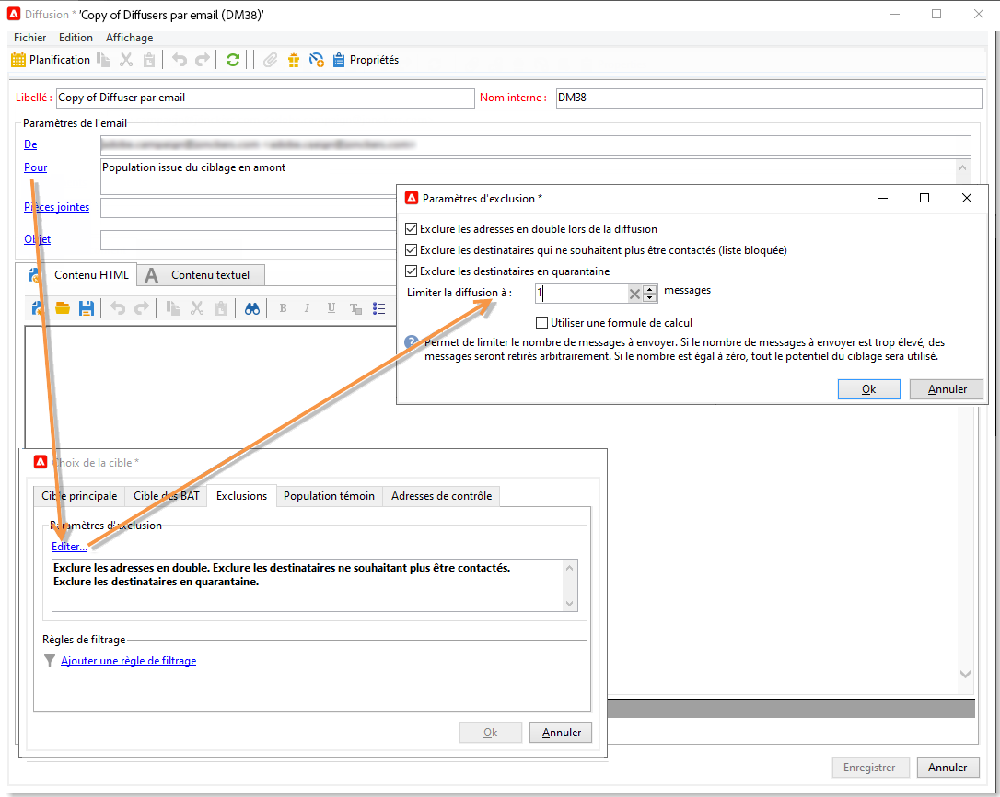

Localisez le HTML de votre diffusion. Par exemple, dans **[!UICONTROL Diffusion > Commande courante > Champs additionnels]**, utilisez le champ **[!UICONTROL Segment d’âge]** pour localiser la diffusion en fonction de l’âge de la cible.

Enregistrez votre modèle de campagne. Vous pouvez désormais l’utiliser depuis la vue **[!UICONTROL Kits d’opération]** de l’onglet **[!UICONTROL Campagnes]**, en cliquant sur le bouton **[!UICONTROL Créer]**.

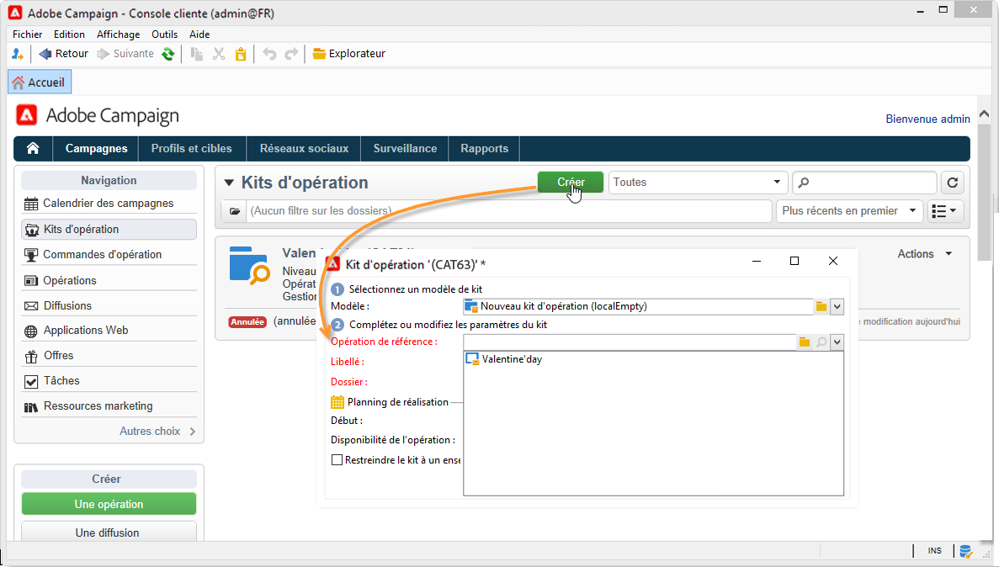

>[!NOTE]
>
>Les modèles de campagne et leur paramétrage général sont présentés sur [cette page](../campaigns/marketing-campaign-templates.md).

## Créer le kit d&#39;opération {#creating-the-campaign-package}

Pour mettre à disposition le modèle d&#39;opération auprès des entités locales, il doit être ajouté dans la liste. Pour cela, l&#39;entité centrale doit créer un nouveau kit.

Les étapes sont les suivantes :

1. Dans la section **[!UICONTROL Navigation]** de l&#39;univers **Campagnes**, cliquez sur le lien **[!UICONTROL Kits d&#39;opération]**.
1. Cliquez sur le bouton **[!UICONTROL Créer]**.

   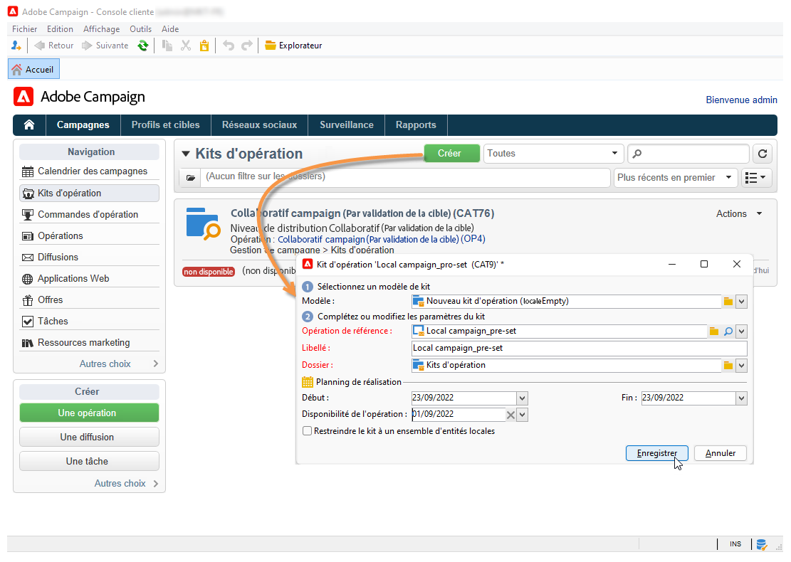

1. La section supérieure de la fenêtre permet de sélectionner le modèle de kit d&#39;opération défini [précédemment](#creating-a-local-campaign-template).

   Par défaut, le modèle **[!UICONTROL Nouveau kit d&#39;opération (localEmpty)]** peut être utilisé pour les opérations locales.

1. Définissez le libellé du kit d&#39;opération, son dossier d&#39;enregistrement et indiquez son planning de réalisation.

### Dates       {#dates}

Les dates de début et de fin correspondent à la période de visibilité de l&#39;opération dans la liste des kits.

La date de disponibilité est la date à partir de laquelle l&#39;opération est disponible auprès des entités locales (pour la commander).

>[!CAUTION]
>
>Si une entité locale n&#39;a pas réservé l&#39;opération avant la date limite d&#39;inscription, elle ne pourra pas y participer.

Ces informations sont accessibles depuis le mail de notification adressé aux agences locales, comme dans l&#39;exemple ci-dessous :

### Audience {#audience}

Pour une opération locale, l&#39;entité centrale peut définir les entités locales impliquées en cochant l&#39;option **[!UICONTROL Restreindre le kit à un ensemble d&#39;entités locales]**.

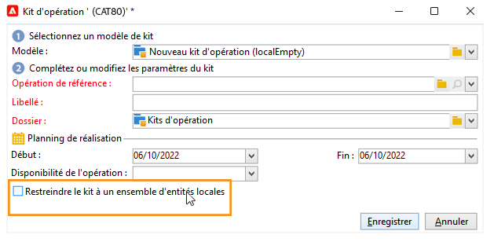

### Configurations supplémentaires {#additional-settings}

Lorsque le kit est enregistré, l&#39;entité centrale peut l&#39;éditer depuis l&#39;onglet **[!UICONTROL Edition]**.

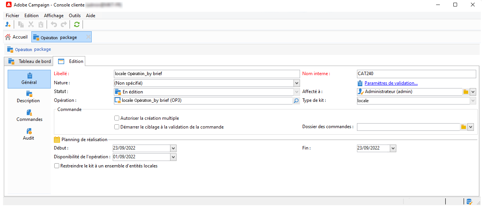

Depuis l&#39;onglet **[!UICONTROL Général]**, l&#39;entité centrale peut :

* paramétrer le ou les validants du kit d&#39;opération depuis le lien **[!UICONTROL Paramètres de validation...]**,
* revoir le planning de réalisation,
* ajouter ou supprimer des entités locales.

>[!NOTE]
>
>Par défaut, chaque entité ne peut commander qu&#39;une seule fois une **opération locale**.
>   
>Cochez l&#39;option **[!UICONTROL Autoriser la création multiple]** pour lui permettre de créer plusieurs opérations locales à partir du kit d&#39;opération.

### Notifications {#notifications}

Lorsqu’une opération est disponible ou lorsque la date limite d’inscription est atteinte, un message est adressé aux opérateurs du groupe de notification indiqué au niveau de l’entité locale. Pour plus d&#39;informations, consultez la section [Entités organisationnelles](about-distributed-marketing.md#organizational-entities).

## Commander une opération {#ordering-a-campaign}

Une fois validés et leur période de réalisation débutée, les kits d&#39;opération sont accessibles au niveau des entités locales. Les acteurs locaux sont avisés par email de la disponibilité d&#39;un nouveau kit d&#39;opération (dès que sa date de disponibilité est atteinte).

>[!NOTE]
>
>Si des entités locales ont été indiquées lors de la création du kit d&#39;opération, elles seules recevront une notification. Si aucune entité locale n&#39;a été indiquée, toutes les entités locales recevront une notification.

Pour utiliser une opération proposée par l&#39;entité centrale, l&#39;entité locale doit la commander.

Pour commander une opération :

1. Cliquez sur lien **[!UICONTROL Commander l&#39;opération]** dans le message de notification, ou sur le bouton correspondant dans la console Adobe Campaign.

   Saisissez votre identifiant et votre mot de passe pour procéder à la commande. L&#39;interface de saisie des paramétrages se compose d&#39;un ensemble de pages définies dans une application Web.

1. Renseignez les informations utiles dans la première page (libellé de la commande et commentaire) et cliquez sur **[!UICONTROL Suivant]**.

   

1. Renseignez les paramètres disponibles et validez la commande.

1. Une notification est adressée au responsable de l&#39;entité organisationnelle à laquelle appartient l&#39;agence locale, pour valider cette commande.

   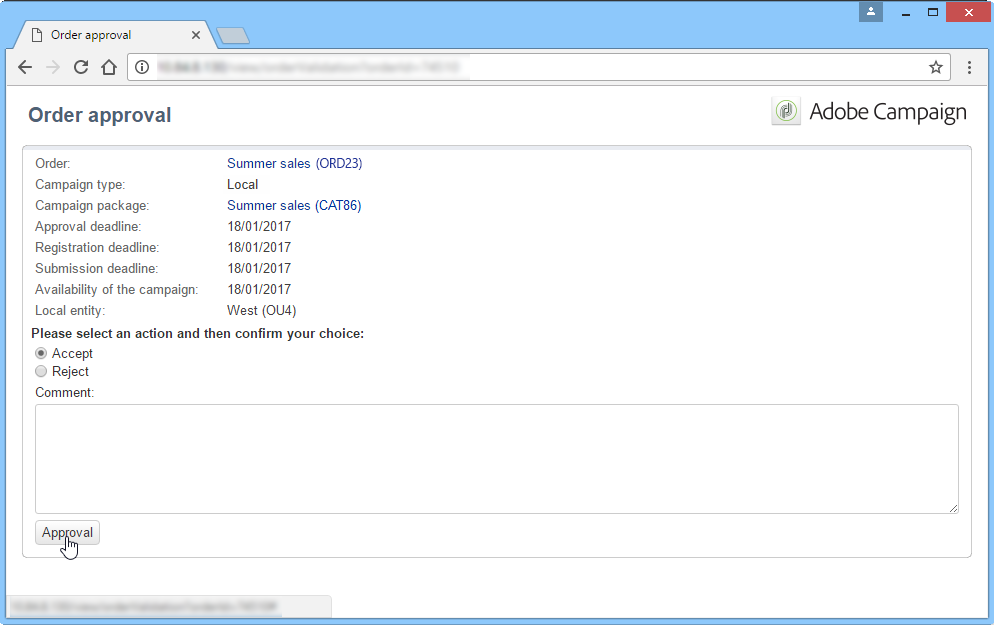

1. L&#39;information est remontée au niveau de l&#39;entité locale et de l&#39;entité centrale. Si chaque entité locale ne voit que ses commandes, l&#39;entité centrale peut visualiser toutes les commandes de toutes les entités locales, comme ci-dessous :

   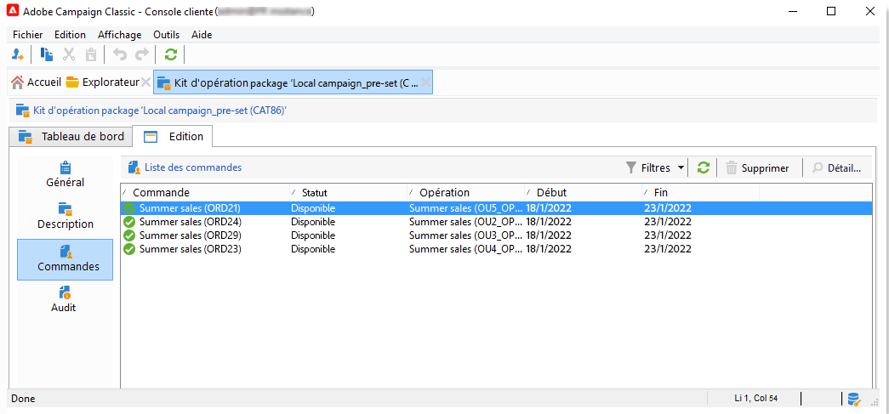

   Les opérateurs peuvent afficher le détail de la commande :

   

   L&#39;onglet **[!UICONTROL Edition]** contient les informations renseignées par l&#39;entité locale lors de la commande :

   

1. La commande doit être validée par l&#39;entité centrale pour être définitive.

   

   Pour plus d&#39;informations, consultez la section [Processus de validation](#approval-process).

1. L’opérateur local est alors notifié de la disponibilité de la campagne : elle est accessible à partir de la liste des kits d’opérations de l’onglet **Campagnes**. La campagne peut alors être utilisée. Pour plus d&#39;informations, consultez la section [Accéder aux opérations](accessing-campaigns.md).

   L&#39;option **[!UICONTROL Démarrer le ciblage à la validation de la commande]** permet à l&#39;entité locale d&#39;exécuter l&#39;opération dès que sa commande a été validée.

   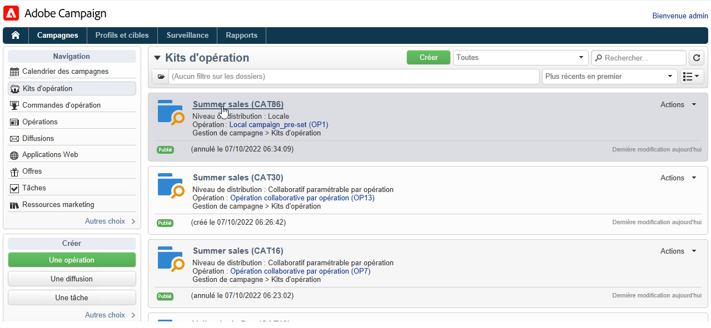

## Valider une commande {#approving-an-order}

Pour confirmer la commande d&#39;une opération, l&#39;entité centrale doit la valider.

La vue d’ensemble **[!UICONTROL Commandes des campagnes]**, accessible à partir du lien correspondant dans l’onglet **Campagnes**, permet de visualiser l’état des commandes des campagnes et de procéder à leur validation.

>[!NOTE]
>
>Tant que la commande n&#39;est pas validée, les acteurs locaux peuvent la modifier.

### Processus de validation {#approval-process}

#### Notification par email {#email-notification}

Lorsqu&#39;une commande d&#39;opération est effectuée par une entité locale, les opérateurs validants de cette entité sont notifiés par email, comme dans l&#39;exemple ci-dessous :

>[!NOTE]
>
>La sélection des opérateurs validants est présentée dans la section [Validants](#reviewers). Ils peuvent accepter ou refuser la commande.

#### Approuver via la console cliente {#approving-via-the-adobe-campaign-console}

La commande peut également être approuvée à partir de la console cliente, dans la vue d’ensemble des commandes de la campagne. Pour approuver une commande, sélectionnez-la et cliquez sur **[!UICONTROL Approuver la commande]**.

>[!NOTE]
>
>La campagne peut toujours être éditée et reconfigurée jusqu’à sa date de disponibilité. Les entités locales peuvent également rejeter la campagne en cliquant sur le bouton **[!UICONTROL Annuler]**.

#### Créer une campagne {#creating-a-campaign}

Lorsque la commande d&#39;une opération est validée, celle-ci peut être paramétrée et exécutée par l&#39;entité locale.

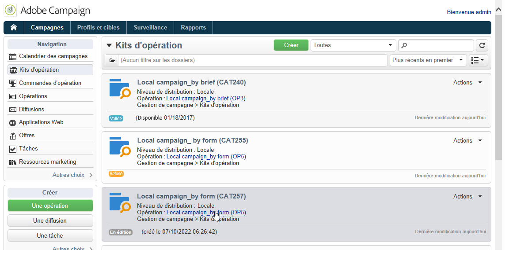

Pour plus d&#39;informations, consultez la section [Accéder aux opérations](accessing-campaigns.md).

### Refuser une validation {#rejecting-an-approval}

L&#39;opérateur validant peut refuser la validation d&#39;un kit d&#39;opération ou d&#39;une commande.

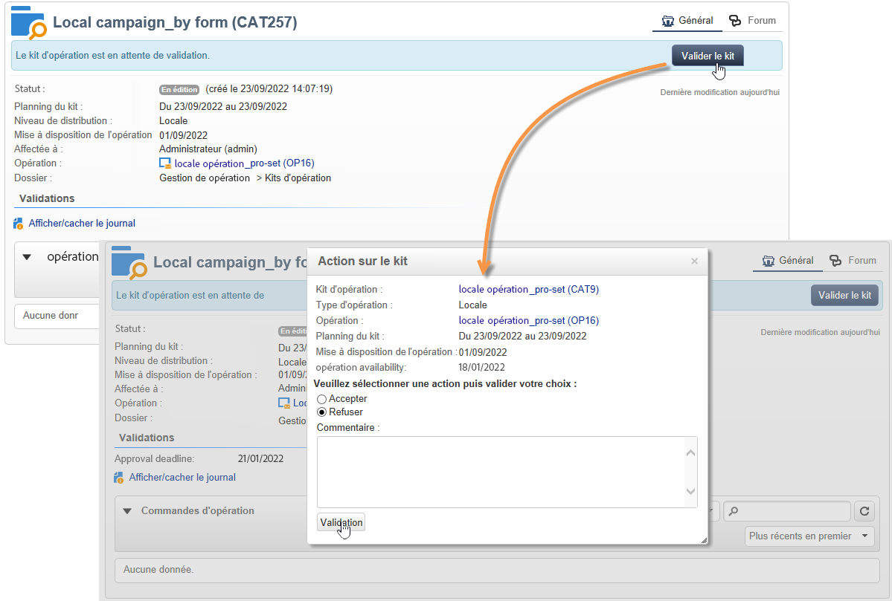

Si l&#39;opérateur validant refuse une commande, la notification correspondante est automatiquement envoyée aux entités locales concernées : elle affiche le commentaire saisi par l&#39;opérateur ayant refusé la validation.

Les informations sont affichées dans la liste des pckages de campagne ou dans la page des commandes de campagne. Si les réviseurs et réviseuses ont accès à la console cliente Adobe Campaign, les entités locales sont informées de ce rejet.

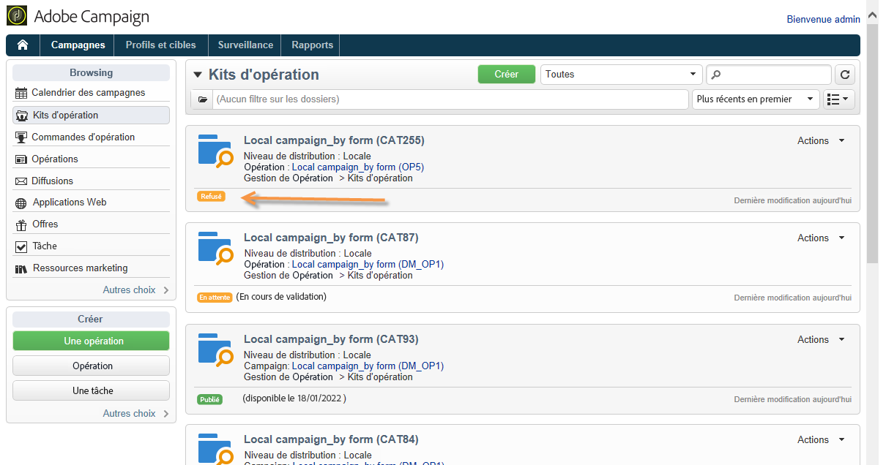

Elles peuvent visualiser le commentaire saisi dans l’onglet **[!UICONTROL Edition]** du package des campagnes.

### Opérateurs validants {#reviewers}

Les opérateurs validants sont notifiés par email lorsqu&#39;une validation est requise.

Pour chaque entité locale, les opérateurs validants sont sélectionnés pour l’approbation des commandes d’opération et la validation de la campagne. Pour plus d’informations sur la sélection des opérateurs validants, voir la section [Entités organisationnelles](about-distributed-marketing.md#organizational-entities).

>[!NOTE]
>
>La validation de la commande ne doit pas encore être effective pour que cette sélection soit possible.

### Annuler une commande {#canceling-an-order}

L&#39;entité centrale a la possibilité d&#39;annuler une commande à partir du bouton **[!UICONTROL Supprimer]**, disponible dans le tableau de bord de la commande.

L&#39;opération est alors annulée au niveau de la vue **[!UICONTROL Commandes d&#39;opérations]**.
