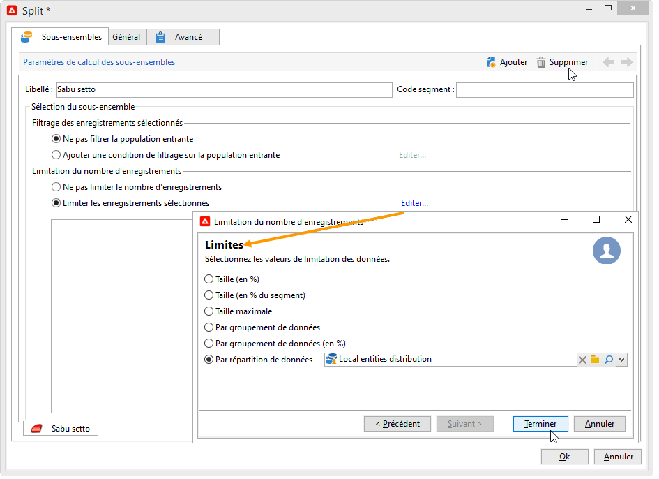
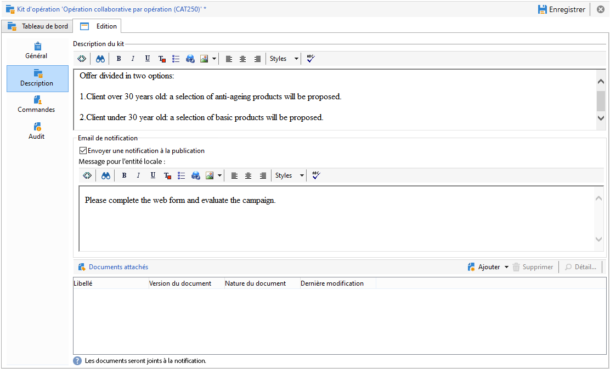

# Exemples de marketing distribué{#distributed-marketing-samples}


## Création dʼune campagne locale (par formulaire) {#creating-a-local-campaign--by-form-}

Le type d’interface web **par formulaire** implique l’utilisation d’une **application web**. Cette application web peut contenir toutes sortes d’éléments définis personnalisés, selon la configuration. Par exemple, vous pouvez proposer des liens pour évaluer la cible, le budget, le contenu, etc. via des API dédiées.

>[!NOTE]
>
>L&#39;application web utilisée dans cet exemple n&#39;est pas une application web Adobe Campaign d&#39;usine. Pour utiliser un formulaire dans une campagne, vous devez créer l&#39;application web dédiée.

Lors de la création du modèle de campagne, cliquez sur l&#39;icône **[!UICONTROL Zoom]** de l&#39;option **[!UICONTROL Interface web]** du lien **[!UICONTROL Paramètres avancés de la campagne...]** pour accéder aux détails de l&#39;application web.


>[!NOTE]
>
>Le paramétrage de l&#39;application Web n&#39;est disponible qu&#39;au niveau du modèle d&#39;opération.

Dans l&#39;onglet **[!UICONTROL Edition]**, sélectionnez l&#39;activité **Commande d&#39;opération** et ouvrez-la pour accéder à son contenu.


Dans cet exemple, l&#39;activité **Commande d&#39;opération** comprend :

* des champs qui seront renseignés par l&#39;entité locale lors de la commande,

  

* des liens qui permettront à l&#39;entité locale d&#39;évaluer l&#39;opération (par exemple la cible, le budget, le contenu, etc.),

  

* des scripts qui permettent de calculer et d&#39;afficher le résultat de ces évaluations.

  

Dans cet exemple, les APIs suivantes sont utilisées :

* Pour l&#39;évaluation du ciblage,

  ```
  var res = nms.localOrder.EvaluateTarget(ctx.localOrder);
  ```

* Pour l&#39;évaluation du budget,

  ```
  var res = nms.localOrder.EvaluateDeliveryBudget(ctx.@deliveryId, NL.XTK.parseNumber(ctx.@compt));
  ```

* Pour l&#39;évaluation du contenu,

  ```
  var res = nms.localOrder.EvaluateContent(ctx.localOrder, ctx.@deliveryId, "html", resSeed.@id);
  ```

## Création dʼune opération collaborative (par validation de la cible) {#creating-a-collaborative-campaign--by-target-approval-}

### Introduction {#introduction}

Vous êtes le responsable marketing d&#39;une grande marque de vêtements qui possède une boutique en ligne, et plusieurs magasins dans toute la France. A l&#39;annonce des beaux jours vous décidez de créer une offre promotionnelle qui permettra à vos meilleurs clients de bénéficier de 50 % de réduction sur toutes les robes disponibles dans votre catalogue.

Cette offre est destinée aux meilleurs clients de vos magasins français, c&#39;est à dire ceux qui ont dépensé plus de 300 € depuis le début de l&#39;année.

Vous décidez donc de créer, grâce au Marketing Distribué, une opération collaborative par validation de la cible, qui vous permet de sélectionner les meilleurs clients de vos magasins (regroupés par région), qui recevront la diffusion email contenant l&#39;offre promotionnelle.

La première partie de cet exemple illustre la réception par vos entités locales de la notification de création de l&#39;opération, et l&#39;utilisation qu&#39;ils peuvent en faire pour évaluer l&#39;opération et la commander.

La deuxième partie de cet exemple explique le mode de création de votre opération.

Les étapes sont les suivantes :

**Pour l&#39;entité locale**

1. Utilisez la notification de création de l&#39;opération pour accéder à la liste de contacts sélectionnés par l&#39;entité centrale.
1. Sélectionnez les contacts désirés et validez la participation.

**Pour l&#39;entité centrale :**

1. Créez une activité **[!UICONTROL Répartition de données]**.
1. Créez l&#39;opération collaborative.
1. Publiez l&#39;opération.

### Côté entité locale {#local-entity-side}

1. Les entités locales sélectionnées pour participer à l&#39;opération reçoivent, par email, une notification.

   

1. En cliquant sur le lien **[!UICONTROL Accéder à votre liste de contacts et valider le ciblage]**, l’entité locale a accès, depuis un navigateur web, à la liste de ses clients sélectionnés pour l’opération.

   

1. L&#39;entité locale dé-sélectionne certains contacts de la liste, car ces derniers ont déjà été contactés pour une offre du même acabit depuis le début de l&#39;année.

   

Lorsque les validations sont approuvées, l&#39;opération peut démarrer automatiquement.

### Côté entité centrale {#central-entity-side}

#### Création dʼune activité Répartition de données {#creating-a-data-distribution-activity}

1. Pour mettre en place une campagne collaborative (par validation de la cible), vous devez d’abord créer une **[!UICONTROL Activité Répartition de données]**. Cliquez sur l’icône **[!UICONTROL Nouveau]** dans le dossier **[!UICONTROL Ressources > Gestion de campagne > Répartition de données]** de l’explorateur Campaign.

   

1. Dans l&#39;onglet **[!UICONTROL Général]** vous devez indiquer :

   * la **[!UICONTROL Dimension de ciblage]**. Ici la **Répartition de données** s&#39;effectue sur les **Destinataires**.
   * le **[!UICONTROL Type de répartition]**. Vous pouvez choisir une **taille fixe** ou une **taille en pourcentage**.
   * le **[!UICONTROL Type d&#39;affectation]**. Choisissez l&#39;option **Entité locale**.
   * le **[!UICONTROL Champ de répartition]**. Ici, c&#39;est le champ **[!UICONTROL Origine (@origin)]** présent dans la table des Destinataires qui vous permet d&#39;identifier la relation entre le contact et l&#39;entité locale.
   * Le champ **[!UICONTROL Stockage des validations]**. Choisissez l&#39;option **Validation en local d&#39;un destinataire**.

1. Dans l&#39;onglet **[!UICONTROL Répartition]**, indiquez :

   * la **[!UICONTROL Valeur du champ de répartition]**, qui correspond aux entités locales impliquées dans l&#39;opération à venir.
   * le **[!UICONTROL libellé]** de l&#39;entité locale.
   * la **[!UICONTROL taille]** (fixe ou en pourcentage) choisie. La **valeur par défaut 0** implique la sélection de tous les destinataires liés à l&#39;entité locale.

   

1. Enregistrez votre nouvelle boîte de répartition.

#### Création d’une opération collaborative {#creating-a-collaborative-campaign}

1. À partir du dossier **[!UICONTROL Gestion de campagne > Campagne]** de l’explorateur Campaign, créez une **[!UICONTROL campagne collaborative (par validation de la cible)]**.
1. Dans l&#39;onglet **[!UICONTROL Ciblages et workflows]**, créez un workflow pour votre opération. Celui-ci doit contenir une activité de **Partage** dont la **[!UICONTROL limitation du nombre d&#39;enregistrements]** est définie par l&#39;activité **[!UICONTROL Répartition de données]**.

   

1. Ajoutez une action **[!UICONTROL Validation en local]** où vous pouvez définir :

   * le contenu du message qui sera envoyé aux entités locales lors de la notification,
   * le rappel pour la validation,
   * le traitement anticipé de l&#39;opération..

   

1. Sauvegardez votre enregistrement.

#### Publication de la campagne {#publishing-the-campaign}

Vous pouvez désormais ajouter un **kit de campagne** à partir de l’onglet **[!UICONTROL Campagnes]**.

1. Choisissez votre **[!UICONTROL Opération de référence]**. Dans l&#39;onglet **[!UICONTROL Edition]** de votre kit, vous pouvez choisir le **[!UICONTROL Mode de validation]** que vous souhaitez utiliser pour votre opération :

   * avec le mode **Manuel**, les entités locales participent à l&#39;opération si elles acceptent l&#39;invitation de l&#39;entité centrale. Elles peuvent supprimer des contacts pré-sélectionnés si elles le souhaitent et une validation d&#39;un manager est obligatoire pour confirmer la participation.
   * avec le mode **Automatique**, les entités locales participent obligatoirement à l&#39;opération, à moins qu&#39;elles ne s&#39;en désinscrivent. Elles peuvent supprimer des contacts sans qu&#39;aucune validation ne soit demandée.

   

1. Dans l&#39;onglet **[!UICONTROL Description]**, vous pouvez ajouter une description pour votre opération, ainsi que des documents qui seront transmis aux entités locales.

   

1. Validez votre kit puis lancez votre workflow pour que le kit soit publié et disponible pour les entités locales dans la liste des kits.

   

## Création dʼune opération collaborative (par formulaire) {#creating-a-collaborative-campaign--by-form-}

### Introduction {#introduction-1}

Vous êtes le responsable marketing d&#39;une grande marque de cosmétiques qui possède une boutique en ligne, et plusieurs magasins dans toute la France. Pour écouler vos stocks d&#39;hiver, vous décidez de créer une offre promotionnelle qui ciblera deux catégories de clients : les plus de 30 ans, à qui vous proposerez des produits adaptés à leur peau mature, et les moins de 30 ans, à qui vous proposerez des produits de soin plus basiques.

Vous décidez donc de créer, grâce au Marketing Distribué, une opération collaborative par formulaire, qui vous permet de sélectionner les clients, de vos différents magasins, par tranches d&#39;âge. Ces clients recevront une diffusion email, personnalisée en fonction de leur âge, contenant l&#39;offre promotionnelle.

La première partie de cet exemple illustre la réception par vos entités locales de la notification de création de l&#39;opération, et l&#39;utilisation qu&#39;ils peuvent en faire pour évaluer l&#39;opération et la commander.

La deuxième partie de cet exemple explique le mode de création de votre opération.

Les étapes sont les suivantes :

**Pour l&#39;entité locale**

1. Utilisez la notification de création de l&#39;opération pour accéder au formulaire en ligne.
1. Localisez l&#39;opération (cible, contenu, volume de la diffusion).
1. Evaluez la localisation et remaniez-la si besoin.
1. Validez votre participation.
1. Le manager de l&#39;entité locale (ou de l&#39;entité centrale) valide le paramétrage et la participation.

**Pour l&#39;entité centrale :**

1. Créez l&#39;opération collaborative.
1. Configurez les **[!UICONTROL Paramètres avancés de la campagne...]** comme pour une campagne locale.
1. Paramétrez le workflow de l&#39;opération et la diffusion comme pour une opération locale.
1. Mettez à jour le formulaire web.
1. Créez le kit d&#39;opération et publiez.

### Côté entité locale {#local-entity-side-1}

1. Les entités locales sélectionnées pour participer à l&#39;opération reçoivent, par email, une notification les informant de la publication de l&#39;opération.

   

1. L&#39;entité locale remplit un formulaire personnalisé puis elle :

   * évalue la cible et le budget,
   * prévisualise le contenu de la diffusion,
   * valide sa participation.

     

1. L&#39;opérateur en charge de la validation des commandes approuve la participation.

   

### Côté entité centrale {#central-entity-side-1}

1. Pour mettre en place une opération collaborative (par formulaire), vous devez créer une opération à partir du **modèle d&#39;opération collaborative (par formulaire)**.

   

1. Sous l&#39;onglet **[!UICONTROL Modifier]** de la campagne, cliquez sur le lien **[!UICONTROL Paramètres avancés de la campagne...]** pour la configurer comme une campagne locale. Pour plus d&#39;informations, consultez la section [Créer une campagne locale (par formulaire)](#creating-a-local-campaign--by-form-).

   

1. Configurez le workflow de l&#39;opération et le formulaire web. Pour plus d&#39;informations, consultez la section [Créer une campagne locale (par formulaire)](#creating-a-local-campaign--by-form-).
1. Créez votre kit d&#39;opération en spécifiant le planning de réalisation et les entités locales impliquées.

   

1. Finalisez le paramétrage du kit en choisissant le mode de validation dans l&#39;onglet **[!UICONTROL Edition]**.

   

1. Si besoin, dans l&#39;onglet **[!UICONTROL Description]**, rentrez une description du kit, un message de notification qui sera envoyé aux entités locales lors de la publication du kit, et attachez des documents informatifs à votre kit d&#39;opération.

   

1. Validez le kit pour activer sa publication.

   
