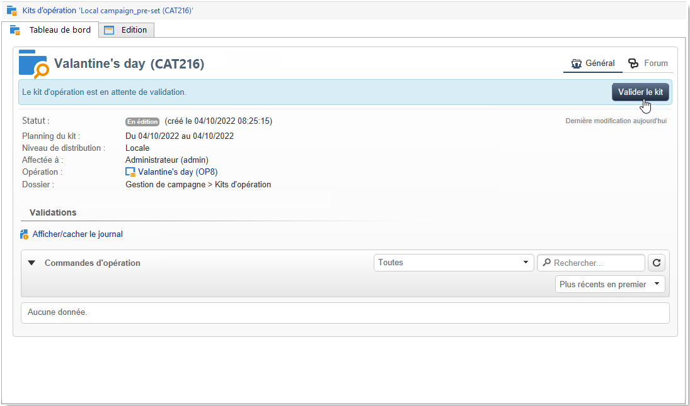

# Publier le pack de campagnes{#publishing-the-campaign-package}

Les opérateurs et opératrices de l’entité centrale publient dans la **[!UICONTROL liste des kits de campagne]**, les kits qu’ils souhaitent proposer aux entités locales.

Avant de pouvoir être publiés dans la liste des kits de campagne, les kits de campagnes doivent être validés par l’entité centrale. Pour cela, vous pouvez définir un réviseur ou une réviseuse, ou un groupe de réviseurs ou de réviseuses, au moyen de l’option **[!UICONTROL Paramètres de validation]** dans le kit de campagne.

## Attribuer un réviseur ou une réviseuse {#assigning-a-reviewer}

Pour indiquer le validant, cliquez sur le lien **[!UICONTROL Paramètres de validation...]** du kit d&#39;opération et choisissez l&#39;opérateur concerné dans la liste déroulante.

Vous pouvez alors lancer le processus de validation en cliquant sur le bouton **[!UICONTROL Soumettre à validation]**.

Un message de notification est alors envoyé au validant afin de confirmer la mise à disposition de ce kit d&#39;opération. Ce message propose un lien pour accepter ou refuser la validation via un accès web.

>[!NOTE]
>
>Au niveau de l&#39;entité organisationnelle, vous pouvez également spécifier des opérateurs validants pour approuver les commandes. Pour plus d&#39;informations, consultez la section [Entités organisationnelles](about-distributed-marketing.md#organizational-entities).

## Ajouter d’autres réviseurs et réviseuses {#adding-other-reviewers}

Depuis le lien **[!UICONTROL Paramètres de validation...]** du package de la campagne, le lien **[!UICONTROL Editer...]** permet d&#39;ajouter d’autres réviseurs et réviseuses.

## Calendrier d’approbation {#approval-periods}

Par défaut, les opérateurs et opératrices validants disposent de trois jours pour procéder à la validation, à partir de la date de soumission.

Dans la fenêtre d’édition des réviseurs et des réviseuses, vous pouvez également paramétrer des rappels afin d’envoyer un ou plusieurs messages en cas de non validation d’un kit de campagne. Pour ce faire, cliquez sur le lien **[!UICONTROL Ajouter un rappel]**, puis sur le bouton **[!UICONTROL Ajouter]**.

Les rappels peuvent être envoyés à une date donnée et/ou **x** jours après la date d’envoi. Le type de rappel peut être paramétré dans la première colonne du tableau des rappels. Dans l’exemple ci-dessous, les réviseurs et réviseuses reçoivent un message de rappel le 11/01/2023, soit deux jours avant la date sélectionnée dans la colonne **[!UICONTROL Date]**, ainsi qu’un deuxième rappel un jour avant la fin de la période d’approbation, soit deux jours après la date d’approbation de l’envoi.

Une fois défini et une fois que le package a été soumis à validation, le planning des traitements est affiché directement dans l&#39;onglet **[!UICONTROL Suivi]**. Il indique la date limite de traitement calculée à partir de la configuration spécifiée ci-avant, et la date du ou des rappels paramétrés.

## Approuver via la console cliente {#approving-via-the-adobe-campaign-console}

Si aucun validant n&#39;a été défini ou si aucun des opérateurs notifiés n&#39;a validé le kit, le bouton **[!UICONTROL Valider le kit]** permet de procéder directement à la validation depuis l&#39;onglet **[!UICONTROL Tableau de bord]** du kit d&#39;opération ou depuis la vue d&#39;ensemble des kits.

Une fois validée, l&#39;opération est alors publiée, ajoutée à la liste et les entités locales pourront l&#39;utiliser dès que sa date de disponibilité sera atteinte. Si des entités locales ont été définies lors de la création de l&#39;opération, un message est envoyé aux opérateurs appartenant au groupe de notification des kits d&#39;opération pour les informer de la disponibilité de l&#39;opération. Si aucune entité n&#39;a été définie en amont, l&#39;opération est accessible par défaut pour toutes les entités locales. Pour plus d&#39;informations, consultez la section [Entités organisationnelles](about-distributed-marketing.md#organizational-entities).
