# Suivi d’une campagne{#tracking-a-campaign}

Les opérateurs de l’entité centrale peuvent effectuer un tracking des commandes des opérations proposées dans la liste des kits de campagne.

Ils peuvent ainsi :

* [Filtrer les kits](#filter-packages),
* [Modifier les packages](#edit-packages),
* [Annuler un kit](#cancel-a-package),
* [Réinitialisation dʼun package](#reinitializing-a-package).

## Filtrer les kits {#filter-packages}

Dans l’onglet **[!UICONTROL Campagnes]**, vous pouvez afficher la liste des **[!UICONTROL Kits de campagne]** qui regroupe toutes les campagnes de marketing distribué existantes. Vous pouvez filtrer cette liste afin qu’elle n’affiche que les campagnes publiées, en retard, en attente de validation, etc. Pour cela, cliquez sur les liens dans la section supérieure de cette vue ou utilisez le lien **[!UICONTROL Liste de filtres]** et sélectionnez le statut du kit d&#39;opération à afficher.

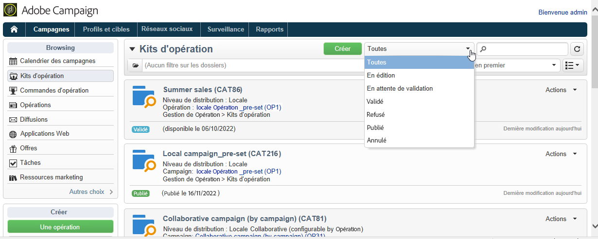

## Modifier les packages {#edit-packages}

La page des **[!UICONTROL kits de campagne]** permet de visualiser le résumé de chaque kit.

Ce résumé affiche les informations suivantes : le libellé, le type d&#39;opération, le nom de l&#39;opération à partir de laquelle le kit a été créé et le dossier d&#39;enregistrement.

Cliquez sur le nom du package pour le modifier. Vous pouvez également visualiser les commandes par entité locale et par statut.

Cette information est proposée aussi dans la vue **[!UICONTROL Commandes d&#39;opérations]** qui liste unitairement toutes les commandes réalisées.

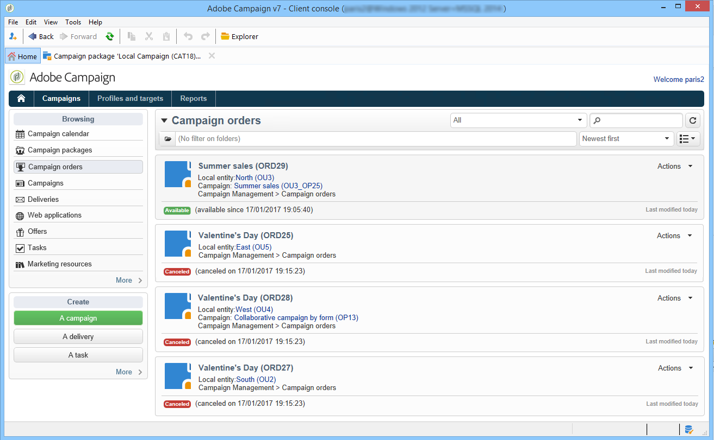

L&#39;opérateur central peut modifier la commande. Vous avez le choix entre les deux méthodes suivantes :

1. L’opérateur ou l’opératrice peut cliquer sur le nom de la commande pour l’éditer : il ou elle accède alors aux détails de celle-ci.

   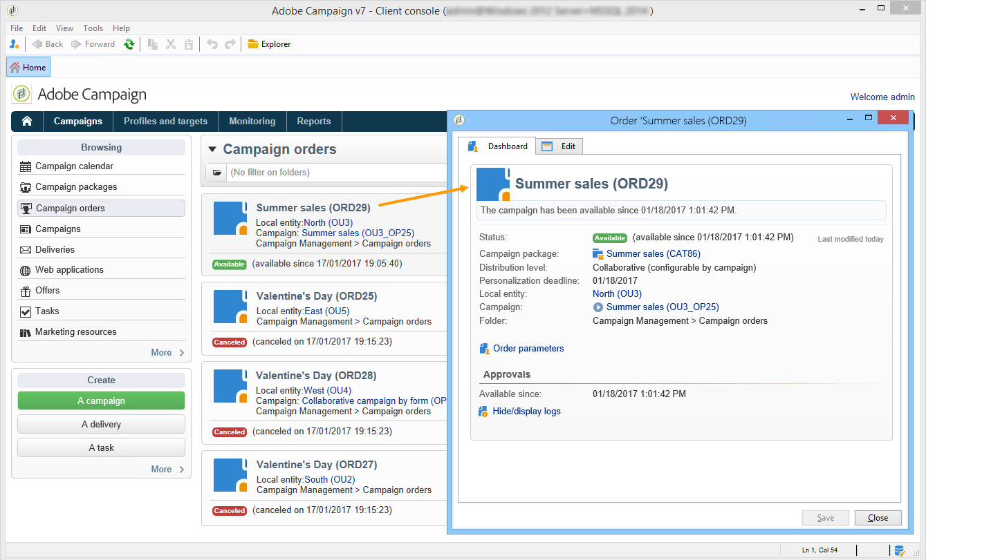

   L&#39;onglet **[!UICONTROL Edition > Général]** permet de consulter les informations renseignées par l&#39;entité locale lors de la commande de l&#39;opération.

   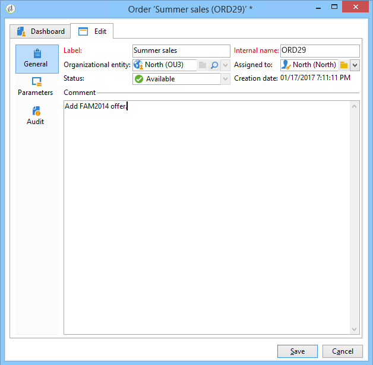

1. L’opérateur peut cliquer sur le libellé du kit de campagne pour l’éditer : il peut éventuellement modifier certains paramétrages.

   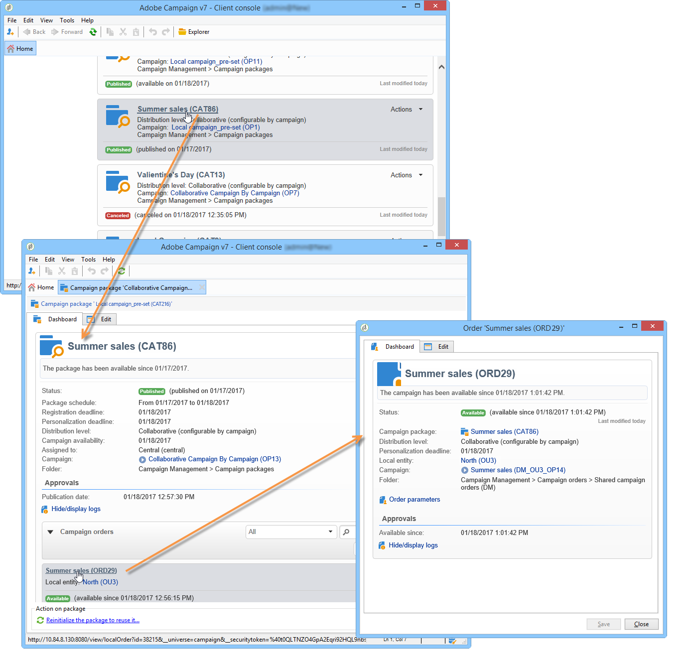

## Annuler un kit {#cancel-a-package}

À tout moment, l’entité centrale a la possibilité d’annuler un kit de campagne.

Pour cela, cliquez sur le bouton **[!UICONTROL Annuler]** à partir du **[!UICONTROL Tableau de bord]** du kit de campagne.

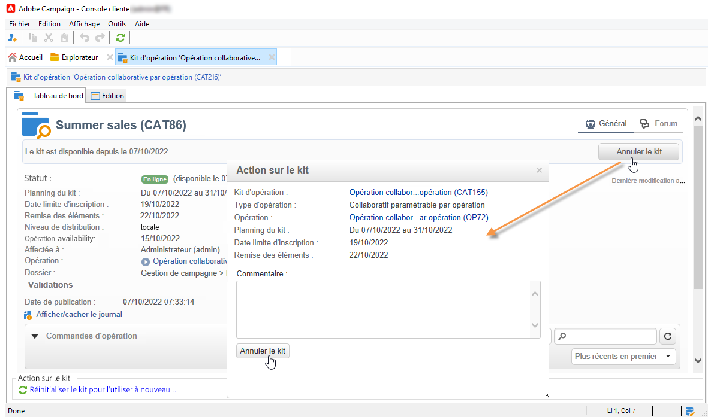

Vous avez la possibilité de motiver cette annulation dans le champ **[!UICONTROL Commentaire]**.

Pour les **opérations locales**, l&#39;annulation d&#39;un kit le supprime de la liste des opérations marketing disponibles.

Pour les **campagnes collaboratives**, l’annulation d’un kit d’opération provoque de nombreuses actions :

1. L&#39;annulation de toutes les commandes relatives à ce kit,

   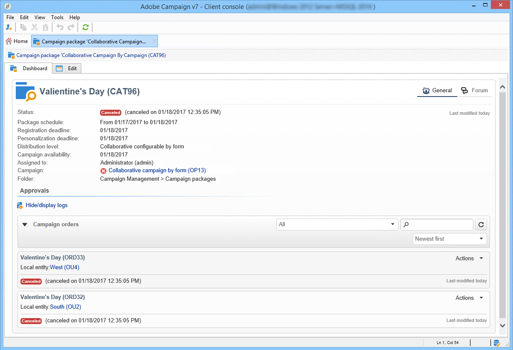

1. L&#39;annulation de l&#39;opération de référence et l&#39;arrêt de tous les traitements actifs (workflows, diffusions),

   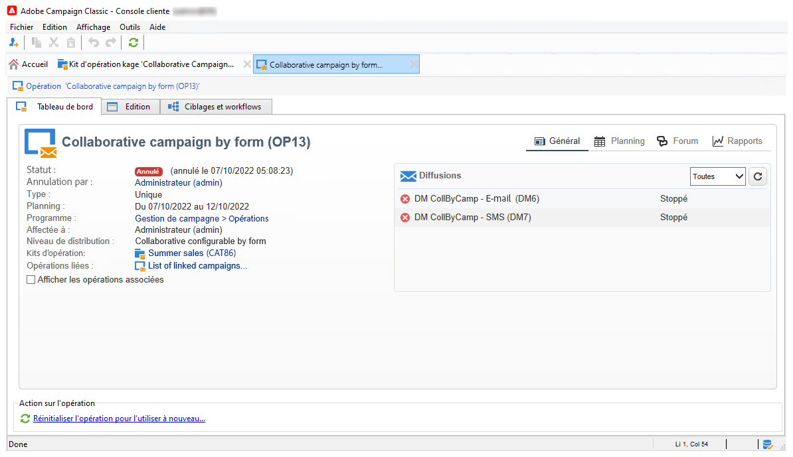

1. L&#39;envoi d&#39;une notification aux entités locales concernées.

   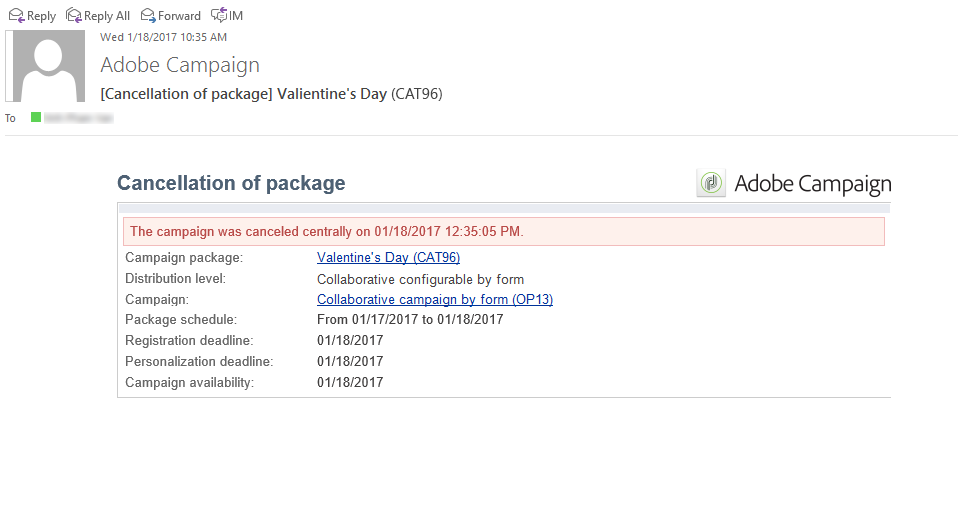

Les packages annulés restent accessibles et réinitialisables par l&#39;entité centrale (voir ci-dessous) si nécessaire. Ils ne seront proposés aux entités locales qu&#39;une fois approuvés et démarrés. Le processus de réinitialisation du package est illustré ci-dessous.

## Réinitialisation dʼun package {#reinitializing-a-package}

Vous pouvez réinitialiser un kit de campagne déjà publié afin de le modifier puis le mettre à nouveau à disposition des entités locales.

1. Pour cela, sélectionnez le kit concerné.
1. Cliquez sur le lien **[!UICONTROL Réinitialiser le kit pour l&#39;utiliser à nouveau]**, puis sur **[!UICONTROL OK]**.

   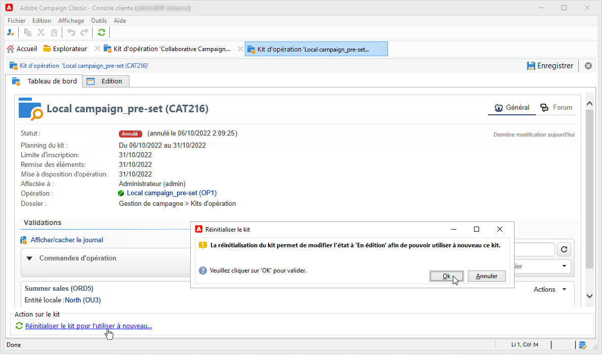

1. Cliquez sur le bouton **[!UICONTROL Enregistrer]** pour valider la réinitialisation du kit.

   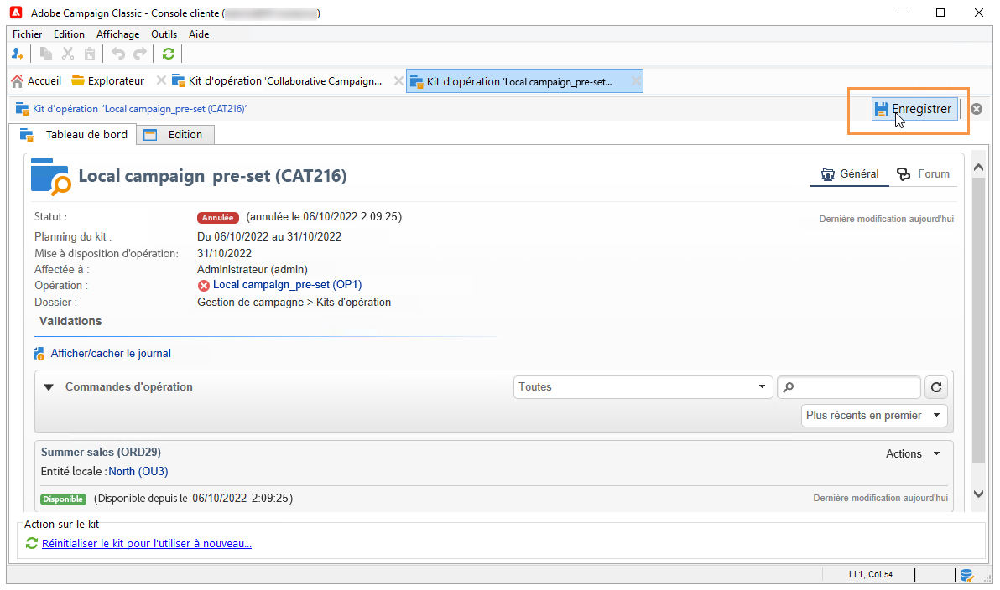

1. Le statut du package passe à **[!UICONTROL En édition]**. Modifiez, approuvez et publiez-le à nouveau pour le restaurer dans la liste du package de campagne.

>[!NOTE]
>
>Vous pouvez également réinitialiser un kit de campagne qui a été annulé.
