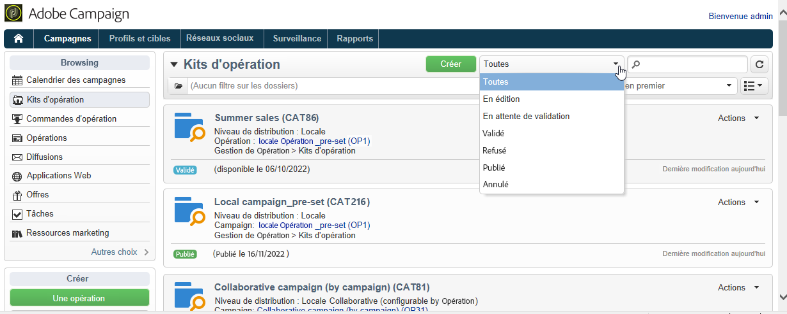

# Suivi d’une campagne{#tracking-a-campaign}

Les opérateurs de l&#39;entité centrale peuvent effectuer un tracking des commandes des opérations proposées dans la liste des kits d&#39;opération.

Ils peuvent ainsi :

* [Filtrer les kits](#filter-packages),
* [Modifier les packages](#edit-packages),
* [Annuler un kit](#cancel-a-package),
* [Réinitialisation dʼun package](#reinitializing-a-package).

## Filtrer les kits {#filter-packages}

Dans l’onglet **[!UICONTROL Campagnes]**, vous pouvez afficher la liste des **[!UICONTROL Kits de campagne]** qui regroupe toutes les campagnes de marketing distribué existantes. Vous pouvez filtrer cette liste pour faire en sorte qu’elle n’affiche que les campagnes publiées, en retard, en attente de validation, etc. Pour ce faire, cliquez sur les liens dans la section supérieure de cette vue ou utilisez le lien **[!UICONTROL Filtrer la liste]** et sélectionnez l’état du kit de campagne à afficher.

## Modifier les packages {#edit-packages}

La page des **[!UICONTROL Kits d&#39;opération]** permet de visualiser le résumé de chaque kit.

Ce résumé affiche les informations suivantes : le libellé, le type d&#39;opération, le nom de l&#39;opération à partir de laquelle le kit a été créé et le dossier d&#39;enregistrement.

Cliquez sur le nom du kit pour l&#39;éditer. Vous pourrez alors visualiser les commandes réalisées par les entités locales et leur état.

Cette information est proposée aussi dans la vue **[!UICONTROL Commandes d&#39;opérations]** qui liste unitairement toutes les commandes réalisées.

L&#39;opérateur central peut éditer la commande. Pour cela, il dispose de deux modes :

1. L’opérateur peut cliquer sur le nom de la commande pour l’éditer : il accède alors aux détails de celle-ci.

   

   L&#39;onglet **[!UICONTROL Edition > Général]** permet de consulter les informations renseignées par l&#39;entité locale lors de la commande de l&#39;opération.

   

1. L&#39;opérateur peut cliquer sur le libellé du kit d&#39;opération pour l&#39;éditer : il peut éventuellement modifier certains paramétrages.

   

## Annuler un kit {#cancel-a-package}

A tout moment, l&#39;entité centrale a la possibilité d&#39;annuler un kit d&#39;opération.

Pour cela, cliquez sur le bouton **[!UICONTROL Annuler]** à partir du **[!UICONTROL Tableau de bord]** du kit d&#39;opération.

Vous avez la possibilité de motiver cette annulation dans le champ **[!UICONTROL Commentaire]**.

Pour les **opérations locales**, l&#39;annulation d&#39;un kit le supprime de la liste des opérations marketing disponibles.

Pour les **opérations collaboratives**, l&#39;annulation d&#39;un kit d&#39;opération provoque :

1. L&#39;annulation de toutes les commandes relatives à ce kit,

   

1. L&#39;annulation de l&#39;opération de référence et l&#39;arrêt de tous les traitements en cours (workflows, diffusions),

   

1. L&#39;envoi d&#39;une notification aux entités locales concernées.

   

Une fois annulée, l&#39;entité centrale peut toujours accéder au kit et éventuellement le réinitialiser, au besoin. Il ne sera à nouveau proposée aux entités locales que lorsqu&#39;il sera validé et démarré. Le processus de réinitialisation d&#39;un kit d&#39;opération est présenté ci-après.

## Réinitialisation dʼun package {#reinitializing-a-package}

Vous pouvez réinitialiser un kit d&#39;opération déjà publié afin de le modifier puis le mettre à nouveau à disposition des entités locales.

1. Pour cela, sélectionnez le kit concerné.
1. Cliquez sur le lien **[!UICONTROL Réinitialiser le kit pour l&#39;utiliser à nouveau]**, puis sur **[!UICONTROL OK]**.

   

1. Cliquez sur le bouton **[!UICONTROL Enregistrer]** pour valider la réinitialisation du kit.

   

1. Le kit prend le statut **[!UICONTROL En édition]**. Il peut alors être modifié puis validé et publié pour être à nouveau proposé dans la liste des kits d&#39;opération.

>[!NOTE]
>
>Vous pouvez également réinitialiser un kit d&#39;opération qui a été annulé.
