# Contrôle des coûts{#controlling-costs}

Adobe Campaign permet de contrôler les coûts marketing planifiés, engagés et facturés, et de les ventiler par catégories à l’aide du module Marketing Resource Management.

Les coûts engagés pour les différents traitements d&#39;une opération sont imputés sur un budget préalablement défini par le service marketing. Les montants peuvent être répartis en plusieurs catégories afin de rendre les informations plus lisibles et de fournir des rapports plus détaillés sur les investissements marketing.

La gestion et le tracking des budgets sont centralisés dans un nœud dédié de l&#39;arborescence d&#39;Adobe Campaign. Vous pouvez ainsi suivre les montants alloués, réservés, engagés et dépensés à partir de la même vue et pour tous les budgets.

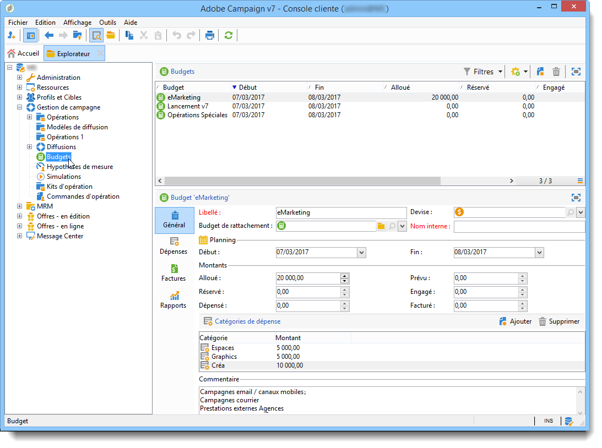

Les étapes de mise en oeuvre de la gestion des budgets avec MRM sont les suivantes :

1. Définissez le budget. [En savoir plus](#creating-a-budget).

1. Définissez la méthode de calcul des coûts : les structures de coûts sont définies pour les prestataires. [En savoir plus](../campaigns/providers-stocks-and-budgets.md).

1. Définissez les coûts de la campagne (diffusions/tâches) : les coûts engendrés par les diffusions et les tâches sont renseignés unitairement ou globalement au niveau du modèle de campagne. [En savoir plus](../campaigns/marketing-campaign-deliveries.md#compute-costs-and-stocks).

1. Consolidez : en fonction du statut de réalisation des tâches, des diffusions et de la campagne, les coûts seront calculés et répercutés au niveau du budget correspondant. Lorsque la création de la campagne est suffisamment avancée, le statut de progression du budget de la campagne peut être modifié en **[!UICONTROL Spécifié]**. Le coût calculé du programme est alors automatiquement renseigné avec les coûts calculés sur la campagne. [En savoir plus](#cost-commitment--calculation-and-charging).

## Créer un budget {#creating-a-budget}

Pour établir un budget, procédez comme suit :

1. Accédez au dossier **[!UICONTROL Gestion de campagne > Budgets]** de l’explorateur Campaign.
1. Cliquez sur l&#39;icône **[!UICONTROL Nouveau]**, nommez et enregistrez le budget.
1. Saisissez le montant initial : indiquez le montant alloué dans le champ correspondant. Les autres montants sont renseignés automatiquement. [En savoir plus](#calculating-amounts).
1. Définissez la période de validité en indiquant les dates de début et de fin. Ces informations sont purement indicatives.
1. Créez les catégories de dépenses auxquelles pourront être rattachés les coûts affectés à ce budget au niveau des opérations, diffusions, tâches, etc. [En savoir plus](#expense-categories).

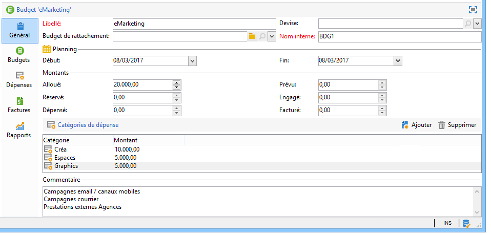

>[!NOTE]
>
>Vous pouvez sélectionner un budget de rattachement. Pour plus d’informations, consultez [cette section](#linking-a-budget-to-another).
>

### Calculer les montants {#calculating-amounts}

Chaque budget est défini par un montant initial qui sera décrémenté des coûts des différentes campagnes, diffusions ou tâches qui leur sont attachées après leur planification ou exécution. Le statut des montants (planifiés, réservés, engagés, dépensés ou facturés) dépend du type de coût et du niveau d&#39;engagement définis dans la campagne, la diffusion ou la tâche.

>[!NOTE]
>
>Les montants renseignés au niveau des catégories doivent correspondre à l&#39;enveloppe budgétaire définie dans le champ **[!UICONTROL Alloué]**.

Au niveau des opérations, selon le niveau d&#39;engagement, un coût peut être prévu, engagé ou réservé pour une action à venir.

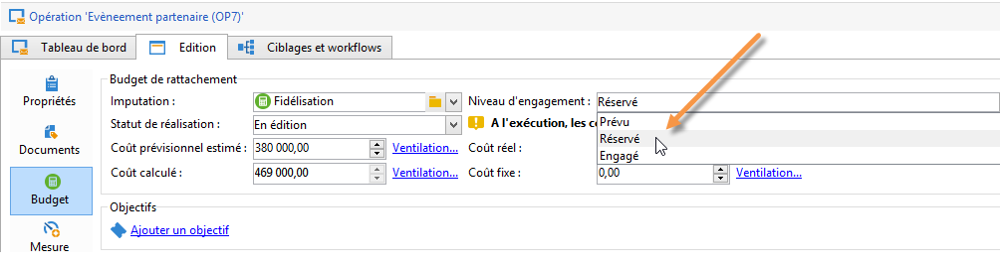

>[!CAUTION]
>
>Lors de la création d’une campagne, le statut de la progression dans **[!UICONTROL Budget]** doit être défini sur **[!UICONTROL Défini]** pour la prise en compte des coûts d’exécution. Si le statut est **[!UICONTROL En cours d’édition]**, les coûts ne seront pas consolidés.
>   
>L’option **[!UICONTROL niveau d’engagement]** représente une projection des coûts pour l’avenir avant qu’ils ne soient imputés au budget. En fonction de l&#39;avancement d&#39;une campagne, d&#39;une tâche ou d&#39;une diffusion, vous pouvez décider d&#39;attribuer un niveau d&#39;engagement supérieur ou inférieur (1. Prévu, 2. Réservé, 3. Engagé) à l&#39;aide de la zone de liste déroulante.

Par exemple, le coût prévisionnel estimé d’une opération web est de 45 000 euros.

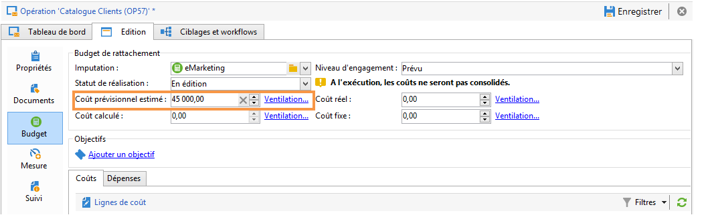

Au niveau de l&#39;opération, lorsque le statut de réalisation du budget est positionné à **[!UICONTROL Renseigné]**, le coût réel de l&#39;opération (ou, à défaut, le coût calculé) sera reporté dans les montants du budget.

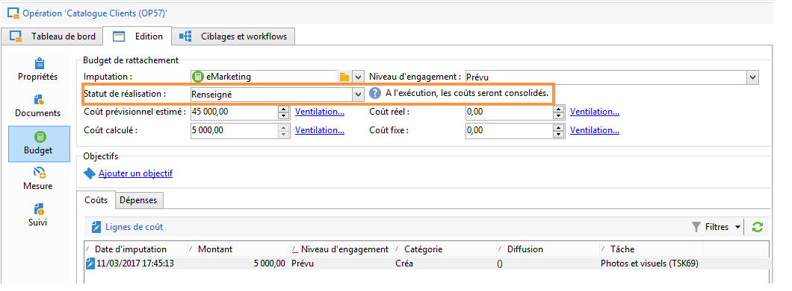

Selon le niveau d&#39;engagement du budget de l&#39;opération, le montant sera reporté dans le champ **[!UICONTROL Prévu]**, **[!UICONTROL Réservé]** ou **[!UICONTROL Engagé]**.

Le niveau d&#39;engagement peut être modifié:

* au niveau de la **campagne**, dans la fenêtre **[!UICONTROL Budget]**, accessible dans l&#39;onglet **[!UICONTROL Modifier]**. C&#39;est là que sont configurés les budgets, les coûts et les dépenses.
* au niveau des **tâches**, dans la fenêtre **[!UICONTROL Dépenses et revenus]**.

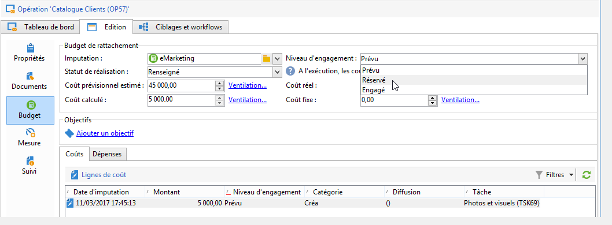

Lorsque le budget est **[!UICONTROL Réservé]**, la mise à jour est faite automatiquement au niveau du budget imputé.

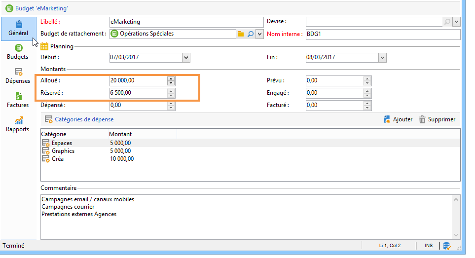

Le fonctionnement est le même au niveau des tâches.

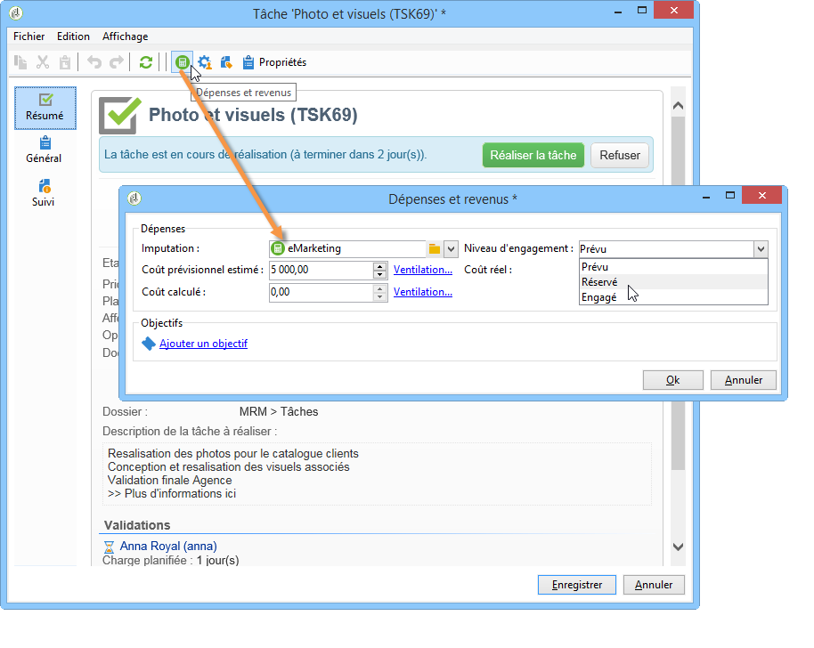

Lorsqu&#39;une dépense fait l&#39;objet d&#39;une facture et que la facture est soldée, son montant est alors reporté dans le champ **[!UICONTROL Facturé]**.

### Catégories de dépense {#expense-categories}

Les montants peuvent être répartis en plusieurs catégories de dépenses, afin de permettre une meilleure lisibilité des données et un reporting plus fin des investissements marketing. Les catégories de dépenses sont définies lors de la création du budget, à l’aide du nœud **[!UICONTROL Budgets]** de l’arborescence.

Pour ajouter une catégorie, cliquez sur le bouton **[!UICONTROL Ajouter]** dans la section inférieure de la fenêtre.

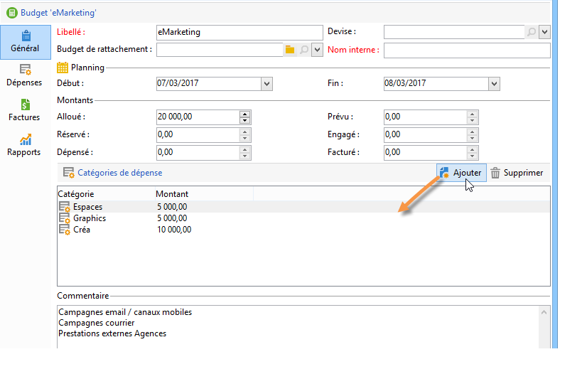

Vous pouvez sélectionner une catégorie parmi celles qui existent déjà ou définir une nouvelle catégorie en la saisissant directement dans le champ. Lorsque vous confirmez votre saisie, un message de confirmation vous permet d’ajouter cette catégorie à la liste des catégories existantes et de l’associer à une Nature si nécessaire. Ces informations seront utilisées dans les rapports budgétaires.

### Rattacher un budget à un autre {#linking-a-budget-to-another}

Vous pouvez rattacher un budget à un budget principal. Pour cela, sélectionnez le budget principal dans le champ **[!UICONTROL budget associé]** des budgets secondaires.

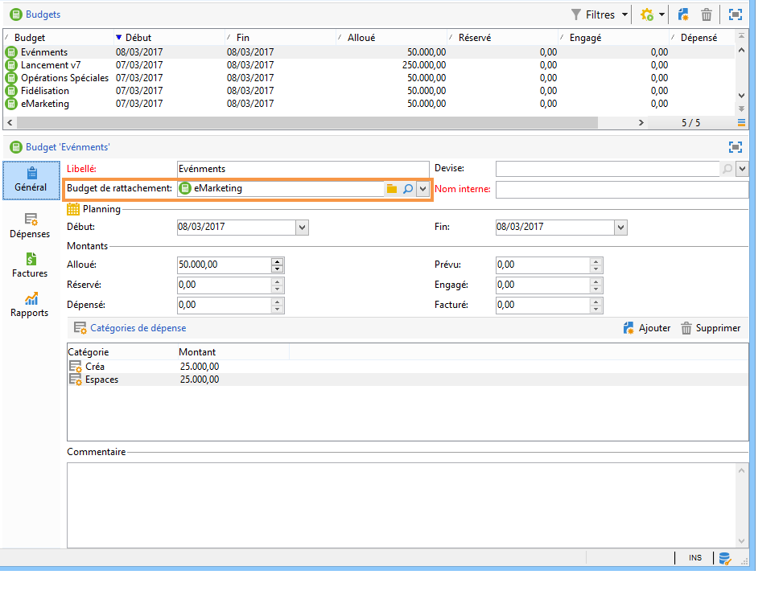

Un onglet supplémentaire sera ajouté au budget principal afin d&#39;afficher la liste des budgets rattachés.

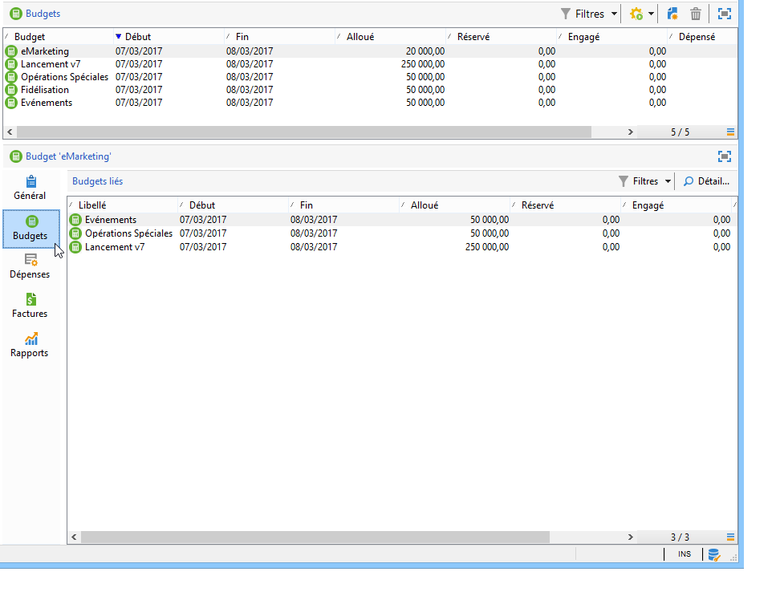

Ces informations sont remontées au niveau des rapports sur les budgets.

## Ajouter des lignes de dépenses {#adding-expense-lines}

Les lignes de dépense sont automatiquement ajoutées au budget. Elles sont créées lors de l’analyse de la diffusion et lorsqu’une tâche est terminée.

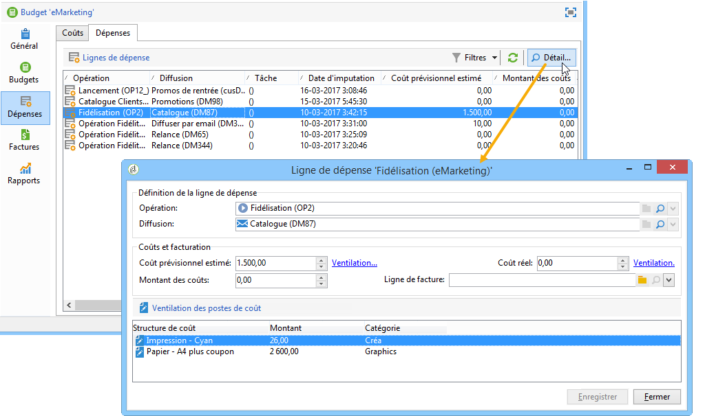

Pour chaque campagne, diffusion ou tâche, les coûts générés sont regroupés dans les lignes de dépenses du budget sur lequel ils sont imputés. Ces lignes de dépenses sont créées en fonction des lignes de coûts du prestataire concerné et calculées via les structures de coûts associées.

Ainsi, chaque ligne de dépense contient les informations suivantes :

* L&#39;opération et la diffusion ou la tâche auxquelles elle est rattachée
* Le montant calculé à partir des structures de coût ou du coût prévisionnel estimé
* Le coût réel de la diffusion ou de la tâche concernée
* La ligne de facture correspondante (MRM seulement)
* La liste des coûts calculés par postes de coûts (si une structure de coûts existe)

Dans l’exemple ci-dessus, la ligne de dépense modifiée contient les coûts calculés pour la diffusion des **nouvelles cartes** de la campagne **Loyalty Spring Pack**. Lorsque la diffusion est éditée, l’onglet **[!UICONTROL Courrier]** permet de visualiser le mode de calcul de la ligne de dépense.

Le calcul des coûts pour cette diffusion se base sur les postes de coûts sélectionnés pour le prestataire concerné :

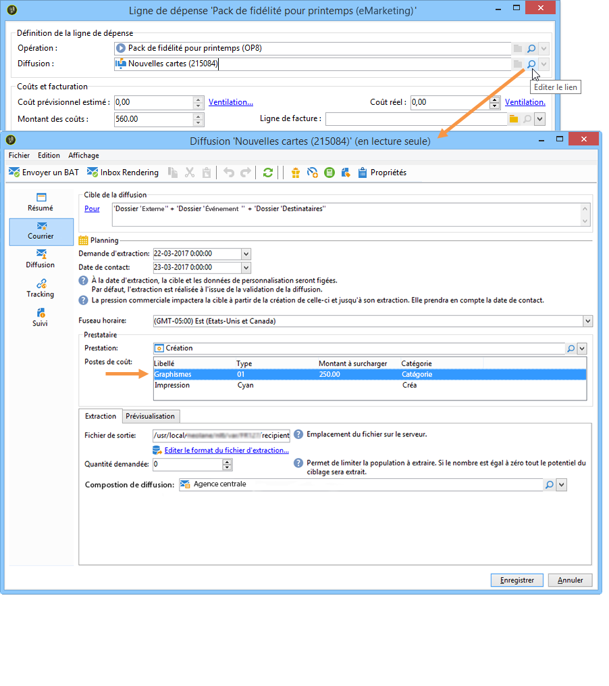

En fonction des postes de coûts sélectionnés, les structures de coûts correspondantes sont appliquées afin de calculer les lignes de coûts. Dans cet exemple, pour le prestataire concerné, les structures de coûts sont les suivantes :

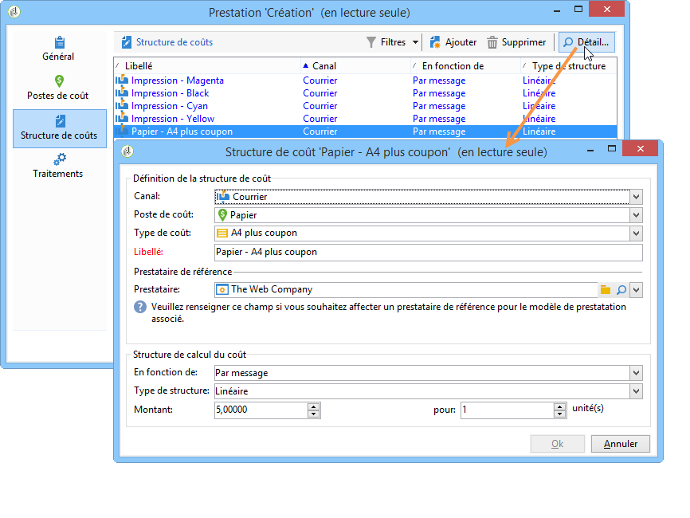

>[!NOTE]
>
>Les postes et structures de coûts sont présentés sur [cette page](../campaigns/providers-stocks-and-budgets.md#create-a-service-provider-and-its-cost-categories).

## Engagement, calcul et imputation des coûts {#cost-commitment--calculation-and-charging}

Les coûts peuvent être engagés au niveau des diffusions et des tâches. En fonction de l’avancement du processus auquel il est associé, le statut d’un coût est mis à jour.

### Processus de calcul des coûts {#cost-calculation-process}

Les coûts sont répartis en 3 catégories :

1. Coût prévisionnel estimé

   Le coût prévisionnel estimé est une estimation des coûts des processus de la campagne. Tant qu&#39;il est édité, les montants entrés ne sont pas consolidés. Il doit avoir le statut **[!UICONTROL Spécifié]** des montants saisis à prendre en compte dans les calculs.

   Ce montant est saisi manuellement et peut être réparti en plusieurs catégories de dépenses. Pour répartir un coût, cliquez sur le lien **[!UICONTROL Répartition...]**, puis sur le bouton **[!UICONTROL Ajouter]** pour définir un nouveau montant.

   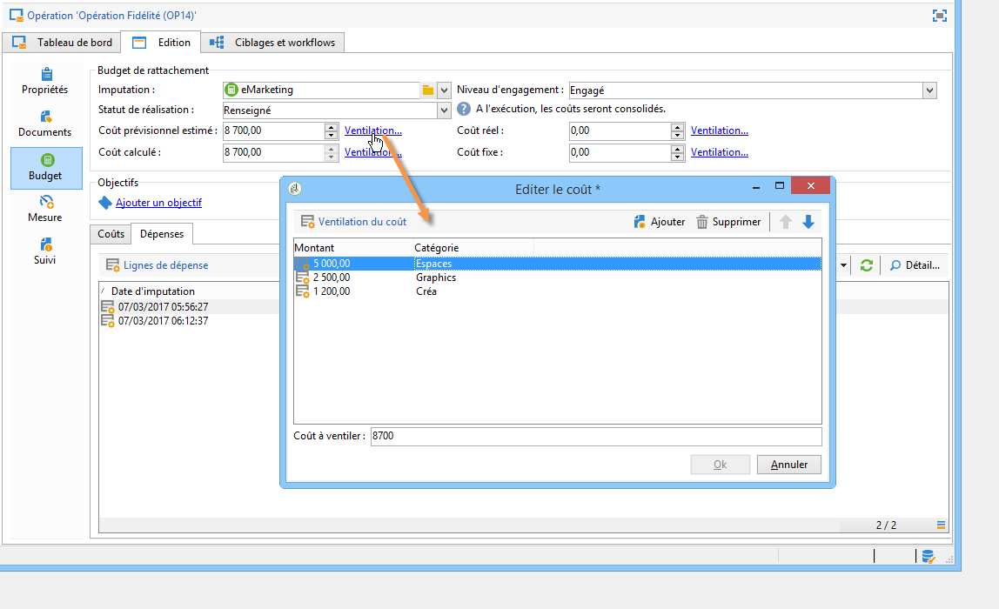

   Vous pouvez associer chaque coût à une catégorie, afin de visualiser par la suite la répartition des coûts par catégories de dépenses dans le budget de rattachement et dans les rapports sur les budgets.

1. Coût calculé

   Le coût calculé dépend de l&#39;élément concerné (opération, diffusion, tâche, etc.) et son statut (en édition, en cours, terminé). Dans tous les cas, si le coût réel est spécifié, le coût calculé utilisera ce montant.

   Si le coût réel n&#39;est pas renseigné, les règles sont les suivantes :

   * Pour une campagne en édition, le coût calculé est le coût prévisionnel estimé de la campagne ou, si ce coût n&#39;est pas défini, le coût calculé sera la somme de tous les coûts prévisionnels des diffusions et des tâches de la campagne. Si la campagne est terminée, le coût calculé de la campagne sera la somme de tous les coûts calculés.
   * Pour une diffusion qui n&#39;a pas encore été analysée, le coût calculé est le coût prévisionnel estimé. Si l’analyse a déjà été réalisée, le coût calculé sera la somme de tous les coûts calculés à partir des structures de coûts du prestataire et du nombre de destinataires ciblés.
   * Pour une tâche en cours, le coût calculé utilise le coût prévisionnel estimé. Si la tâche est terminée, le coût calculé sera la somme de tous les coûts calculés à partir des structures de coûts du fournisseur et du nombre de jours effectués.
   * Pour le plan marketing, comme pour le programme, le coût calculé est la somme des coûts calculés pour les campagnes. Si ces coûts ne sont pas spécifiés, le coût calculé utilisera les coûts prévisionnels estimés.

   >[!NOTE]
   >
   >Le lien **[!UICONTROL Répartition]** permet de visualiser les détails du calcul, ainsi que la date du dernier calcul des coûts.

1. Coût réel

   Le coût réel est saisi manuellement, et éventuellement ventilé entre différentes catégories de dépenses.

### Calcul et imputation {#calculation-and-charging}

Les coûts sont calculés via les structures de coûts et imputés aux budgets sélectionnés au niveau des opérations, des diffusions ou des tâches concernées.

Un contrôle peut être effectué sur les montants engagés dans les campagnes via la validation du budget. D’autres tâches de type point de contrôle peuvent être créées dans une campagne afin de configurer d’autres validations. Pour plus d&#39;informations, consultez la section [Types de tâches](creating-and-managing-tasks.md#types-of-task).

### Exemple {#example}

Nous allons créer une opération avec :

* Une diffusion courrier utilisant les structures de coûts d&#39;un prestataire
* Une tâche avec un coût fixe
* Une tâche avec un coût journalier

#### Étape 1 - Créer le budget {#step-1---creating-the-budget}

1. Créez un nouveau budget à partir du noeud **[!UICONTROL Gestion de campagnes > Budgets]**.

1. Définissez un budget de 10 000 euros dans le champ **[!UICONTROL Alloué]** de la section **[!UICONTROL Montants]**. Ajoutez deux catégories de dépenses dans la section inférieure de la fenêtre :

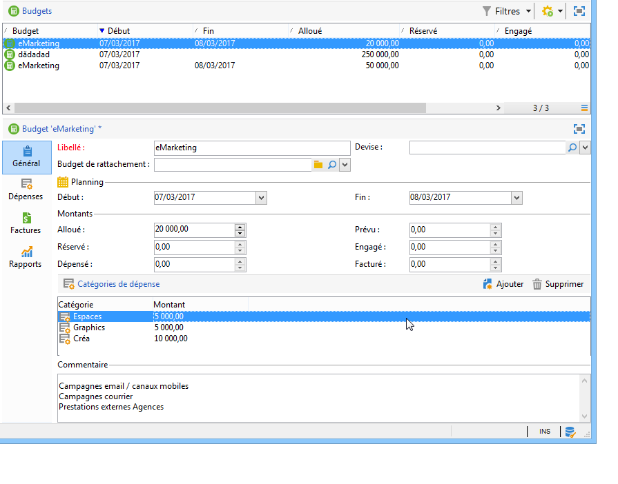

#### Étape 2 - Configurer le prestataire et définir les structures de coûts {#step-2---configuring-the-service-provider-and-defining-the-cost-structures}

1. Créez un prestataire et un modèle de prestation avec sa structure de coûts associée à partir du nœud **[!UICONTROL Administration > Campagnes.]** Pour plus d’informations, consultez [cette section](../campaigns/providers-stocks-and-budgets.md#create-a-service-provider-and-its-cost-categories).

   Pour les diffusions courrier, créez des postes de coûts **[!UICONTROL Enveloppes]** (types 114x229 et 162x229), **[!UICONTROL Affranchissement]** et **[!UICONTROL Impression]** (types A3 et A4). Créez ensuite les structures de coûts suivantes :

   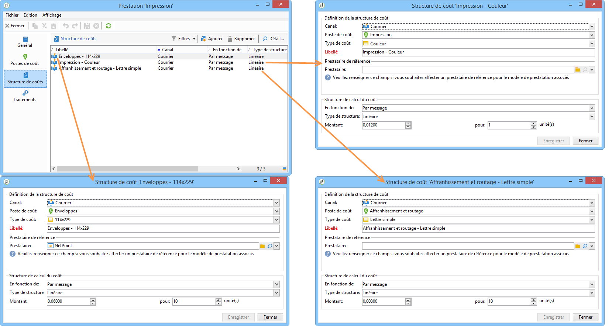

1. Ajoutez un coût fixe (dans les postes de coûts), dont le calcul est fixe et le montant est vide (dans la structure de coût correspondante), et qui sera renseigné unitairement pour chaque diffusion.

   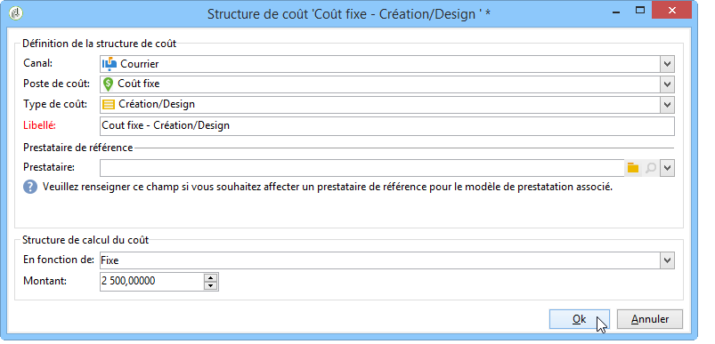

   Pour les tâches, créez les deux postes de coût suivants :

   * **[!UICONTROL Réservation Salle]** (types Petite Salle et Grande Salle), avec une structure de coût **fixe** d&#39;un montant de 300 et 500 euros :

   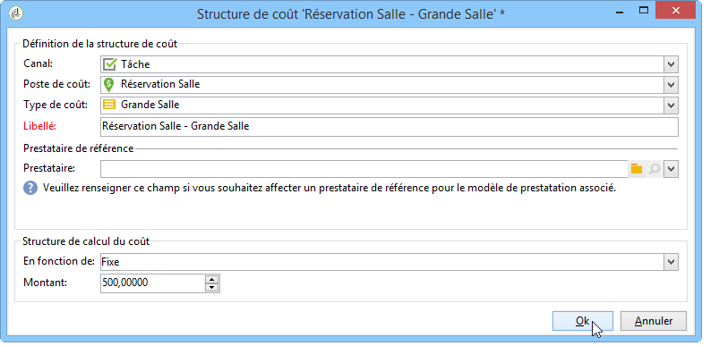

   * **[!UICONTROL Création]** (type **Modèle de contenu**), avec une structure de coûts **journalière** d&#39;un montant de 300 euros :

   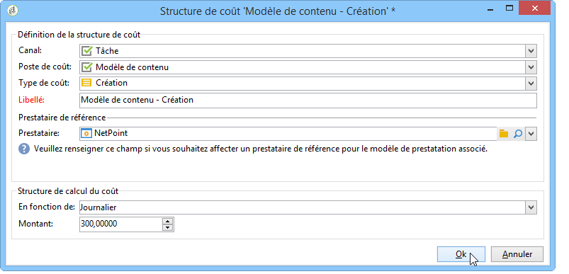

#### Étape 3 - Imputer le budget dans l&#39;opération {#step-3---charging-the-budget-in-the-campaign}

1. Créez une opération et sélectionnez le budget créé lors de l&#39;étape 1.

   >[!NOTE]
   >
   >Par défaut, le budget qui a été sélectionné au niveau du programme est appliqué à toutes les opérations du programme.

   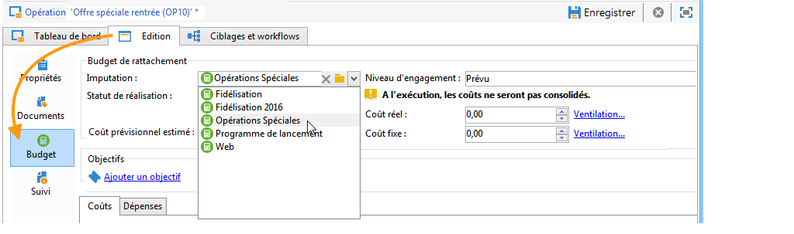

1. Indiquez le coût prévisionnel estimé, avec répartition :

   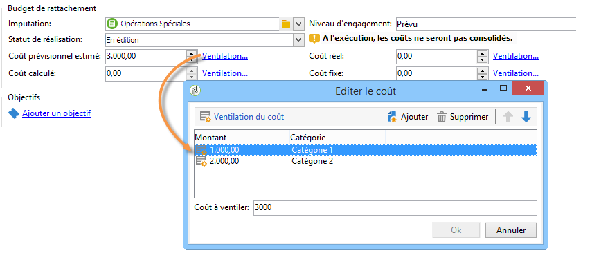

1. Cliquez sur **[!UICONTROL Ok]** puis **[!UICONTROL Enregistrer]** pour confirmer ces informations. Le coût calculé de la campagne est ensuite mis à jour avec le coût prévisionnel estimé.

#### Étape 4 - Créer la diffusion courrier {#step-4---creating-the-direct-mail-delivery}

1. Créez un workflow au niveau de l&#39;opération et positionnez les activités de requête afin de sélectionner la cible (attention, l&#39;adresse postale des destinataires doit être renseignée).

1. Créez une diffusion Courrier et sélectionnez le prestataire créé à l&#39;étape 2 : les postes de coûts s&#39;affichent automatiquement.

1. Remplacez le coût des enveloppes et ajoutez un coût fixe. Sélectionnez également les catégories concernées par ces coûts.

   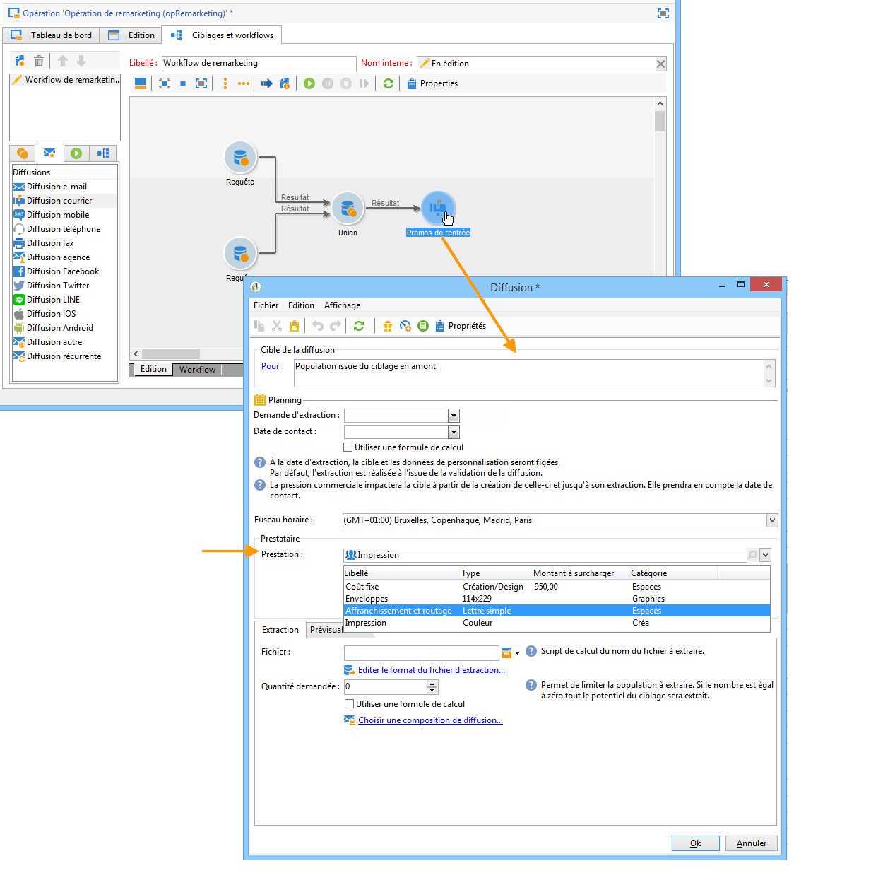

   >[!NOTE]
   >
   >Si l&#39;un des postes de coûts n&#39;est pas utilisé, il n&#39;engendrera aucune dépense.

1. Démarrez le workflow que vous venez de créer pour lancer l&#39;analyse et calculer les coûts.

   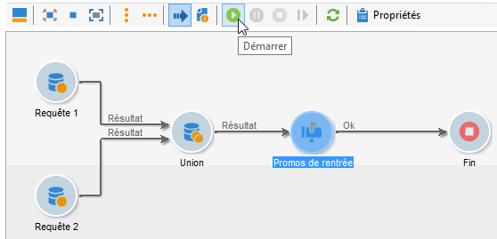

1. Si la validation du budget est activée pour cette campagne, validez le budget depuis le tableau de bord. Vous pouvez vérifier la validation des postes de coûts.

   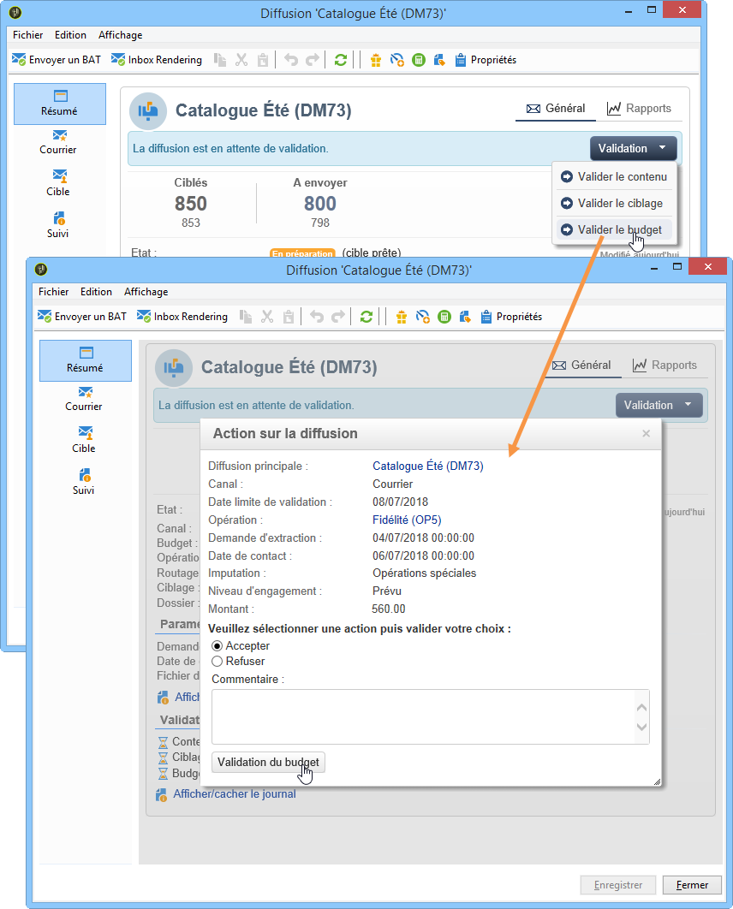

La ligne de dépense relative à la diffusion est ajoutée dans l&#39;onglet **[!UICONTROL Modifier > Budget]** de l&#39;opération. Modifiez-le pour afficher les détails du calcul.

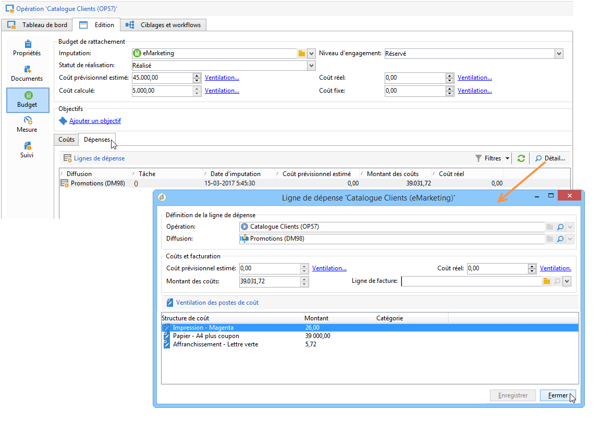

Au niveau de la diffusion, le coût calculé est mis à jour avec ces informations :

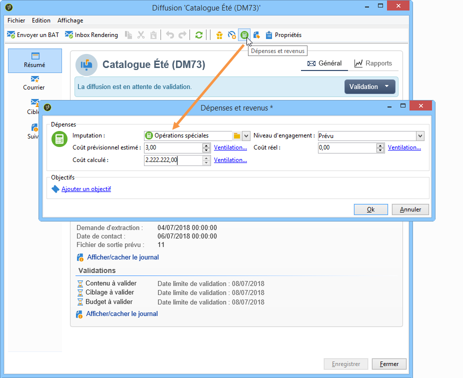

Lorsque vous éditez le coût calculé, vous pouvez vérifier la répartition des coûts ainsi que l’état et la date du calcul des coûts.

#### Étape 5 - Créer les tâches {#step-5---creating-tasks}

Nous ajouterons à cette campagne les deux tâches pour lesquelles les structures de coûts ont été [créées précédemment](#step-2---configuring-the-service-provider-and-defining-the-cost-structures).

Pour ce faire, dans le tableau de bord de la campagne, cliquez sur le bouton **[!UICONTROL Ajouter une tâche]**. Nommez la tâche et cliquez sur **[!UICONTROL Enregistrer]**.

1. La tâche est ensuite ajoutée à la liste des tâches. Vous devez le modifier pour le configurer.

1. Dans l&#39;onglet **[!UICONTROL Propriétés]**, sélectionnez la prestation et le poste de coût correspondant :

   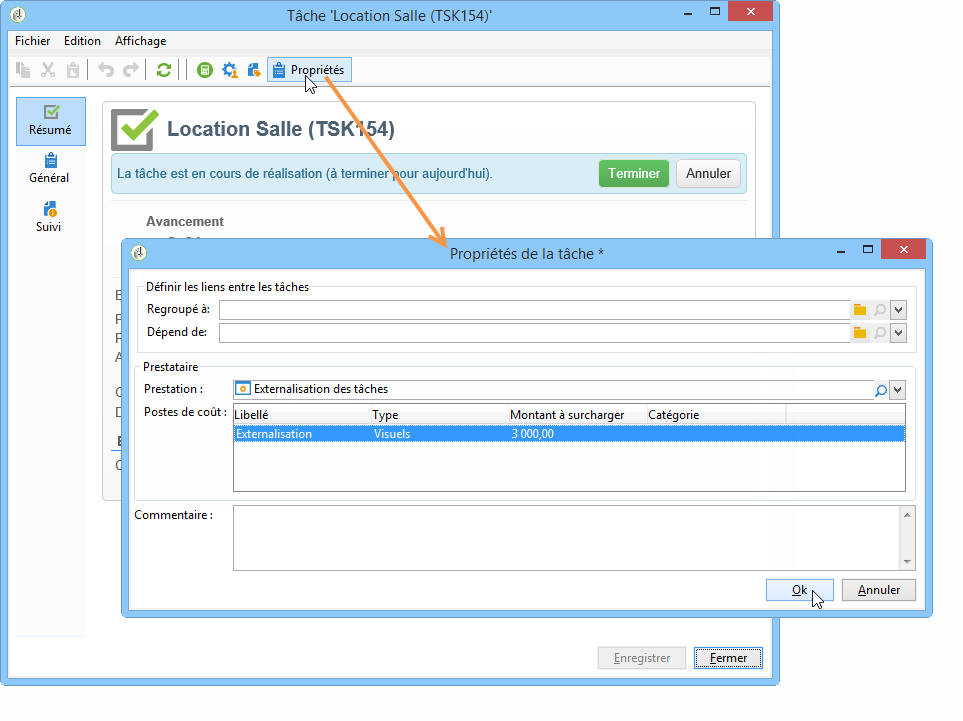

1. Cliquez ensuite sur l&#39;icône **[!UICONTROL Dépenses et revenus]** de la tâche et indiquez le coût prévisionnel estimé.

   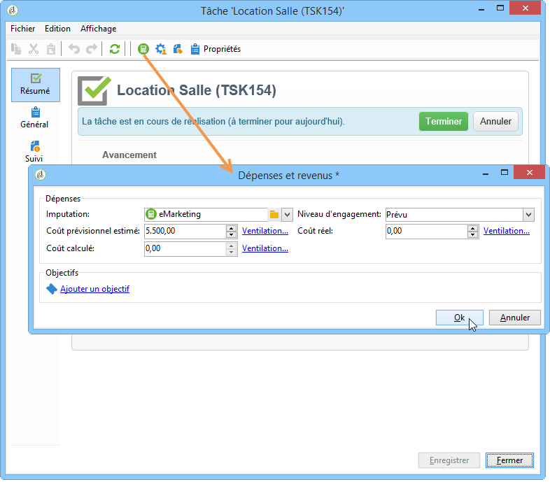

   Une fois la tâche enregistrée, le coût calculé est renseigné avec la valeur saisie pour le coût prévisionnel estimé.

   Lorsque la tâche est terminée (statut **[!UICONTROL Terminé]** ), le coût calculé est automatiquement mis à jour avec le coût de la grande salle tel qu&#39;il est entré dans sa structure de coûts. Ce coût apparaît également dans cette catégorie de la répartition.

1. Selon le même mode opératoire, créez ensuite une seconde tâche, planifiée sur 5 jours et associée à la structure de coûts créée précédemment.

   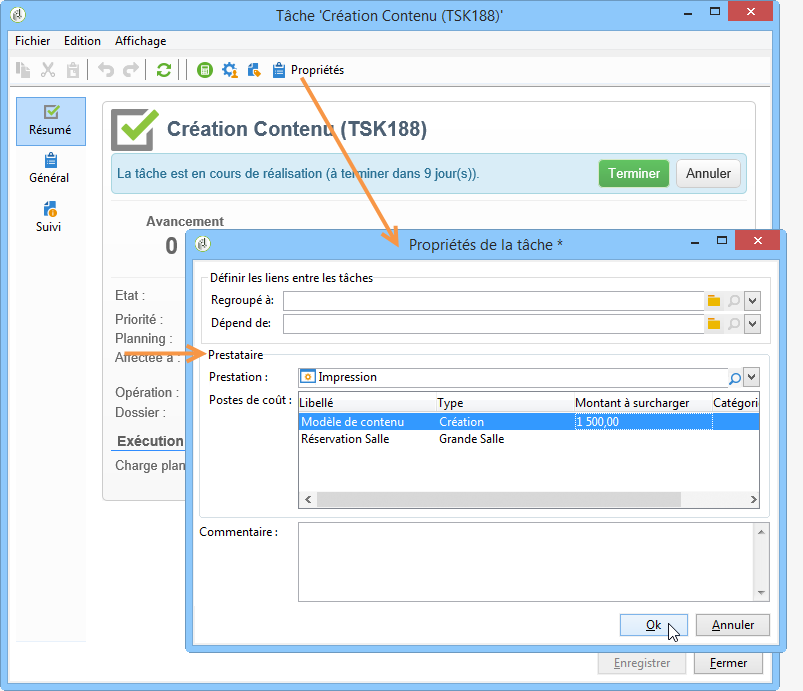

   Une fois la tâche terminée, le coût calculé est renseigné avec la valeur issue de la structure de coût associée, soit 1500 euros dans notre exemple (5 jours x 300 euros) :

   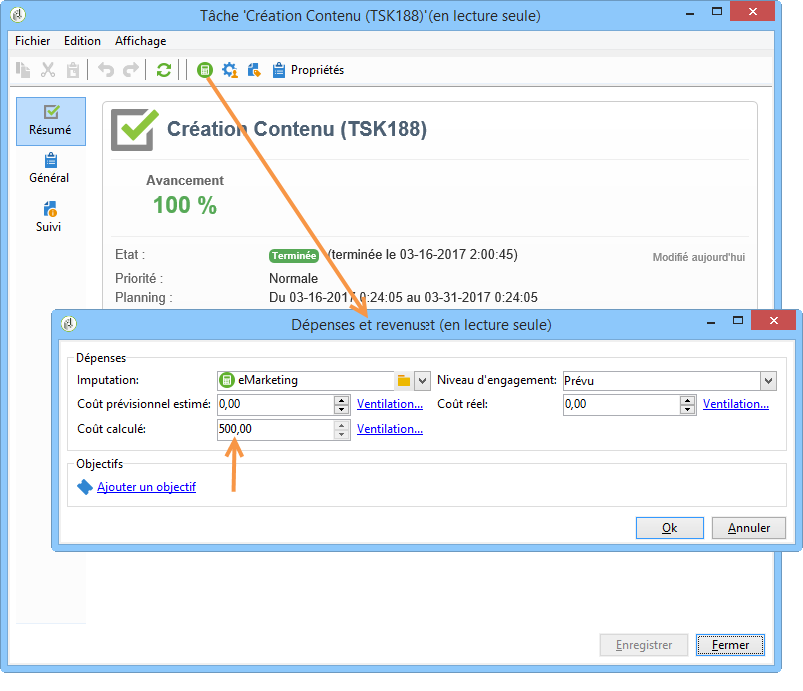

#### Etape 6 - Mettre à jour le statut du budget de l&#39;opération {#step-6---update-the-campaign-budget-status}

Lorsque la campagne est configurée, son statut peut être mis à jour en la définissant sur **[!UICONTROL Spécifié]**. Le coût calculé de l&#39;opération va alors indiquer la somme des coûts calculés de la diffusion et des tâches de l&#39;opération :

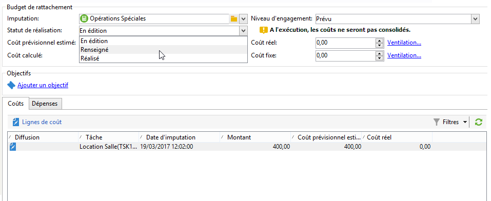

#### Validation du budget {#budget-approval}

Lorsque la validation est activée, un lien spécifique permet de valider le budget à partir du tableau de bord de la campagne. Ce lien s&#39;affiche lorsque le workflow de ciblage a été lancé et qu&#39;une diffusion courrier doit être validée.

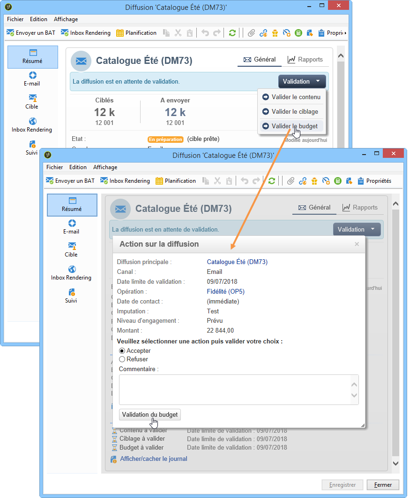

Vous pouvez alors cliquer sur le lien pour accorder ou refuser la validation, ou utiliser le lien contenu dans l’e-mail de notification, si la notification a été activée pour cette opération.

Une fois le budget validé et la diffusion terminée, les coûts sont téléchargés automatiquement via un workflow technique spécifique.

## Commandes et factures {#orders-and-invoices}

Dans le cadre de MRM, vous pouvez enregistrer des commandes auprès d&#39;un prestataire et émettre des factures. L&#39;ensemble du cycle de vie de ces commandes et factures peut être géré à partir de l&#39;interface d&#39;Adobe Campaign.

### Création de commande {#order-creation}

Pour enregistrer une nouvelle commande auprès d&#39;un prestataire, cliquez sur le noeud **[!UICONTROL MRM > Commandes]** de l&#39;arborescence, puis cliquez sur le bouton **[!UICONTROL Nouveau]**.

Indiquez le numéro de la commande, le prestataire concerné et le montant total de la commande.

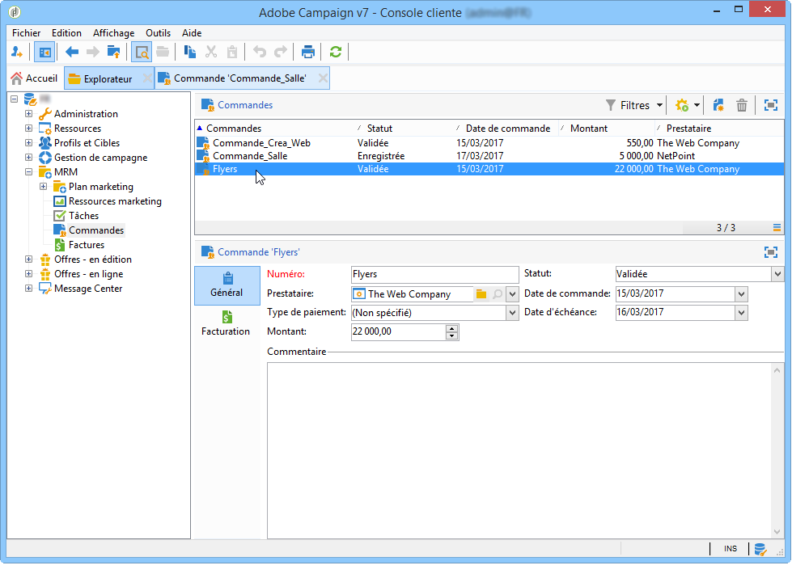

### Émettre et suivre des factures {#issuing-and-tracking-invoices}

Pour chaque prestataire, vous pouvez enregistrer des factures et définir leur statut et le budget imputé.

Les factures sont créées et stockées dans le noeud **[!UICONTROL MRM > Factures]** de l&#39;arborescence d&#39;Adobe Campaign.

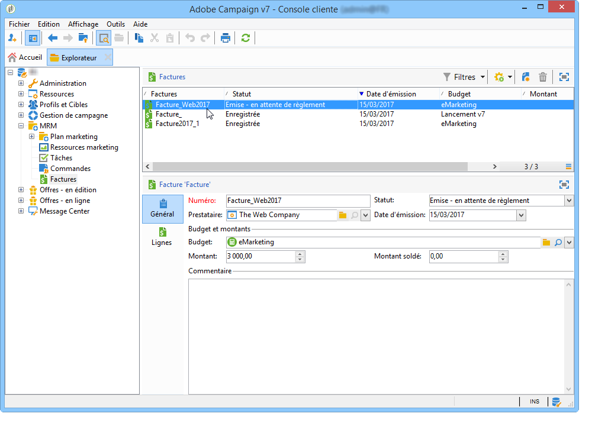

Une facture est composée de lignes dont le total permet de calculer automatiquement le montant. Ces lignes sont créées manuellement à partir de l’onglet **[!UICONTROL Lignes de facture]**. Elles peuvent être associées à une commande, afin de charger les informations vers les commandes.

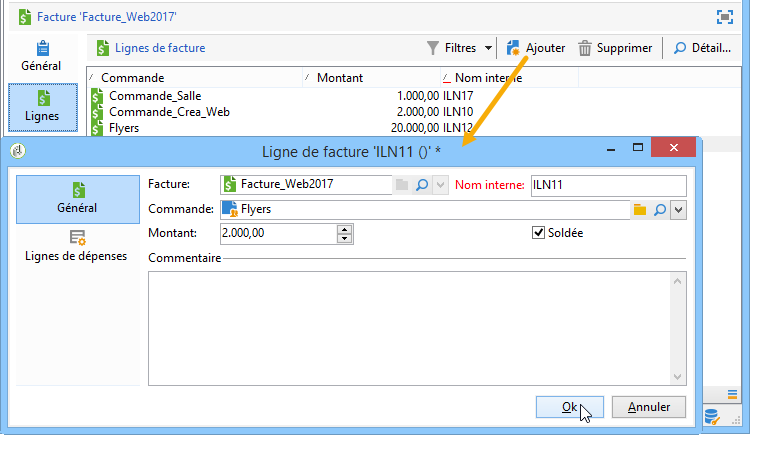

Les factures de chaque prestataire sont affichées dans l&#39;onglet **[!UICONTROL Factures]** de son profil :

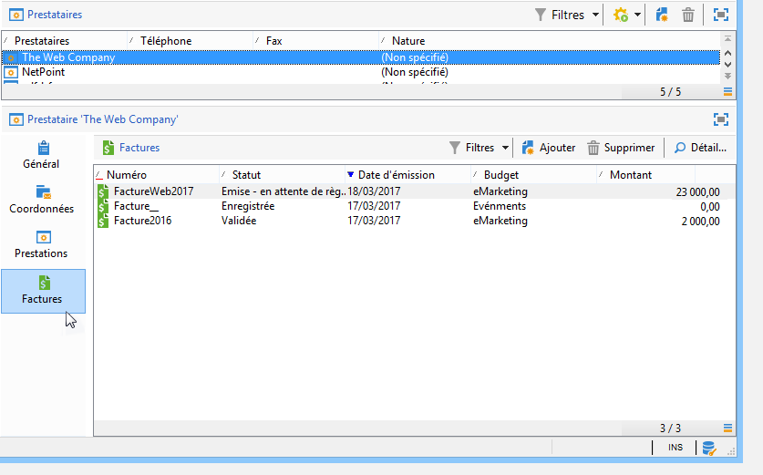

L&#39;onglet **[!UICONTROL Détails]** permet d&#39;afficher le contenu de la facture.

Cliquez sur **[!UICONTROL Ajouter]** pour créer une nouvelle facture.
