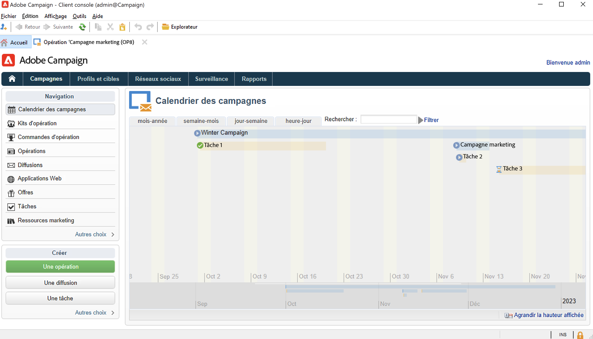
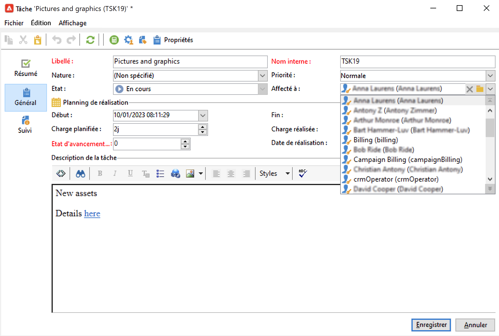
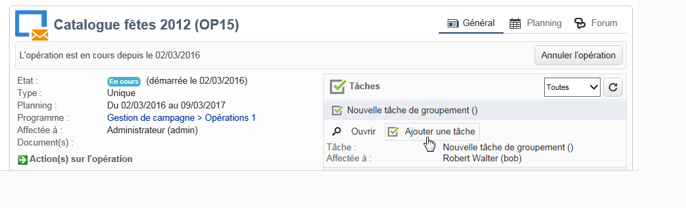

# Création et gestion de tâches{#creating-and-managing-tasks}

Adobe Campaign permet de créer des tâches et de gérer leur cycle de vie complet directement au sein de l&#39;application. La mise en œuvre des programmes et des opérations peut être découpée en tâches qui sont assignées à des opérateurs Adobe Campaign ou à des prestataires externes. Ce mode de fonctionnement permet de créer un environnement de collaboration ouvert incluant tous les participants au programme et les intervenants externes.

Les tâches peuvent être créées, visualisées et suivies au niveau de liste des tâches et du tableau de bord d&#39;une opération. Elles peuvent également être visualisées et suivies au niveau des plannings du plan marketing, des programmes et des opérations.

Les tâches sont attachées à des opérations, et peuvent avoir des dépendances, c&#39;est-à-dire des tâches associées. Chaque tâche a un statut, une priorité, une charge estimée et des coûts associés.

Toutes les tâches sont regroupées dans une liste accessible à partir de l&#39;onglet **Campagnes**. Pour plus d&#39;informations, consultez la section [Accéder aux tâches](#accessing-tasks).

Elles peuvent être affichées dans le planning du programme auquel elles appartiennent.

## Accéder aux tâches {#accessing-tasks}

### Afficher les tâches {#displaying-tasks}

Les tâches sont affichées dans la liste des tâches accessible à partir de l&#39;onglet **[!UICONTROL Campagnes]**.

Vous pouvez visualiser toutes les tâches de l&#39;opérateur actuel.

Pour plus d&#39;informations, voir les sections [Etat d&#39;exécution d&#39;une tâche](#execution-status-of-a-task) et [Etat d&#39;avancement d&#39;une tâche](#progress-status-of-a-task).

### Filtrer les tâches {#filtering-tasks}

Lorsque vous affichez cette vue, elle est automatiquement filtrée afin de n’afficher que le **tâches actuelles de l&#39;opérateur**. Vous pouvez également filtrer les tâches à partir des champs de la section supérieure de la fenêtre.

### Modifier les tâches {#editing-tasks}

Cliquez sur une tâche pour la modifier.

## Créer une nouvelle tâche {#creating-a-new-task}

Pour créer une tâche, procédez comme suit :

1. Accédez au **[!UICONTROL Tâches]** dans le **[!UICONTROL Campagnes]** et cliquez sur **[!UICONTROL Créer]**.

   

1. Saisissez le nom de la tâche et sélectionnez l&#39;opération à laquelle elle est rattachée.
1. Définissez les dates de début et de fin.
1. Cliquez sur **[!UICONTROL Enregistrer]** pour créer la tâche.

   

Vous pouvez également créer une tâche à partir du tableau de bord d&#39;une opération : dans ce cas, elle est automatiquement associée à l&#39;opération à partir de laquelle elle a été créée.

Une fois créée, la tâche est ajoutée au planning de l&#39;opération, au tableau de bord de l&#39;opération et à la liste des tâches. Pour éditer une tâche, cliquez sur son nom dans la liste des tâches ou sélectionnez-la dans le planning ou le tableau de bord de l&#39;opération, puis cliquez sur le bouton **[!UICONTROL Ouvrir]**.

Une fois créée, vous pouvez paramétrer la tâche en définissant :

* Le responsable et les participants. [En savoir plus](#manager-and-participants)
* Le planning de création. [En savoir plus](#execution-schedule)
* Les coûts engagés. [En savoir plus](#expenses-and-revenues)

Vous pouvez également ajouter [validants](#reviewers) et [documents de référence](#documents-referenced).

Le cycle de vie d&#39;une tâche est présenté dans la section [cette section](#life-cycle).

### Responsable et intervenants {#manager-and-participants}

Par défaut, la tâche est assignée à l&#39;opérateur qui l&#39;a créée. Cet opérateur est averti lorsqu’une action est requise pour cette tâche.

Vous pouvez sélectionner un autre opérateur dans la **[!UICONTROL Affecté à]** liste déroulante.

>[!NOTE]
>
>La gestion des opérateurs est présentée dans la section [cette section](../../v8/start/gs-permissions.md).
>
>Seul l&#39;opérateur en charge d&#39;une tâche est autorisé à la clore.

Vous pouvez indiquer davantage d&#39;opérateurs impliqués dans l&#39;exécution de la tâche. Ces opérateurs ne sont pas autorisés à fermer la tâche : il ne peut valider que la tâche qui lui est assignée.

Pour ajouter des opérateurs de tâches, procédez comme suit :

1. Cliquez sur le bouton **[!UICONTROL Ressources]** dans la barre d’outils de la tâche.

   

1. Cliquez sur **[!UICONTROL Ajouter]** et sélectionnez les opérateurs concernés.
1. Saisissez le taux d’utilisation : représente la charge de travail affectée à l&#39;opérateur pendant la durée d&#39;exécution de la tâche. Ce taux est indicatif et exprimé en pourcentage.

   

   Par exemple, pour une tâche dont le planning de réalisation est fixé à 10 jours, un opérateur pour lequel le taux d’utilisation est de 50 % sera mobilisé pour la moitié de son temps de travail sur la réalisation de cette tâche, pendant les 10 jours prévus.

   Il est également possible de renseigner, pour chaque opérateur, une charge planifiée ainsi qu&#39;une charge réalisée. Ces durées sont également indicatives.

1. Vous pouvez configurer un rappel à partir du **[!UICONTROL Ajouter un rappel...]** lien. Une notification électronique sera envoyée à tous les opérateurs impliqués dans la tâche avant sa date de fin.

   

1. Vous pouvez également envoyer une notification avant le début de la tâche. Pour configurer ce paramètre, sélectionnez la date dans le **[!UICONTROL Notification initiale]** champ .
1. Lorsque la date de fin est atteinte et que la tâche n’est pas fermée, une notification peut être envoyée à la personne désignée ou au groupe de personnes désignées sélectionné dans la variable **[!UICONTROL Cessionnaire]** Liste déroulante.

Le tableau de bord de l&#39;opérateur permet de consulter sa charge de travail, c&#39;est-à-dire les autres tâches.

### Validation des tâches {#reviewers}

En plus des participants, vous pouvez définir des opérateurs qui examineront la tâche une fois qu’elle aura été close.

Pour ce faire, cliquez sur le bouton **[!UICONTROL Activer la validation des tâches]** dans la section inférieure de l’objet **[!UICONTROL Ressources]** fenêtre. Il peut s&#39;agir d&#39;un opérateur individuel, d&#39;un groupe d&#39;opérateurs ou d&#39;une liste d&#39;opérateurs.

Pour désigner une liste d&#39;opérateurs, cliquez sur le lien **[!UICONTROL Editer...]** situé à droite du champ désignant le premier validant et ajoutez autant d&#39;opérateurs additionnels que nécessaire, comme dans l&#39;exemple ci-dessous :

Vous pouvez définir un planning de validation pour la tâche dans la section inférieure de la fenêtre de paramétrage. Par défaut, les opérateurs validants disposent de trois jours à partir de la date d&#39;envoi pour valider la tâche. Vous pouvez également ajouter un rappel qui sera automatiquement envoyé aux opérateurs concernés avant la date limite de validation.

Le responsable de la tâche peut se charger de la validation, même si d&#39;autres opérateurs lui ont déjà été assignés. Si aucun opérateur validant n&#39;a été défini, les notifications seront envoyées au responsable de la tâche. Tous les autres opérateurs Adobe Campaign avec **[!UICONTROL Administrateur]** Les droits peuvent également approuver la tâche. Toutefois, elles ne reçoivent pas de notifications.

### Documents référencés {#documents-referenced}

Vous pouvez ajouter [documents et ressources marketing](managing-marketing-resources.md) à une tâche.

Procédez comme suit :

1. Ouvrez la tâche et cliquez sur le bouton **[!UICONTROL Documents]** dans la barre d’outils de la tâche.

   

1. Cliquez sur **[!UICONTROL Ajouter]** et sélectionnez le document que vous souhaitez attacher à votre tâche. Faites de même pour les ressources marketing.

Les documents référencés sont ajoutés aux notifications envoyées aux opérateurs impliqués dans la tâche. Elles sont également ajoutées dans le tableau de bord de la tâche.

### Planning d&#39;exécution {#execution-schedule}

La période de validité de la tâche est indiquée dans les champs **[!UICONTROL Début]** et **[!UICONTROL Fin]**. La charge planifiée exprime la charge de travail à réaliser durant cette période. Elle est exprimée en jours ou en heures.

>[!NOTE]
>
>Le cycle de vie d&#39;une tâche est présenté dans la section [Cycle de vie](#life-cycle).

De plus, le champ **[!UICONTROL Charge réalisée]**, exprimé également en jours ou en heures, permet de mettre à jour manuellement l&#39;état d&#39;avancement de la charge de travail par rapport à la charge planifiée.

L&#39;**[!UICONTROL Etat d&#39;avancement]** de la tâche, exprimé en pourcentage, est mis à jour automatiquement en fonction du travail réalisé par les différents opérateurs impliqués dans la tâche. Il peut cependant être saisi manuellement.

Cette information est visualisable dans le tableau de bord de la tâche.

Elle est également affichée dans celui de l&#39;opération.

Si la date de fin du planning de réalisation de la tâche est atteinte et que la tâche n&#39;est pas terminée, la tâche sera **[!UICONTROL En retard]**. Un message d&#39;avertissement sera également affiché pour alerter les opérateurs.

Pour plus d&#39;informations, voir la section [Etat d&#39;avancement d&#39;une tâche](#progress-status-of-a-task).

### Dépenses et revenus {#expenses-and-revenues}

Pour chaque tâche, vous pouvez définir les dépenses liées et les revenus prévisionnels. Ils seront calculés puis consolidés au niveau de l&#39;opération à laquelle est rattachée la tâche.

Pour indiquer ces informations, cliquez sur l&#39;icône **[!UICONTROL Dépenses et revenus]** située dans la barre d&#39;outils de la tâche.

Par défaut, le budget imputé est celui de l&#39;opération à laquelle est rattachée la tâche. Il est affiché dans le détail de la tâche.

>[!NOTE]
>
>Pour plus d’informations sur les dépenses et les budgets, reportez-vous à la section [cette section](../campaigns/providers--stocks-and-budgets.md#cost-commitment--calculation-and-charging).

Vous pouvez également définir à partir de cette fenêtre les objectifs à réaliser. Les objectifs correspondent aux revenus prévisionnels de la tâche.

### Prestataires {#service-providers}

Un prestataire externe peut être impliqué dans la gestion de la tâche.

Pour cela, éditez les propriétés de la tâche et sélectionnez le prestataire concerné. Les postes de coûts associés au prestataire sont automatiquement listés dans la section centrale de la fenêtre.

Sélectionnez les postes de coûts afférents à la réalisation de la tâche. Pour cela, choisissez le type de coût et ajoutez éventuellement un montant à surcharger.

>[!NOTE]
>
>La méthode de gestion des budgets et des coûts est présentée dans la section [Maîtriser les coûts](controlling-costs.md).

Lorsqu&#39;un prestataire est sélectionné, il est affiché dans le tableau de bord de la tâche :

### Tâches en retard {#late-tasks}

Une tâche est en retard si elle a atteint sa date de fin alors qu&#39;elle n&#39;a pas le statut **[!UICONTROL Terminée]**. Par défaut, aucun opérateur n&#39;est alerté si une tâche est en retard. Vous pouvez paramétrer l&#39;envoi d&#39;un email d&#39;alerte : vous pouvez notifier n&#39;importe quel opérateur, même s&#39;il n&#39;est pas responsable, validant ou ressource de la tâche.

Dans la boîte **[!UICONTROL Ressources]**, choisissez l&#39;opérateur désiré dans le champ **[!UICONTROL Assignation]**. Pour notifier plusieurs personnes, sélectionnez un groupe d&#39;opérateurs.

### Notifications initiales {#initial-notifications}

Lorsque vous créez ou modifiez une tâche dont la date de début se situe dans le futur, Adobe Campaign vous propose d&#39;envoyer un email au responsable de la tâche pour lui signaler le début de celle-ci.

Cependant, si la tâche que vous êtes en train de créer est éloignée dans le temps, il peut être préférable de programmer l&#39;envoi de l&#39;email de notification un peu avant le début de la tâche. Par exemple, si la tâche ne commence que dans 1 mois, vous pouvez faire en sorte que le responsable de la tâche soit notifié une semaine avant le début de celle-ci.

Pour programmer une notification, dans la boîte **[!UICONTROL Ressources]**, utilisez le champ **[!UICONTROL Notification initiale]**.

* Pour les tâches dans les opérations, choisissez une date et une heure précises.
* Pour les tâches dans les modèles d&#39;opération, le moment de la notification est exprimé en temps avant le début de la tâche (par exemple, si vous entrez 2j dans le champ **[!UICONTROL Notification initiale]**, l&#39;email sera envoyé 2 jours avant le début de la tâche).

Si vous avez programmé une notification, lorsque vous enregistrez la tâche, Adobe Campaign vous proposera quand même d&#39;envoyer une notification immédiatement. Si vous choisissez de l&#39;envoyer, celle-ci ne remplacera pas la notification programmée.

### Tâche liée à un programme {#task-linked-to-a-program}

Vous pouvez créer des tâches directement au niveau d&#39;un programme pour gérer les actions qui relèvent de l&#39;organisation globale de celui-ci et non d&#39;une opération particulière (par exemple, une réunion pour discuter du thème des prochaines opérations au sein du programme). La tâche apparaîtra dans le planning du programme.

Pour créer une tâche directement rattachée à un programme :

1. Ouvrez le planning du programme : depuis la page d&#39;accueil, aller à **[!UICONTROL Campagnes > Navigation > Autres choix > Programmes]**. Le planning global des programmes s&#39;ouvre dans la partie droite de la fenêtre.
1. Dans le planning, cliquez sur le programme désiré : une fenêtre décrivant le programme apparaît.
1. Dans cette fenêtre, cliquez sur **[!UICONTROL Ouvrir]**. Le planning du programme s&#39;ouvre.
1. Cliquez sur le bouton **[!UICONTROL Ajouter]** au-dessus du planning à droite, puis cliquez sur **[!UICONTROL Ajouter une tâche]**.

### Disponibilité des opérateurs {#operator-availability}

Dans le tableau de bord de la tâche, une icône en regard du nom de l’opérateur indique qu’il est déjà en train de travailler sur une autre tâche ou un autre événement pendant la période couverte par la tâche. La tâche dont l’opérateur est responsable ou à laquelle il participe apparaît dans le champ **[!UICONTROL Affecté à]** ou dans la zone **[!UICONTROL Ressources]** de la tâche.

### Tâche dans un workflow {#task-in-a-workflow}

Utiliser un élément **[!UICONTROL Tâche]** dans un workflow d&#39;opération permet de définir deux scénarios en fonction de si la tâche est validée ou non.

Dans les workflows d&#39;opération, l&#39;activité **[!UICONTROL Tâche]** se trouve dans l&#39;onglet **[!UICONTROL Ordonnancement]**.

## Types de tâches {#types-of-task}

Lorsque vous créez des tâches depuis une opération, vous pouvez créer des tâches spécifiques. Le type de tâche est défini dans le modèle sélectionné.

Les tâches suivantes peuvent être planifiées :

* [Tâche de contrôle](#control-tasks),
* [Tâche de groupement](#grouping-task),
* [Tâche de groupement](#grouping-task),
* [Tâche de notification](#notification-task).

>[!NOTE]
>
>Les tâches de type **[!UICONTROL Tâche de contrôle]** et **[!UICONTROL Tâche de groupement]** ne peuvent être créées **que** depuis le tableau de bord de l&#39;opération.\
>Elles sont affichées dans la vue d&#39;ensemble des tâches de l&#39;opérateur auquel elles sont assignées. Voir [Accéder aux tâches](#accessing-tasks).

### Tâche de contrôle {#control-tasks}

Une tâche de type **[!UICONTROL Tâche de contrôle]** est attachée à la validation d&#39;une diffusion : validation du ciblage, du contenu, du fichier d&#39;extraction, du budget ou du BAT.

Une fois créée, la tâche est ajoutée dans le tableau de bord de l&#39;opération.

Vous pouvez alors l&#39;éditer et en préciser les paramètres.

### Tâche de création de ressource marketing {#marketing-resource-creation-task}

Une tâche de création de ressource marketing peut être utilisée pour gérer la création et la publication d&#39;une ressource marketing. Si vous gérez une ressource via une tâche et non uniquement via la ressource elle-même, vous pouvez :

* Piloter le processus de création de la ressource à partir d&#39;une opération.
* Visualiser le processus de création de la ressource dans un planning.
* Maîtriser le planning de création de la ressource (rappels, notifications).
* Comptabiliser et contrôler les coûts liés à l&#39;élaboration de la ressource.
* Valider et publier la ressource via la tâche (si l&#39;option correspondante est activée).

#### Interaction entre la tâche et sa ressource associée {#interaction-between-the-task-and-its-linked-resource}

La tâche de création d&#39;une ressource marketing interagit avec la ressource qui lui est associée. Ainsi :

* Le planning d&#39;élaboration de la ressource et les coûts liés à celle-ci sont gérés via la tâche.
* Les opérateurs peuvent travailler normalement sur la ressource (télécharger le fichier vers ou depuis le serveur, verrouiller et déverrouiller la ressource) : cela n&#39;a pas d&#39;incidence sur la tâche.
* La validation et la publication de la ressource peuvent être faites via la tâche : si l&#39;option **[!UICONTROL Publier la ressource marketing]** est active, la ressource est automatiquement validée et publiée lorsque la tâche est terminée. Si l&#39;option n&#39;est pas active, il n&#39;y a pas d&#39;interaction entre la tâche et la ressource : une action effectuée dans l&#39;une n&#39;aura aucun effet sur l&#39;autre.

   Vous pouvez utiliser une série de tâches liées pour définir un chemin de validation complet. Cochez l&#39;option **[!UICONTROL Publier la ressource marketing]** uniquement au niveau de la dernière tâche : toutes les tâches devront être terminées pour que la ressource puisse être publiée. De plus, lorsque vous créerez une tâche de ressource marketing enfant d&#39;une autre tâche de ressource marketing, la ressource sera automatiquement sélectionnée dans la tâche-fille.

   * **Via la ressource** : si vous soumettez la ressource à validation ou la validez, ces actions n&#39;auront aucun effet sur la tâche.
   * **Via la tâche** : si l&#39;option **[!UICONTROL Publier la ressource marketing]** est cochée dans la tâche, la ressource est automatiquement validée et publiée lorsque la tâche est terminée (voir ci-dessous). Si l&#39;option n&#39;est pas cochée, il n&#39;y a pas d&#39;interaction entre la tâche et la ressource :une action effectuée dans l&#39;une n&#39;aura aucune incidence sur l&#39;autre.

#### Paramétrer une tâche de création de ressource marketing {#configuring-a-marketing-resource-creation-task}

Le validant de la tâche peut être différent du validant de contenu défini dans la ressource. Cependant, si l&#39;option **[!UICONTROL Publier la ressource marketing]** est cochée (voir ci-dessous), le validant de la tâche est autorisé à valider le contenu de la ressource, puisque terminer la tâche valide automatiquement la ressource (ou, si aucun validant n&#39;est défini, le responsable de la tâche).

Dans le champ **[!UICONTROL Ressource marketing]**, définissez la ressource que vous voulez gérer via cette tâche. Vous pouvez :

* Sélectionner une ressource existante : la liste déroulante propose toutes les ressources dont le statut est **[!UICONTROL En édition]**.
* Créer une ressource : cliquez sur l&#39;icône **[!UICONTROL Choisir le lien]**, puis sur l&#39;icône **[!UICONTROL Créer]**.

L&#39;option **[!UICONTROL Publier la ressource marketing]** permet d&#39;automatiser la publication d&#39;une ressource : lorsque la tâche est **[!UICONTROL Terminée]**, l&#39;état de la ressource passe automatiquement à **[!UICONTROL Publiée]**, même si elle n&#39;avait pas été soumise à validation ni validée,y compris si le validant qui termine la tâche n&#39;est pas le validant de contenu défini dans la ressource.

Le bouton **[!UICONTROL Publier la ressource]** est rendu disponible et le réviseur de la publication de la ressource reçoit une notification par e-mail pour l’informer qu’elle est prête à être publiée. Sous l’onglet **[!UICONTROL Modifier > Tracking]**, les options de révision et de publication par le réviseur de la tâche deviennent visibles. Si un workflow de post-traitement des ressources a été défini, il est exécuté maintenant.

### Tâche de groupement {#grouping-task}

La tâche de type **[!UICONTROL Tâche de groupement]** permet de regrouper plusieurs tâches et de synchroniser la gestion de leur état d&#39;avancement et de leur validation.

Les tâches de groupement n&#39;ont ni dépenses ni ressources associées.

Vous pouvez voir toutes les tâches groupées à une tâche de groupement dans le tableau de bord de celle-ci. Cela vous permet de filtrer la liste des tâches afin de ne voir que les tâches qui vous intéressent.

Les tâches de groupement comprennent un lien permettant de créer rapidement une tâche groupée.

Pour créer une tâche groupée à partir d&#39;une tâche de groupement, dans le tableau de bord de l&#39;opération, cliquez sur le nom de la tâche de groupement pour afficher sa description, puis cliquez sur **[!UICONTROL Ajouter une tâche]**.

Cependant, si vous avez déjà créé une tâche que vous voulez rattacher à une tâche de groupement, vous pouvez toujours le faire via le champ **[!UICONTROL Regroupé à]** de la boîte **[!UICONTROL Propriétés]** de la tâche à grouper.

### Tâche de notification {#notification-task}

Les tâches de notification permettent de programmer l&#39;envoi d&#39;emails (à un opérateur, un groupe d&#39;opérateurs, un prestataire, etc.). Vous pouvez ainsi programmer des rappels, par exemple pour alerter une personne qu&#39;une opération finit bientôt, ou bien envoyer des documents avant le début de l&#39;opération pour permettre à des opérateurs de la préparer. Ainsi, vous gardez la trace de ces communications dans votre opération ou votre programme et vous avez une meilleure visibilité sur les actions réalisées.

#### Cycle de vie {#life-cycle}

Les tâches de notification ne font pas l&#39;objet d&#39;une validation. Leur cycle de vie est donc plus simple que celui d&#39;une tâche standard :

Une tâche de notification peut avoir les états suivants :

* **[!UICONTROL Planifiée]** tant que l&#39;email n&#39;a pas été envoyé
* **[!UICONTROL En cours]** une fois que l&#39;email a été envoyé mais la date de fin n&#39;est pas atteinte
* **[!UICONTROL Terminée]** une fois que la date de fin est atteinte.

#### Configuration  {#configuration}

Lors de sa création, les éléments suivants doivent être renseignés dans la tâche :

* **[!UICONTROL Affecté à]** : l&#39;opérateur ou le groupe d&#39;opérateurs à qui l&#39;email va être envoyé. Si vous réaffectez la tâche une fois l&#39;email envoyé, l&#39;email ne sera pas renvoyé au nouvel opérateur affecté à la tâche (pour cela, il faut réinitialiser la tâche et changer sa date de début).
* **Date de début de la tâche** : date à laquelle l&#39;email de notification sera envoyé. Cette date doit impérativement être située dans le futur par rapport au moment où vous enregistrez la tâche.
* **Date de fin de la tâche** : date à laquelle la tâche prend le statut **[!UICONTROL Terminé]**. Par défaut, la date de fin est identique à celle de début. Cependant, donner une durée à la tâche permet, si besoin, de symboliser dans le planning le temps dont dispose l&#39;opérateur pour agir.
* **[!UICONTROL Description]** : le texte entré ici apparaîtra dans le corps de l&#39;email de notification.

   

Vous pouvez attacher une pièce jointe à la tâche, et à l&#39;email de notification. Pour cela, cliquez sur l&#39;icône **[!UICONTROL Documents]** dans la barre d&#39;outils en haut de la boîte.

## Cycle de vie {#life-cycle-1}

### Liens entre les tâches {#links-between-tasks}

Le bouton **[!UICONTROL Propriétés]** de chaque tâche permet de définir les liens entre les tâches d&#39;une campagne. Il est possible de fractionner ces tâches en sous-tâches à l&#39;aide d&#39;un regroupement (voir la section [Tâches liées](#linked-tasks)) ou de définir des dépendances entre les tâches (voir la section[Tâches de groupement](#grouping-tasks)).

#### Tâches liées {#linked-tasks}

Utilisez le champ **[!UICONTROL Tâche liée]** pour associer des tâches à une tâche de groupement. Pour plus d&#39;informations, consultez la section [Types de tâches](#types-of-task).

Dans l&#39;exemple suivant, la validation des ciblages est découpée en quatre sous-tâches.

Chaque sous-tâche est une tâche standard, liée à la tâche principale.

#### Tâches de groupement {#grouping-tasks}

Utilisez le champ **[!UICONTROL Regroupé à]** pour faire dépendre la réalisation d&#39;une tâche de la réalisation d&#39;une autre tâche.

La dépendance entre les tâches est matérialisée par des flèches dans le tableau de bord de l&#39;opération.

Dans le cas de tâches groupées, Adobe Campaign attribue automatiquement la date de fin de la tâche parent comme date de début de la tâche enfant. Par exemple, si une tâche **Créer une invitation** se termine le 15 octobre à 15h30, la tâche enfant **Envoyer un email d&#39;invitation** démarre le 15 octobre à 15h30.

De plus, si vous retardez la fin d&#39;une tâche parent, certaines de ses tâches enfants peuvent être décalées : il s&#39;agit des tâches enfants dont le statut est **[!UICONTROL Planifié]** et dont la date de début est antérieure à la nouvelle date de fin de la tâche parent. La durée de la tâche enfant reste la même. Si la date de début d&#39;une tâche enfant est postérieure à la nouvelle date de fin de la tâche parent, alors la tâche enfant n&#39;est pas décalée.

**Exemple**

Une tâche parent planifiée pour finir le mardi 9 octobre à 17h a 2 tâches enfants, la tâche A et la tâche B. La tâche A est planifiée pour commencer le 10 octobre à 14h et la tâche B, planifiée pour commencer le 12 octobre à 8h.

On décale la tâche parent : elle finit maintenant le 11 octobre à 13h. Seule la tâche A est décalée pour commencer le 11 octobre à 13h.

### Statut d&#39;exécution d&#39;une tâche {#execution-status-of-a-task}

Les statuts des tâches sont visualisables dans la vue d&#39;ensemble des tâches. Le statut de réalisation d&#39;une tâche est mis à jour automatiquement en fonction des actions des opérateurs.

Une tâche peut être : **[!UICONTROL Planifiée]**, **[!UICONTROL En cours]**, **[!UICONTROL Terminée]**, **[!UICONTROL Annulée]**, **[!UICONTROL En attente de validation]** ou **[!UICONTROL Refusée]**.

* A sa création, une tâche est **[!UICONTROL Planifiée]** si sa date de début se situe dans le futur. Une fois créée, elle reste planifiée tant que sa date de début n&#39;est pas atteinte.
* Une fois débutée, la tâche est **[!UICONTROL En cours]**. Lorsque le responsable de la tâche la clôt, elle passe en **[!UICONTROL Terminée]**.
* Si un validant a été défini, la tâche est **[!UICONTROL En attente de validation]** entre le moment où le responsable la clôt et le moment où le validant la valide. Si le validant la refuse, la tâche est **[!UICONTROL Refusée]**.
* Une tâche peut être annulée par son responsable depuis le tableau de bord ou à partir de la **[!UICONTROL Vue d&#39;ensemble des tâches]** en cliquant sur le bouton **[!UICONTROL Annuler]**.
* Pour planifier une tâche, saisissez une date de démarrage dans le futur. Vous pouvez alors envoyer une notification initiale aux opérateurs Adobe Campaign impliqués dans la réalisation de cette tâche. Voir à ce sujet la section [Cycle de vie complet d&#39;une tâche](#complete-task-life-cycle).

>[!NOTE]
>
>* Le statut de la tâche est mis à jour automatiquement.
>* Même si la période de validité est terminée, une tâche qui n&#39;a pas été close par son responsable apparaît toujours dans les tâches en cours. Un message d&#39;avertissement est affiché pour alerter les opérateurs que la tâche est en retard.
>

### Statut d&#39;avancement d&#39;une tâche {#progress-status-of-a-task}

En plus de son statut d&#39;exécution, une tâche peut être associée à un état d&#39;avancement : **[!UICONTROL En retard]**, **[!UICONTROL A valider]**, **[!UICONTROL A faire aujourd&#39;hui]** ou **[!UICONTROL A faire cette semaine]**. Ces informations sont automatiquement renseignées en fonction du planning de réalisation de la tâche.

Vous pouvez filtrer la liste des tâches par Statut de réalisation de la tâche ou Etat d&#39;avancement de la tâche.

Pour plus d&#39;informations, consultez la section [Accéder aux tâches](#accessing-tasks).

### Cycle de vie complet d&#39;une tâche {#complete-task-life-cycle}

Voici les différentes étapes du cycle de vie complet d&#39;une tâche pour laquelle le responsable a défini des intervenants et des validants.

1. Le responsable crée la tâche et renseigne les différents champs. Pour plus d&#39;informations, consultez la section [Créer une nouvelle tâche](#creating-a-new-task).

   Lors de la création, et à chaque modification d&#39;une tâche **planifiée dans le futur** (tant que la date de début de la tâche n&#39;a pas été atteinte), vous avez la possibilité d&#39;envoyer un email de notification aux intervenants ainsi qu&#39;au responsable, les informant qu&#39;une nouvelle tâche a été planifiée.

   

   Pour envoyer cette notification initiale, cliquez sur **[!UICONTROL Oui]**. Cette notification les informe de la prochaine tâche, avec le détail de son contenu et le nombre de jours restants pour la réaliser.

   A la création d&#39;une tâche planifiée dans le futur, celle-ci passe à l&#39;état **[!UICONTROL Planifiée]**.

1. A la date de début de la tâche, le responsable et les intervenants reçoivent un email de notification les informant que la tâche a commencé. La tâche passe à l&#39;état **[!UICONTROL En cours]**.
1. Lorsqu&#39;un intervenant a terminé la partie qui lui a été assignée, il valide la tâche, au choix :

   * à partir de l&#39;email de notification.
   * à partir de la console ou de l&#39;interface web, au niveau du tableau de bord de la tâche.

      

1. A chaque validation d&#39;un intervenant, l&#39;état d&#39;avancement de la tâche est automatiquement mis à jour.

   

1. Le réviseur reçoit un e-mail de notification l’informant que l’opérateur a terminé la partie qui lui a été assignée.

   Il peut suivre l&#39;avancement dans le tableau de bord de la tâche.

   

1. Lorsqu&#39;il estime que la tâche est terminée, le responsable peut alors la clore, à partir de l&#39;email de notification envoyé à la date de début de la tâche, depuis la console ou l&#39;interface web.

   

   >[!NOTE]
   >
   >Le responsable peut clore la tâche à tout moment, même si les intervenants n&#39;ont pas tous validé leur partie. L&#39;état d&#39;avancement passe alors automatiquement à 100%.

1. La tâche passe alors à l&#39;état **[!UICONTROL A valider]**, et un email de notification est envoyé au validant.

   Ce dernier valide la tâche à partir de l&#39;email de notification, depuis la console ou l&#39;interface web.

   Il peut agir depuis le tableau de bord de l&#39;opération :

   

   Il peut également utiliser le bouton de validation de la tâche :

   

   >[!NOTE]
   >
   >La tâche ne passe à l&#39;état **[!UICONTROL A valider]** que si vous avez activé l&#39;option **[!UICONTROL Activer la validation de la tâche]** dans la fenêtre des **[!UICONTROL Ressources]** de la tâche.\
   >Si le validant refuse la tâche, elle passe alors à l&#39;état **[!UICONTROL Refusée]**, et le cycle de vie de la tâche recommence automatiquement.

1. La tâche passe alors à l&#39;état **[!UICONTROL Terminée]**. Un email de notification est envoyé au responsable ainsi qu&#39;aux intervenants.

   >[!NOTE]
   >
   >Lorsqu&#39;une tâche est terminée, le responsable a la possibilité de réinitialiser son cycle de vie. Pour cela, ouvrez la tâche, puis cliquez sur le lien **[!UICONTROL Réinitialiser la tâche pour l&#39;exécuter à nouveau...]** situé dans la partie inférieure de son tableau de bord.
