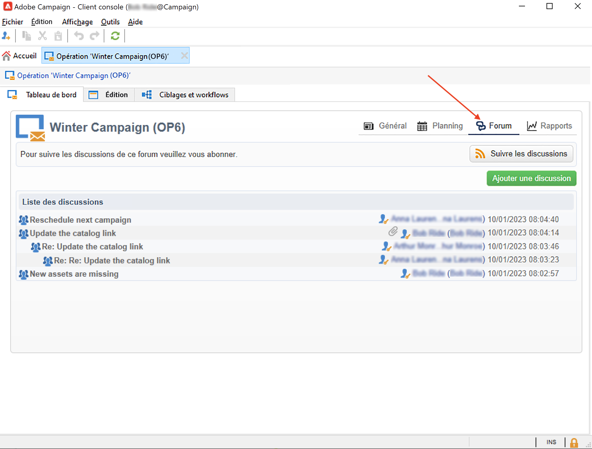
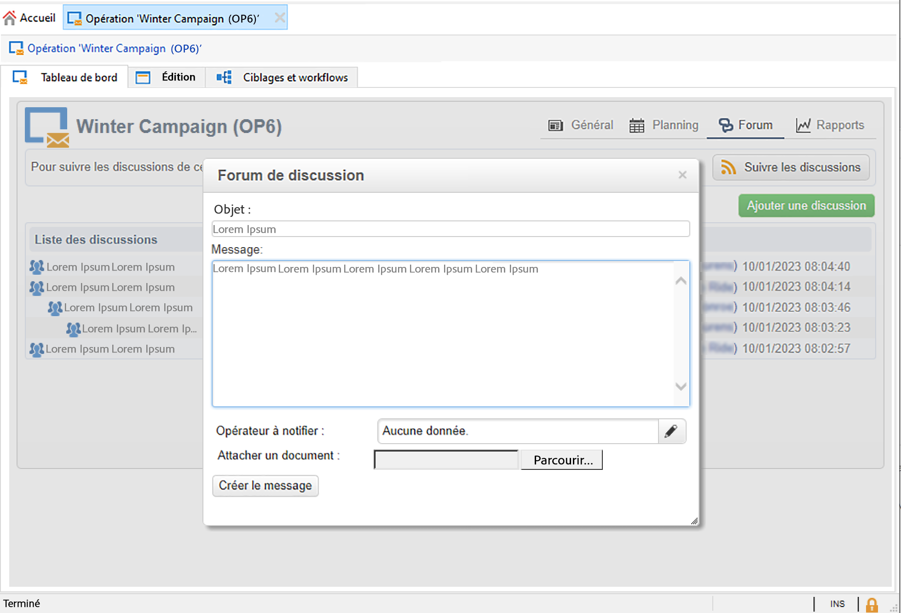
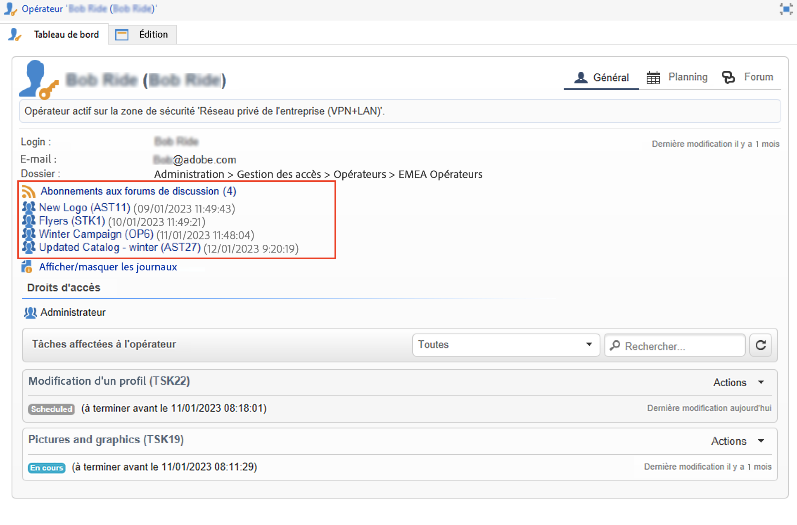

# Forums de discussion{#discussion-forums}

Les opérateurs d’Adobe Campaign peuvent utiliser les forums de discussion pour partager des informations. Les éléments suivants disposent de leur propre forum : plans, programmes, campagnes, ressources marketing, simulations, stocks. Chaque opérateur/opératrice possède également un forum personnel. Toutes les discussions sont publiques, même sur des forums personnels.

Les opérateurs/opératrices peuvent s’abonner à des forums afin de recevoir un e-mail de notification à chaque message posté dans ceux-ci.

## Accéder à un forum {#accessing-a-forum}

Pour consulter un forum, accédez à un tableau de bord et cliquez sur le lien **[!UICONTROL Forum]**, dans le coin supérieur droit.

Les messages et leurs réponses sont classés du plus récent au plus ancien.

Pour démarrer un nouveau thread, cliquez sur le bouton **[!UICONTROL Ajouter une discussion]** dans le coin supérieur droit. La boîte de dialogue **[!UICONTROL Forum de discussion]** s’affiche alors (cf. image ci-dessous).

Saisissez votre texte dans le champ **[!UICONTROL Message]** et, le cas échéant, saisissez un titre pour la discussion dans le champ **[!UICONTROL Objet]**.

Les opérateurs/opératrices ayant déjà publié un message dans ce forum reçoivent une notification par défaut. Vous pouvez sélectionner un opérateur/opératrice supplémentaire à avertir. Pour avertir plusieurs opérateurs/opératrices, sélectionnez un groupe d’opérateurs/opératrices.

Vous pouvez ajouter une pièce jointe au message à l’aide du bouton **[!UICONTROL Parcourir...]** La pièce jointe sera également incluse dans l’e-mail de notification. Une seule pièce jointe peut être ajoutée par message : pour envoyer plusieurs fichiers, vous devez les compresser dans un fichier .zip.

>[!CAUTION]
>
>Une fois un message publié dans le forum, il ne peut plus être modifié ni supprimé.

## Poster un message dans le forum personnel d&#39;un opérateur {#posting-to-the-personal-forum-of-an-operator}

Vous pouvez publier un message dans le forum d’un opérateur ou d’une opératrice. Les forums personnels sont publics et votre message est visible par tous les opérateurs/opératrices. L’opérateur/opératrice reçoit une notification par e-mail chaque fois qu’une personne publie sur son forum personnel.

Pour accéder au forum d’un opérateur/une opératrice, procédez comme suit :

* Accédez au dossier **[!UICONTROL Administration > Gestion des accès > Opérateurs]** de l’explorateur Campaign, sélectionnez l’opérateur/opératrice afin d’ouvrir son tableau de bord, puis cliquez sur le lien **[!UICONTROL Forum]** dans le coin supérieur droit.
* Recherchez le nom de l’opérateur/opératrice dans l’interface utilisateur d’Adobe Campaign (via un message publié dans le forum par cet opérateur/cette opératrice ou une tâche qui lui est affectée) et cliquez dessus pour accéder à son tableau de bord.

## S’abonner à un forum {#subscribing-to-a-forum}

Vous pouvez vous abonner à un forum pour suivre toutes les discussions. Une fois abonné(e), vous recevez une notification par e-mail chaque fois qu’un message est publié sur le forum.

Pour répondre à un message, cliquez dans le corps de l’e-mail, puis connectez-vous à l’interface web d’Adobe Campaign.

* Pour vous abonner à un forum, cliquez sur le bouton **[!UICONTROL Suivre les discussions]** dans le bandeau au-dessus de la liste des messages, à droite.

  Le bandeau devient bleu et indique que vous êtes abonné au forum.

* Pour vous désabonner d&#39;un forum, cliquez sur le bouton **[!UICONTROL Se désabonner]** dans le bandeau.

* Votre tableau de bord personnel répertorie les forums auxquels vous êtes abonné. Cliquez sur le bouton **[!UICONTROL Abonnement aux forums de discussion]** pour afficher la liste, puis cliquez sur l&#39;élément qui vous intéresse pour accéder à son forum.

  

## Résoudre les problèmes de diffusion des notifications {#checking-notification-delivery}

Si des opérateurs/opératrices abonné(e)s à un forum ne reçoivent pas les notifications attendues, procédez comme suit :

* Vérifiez que les opérateurs/opératrices ont bien une adresse e-mail renseignée dans leur profil.
* Accédez au dossier **[!UICONTROL Administration > Exploitation > Workflows techniques > Processus de Campaign]** de l’explorateur Campaign et vérifiez que le workflow **[!UICONTROL Traitements dans les forums de discussion]** a démarré sans erreur.
* Vérifiez les logs de diffusion :

   * Depuis la page d’accueil d’Adobe Campaign, accédez à **[!UICONTROL Campagnes > Navigation > Diffusions]**, puis ouvrez la diffusion **[!UICONTROL Notification des forums de discussion]**.
   * Dans l’explorateur Campaign, accédez à **[!UICONTROL Administration > Exploitation > Objets créés automatiquement > Diffusions techniques > Notifications de workflow]**, puis cliquez sur **[!UICONTROL Notification des forums de discussion]**.

  Dans le **[!UICONTROL Notifications des forums de discussion]** , les logs de diffusion se trouvent dans la variable **[!UICONTROL Modifier > Diffusion]** . Vous pouvez également afficher la variable **[!UICONTROL Tracking > Journal]** et la variable **[!UICONTROL Exclusions appliquées]** onglets.
