# Gérer des ressources marketing{#managing-marketing-resources}

Utilisez Adobe Campaign pour gérer et suivre les ressources marketing impliquées dans le cycle de vie de la campagne. Ces ressources marketing peuvent être un livre blanc, un fichier de données, un logo ou toute autre ressource liée à une campagne.

Pour chaque ressource marketing gérée via Adobe Campaign, vous pouvez contrôler à tout moment son statut, son historique et visualiser la version actuelle.

Par défaut, les ressources marketing sont stockées dans le dossier **[!UICONTROL MRM > Ressources marketing]** de l’explorateur Campaign.

## Ajouter une ressource marketing {#adding-a-marketing-resource}

Pour ajouter une ressource marketing, procédez comme suit :

1. Accédez à l’onglet **[!UICONTROL Campagnes]** et sélectionnez **[!UICONTROL Ressources marketing]**.

1. Cliquez sur le bouton **[!UICONTROL Créer]**.
   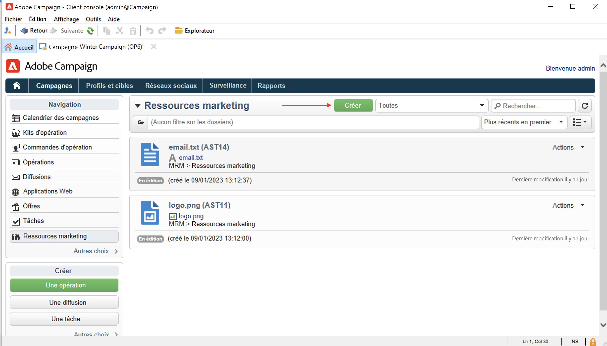
1. Faites glisser et déposez le fichier dans la fenêtre Ressource marketing pour le télécharger sur le serveur Campaign. Vous pouvez également utiliser le lien **[!UICONTROL Télécharger le fichier sur le serveur...]**.
   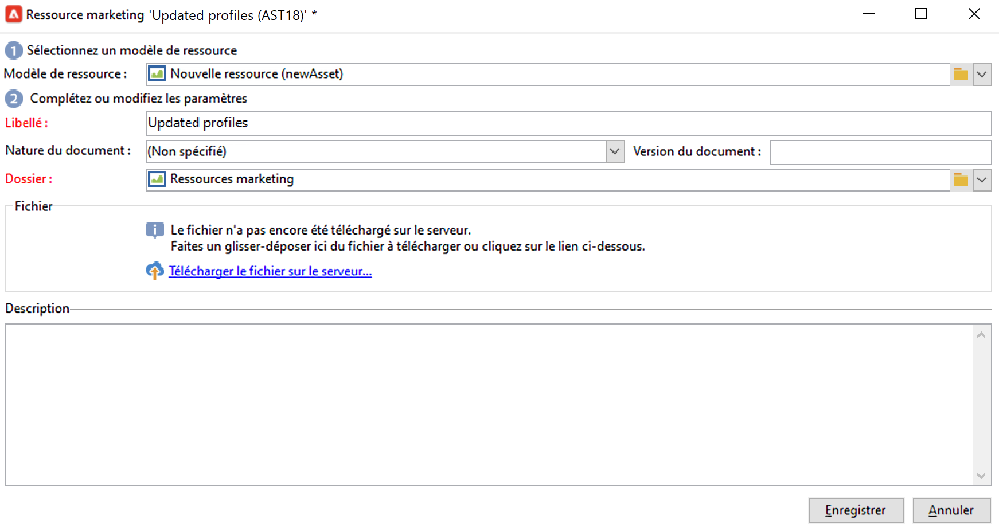

Une fois le téléchargement terminé, la ressource est ajoutée à la liste des ressources disponibles.

## Gérer des ressources marketing {#manage-marketing-resources}

Une fois le téléchargement effectué, la ressource marketing est disponible pour tous les opérateurs et opératrices Adobe Campaign. Ils peuvent la visualiser, en faire une copie pour la modifier ou mettre à jour le fichier sur le serveur.

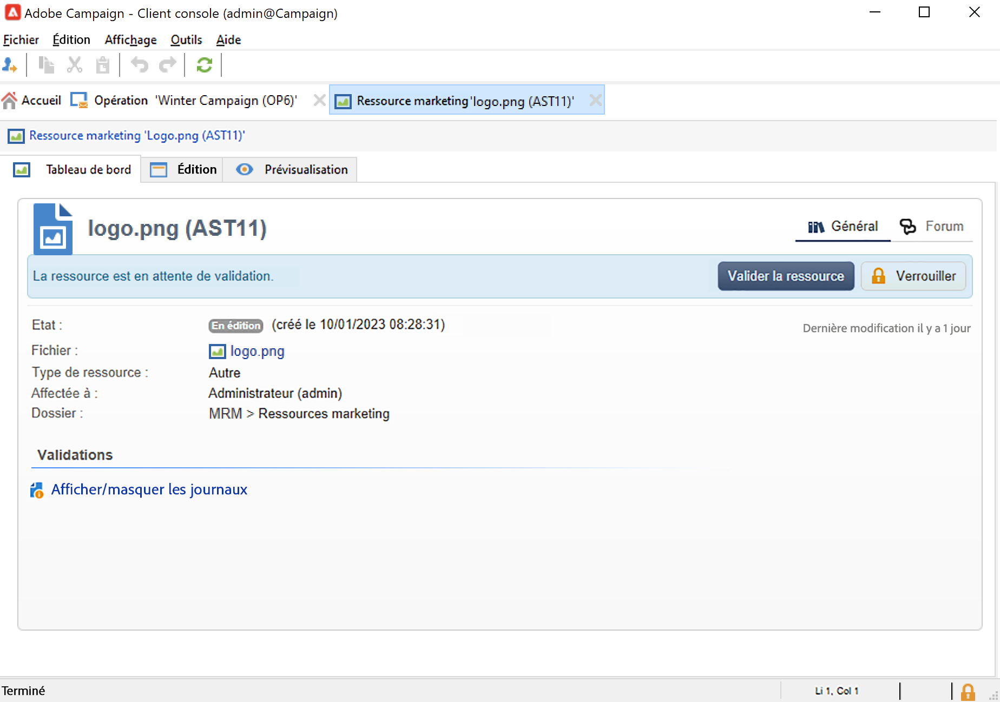

Utilisez la liste déroulante **[!UICONTROL Affecté à]** dans l’onglet **[!UICONTROL Modifier]** pour sélectionner l’opérateur ou l’opératrice responsable de la ressource.

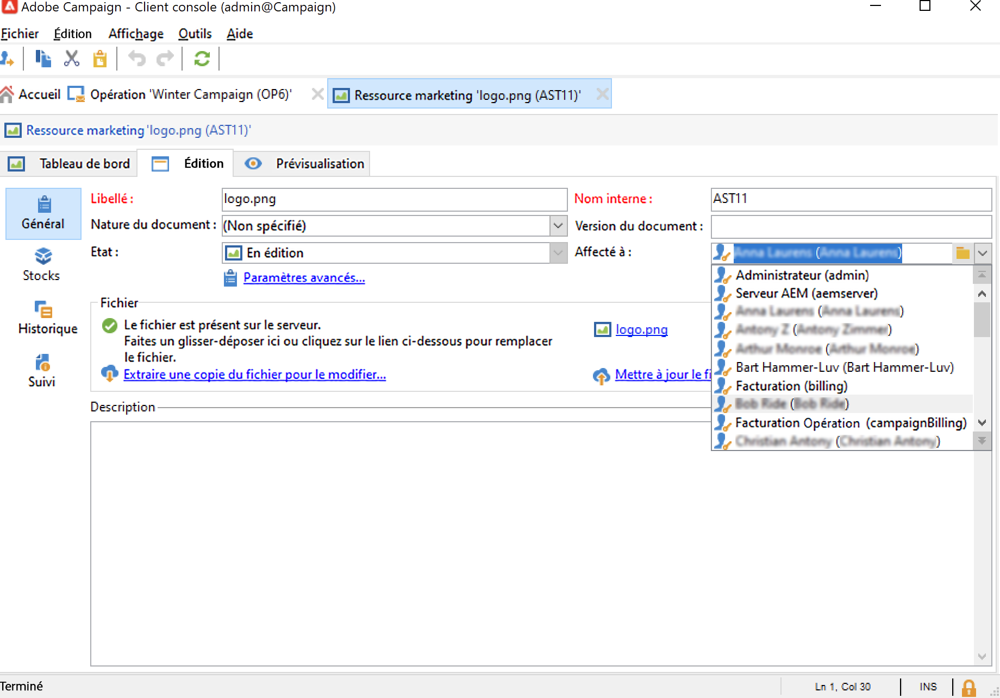

Vous pouvez également sélectionner les opérateurs et opératrices ou les groupes d’opérateurs et d’opératrices chargés de la validation et de la publication des ressources. Pour accéder à ces options, cliquez sur le lien **[!UICONTROL Paramètres avancés]**.

Ces opérateurs et opératrices sont avertis par e-mail lorsque le processus de validation de la ressource est lancé.

En l’absence de validant(e) sélectionné(e), la ressource **[!UICONTROL ne pourra pas]** être soumise à validation.

L’onglet **[!UICONTROL Audit]** vous permet d’ajouter un relecteur ou une relectrice et de définir une date de disponibilité pour la ressource. Au-delà de cette date, la ressource reçoit le statut **[!UICONTROL En retard]**.

>[!NOTE]
>
>L’onglet **[!UICONTROL Historique]** contient le journal de téléchargement et de mise à jour de la ressource. Le bouton **[!UICONTROL Détails]** permet de visualiser la version sélectionnée.
>
>L’onglet **[!UICONTROL Audit]** permet de suivre les actions effectuées sur la ressource : validations, refus de validation, commentaires associés ou publications.

### Verrouiller/déverrouiller une ressource {#locking-unlocking-a-resource}

Une fois créées, les ressources sont disponibles dans le tableau de bord des ressources marketing et les opérateurs et opératrices peuvent les éditer et les modifier.

Lorsqu’un opérateur ou une opératrice commence à travailler sur une ressource, il est recommandé de la verrouiller afin d’empêcher d’autres opérateurs ou opératrices de la modifier en même temps. La ressource est alors réservée : elle reste accessible, mais ne peut pas être publiée ou mise à jour sur le serveur par un autre opérateur ou une autre opératrice.

Une ressource marketing ne peut être verrouillée que si elle n’a pas été validée.

Pour verrouiller une ressource, vous devez cliquer sur le bouton **[!UICONTROL Verrouiller]** de la ressource dans le tableau de bord de la ressource.

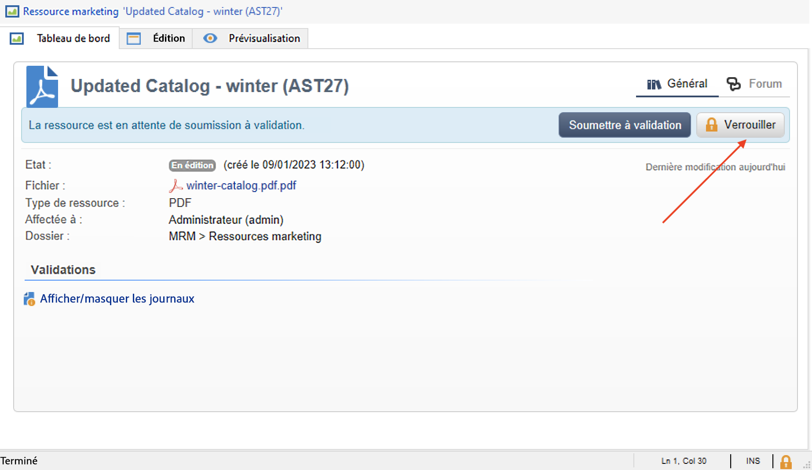

Une fois la ressource mise à jour, cliquez sur le bouton **[!UICONTROL Verrouiller]** dans le tableau de bord de la ressource pour la rendre à nouveau accessible à tous les opérateurs et opératrices.

Un message spécifique vient avertir l’opérateur ou l’opératrice qui souhaite y accéder :

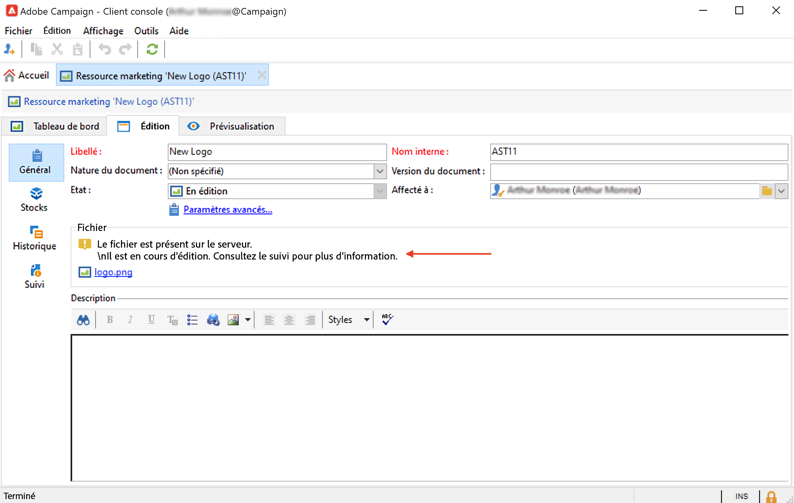

L’onglet **[!UICONTROL Tracking]** indique le nom de l’opérateur ou de l’opératrice qui a verrouillé la ressource.

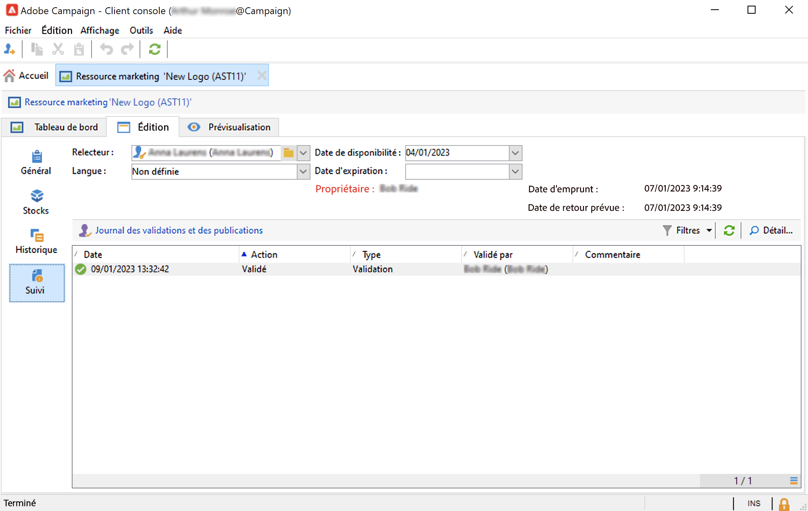

>[!NOTE]
>
>Seul l’opérateur ou l’opératrice ayant verrouillé la ressource et les opérateurs et opératrices ayant des droits Administrateur sont autorisés à déverrouiller une ressource verrouillée.

### Forums de discussion {#discussion-forums}

Pour chaque ressource, l’onglet **[!UICONTROL Forum]** permet aux participant(e)s de partager des informations.

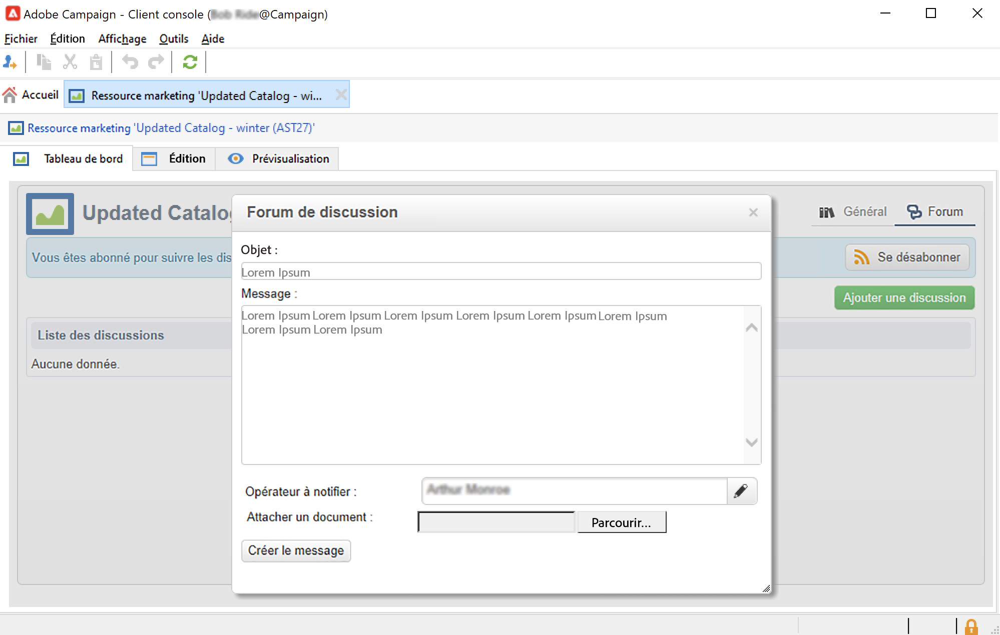

En savoir plus dans la section [Forums de discussion](discussion-forums.md).

### Processus de validation {#approval-process}

La date de disponibilité prévue est affichée dans les détails de la ressource, si elle a été spécifiée dans l’onglet **[!UICONTROL Tracking]**. Une fois cette date atteinte, vous pouvez exécuter le processus de validation à l’aide du bouton **[!UICONTROL Soumettre à validation]** du tableau de bord de la ressource. La ressource adopte alors le statut **[!UICONTROL Validation en cours]**.

Pour valider une ressource, cliquez sur le bouton **[!UICONTROL Valider la ressource]** sur son tableau de bord.

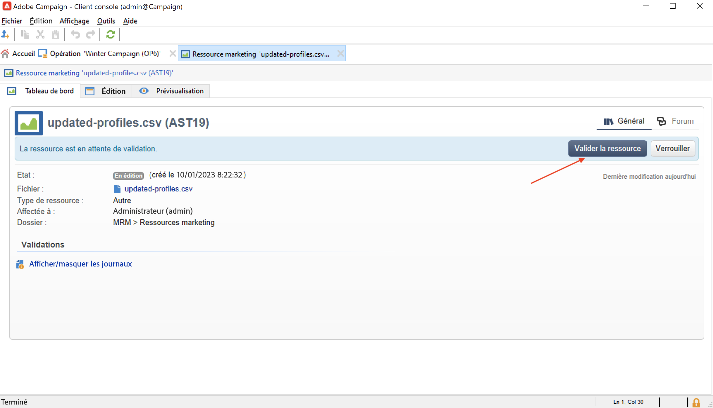

Les opérateurs ou opératrices habilités peuvent alors accepter ou refuser l’approbation. Cette action est à la fois possible à partir de l’e-mail envoyé (en cliquant sur le lien inclus dans le message de notification) ou de la console cliente (en cliquant sur le bouton **[!UICONTROL Approuver]**).

La fenêtre de validation permet de saisir un commentaire.

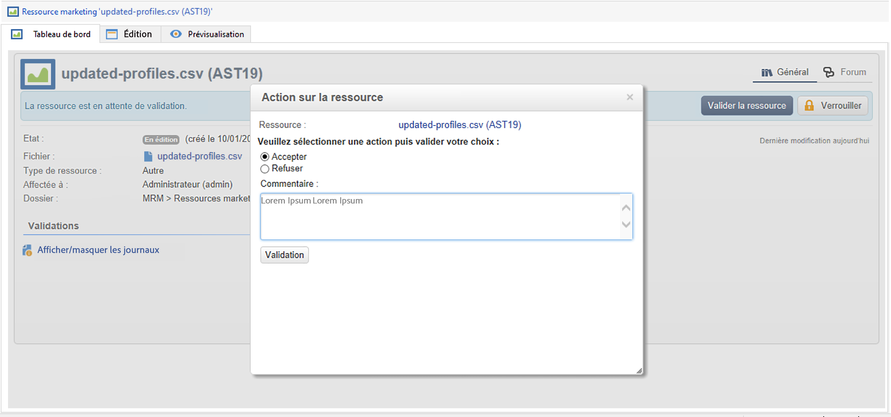

Accédez à l’onglet **[!UICONTROL Tracking]** pour consulter les validations.

>[!NOTE]
>
>En plus de l’opérateur ou de l’opératrice validant(e) désigné(e) au niveau de chaque ressource marketing, les opérateurs et opératrices ayant les droits d’administration et le ou la responsable de la ressource sont habilités à valider une ressource marketing.

### Publier une ressource {#publishing-a-resource}

Une fois validée, la ressource marketing doit être publiée. Le processus de publication doit faire l&#39;objet d&#39;une implémentation spécifique en fonction des besoins de l&#39;entreprise. Ainsi, les ressources peuvent être publiées sur un extranet ou tout autre serveur, une information spécifique peut être transmise à un prestataire externe, etc.

Pour publier une ressource, cliquez sur le bouton **[!UICONTROL Publier]** situé dans sa zone d&#39;édition dans le tableau de bord des ressources marketing.

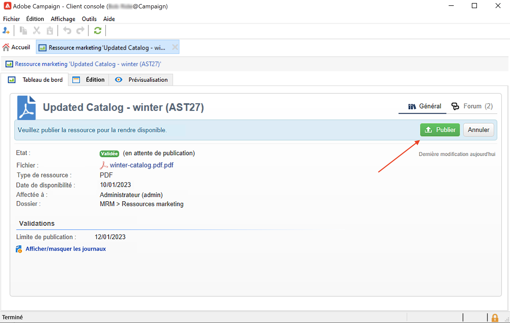

Vous pouvez également automatiser la publication d&#39;une ressource via un workflow.

Publier une ressource signifie la rendre disponible afin qu&#39;elle puisse être utilisée (par exemple dans une autre tâche). La publication proprement dite varie suivant la nature de votre ressource : pour un flyer, la publication peut consister à envoyer le fichier à un imprimeur, pour une page web, la publier sur un site...

Pour qu’Adobe Campaign puisse effectuer la publication, vous devez créer un workflow adéquat et le lier à la ressource. Pour ce faire, ouvrez la boîte de dialogue **[!UICONTROL Paramètres avancés…]** de la ressource, puis sélectionnez le workflow de votre choix dans le champ **[!UICONTROL Post-traitement]**.

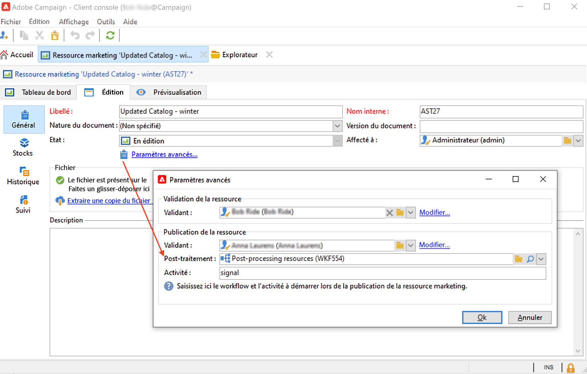

Le workflow est lancé :

* Lorsque le ou la validant(e) de publication cliquera sur **[!UICONTROL Publier la ressource]** (ou, en l’absence de validant(e) de publication défini(e), le ou la responsable de la ressource).
* Si la ressource est gérée via une tâche de création de ressource marketing, elle sera exécutée lorsque la tâche sera définie sur **[!UICONTROL Terminé]** à condition que la case **[!UICONTROL Publier la ressource marketing]** ait été cochée dans la tâche. [En savoir plus](creating-and-managing-tasks.md#marketing-resource-creation-task))

Si un workflow n’est pas lancé immédiatement (par exemple, si le workflow est arrêté), le statut de la ressource passe à **[!UICONTROL En attente de publication]**. Une fois le workflow démarré, le statut de la ressource passe à **[!UICONTROL Publié]**. Ce statut ne prend pas en compte les éventuelles erreurs dans le processus de publication. Vérifiez le statut de votre workflow pour vous assurer qu’il se soit exécuté correctement.

## Associer une ressource à une campagne {#linking-a-resource-to-a-campaign}

### Référencer une ressource marketing {#referencing-a-marketing-resource}

Les ressources marketing peuvent être associées aux campagnes, sous réserve que cette fonctionnalité ait été sélectionnée au niveau du [modèle de la campagne](../campaigns/marketing-campaign-templates.md).

Accédez à l’onglet **[!UICONTROL Modifier > Documents > Ressources]** dans le tableau de bord de la campagne, puis cliquez sur **[!UICONTROL Ajouter]** pour sélectionner la ressource visée.

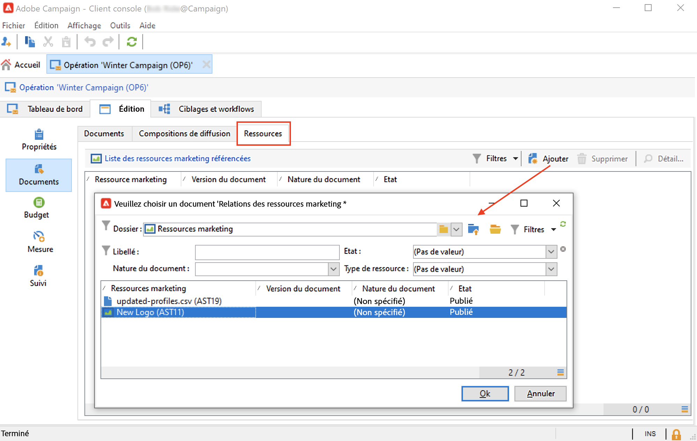

Vous pouvez filtrer les ressources par statut, par nature ou par type, ou appliquer un filtre personnalisé.

Utilisez le bouton **[!UICONTROL Détails]** pour modifier et prévisualiser la ressource.

### Ajouter une ressource marketing à une composition de diffusion {#adding-a-marketing-resource-to-a-delivery-outline}

Les ressources marketing peuvent être associées à des diffusions via les compositions.

En savoir plus sur les compositions de diffusion dans [cette section](../campaigns/marketing-campaign-deliveries.md).

Pour ce faire, cliquez avec le bouton droit sur une composition de diffusion et sélectionnez **Nouveau > Ressource**.

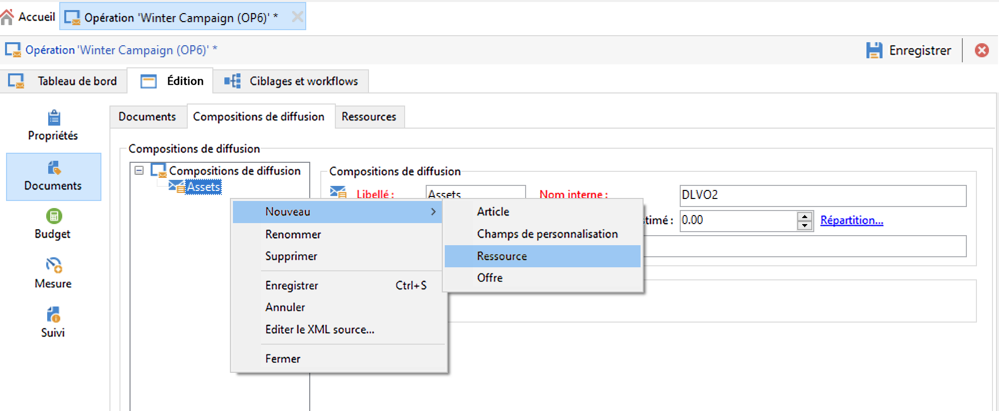

Saisissez le nom de la ressource et sélectionnez-la dans la liste déroulante **Ressource marketing**.

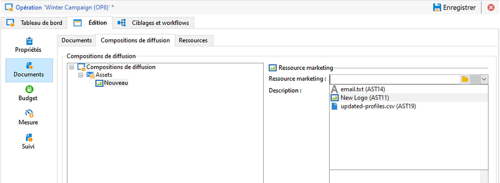

## Gestion des stocks {#stock-management}

Vous pouvez associer une ressource marketing à un ou plusieurs stocks afin de gérer l’approvisionnement et, au besoin, en cas de stock insuffisant, afficher une alerte dans le tableau de bord.

Pour associer une ressource marketing à un stock, procédez comme suit :

1. Modifiez ou créez un stock. En savoir plus sur les stocks dans [cette section](../campaigns/providers-stocks-and-budgets.md#stock-management).

1. Ajoutez une ligne de stock et sélectionnez la ressource marketing correspondante.

   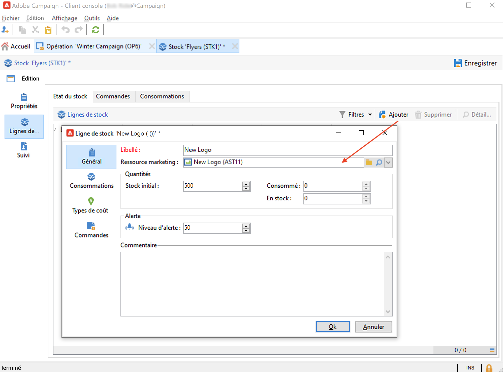

   Vous pouvez modifier la ressource sélectionnée à partir de l’icône **[!UICONTROL Modifier le lien]**, située à droite de la ressource.

1. Indiquez le stock initial et le stock d’alerte puis enregistrez.

Le stock est indiqué dans l’onglet **Stocks** de la ressource marketing.
