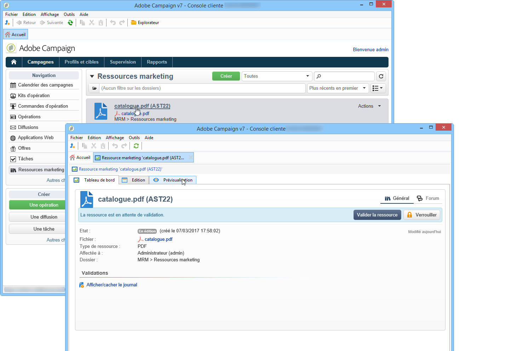
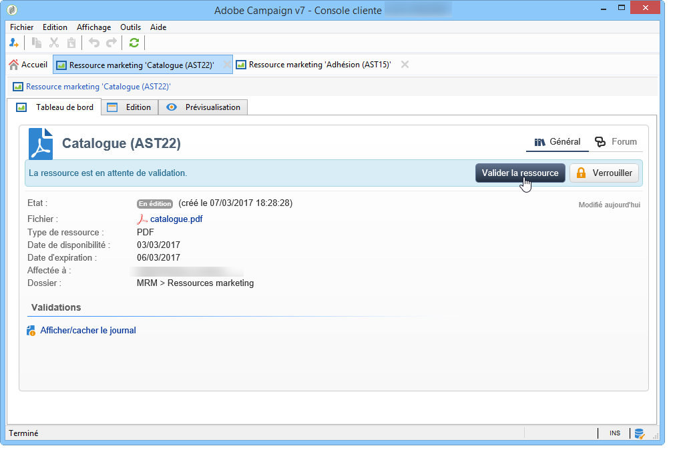
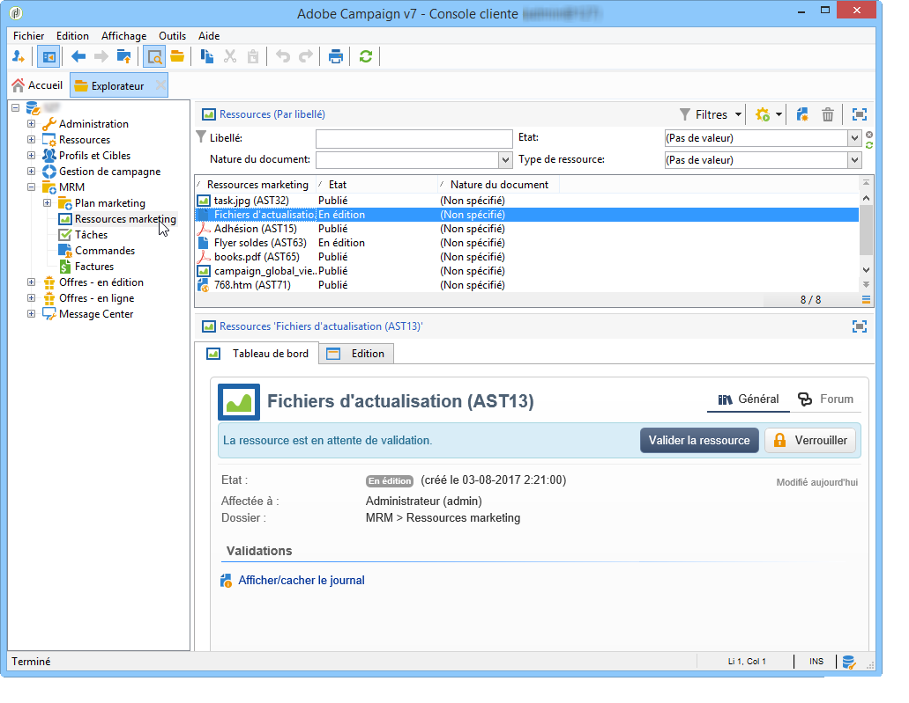

# Gestion des ressources marketing{#managing-marketing-resources}

Adobe Campaign permet d&#39;assurer le suivi et le tracking des ressources marketing impliquées dans le cycle de vie des opérations. Ces ressources marketing peuvent être par exemple une brochure, un visuel, ou tout autre support de communication sur lequel plusieurs opérateurs sont appelés à intervenir.

Pour chaque ressource marketing gérée via Adobe Campaign, vous pouvez contrôler à tout moment son statut, son historique et visualiser la version courante.

## Ajouter une ressource marketing {#adding-a-marketing-resource}

Les ressources marketing sont accessibles à partir de l’onglet **[!UICONTROL Campagnes]**.

Pour ajouter une ressource, cliquez sur le bouton **[!UICONTROL Créer]**.

Pour mettre à disposition une ressource sur le serveur Adobe Campaign, vous devez ajouter la ressource souhaitée par un glisser-déposer dans la zone centrale de l&#39;éditeur. Vous pouvez également cliquer sur le lien **[!UICONTROL Télécharger le fichier sur le serveur...]**.

Un message de confirmation permet de lancer le téléchargement.

Une fois le téléchargement terminé, la ressource est ajoutée dans la liste des ressources disponibles. Elle est alors accessible aux opérateurs Adobe Campaign qui peuvent la visualiser (à partir de l&#39;onglet **[!UICONTROL Prévisualisation]**), en extraire une copie pour la modifier ou mettre à jour le fichier sur le serveur (à partir de l&#39;onglet **[!UICONTROL Edition]**).

Cliquez sur l&#39;onglet **[!UICONTROL Général]** pour sélectionner les opérateurs, ou groupes d&#39;opérateurs, responsables du suivi, du tracking et de l’approbation de cette ressource. Le choix de l&#39;opérateur validant se fait via le lien **[!UICONTROL Paramètres avancés]**.

* L&#39;opérateur auquel la ressource est affectée est chargé d&#39;en assurer le tracking.
* L&#39;opérateur validant est celui qui est responsable de la validation de la ressource marketing. Il sera notifié lors du lancement du processus de validation de la ressource.

   Si aucun opérateur validant n&#39;est sélectionné, la ressource **[!UICONTROL ne pourra pas]** être soumise à validation.

* Au besoin, vous pouvez également définir un relecteur.

Vous pouvez indiquer une date de disponibilité de la ressource : cette date est indicative, au-delà de cette date, elle apparaîtra avec le statut **[!UICONTROL En retard]**.

## Travail collaboratif sur les ressources {#collaborative-work-on-resources}

Vous pouvez modifier et mettre à jour une ressource marketing et, au besoin, en informer les autres opérateurs Adobe Campaign. Ainsi, vous pouvez :

* Télécharger la ressource en local pour la modifier.
* Mettre à jour le fichier sur le serveur et le rendre accessible aux autres opérateurs.
* Verrouiller une ressource afin d&#39;en interdire la modification par les autres opérateurs.

>[!NOTE]
>
>L’onglet **[!UICONTROL Historique]** contient le journal des téléchargements et mises à jour de la ressource. Le bouton **[!UICONTROL Détails]** permet de visualiser la version sélectionnée.

### Verrouiller/déverrouiller une ressource {#locking-unlocking-a-resource}

Une fois créées, les ressources sont disponibles dans le tableau de bord des ressources marketing et les opérateurs peuvent les éditer et les modifier.

Lorsqu&#39;un opérateur souhaite travailler sur une ressource, il est préférable de la verrouiller au préalable, afin d&#39;éviter à tout autre opérateur d&#39;y apporter des modifications simultanément. La ressource lui est alors réservée : elle reste accessible mais ne peut être aucunement publiée ni mise à jour sur le serveur par un autre opérateur.

Un message spécifique vient avertir l&#39;opérateur qui souhaite y accéder :

L&#39;onglet **[!UICONTROL Tracking]** indique le nom de l&#39;opérateur qui a verrouillé la ressource et la date prévue de mise à jour.

Pour verrouiller une ressource, vous devez cliquer sur la ressource, puis sur le bouton **[!UICONTROL Verrouiller]** dans le tableau de bord des ressources.

Vous pouvez indiquer la date de retour prévue dans l&#39;onglet **[!UICONTROL Tracking]** de la ressource.

Cette information permet d&#39;indiquer aux autres opérateurs Adobe Campaign la date à laquelle cette ressource sera déverrouillée.

Une fois la ressource mise à jour, elle est automatiquement déverrouillée pour la rendre à nouveau disponible à tous les opérateurs.

Vous pouvez également, au besoin, la déverrouiller manuellement depuis le tableau de bord.

>[!NOTE]
>
>Seul l&#39;opérateur ayant verrouillé la ressource et les opérateurs ayant des droits Administrateur sont autorisés à déverrouiller une ressource verrouillée.

### Forums de discussion {#discussion-forums}

Pour chaque ressource, l&#39;onglet **[!UICONTROL Forum]** permet aux intervenants d&#39;échanger des informations.

La section [Forums de discussion](discussion-forums.md) explique la façon dont les forums de discussion fonctionnent dans Adobe Campaign.

## Cycle de vie d&#39;une ressource marketing {#life-cycle-of-a-marketing-resource}

Lors de la création de la ressource, des opérateurs Adobe Campaign sont désignés pour concevoir, relire, valider et publier la ressource. Une durée peut être déterminée pour ces opérations.

L&#39;onglet **[!UICONTROL Tracking]** permet de suivre les interventions réalisées sur la ressource : validations, refus de validation, commentaires associés, publications.

L&#39;onglet **[!UICONTROL Historique]** affiche les transferts de fichiers réalisés pour cette ressource.

### Processus de validation {#approval-process}

La date de disponibilité attendue est affichée dans le détail de la ressource, si celle-ci a été indiquée dans l&#39;onglet **[!UICONTROL Tracking]**. Une fois cette date atteinte, il est possible de lancer le processus de validation via le bouton **[!UICONTROL Soumettre à validation]** du tableau de bord de la ressource. La ressource passe alors dans l&#39;état **[!UICONTROL En cours de validation]**.

Une ressource peut être validée via le bouton **[!UICONTROL Valider la ressource]** de son tableau de bord.

Les opérateurs habilités peuvent alors accepter ou refuser la validation. Cette action est à la fois possible depuis l&#39;email envoyé (en cliquant sur le lien inclus dans le message de notification ) et à partir de la console (en cliquant sur le bouton **[!UICONTROL Valider]**).

La fenêtre de validation permet de saisir un commentaire.

L&#39;onglet **[!UICONTROL Tracking]** permet à tous les opérateurs de suivre les différentes étapes du processus de validation.

>[!NOTE]
>
>En plus de l&#39;opérateur validant désigné au niveau de chaque ressource marketing, les opérateurs ayant les droits d&#39;administration et le responsable de la ressource sont habilités à valider une ressource marketing.

### Publier une ressource {#publishing-a-resource}

Une fois validée, la ressource marketing doit être publiée. Le processus de publication doit faire l&#39;objet d&#39;une implémentation spécifique en fonction des besoins de l&#39;entreprise. Ainsi, les ressources peuvent être publiées sur un extranet ou tout autre serveur, une information spécifique peut être transmise à un prestataire externe, etc.

Pour publier une ressource, cliquez sur le bouton **[!UICONTROL Publier]** situé dans sa zone d&#39;édition dans le tableau de bord des ressources marketing.

Vous pouvez également automatiser la publication d&#39;une ressource via un workflow.

Publier une ressource signifie la rendre disponible afin qu&#39;elle puisse être utilisée (par exemple dans une autre tâche). La publication proprement dite varie suivant la nature de votre ressource : pour un flyer, la publication peut consister à envoyer le fichier à un imprimeur, pour une page web, la publier sur un site...

Pour qu&#39;Adobe Campaign effectue la publication, vous devez créer un workflow adéquat et le lier à la ressource. Pour lier le workflow à la ressource, ouvrez la boîte **[!UICONTROL Paramètres avancés]** de la ressource, puis sélectionnez le workflow désiré dans le champ **[!UICONTROL Post-traitement]**.

Le workflow sera exécuté :

* Lorsque le validant de publication cliquera sur **[!UICONTROL Publier la ressource]** (ou, si aucun validant de publication n&#39;a été défini, le responsable de la ressource).
* Si la ressource est gérée via une tâche de création de ressource marketing, lorsque la tâche sera marquée comme **[!UICONTROL Terminée]**, à condition que la case **[!UICONTROL Publier la ressource marketing]** ait été cochée dans la tâche (voir [Tâche de création de ressource marketing](creating-and-managing-tasks.md#marketing-resource-creation-task)).

Si le workflow n&#39;est pas lancé immédiatement (par exemple si le moteur de workflow est arrêté), l&#39;état de la ressource passe à **[!UICONTROL En attente de publication]**. Une fois le workflow lancé, l&#39;état de la ressource passe à **[!UICONTROL Publié]**. Ce statut ne tient pas compte d&#39;éventuelles erreurs dans le processus de publication. Vérifiez l&#39;état de votre workflow pour vous assurer que celui-ci s&#39;est correctement exécuté.

## Associer une ressource à une opération {#linking-a-resource-to-a-campaign}

### Référencer une ressource marketing {#referencing-a-marketing-resource}

Les ressources marketing peuvent être associées aux opérations, sous réserve que cette fonctionnalité ait été sélectionnée au niveau du modèle de l&#39;opération.

>[!NOTE]
>
>La création et le paramétrage des modèles d’opération sont détaillés dans la section [Modèles de campagne](../campaigns/marketing-campaign-templates.md)

Pour cela, cliquez sur l&#39;onglet **[!UICONTROL Documents > Ressources]** dans le tableau de bord de l&#39;opération, puis cliquez sur **[!UICONTROL Ajouter]** pour sélectionner la ressource visée.

Vous pouvez filtrer les ressources par statut, par nature ou par type, ou appliquer un filtre personnalisé.

Cliquez sur **[!UICONTROL Ok]** pour ajouter la ressource dans la liste des ressources marketing référencées pour cette opération.

Le bouton **[!UICONTROL Détails]** permet de l&#39;éditer et de la visualiser.

Les ressources ajoutées sont affichées dans le tableau de bord. Elles peuvent également y être éditées.

### Ajouter une ressource marketing dans une composition de diffusion {#adding-a-marketing-resource-to-a-delivery-outline}

Les ressources marketing peuvent être associées à des diffusions via les compositions.

>[!NOTE]
>
>Pour plus d&#39;informations sur les compositions de diffusion, consultez [Associer et structurer les ressources liées via une composition de diffusion](../campaigns/marketing-campaign-deliveries.md).

## Gestion des stocks {#stock-management}

Vous pouvez associer une ressource marketing à un ou plusieurs stocks afin de gérer l&#39;approvisionnement et, au besoin, en cas de stock insuffisant, afficher une alerte dans le tableau de bord.

>[!NOTE]
>
>Pour plus d&#39;information sur le mode de gestion des stocks dans Adobe Campaign, consultez la section [Gestion des stocks](../campaigns/providers--stocks-and-budgets.md#stock-management).

Pour associer une ressource marketing à un stock, éditez la vue d&#39;ensemble des stocks et éditez ou créez un stock. Ajoutez une ligne de stock et sélectionnez la ressource marketing correspondante.

Au besoin, vous pouvez éditer la ressource sélectionnée à partir de l&#39;icône **[!UICONTROL Editer le lien]** (loupe) situé à droite de la ressource, une fois sélectionnée.

Indiquez le stock initial et le stock d&#39;alerte puis enregistrez.

Le stock est indiqué dans le détail de la ressource.

Lorsque le stock est insuffisant, un message d&#39;alerte sera envoyé aux opérateurs auxquels il est affecté.

## Fonctions avancées {#advanced-functions}

Le tableau de bord des ressources marketing permet d&#39;effectuer les opérations usuelles : ajout, édition, verrouillage/déverrouillage, validation, publication. Vous pouvez créer d&#39;autres types de ressources marketing et accéder à des fonctionnalités avancées via l&#39;arborescence d&#39;Adobe Campaign. Pour cela, cliquez sur le lien **[!UICONTROL Explorer]** depuis la page d&#39;accueil d&#39;Adobe Campaign.

Par défaut, les ressources marketing sont stockées dans le noeud **[!UICONTROL MRM > Ressources marketing]** de l&#39;arborescence.

Vous pouvez ajouter les ressources suivantes depuis cette vue :

* Fichier
* HTML
* Texte
* URL
