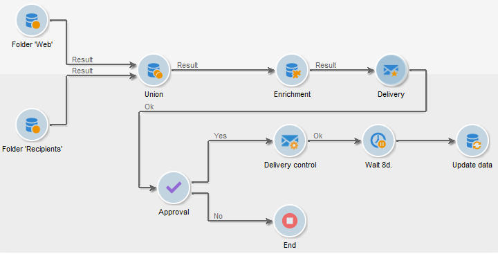

# Commencer avec les workflows{#gs-workflows}

## À propos des workflows{#about-workflows}

Adobe Campaign comprend un module de workflow qui vous permet d’orchestrer l’ensemble des processus et tâches dans les différents modules du serveur d’applications. Cet environnement graphique complet permet de concevoir des processus englobant segmentation, exécution de campagnes, traitement de fichiers, participation humaine, etc. Le moteur de workflow exécute et suit ces processus.

Un workflow permet par exemple de télécharger un fichier depuis un serveur, de le décompresser et d&#39;importer ses enregistrements dans la base de données Adobe Campaign.

Un workflow peut également impliquer un ou plusieurs opérateurs et opératrices à avertir ou pouvant effectuer des choix et valider des processus. Ainsi, il est possible de créer une action de diffusion, d&#39;affecter une tâche à un ou plusieurs opérateurs pour travailler sur le contenu, de spécifier des cibles et de valider les BAT avant de démarrer la diffusion.

Les workflows interviennent dans différents contextes et à différentes étapes du processus de gestion des campagnes.

Ainsi, Adobe Campaign utilise des workflows pour :

* Concevez des workflows de ciblage. [En savoir plus](#targeting-workflows)
* Orchestrez des campagnes cross-canal. [En savoir plus](#campaign-workflows)
* Exécutez des processus techniques tels que le nettoyage, la collecte de données, les calculs, etc. [En savoir plus](#technical-workflows)

Un workflow est une définition de processus : le diagramme de workflow, qui est une représentation de ce qui est censé se produire. Un workflow est également une instance de ce processus : une instance de workflow, qui est une représentation de ce qui se passe réellement.

Le modèle de workflow décrit les différentes tâches à effectuer et la manière dont elles sont liées. Les modèles de tâche sont appelés activités et sont représentés par des icônes. Elles sont reliées entre elles par des transitions.

## Principes clés

Chaque workflow comprend :

* **[!UICONTROL Activities]**

  Une activité décrit un modèle de tâche. Les différentes activités disponibles sont représentées sur le diagramme par des icônes. Chaque type possède des propriétés communes et des propriétés spécifiques. Par exemple, si toutes les activités ont un nom et un libellé, seule l&#39;activité **[!UICONTROL Validation]** a une assignation.

  Dans un diagramme de workflow, une même activité peut engendrer plusieurs tâches, notamment en cas de boucle ou d&#39;actions récurrentes (périodiques).

  Toutes les activités de workflow sont répertoriées dans [cette section](activities.md), notamment les cas pratiques et les exemples.

* **[!UICONTROL Transitions]**

  Les transitions permettent de lier des activités et de définir leur séquence. Une transition relie une activité source à une activité de destination. Il existe plusieurs types de transitions, qui dépendent de l’activité source. Certaines transitions comportent des paramètres supplémentaires tels qu’une durée, une condition ou un filtre.

  Une transition est flottante si elle n&#39;est pas rattachée à une activité destination. Les transitions flottantes apparaissent en orange et la pointe de leur flèche est remplacée par un losange.

  >[!NOTE]
  >
  >Un workflow contenant des transitions flottantes peut être exécuté : lors de l’activation d’une telle transition, l’exécution génère un avertissement et se trouve suspendue, mais aucune erreur n’est entraînée. Il est ainsi possible de démarrer un workflow sans qu’il soit terminé et de le compléter au fur et à mesure.

  Pour plus d&#39;informations sur la création d&#39;un workflow, consultez [cette section](build-a-workflow.md).

* **[!UICONTROL Tables de travail]**

  La table de travail contient toutes les informations véhiculées par la transition. Chaque workflow utilise plusieurs tables de travail. Les données transmises dans ces tableaux peuvent être accélérées et utilisées tout au long du cycle de vie du workflow, tant qu’elles ne sont pas purgées. En effet, les tableaux inutiles sont purgés à chaque passivation du workflow, et potentiellement en cours d’exécution pour les workflows les plus volumineux afin de ne pas surcharger le serveur.

  Pour plus d&#39;informations sur les données de workflow et les tables, consultez [cette section](use-workflow-data.md).

## Sections connexes

Reportez-vous à ces sections qui contiennent des conseils et de bonnes pratiques pour automatiser les processus à l&#39;aide de workflows :

* En savoir plus sur les activités de workflow dans [cette page](use-workflow-data.md).
* Découvrez comment créer un workflow dans [cette section](build-a-workflow.md).
* Découvrez comment utiliser des workflows pour importer des données dans Campaign dans [cette section](campaign-workflows.md).
* Les bonnes pratiques de workflow sont détaillées dans [cette page](workflow-best-practices.md).
* Consultez [cette section](start-a-workflow.md) pour en savoir plus sur l&#39;exécution des workflows.
* Découvrez comment surveiller les workflows dans [cette page](monitor-workflow-execution.md).
* Découvrez comment accorder l&#39;accès aux utilisateurs pour utiliser des workflows dans [cette page](managing-rights.md).
