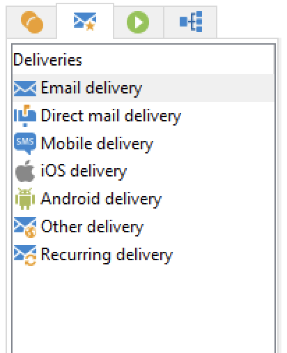

# Activités de workflows{#wf-activities}

Les activités de workflow sont regroupées par catégorie, dans quatre onglets différents.

Les activités disponibles peuvent varier selon vos autorisations, votre implémentation et le contexte dans lequel le workflow est conçu.

Par exemple, les workflows créés dans une campagne ont un onglet **Diffusions** spécifique comportant tous les canaux. Cet onglet n&#39;est pas disponible dans le [workflow technique](technical-workflows.md).

Les workflows techniques ont un onglet **Événements** qui n&#39;est pas disponible dans les [workflows de campagne](campaign-workflows.md).

Toutes les activités sont présentées dans les sections ci-dessous :

* [Activités de ciblage](targeting-activities.md)
* [Activités de contrôle de flux](flow-control-activities.md)
* [Activités d&#39;actions](action-activities.md)
* [Activités d’événement](event-activities.md)
* [Activités spécifiques au workflow de campagne](../campaigns/marketing-campaign-deliveries.md)
