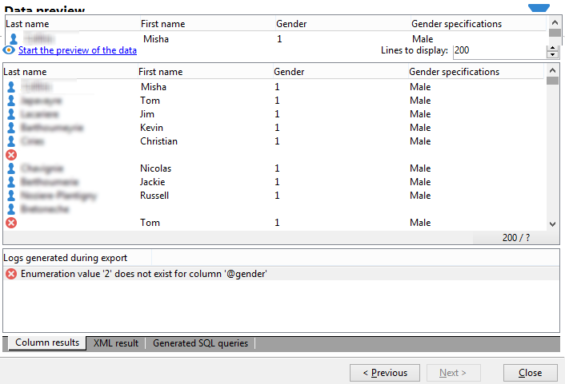

# Ajouter un champ calculé de type Énumération {#adding-an-enumeration-type-calculated-field}

Vous allez élaborer une requête comportant un champ calculé de type **[!UICONTROL Enumérations]**. Ce champ va produire une colonne supplémentaire dans la fenêtre de prévisualisation des données. Cette colonne précisera les valeurs chiffrées correspondant au genre des destinataires (0, 1 et 2). Chaque valeur chiffrée se verra attribuer un genre dans la colonne : &quot;Homme&quot; pour &quot;1&quot;, &quot;Femme&quot; pour &quot;2&quot; ou le statut &quot;Non renseigné&quot; si la valeur est &quot;0&quot;.

* Quelle table doit-on sélectionner ?

   La table des destinataires (nms:recipient).

* Quels sont les champs à sélectionner en colonne de sortie ?

   Nom, Prénom et Genre.

* En fonction de quels critères seront filtrées les informations ?

   En fonction de la langue des destinataires.

Les étapes sont les suivantes :

1. Ouvrez le Requêteur générique et sélectionnez la table des Destinataires (**[!UICONTROL nms:recipient]**).
1. Dans la fenêtre **[!UICONTROL Données à extraire]**, sélectionnez les champs **[!UICONTROL Nom]**, **[!UICONTROL Prénom]** et **[!UICONTROL Genre]**.

   

1. Dans la fenêtre **[!UICONTROL Tri]**, cliquez sur **[!UICONTROL Suivant]** : aucun tri n&#39;est nécessaire pour cet exemple.
1. Dans **[!UICONTROL Filtrage des données]**, sélectionnez **[!UICONTROL Critères de filtrage]**.
1. Paramétrez une condition dans la fenêtre **[!UICONTROL Elément de la cible]** pour que les destinataires retournés en résultat soient de langue française.

   

1. Dans la fenêtre **[!UICONTROL Formatage des données]**, cliquez sur **[!UICONTROL Ajouter un champ calculé]**.

   

1. Dans le champ **[!UICONTROL Type]** de la fenêtre **[!UICONTROL Définition d&#39;un champ calculé d&#39;export]**, sélectionnez **[!UICONTROL Enumérations]**.

   Définissez à quelle colonne doit se référer le nouveau champ calculé. Pour cela, sélectionnez la colonne **[!UICONTROL Genre]** dans le menu déroulant du champ **[!UICONTROL Colonne source]** : c&#39;est à la colonne **[!UICONTROL Genre]** que vont correspondre les valeurs de destination.

   

   Définissez la valeur **Source** et la valeur **Destination** : la valeur de destination va faciliter la lisibilité du résultat de la requête. Cette requête doit retourner le genre des destinataires. Le résultat correspondra aux genres 0, 1, ou 2.

   Pour chaque équivalence &quot;source-destination&quot; à renseigner, cliquez sur **[!UICONTROL Ajouter]** dans le champ **[!UICONTROL Liste des valeurs d&#39;énumérations]** :

   * Dans la colonne **[!UICONTROL Source]**, entrez chaque valeur source correspondant au genre (0, 1 et 2) dans de nouvelles lignes.
   * Dans la colonne **[!UICONTROL Destination]**, entrez les valeurs de destination : &quot;Non renseigné&quot; dans la ligne de &quot;0&quot;, &quot;Homme&quot; dans la ligne &quot;1&quot; et &quot;Femme&quot; dans la ligne &quot;2&quot;.

   Sélectionnez la fonction **[!UICONTROL Conserver la valeur source]**.

   Cliquez sur **[!UICONTROL Ok]** pour valider le champ calculé.

   

1. Dans la fenêtre **[!UICONTROL Formatage des données]**, cliquez sur **[!UICONTROL Suivant]**.
1. Dans l&#39;étape de prévisualisation, cliquez sur **[!UICONTROL Lancer la prévisualisation des données]**.

   La colonne supplémentaire spécifie à quel genre correspond chacune des trois valeurs 0, 1 et 2 :

   * 0 pour &quot;Non renseigné&quot;
   * 1 pour &quot;Homme&quot;
   * 2 pour &quot;Femme&quot;

   

   Par exemple, si vous ne renseignez pas le genre &quot;2&quot; dans la **[!UICONTROL Liste des valeurs d&#39;énumérations]** et que la fonction **[!UICONTROL Générer un avertissement et continuer]** du champ **[!UICONTROL Dans les autres cas]** est sélectionnée, un log d&#39;avertissement est généré. Ce log signale que le genre &quot;2&quot; (féminin) n&#39;a pas été renseigné. Il est affiché dans le champ **[!UICONTROL Logs générés lors de l&#39;export]**, dans la fenêtre de prévisualisation des données.

   

   Dans un autre cas, la valeur d&#39;énumération &quot;2&quot; n&#39;est pas renseignée. Sélectionnez la fonction **[!UICONTROL Générer une erreur et rejeter la ligne]** : tous les destinataires de genre &quot;2&quot; seront signalés en anomalie et les autres informations de la même ligne (nom, prénom, etc.) ne seront pas exportées. Un log d&#39;erreur s&#39;affiche dans le champ **[!UICONTROL Logs générés lors de l&#39;export]** de la fenêtre de prévisualisation des données. Ce log indique que la valeur d&#39;énumération &quot;2&quot; n&#39;est pas renseignée.

   
