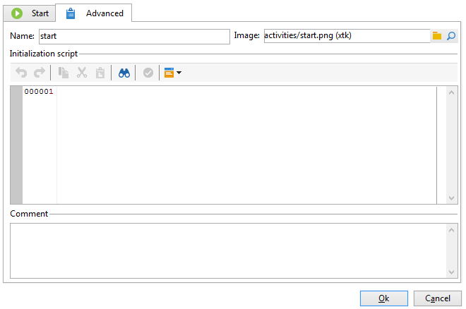
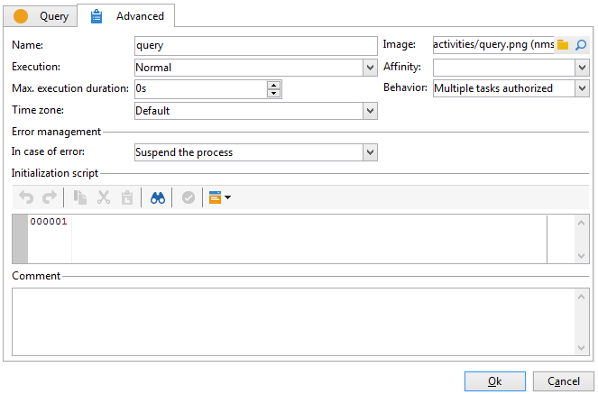

# Paramètres avancés{#advanced-parameters}

L&#39;écran des propriétés d&#39;une activité comporte un onglet **[!UICONTROL Avancé]** permettant notamment de définir le comportement en cas d&#39;erreur, la durée d&#39;exécution de l&#39;activité ou encore et de saisir un script d&#39;initialisation. Il existe deux versions de cet onglet :

* une version simplifiée (par exemple pour les activités **[!UICONTROL Début]** ou **[!UICONTROL Fin]**)

  

* une version plus détaillée (par exemple pour l&#39;activité **[!UICONTROL Requête]**)

  

Les champs à renseigner dans l&#39;onglet **[!UICONTROL Avancé]** sont décrits dans les sections suivantes.

## Nom {#name}

Ce champ contient le nom interne de l&#39;activité.

## Image {#image}

Ce champ vous permet de modifier lʼimage liée à une activité. Pour plus d’informations, consultez la section [Modification des images d’activité](change-activity-images.md).

## Exécution {#execution}

Ce champ vous permet de définir l&#39;action à effectuer au moment du déclenchement de la tâche. Trois choix s’offrent à vous :

Ces options sont généralement sélectionnées au niveau du diagramme en cliquant sur l&#39;activité avec le bouton droit.

* **[!UICONTROL Normale]** : l&#39;activité est exécutée normalement.
* **[!UICONTROL Ne pas activer]** : cette tâche ainsi que toutes celles qui lui succèdent (dans la même branche) ne sont pas exécutées.
* **[!UICONTROL Activer mais ne pas exécuter]** : cette tâche ainsi que toutes celles qui lui succèdent (dans la même branche) sont automatiquement suspendues. Cela peut s’avérer utile si vous souhaitez être présent au démarrage de la tâche. Pour exécuter manuellement la tâche, cliquez sur l&#39;activité avec le bouton droit et sélectionnez **[!UICONTROL Exécution normale]**.

## Affinité {#affinity}

Vous pouvez choisir de forcer l’exécution d’un workflow ou d’une activité de workflow sur une machine spécifique. Pour ce faire, vous devez définir une ou plusieurs affinités au niveau du workflow ou de l’activité concernée.

## Durée max. d’exécution {#max--execution-period}

Ce champ vous permet de définir une alerte vous avertissant lorsque la tâche est trop longue. Cela n’aura aucune incidence sur le fonctionnement du workflow. Si la tâche n’est pas terminée au moment où la **[!UICONTROL Période d’exécution max.]** est terminée, la page **[!UICONTROL Supervision de l’instance]** affiche un avertissement pour ce workflow. Cette page est accessible à partir de l&#39;onglet **[!UICONTROL Supervision]** de la page d&#39;accueil.

## Comportement {#behavior}

Ce champ vous permet de définir le comportement à appliquer dans le cas de l&#39;utilisation de tâches asynchrones. Il existe deux options possibles :

* **[!UICONTROL Plusieurs tâches autorisées]** : plusieurs tâches peuvent être exécutées en même temps, même si la première n&#39;est pas terminée.
* **[!UICONTROL La tâche en cours est prioritaire]** : les tâches en cours sont prioritaires. Tant qu’une tâche est en cours, aucune autre tâche ne sera exécutée.

## Time zone {#time-zone}

Ce champ vous permet de sélectionner le fuseau horaire de l’activité. Pour plus dʼinformations, consultez la section [Gestion des fuseaux horaires](managing-time-zones.md).

## En cas d&#39;erreur {#in-case-of-errors}

Ce champ vous permet de définir l’action à effectuer lorsque l’activité est en erreur. Il existe deux options possibles :

* **[!UICONTROL Suspendre le processus]** : le workflow est automatiquement suspendu. Son statut passe à **[!UICONTROL En échec]**. Lorsque le problème est résolu, relancez le workflow.
* **[!UICONTROL Ignorer]** : cette tâche ainsi que toutes celles qui lui succèdent (dans la même branche) ne sont pas exécutées. Cela peut s’avérer utile pour les tâches récurrentes. Si la branche comporte un planificateur placé en amont, celui-ci se déclenchera normalement à sa prochaine date d’exécution.
* **[!UICONTROL Abandon en erreur]** : le workflow est arrêté automatiquement et ne peut pas être redémarré. Son statut passe à **[!UICONTROL En échec]**.

## Script d&#39;initialisation {#initialization-script}

Ce champ vous permet d’initialiser des variables ou de modifier des propriétés d’activité. Voir à ce sujet la section : [Scripts et templates JavaScript](javascript-scripts-and-templates.md).

## Commentaire {#comment}

Le champ **[!UICONTROL Commentaire]** est un champ libre vous permettant d&#39;ajouter une description.
