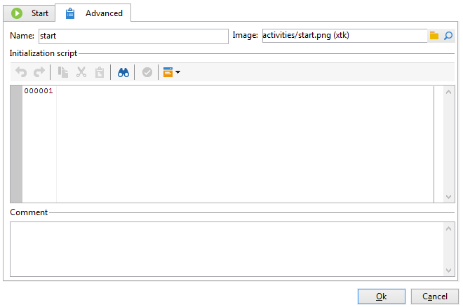
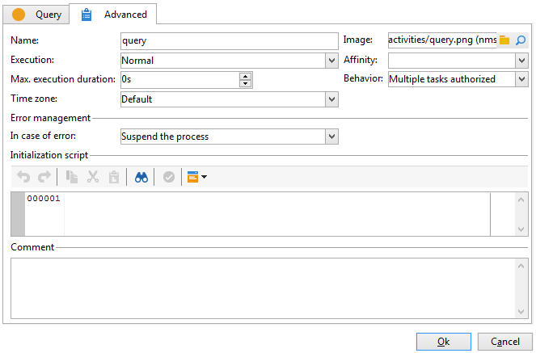

# Paramètres avancés{#advanced-parameters}

L’écran des propriétés d’une activité comporte un onglet **[!UICONTROL Avancé]** qui vous permet de définir le comportement en cas d’erreur, la durée d’exécution de l’activité ou encore de saisir un script d’initialisation. Il existe deux versions de cet onglet :

* une version simplifiée (par exemple pour les activités **[!UICONTROL Début]** ou **[!UICONTROL Fin]**)

  

* une version plus détaillée (par exemple pour l&#39;activité **[!UICONTROL Requête]**)

  

Les champs à renseigner dans l&#39;onglet **[!UICONTROL Avancé]** sont décrits dans les sections suivantes.

## Nom {#name}

Ce champ contient le nom interne de l&#39;activité.

## Image {#image}

Ce champ vous permet de modifier lʼimage liée à une activité. Pour plus d’informations, consultez la section [Modification des images d’activité](change-activity-images.md).

## Exécution {#execution}

Ce champ vous permet de définir l’action à effectuer au moment du déclenchement de la tâche. Trois choix s’offrent à vous :

Ces options sont généralement sélectionnées au niveau du diagramme en cliquant sur l&#39;activité avec le bouton droit.

* **[!UICONTROL Normale]** : l&#39;activité est exécutée normalement.
* **[!UICONTROL Ne pas activer]** : cette tâche ainsi que toutes celles qui lui succèdent (dans la même branche) ne sont pas exécutées.
* **[!UICONTROL Activer mais ne pas exécuter]** : cette tâche ainsi que toutes celles qui lui succèdent (dans la même branche) sont automatiquement arrêtées. Cela peut être utile si vous souhaitez être là au déclenchement de la tâche. Pour exécuter manuellement la tâche, cliquez sur l&#39;activité avec le bouton droit et sélectionnez **[!UICONTROL Exécution normale]**.

## Affinité {#affinity}

Vous pouvez choisir de forcer l’exécution d’un workflow ou d’une activité de workflow sur une machine particulière. Pour cela, vous devez définir une ou plusieurs propensions au niveau du workflow ou de l’activité concernée.

## Durée max. d’exécution {#max--execution-period}

Ce champ vous permet de définir un avertissement lorsque la tâche prend trop de temps. Cela n’aura aucune incidence sur le fonctionnement du workflow. Si la tâche n’est pas terminée au moment où la **[!UICONTROL Période d’exécution max.]** est terminée, la page **[!UICONTROL Su de l’instance]** affiche un avertissement pour ce workflow. Cette page est accessible à partir de l&#39;onglet **[!UICONTROL Su]** de la page d&#39;accueil.

## Comportement {#behavior}

Ce champ vous permet de définir le comportement à appliquer dans le cas de l’utilisation de tâches asynchrones. Deux options sont disponibles :

* **[!UICONTROL Plusieurs tâches autorisées]** : plusieurs tâches peuvent être exécutées en même temps, même si la première n&#39;est pas terminée.
* **[!UICONTROL La tâche en cours est prioritaire]** : les tâches en cours sont prioritaires. Tant qu’une tâche est en cours, aucune autre tâche ne sera exécutée.

## Time zone {#time-zone}

Ce champ vous permet de sélectionner le fuseau horaire de l’activité. Pour plus dʼinformations, consultez la section [Gestion des fuseaux horaires](managing-time-zones.md).

## En cas d&#39;erreur {#in-case-of-errors}

Ce champ vous permet de définir l’action à effectuer lorsque l’activité est en erreur. Deux options sont disponibles :

* **[!UICONTROL Suspendre le processus]** : le workflow est automatiquement suspendu. Son statut passe à **[!UICONTROL En échec]**. Lorsque le problème est résolu, relancez le workflow.
* **[!UICONTROL Ignorer]** : cette tâche ainsi que toutes celles qui lui succèdent (dans la même branche) ne sont pas exécutées. Cela peut être utile pour les tâches récurrentes. Si la branche comporte un planificateur placé en amont, il démarrera normalement à la date d’exécution suivante.
* **[!UICONTROL Abandon en erreur]** : le workflow est arrêté automatiquement et ne peut pas être redémarré. Son statut passe à **[!UICONTROL En échec]**.

## Script d&#39;initialisation {#initialization-script}

Ce champ vous permet d’initialiser des variables ou de modifier des propriétés d’activité. Voir à ce sujet la section : [Scripts et templates JavaScript](javascript-scripts-and-templates.md).

## Commentaire {#comment}

Le champ **[!UICONTROL Commentaire]** est un champ libre vous permettant d&#39;ajouter une description.
