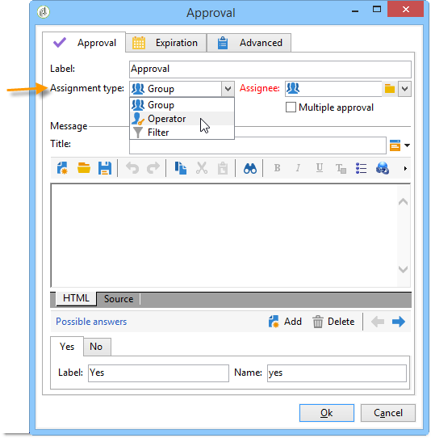
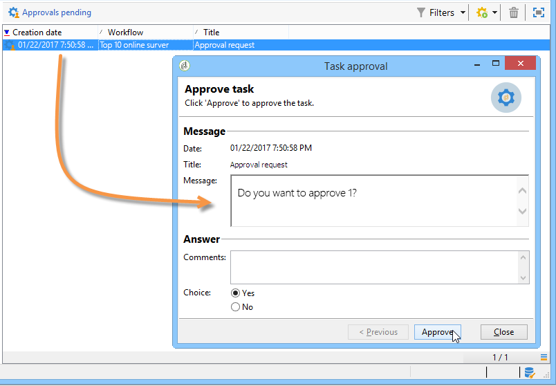
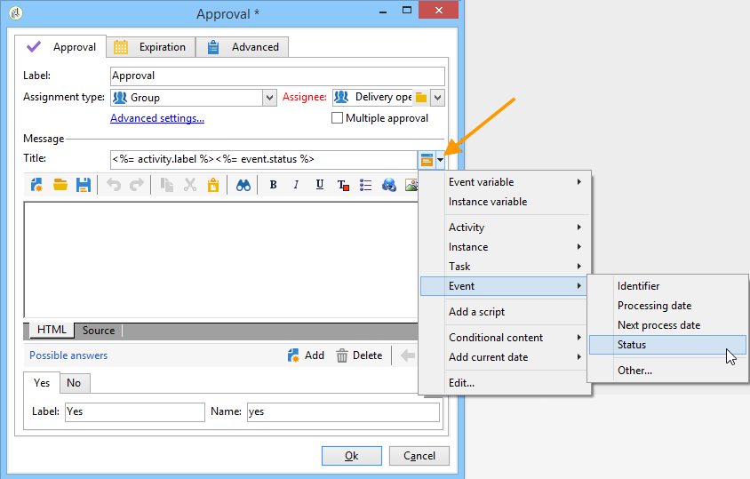

# Validation{#approval}

Une tâche **Validation** requiert la participation d&#39;un opérateur. L&#39;opérateur se voit assigner une tâche à laquelle il peut répondre depuis un email et ce, depuis la page web dont l&#39;URL est fournie dans l&#39;email envoyé, ou depuis la console.

## Assignation de la tâche {#task-assignment}

Par défaut, la validation est attribuée à un groupe d&#39;opérateurs. Ce groupe représente un rôle, par exemple &#39;Groupe de contenu de newsletter&#39; ou &#39;Groupe de ciblage de newsletter&#39;. Chaque opérateur du groupe peut répondre, mais seule la première réponse est prise en compte (sauf en cas de validations multiples).

Au besoin, vous pouvez affecter la tâche de validation à un opérateur unique ou à un ensemble d&#39;opérateurs défini par un filtre.

* Pour sélectionner un opérateur unique, sélectionnez la valeur **[!UICONTROL Opérateur]** dans le champ **[!UICONTROL Type d&#39;affectation]** et sélectionnez l&#39;opérateur concerné dans la liste déroulante du champ **[!UICONTROL Assignation]**.

  

  >[!CAUTION]
  >
  >Seul l&#39;opérateur sélectionné sera habilité à valider la tâche.

* Vous pouvez définir une requête pour filtrer les opérateurs et opératrices en charge de la validation. Pour cela, sélectionnez la valeur **[!UICONTROL Filtre]** dans le champ **[!UICONTROL Type d’affectation]**, puis cliquez sur le lien **[!UICONTROL Paramètres avancés...]** pour définir les critères de filtrage, comme dans l’exemple ci-dessous :

  

Dans le cas d&#39;une validation simple, la transition correspondant au choix de l&#39;opérateur est activée et la tâche est terminée : les autres opérateurs ne peuvent plus répondre.

En cas de validations multiples, les transitions correspondant au choix de chaque opérateur sont activées. La tâche est terminée lorsque tous les opérateurs et opératrices du groupe ont répondu ou lorsque la tâche a expiré.

Cette activité n&#39;est pas bloquante et le workflow peut effectuer d&#39;autres traitements dans l&#39;attente d&#39;une réponse.

Un opérateur ou une opératrice peut approuver les tâches qui lui sont affectées à partir de la console cliente. Un opérateur ou une opératrice doté de droits d’administrateur peut visualiser et supprimer les tâches assignées aux opérateurs, mais il n’est pas possible d’y répondre.

La modification du titre ou du corps du message de l&#39;activité n&#39;affecte pas les tâches en cours, en revanche, la modification des choix possibles affecte directement les tâches en cours qui héritent automatiquement de la nouvelle liste de choix.

Les tâches de type **Validation** sont accessibles depuis le noeud **[!UICONTROL Administration > Exploitation > Objets créés automatiquement > Validations en attente]** : les opérateurs peuvent accéder directement au formulaire de validation depuis cette vue.

## Propriétés {#properties}

Les variables de personnalisation peuvent être utilisées dans le message envoyé aux réviseurs. Ils peuvent être insérés dans le titre ou le corps du message.

Le champ **[!UICONTROL Titre]** contient le titre du message : il s’agit de l’objet de l’e-mail envoyé. Le titre, comme le corps du message, sont des modèles JavaScript et peuvent donc contenir des valeurs calculées en fonction du contexte du workflow.

La section inférieure de l&#39;éditeur permet de définir la liste des réponses possibles. Il y a une transition correspondant à chaque réponse. Le nom est l&#39;identifiant interne et le libellé est le texte qui sera affiché dans la liste de choix.

Cliquez sur le lien **[!UICONTROL Paramètres avancés...]** pour sélectionner le modèle de diffusion à utiliser pour avertir les opérateurs et opératrices. Le modèle par défaut (nom interne « notifyAssignee ») prend le titre et le message et ajoute un lien vers la page web utilisée pour répondre.

Ce modèle peut être modifié pour personnaliser la mise en page du message, mais il est préférable d’en faire une copie. Le mécanisme de ciblage (fichier externe, mapping de ciblage) ne doit pas être modifié, car il est nécessaire au bon fonctionnement des notifications.

Un exemple de validation est proposé dans la section [Définir les validations](define-approvals.md).

## Paramètres de sortie {#output-parameters}

* **[!UICONTROL response]**

  Commentaire associé à la réponse

* **[!UICONTROL responseOperator]**

  Identifiant de l’opérateur ou opératrice qui a répondu. Ce champ est une valeur numérique, mais un champ **[!UICONTROL Chaîne]**.
