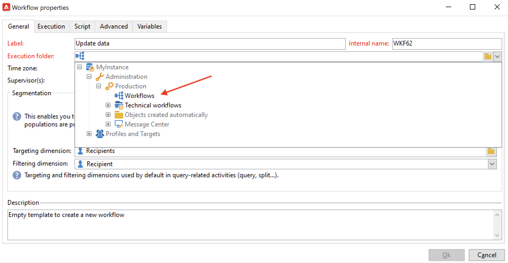

# Création d’un workflow {#build-a-workflow}

## Créer un workflow {#create-a-new-workflow}

Le flux de création de workflow dépend du type de workflow. Vous pouvez ainsi :

* Créer des [workflows de ciblage](#targeting-workflows) à partir du nœud **[!UICONTROL Profils et cibles]** > **[!UICONTROL Tâches]** > **[!UICONTROL Workflows de ciblage]** de l&#39;Explorateur ou de l&#39;onglet **[!UICONTROL Profils et cibles]** de la page d&#39;accueil, via le sous-onglet **[!UICONTROL Workflows de ciblage]**.

  

* Créer des [workflows de campagne](#campaign-workflows) à partir de l&#39;onglet **[!UICONTROL Ciblage et workflows]** d&#39;une campagne.

* Créer des [workflows techniques](#technical-workflows) à partir du nœud **[!UICONTROL Administration]** > **[!UICONTROL Production]** > **[!UICONTROL Workflows techniques]** de l&#39;Explorateur. Il est pratique de créer un dossier de workflow spécifique pour enregistrer vos workflows techniques.

Pour créer un workflow, cliquez sur le bouton **[!UICONTROL Nouveau]** situé au-dessus de la liste des workflows.

Saisissez un libellé, puis cliquez sur **[!UICONTROL Enregistrer]**.

## Ajout et liaison dʼactivités {#add-and-link-activities}

Vous devez maintenant définir les différentes activités et les relier entre elles dans un diagramme. À ce stade de la configuration, sont disponibles le libellé du diagramme et le statut du workflow (Édition en cours). La section inférieure de la fenêtre est réservée à l&#39;édition du diagramme. Elle contient une barre d&#39;outils, une palette d&#39;activités (à gauche) et le diagramme (à droite).

>[!NOTE]
>
>Si la palette n&#39;est pas visible, cliquez sur le premier bouton de la barre d&#39;outils de workflow pour qu&#39;elle s&#39;affiche.

Les activités sont regroupées par catégories sous les onglets de la palette. Les onglets et activités disponibles peuvent varier en fonction du type de workflow (technique, de ciblage ou workflow de campagne).

* Le premier onglet contient les activités de ciblage et de manipulation de données. Ces activités sont détaillées dans la section [Activités de ciblage](targeting-activities.md).
* Le deuxième Onglet contient les activités de planification qui servent principalement à coordonner les autres. Elles sont détaillées dans la section [Activités d&#39;ordonnancement](flow-control-activities.md).
* Le troisième onglet contient les outils et les actions utilisables dans le workflow. Ces activités sont décrites en détail dans la section [Activités d&#39;action](action-activities.md).
* Le quatrième onglet regroupe les activités qui dépendent d&#39;un événement particulier, par exemple la réception d&#39;un email ou l&#39;arrivée d&#39;un fichier sur un serveur. Ces activités sont décrites en détail dans la section [Activités événementielles](event-activities.md).

Pour construire le diagramme

1. Ajoutez une activité en la sélectionnant dans la palette et en la déplaçant jusqu&#39;au diagramme par un glisser-déposer.

   Positionnez une activité de type **Début**, puis une activité de type **Diffusion** sur le diagramme.

   

1. Reliez les deux activités en sélectionnant la transition de l&#39;activité **Début** et en la relâchant sur l&#39;activité **Diffusion**.

   

   Vous pouvez relier automatiquement une activité à celle qui la précède en déposant la nouvelle activité directement sur l&#39;extrémité de la transition.

1. Ajoutez les activités dont vous avez besoin et reliez-les entre elles, comme sur le diagramme ci-dessous.

   

>[!CAUTION]
>
>Vous pouvez copier et coller des activités dans un même workflow. Toutefois, nous vous déconseillons de copier et coller des activités dans différents workflows. Certains paramètres associés à des activités telles que Diffusions et Planificateur peuvent entraîner des conflits et des erreurs lors de l&#39;exécution du workflow de destination. Nous vous recommandons plutôt de **dupliquer** les workflows. Pour plus dʼinformations, consultez la section [Duplication des workflows](#duplicate-workflows).

Lʼaffichage et la mise en page du diagramme peuvent être modifiés à lʼaide des éléments suivants :

* **Utilisation de la barre d’outils**

  La barre d&#39;outils de l&#39;éditeur de diagramme permet d&#39;accéder aux fonctions de mise en page et d&#39;exécution du workflow.

  

  Vous pouvez ainsi adapter la mise en page de l&#39;éditeur : affichage de la palette et de la vue d&#39;ensemble, taille et alignement des objets graphiques.

  

  Les icônes relatives à la progression et l’affichage des logs sont présentées en détail dans les sections suivantes :

   * [Afficher la progression](monitor-workflow-execution.md#displaying-progress)
   * [Afficher les logs](monitor-workflow-execution.md#displaying-logs)

* **Alignement des objets**

  Pour aligner les icônes, sélectionnez-les et cliquez sur l&#39;icône **[!UICONTROL Aligner verticalement]** ou **[!UICONTROL Aligner horizontalement]**.

  Utilisez la touche **CTRL** pour sélectionner plusieurs activités discontinues ou désélectionner une ou plusieurs activités d&#39;une sélection. Cliquez sur l&#39;arrière-plan du diagramme pour tout désélectionner.

* **Gestion des images**

  Vous pouvez personnaliser l’image d’arrière-plan du diagramme et les images associées aux différentes activités. Consultez la section [Modification des images dʼactivité](change-activity-images.md).

## Configuration des activités {#configure-activities}

Double-cliquez sur une activité pour la paramétrer ou cliquez avec le bouton droit et choisissez **[!UICONTROL Ouvrir…]**.

>[!NOTE]
>
>Les activités de workflow d’opérations disponibles sont présentées dans [cette section](activities.md).

Le premier onglet contient le paramétrage de base. L’onglet **[!UICONTROL Avancé]** contient des paramètres supplémentaires, qui permettent notamment de définir le comportement en cas d’erreur ainsi que la durée d’exécution de l’activité, et de saisir un script d’initialisation.

Pour une meilleure compréhension des activités et une meilleure lisibilité des workflows, vous pouvez saisir des commentaires dans les activités.

Ces commentaires s&#39;afficheront automatiquement quand des opérateurs balayeront du curseur l&#39;activité.

## Les modèles de workflows {#workflow-templates}

Un modèle de workflow contient le paramétrage global des propriétés et éventuellement d&#39;un ensemble d&#39;activités enchaînées dans un diagramme. Ce paramétrage peut être réutilisé pour créer de nouveaux workflows dont certains éléments sont pré-paramétrés.

Vous pouvez créer de nouveaux modèles de workflows à partir de modèles existants ou transformer directement un workflow en modèle.

Les modèles de workflows sont stockés dans le nœud **[!UICONTROL Ressources > Modèles > Modèles de workflow]** de l&#39;Explorateur.

En plus des propriétés habituelles des workflows, les propriétés du modèle permettent d&#39;indiquer le dossier d&#39;exécution des workflows créés à partir de ce modèle.

## Duplication de workflows {#duplicate-workflows}

Vous pouvez dupliquer différents types de workflows. Une fois le workflow dupliqué, ses modifications ne sont pas appliquées à la copie de celui-ci.

>[!CAUTION]
>
>La fonction copier-coller est disponible dans les workflows, mais nous vous recommandons d&#39;utiliser **Dupliquer**. Une fois une activité copiée, l&#39;ensemble de sa configuration est conservée. Pour les activités de diffusion (email, SMS, notification Push...), l&#39;objet de la diffusion associé à l&#39;activité est également copié, ce qui peut entraîner un blocage.

1. Cliquez avec le bouton droit de la souris sur un workflow.
1. Cliquez sur **Dupliquer**.

   

1. Dans la fenêtre du workflow, modifiez le libellé du workflow.
1. Cliquez sur **Enregistrer**.

