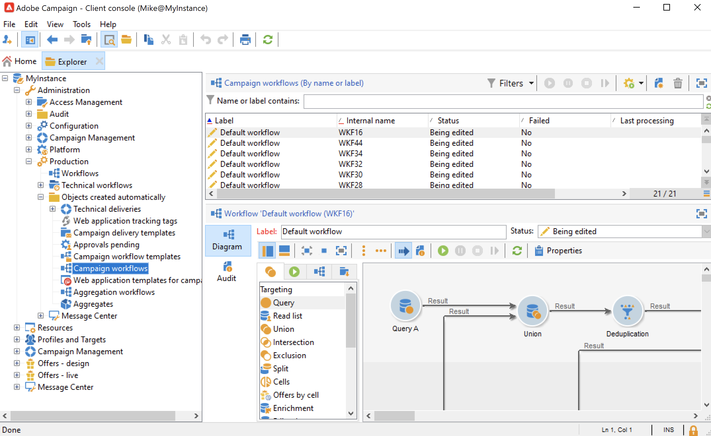

# Les workflows des opérations {#campaign-workflows}

Pour chaque campagne, vous pouvez créer des workflows à exécuter à partir de l&#39;onglet **[!UICONTROL Ciblage et workflows]**. Ces workflows sont spécifiques à la campagne.

Cet onglet contient les mêmes activités que pour tous les workflows. [En savoir plus](#implementation-steps-)

Outre les campagnes de ciblage, les workflows de campagne vous permettent de créer et de configurer entièrement des diffusions pour tous les canaux disponibles. Une fois créées dans le workflow, ces diffusions sont disponibles dans le tableau de bord de la campagne.

Tous les workflows des opérations sont centralisés sous le noeud **[!UICONTROL Administration > Exploitation > Objets créés automatiquement > Workflows des opérations]**.

Les workflows de campagne et des exemples d&#39;implémentation sont présentés dans [cette section](../campaigns/marketing-campaign-target.md).
