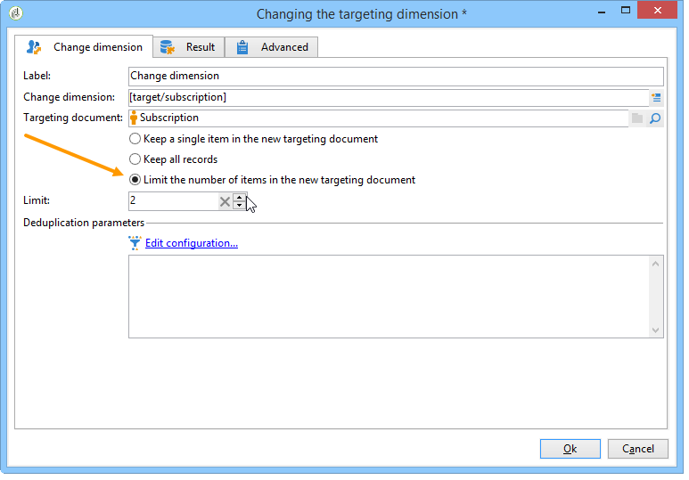
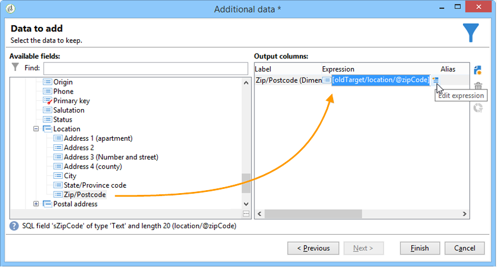

# Changement de dimension{#change-dimension}

Utilisez l’activité **[!UICONTROL Changement de dimension]** pour changer la dimension de ciblage au fur et à mesure que vous créez une audience. Cette activité déplace l’axe en fonction du modèle de données et de la dimension d’entrée. Par exemple, vous passez de la dimension « contrats » à la dimension « clients ».

Vous pouvez également utiliser cette activité pour définir les colonnes supplémentaires de la nouvelle cible et définir les critères de déduplication des données.

>[!IMPORTANT]
>
>Veuillez noter que la variable **[!UICONTROL Modification de la dimension]** et **[!UICONTROL Modification de la source de données]** Les activités ne doivent pas être ajoutées sur une seule ligne. Si vous devez utiliser les deux activités consécutivement, veillez à inclure une **[!UICONTROOL Enrichissement]** activité entre elles. Cela garantit une bonne exécution et évite les conflits ou erreurs potentiels.

Pour configurer l’activité de **[!UICONTROL changement de dimension]**, respectez les étapes suivantes :

1. Sélectionnez la nouvelle dimension de ciblage à partir du champ **[!UICONTROL Changement de dimension]**.

   

1. Lors du changement de dimension, vous pouvez conserver tous les éléments ou sélectionner ceux à conserver en sortie. Dans l&#39;exemple ci-dessous, le nombre maximal de doublons est fixé à 2.

   

   Lorsque vous choisissez de ne conserver qu&#39;un seul enregistrement, une collection apparaît dans le schéma de travail : cette collection représente tous les enregistrements qui ne seront pas ciblés dans le résultat final (puisqu&#39;un seul enregistrement est conservé). Cette collection permet, comme toute autre collection, de calculer des agrégats ou de récupérer des informations en colonne.

   Par exemple, si on passe de la dimension des **[!UICONTROL Clients]** à celle des **[!UICONTROL Destinataires]**, il sera possible de cibler les clients d&#39;un magasin, en précisant le nombre d&#39;achats réalisés.

1. Si vous choisissez de ne pas conserver tous les enregistrements, vous pouvez configurer le mode de gestion des doublons.

   

   Les flèches bleues permettent de définir l&#39;ordre de priorité de traitement des doublons.

   Dans l&#39;exemple ci-dessus, les destinataires seront dédoublonnés d&#39;abord sur leur adresse email, puis, au besoin, sur leur numéro de compte.

1. L&#39;onglet **[!UICONTROL Résultat]** permet d&#39;ajouter des informations complémentaires.

   Vous pouvez par exemple récupérer le numéro du département à partir du code postal en utilisant une fonction de type **Substring**. Pour cela :

   * Cliquez sur le lien **[!UICONTROL Ajouter des données...]** et sélectionnez **[!UICONTROL Données liées à la dimension de filtrage]**.

     

     >[!NOTE]
     >
     >Pour plus d’informations sur la création et la gestion des colonnes additionnelles, reportez-vous à la section [Ajouter des données](query.md#add-data).

   * Choisissez la dimension de ciblage précédente (avant le basculement d&#39;axe) et sélectionnez le **[!UICONTROL Code Postal]** dans la sous-arborescence **[!UICONTROL Localisation]** du destinataire, puis cliquez sur **[!UICONTROL Editer l&#39;expression]**.

     

   * Cliquez sur **[!UICONTROL Sélection avancée]** et choisissez **[!UICONTROL Editer la formule à partir d&#39;une expression]**.

     

   * Utilisez les fonctions proposées dans la liste et indiquez le calcul à réaliser.

     

   * Pour finir, saisissez le libellé de la colonne que vous venez de créer.

     

1. Exécutez le workflow pour visualiser le résultat de ce paramétrage. Comparez les données contenues dans les tables avant et après l&#39;activité de changement de dimension, comparez également la structure des tables du workflow, comme dans les exemples suivants :

   

   
