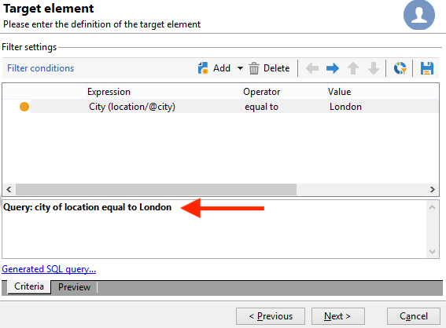

# Effectuer un calcul d&#39;agrégats {#performing-aggregate-computing}

Dans cet exemple, vous allez comptabiliser le nombre de destinataires domiciliés à Paris, en fonction de leur genre.

* Quelle table doit-on sélectionner ?

  La table des destinataires (**nms:recipient**)

* Quels sont les champs à sélectionner en colonne de sortie ?

  Clé primaire (avec comptage) et Genre.

* En fonction de quels critères seront filtrées les informations ?

  En fonction des destinataires domiciliés à Paris.

Pour réaliser cet exemple, les étapes sont les suivantes :

1. Dans **[!UICONTROL Données à extraire]**, définissez un comptage de la clé primaire (comme dans l&#39;exemple précédent). Ajoutez le champ **[!UICONTROL Genre]** en colonne de sortie. Cochez l&#39;option **[!UICONTROL Grouper]** de la colonne **[!UICONTROL Genre]**. Ainsi, les destinataires seront regroupés par genre.

   

1. Dans la fenêtre **[!UICONTROL Tri]**, cliquez sur **[!UICONTROL Suivant]** : aucun tri n&#39;est nécessaire dans cet exemple.
1. Paramétrez le filtrage des données. Ici, vous souhaitez limiter la sélection aux contacts qui vivent à Londres.

   

   >[!NOTE]
   >
   >Les valeurs respectent la casse. Si la valeur &#39;Londres&#39; est saisie dans la condition sans majuscule et que la liste des destinataires contient le mot « Londres » avec majuscule, la requête échoue.

1. Dans la fenêtre **[!UICONTROL Formatage des données]**, cliquez sur **[!UICONTROL Suivant]** : aucun formatage n&#39;est nécessaire dans cet exemple.
1. Dans la fenêtre de prévisualisation, cliquez sur **[!UICONTROL Lancer la prévisualisation des données]**.

   Il existe trois valeurs distinctes pour chaque tri par genre : **2** pour le genre féminin, **1** pour le genre masculin et **0** lorsque le genre est inconnu. Dans cet exemple, la liste contient 10 femmes, 16 hommes et 2 personnes dont le genre n’est pas connu.

   
