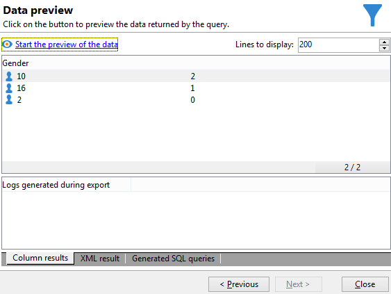

# Effectuer un calcul d&#39;agrégat {#performing-aggregate-computing}

Dans cet exemple, vous allez comptabiliser le nombre de destinataires domiciliés à Paris, en fonction de leur genre.

* Quelle table doit-on sélectionner ?

   La table des destinataires (**nms:recipient**).

* Quels sont les champs à sélectionner en colonne de sortie ?

   Clé primaire (avec comptage) et Genre.

* En fonction de quels critères seront filtrées les informations ?

   En fonction des destinataires domiciliés à Paris.

Pour réaliser cet exemple, les étapes sont les suivantes :

1. Dans **[!UICONTROL Données à extraire]**, définissez un comptage de la clé primaire (comme dans l&#39;exemple précédent). Ajoutez le champ **[!UICONTROL Genre]** en colonne de sortie. Cochez l&#39;option **[!UICONTROL Grouper]** de la colonne **[!UICONTROL Genre]**. Ainsi, les destinataires seront regroupés par genre.

   

1. Dans la fenêtre **[!UICONTROL Tri]**, cliquez sur **[!UICONTROL Suivant]** : aucun tri n&#39;est nécessaire dans cet exemple.
1. Paramétrez le filtrage des données. Ici, vous allez restreindre la sélection aux contacts domiciliés à Paris.

   

   >[!NOTE]
   >
   >Une valeur est sensible à la casse. Si la valeur &#39;paris&#39; est entrée dans la condition sans majuscule et si la liste des destinataires comporte le terme &quot;Paris&quot; avec une majuscule, la requête ne peut pas aboutir.

1. Dans la fenêtre **[!UICONTROL Formatage des données]**, cliquez sur **[!UICONTROL Suivant]** : aucun formatage n&#39;est nécessaire dans cet exemple.
1. Dans la fenêtre de prévisualisation, cliquez sur **[!UICONTROL Lancer la prévisualisation des données]**.

   Il y a trois valeurs distinctes dans un tri par genre : **2** correspond au genre féminin, **1** au genre masculin et la valeur **0** apparaît lorsque le genre est inconnu. Dans cet exemple, la liste comporte 14 femmes, 34 hommes et 2 personnes dont le genre n&#39;est pas renseigné.

   
