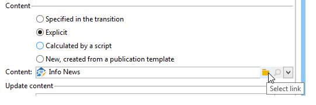
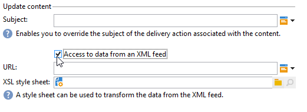

# Gestion de contenu{#content-management}

Une activité de type **Gestion de contenu** permet de créer et de manipuler un contenu ainsi que de générer les fichiers à partir de ce contenu. Ce contenu peut ensuite être diffusé à l&#39;aide d&#39;une activité de type &#39;Diffusion&#39;.

>[!CAUTION]
>
>La gestion de contenu est un module optionnel d&#39;Adobe Campaign. Vérifiez votre contrat de licence.

Les propriétés de l&#39;activité se divisent en trois étapes :

* **Sélection du contenu**: le contenu peut avoir été créé précédemment ou peut être créé depuis l&#39;activité.
* **Mise à jour du contenu**: la tâche peut modifier l&#39;objet du contenu ou importer tout le contenu XML.
* **Action**: le contenu résultant peut être enregistré ou généré.

   

   Le paramétrage et l&#39;utilisation de la gestion de contenu dans Adobe Campaign sont présentés dans cette  .

1. **Content**

   * **[!UICONTROL Spécifié par la transition]**

      Cette option permet d&#39;utiliser le contenu spécifié par la transition, c&#39;est-à-dire que l&#39;événement qui active la gestion de contenu doit contenir une variable **[!UICONTROL contentId]**. Cette variable peut avoir été définie par une gestion de contenu précédente ou par un script quelconque.

   * **[!UICONTROL Explicite]**

      Cette option permet de sélectionner un contenu déjà créé, à partir du champ **[!UICONTROL Contenu]**. Ce champ n&#39;est visible que lorsque l&#39;option **[!UICONTROL Explicite]** est sélectionnée.

      

   * **[!UICONTROL Calculé par un script]**

      L&#39;identifiant du contenu est calculé par un script. Le champ **[!UICONTROL Script]** permet de définir un template JavaScript évaluant l&#39;identifiant (la clé primaire) du contenu. Ce champ n&#39;est visible que lorsque l&#39;option **[!UICONTROL Calculé par un script]** est sélectionnée.

      

   * **[!UICONTROL Nouveau, créé depuis un modèle de publication]**

      Créer un nouveau contenu depuis un modèle de publication. Ce nouveau contenu sera enregistré dans le dossier indiqué dans le champ **[!UICONTROL Chaîne]**. Le champ **[!UICONTROL Modèle]** indique le modèle de publication à utiliser pour créer le contenu.

      

1. **Mettre à jour le contenu**

   * **[!UICONTROL Objet]**

      Ce champ permet de modifier l&#39;objet du contenu.

   * **[!UICONTROL Accès aux données provenant d&#39;un flux XML]**

      Cette option permet de construire le contenu à partir d&#39;un document XML téléchargé depuis un serveur Web et éventuellement de le transformer via une feuille de style XSL. Lorsque cette option est cochée, le champ **[!UICONTROL URL]** indique l&#39;URL de téléchargement du contenu XML. Le champ **[!UICONTROL Feuille de style XSL]** permet d&#39;indiquer la feuille de style à utiliser pour transformer le document XML téléchargé. Cette propriété est optionnelle.

      

1. **Action à effectuer**

   * **[!UICONTROL Enregistrer]**

      Cette option enregistre le contenu créé ou modifié.

      La transition sortante est activée une seule fois avec pour paramètre l&#39;identifiant du contenu enregistré dans la variable **[!UICONTROL contentId]**.

   * **[!UICONTROL Générer]**

      Cette option enregistre le contenu puis génère les fichiers de sortie pour chacun des modèles de transformation dont le type de publication est &#39;Fichier&#39;.

      

      La transition sortante est activée pour chacun des fichiers générés avec pour paramètre l&#39;identifiant du contenu enregistré dans la variable **[!UICONTROL contentId]** et le nom du fichier dans la variable **[!UICONTROL filename]**.

## Paramètres d&#39;entrée {#input-parameters}

* contentId

Identifiant du contenu à utiliser, si l&#39;option **[!UICONTROL Spécifié par la transition]** est activée.

## Paramètres de sortie {#output-parameters}

* contentId

   Identifiant du contenu.

* filename

   Nom complet du fichier généré, si l&#39;action sélectionnée est **[!UICONTROL Générer]**.

## Exemples     {#examples}

Des exemples sont fournis dans ce rapport .
