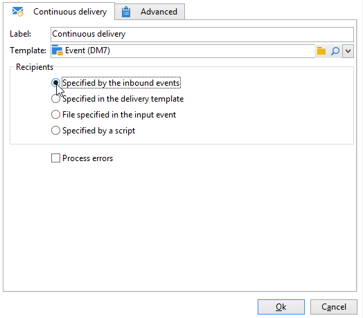
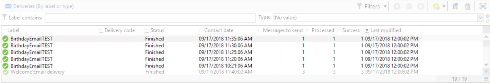

# Diffusion continue{#continuous-delivery}

L’activité de type **Diffusion continue** permet d’ajouter de nouvelles personnes destinataires à une diffusion existante. Ce type de diffusion évite d’avoir à créer une diffusion à chaque fois : ce mode est souvent plus efficace, plus particulièrement pour les alertes ou notifications à faible volume envoyées selon les besoins.

 [Découvrez cette fonctionnalité en vidéo](#continuous-delivery-video)

Au niveau du modèle de diffusion, vous pouvez spécifier un script pour calculer le libellé (et le dossier de campagne) de la diffusion associée. Si le script calcule une diffusion qui n’existe pas encore, elle est créée à la volée.

L’option **[!UICONTROL Traiter les erreurs]** affiche une transition particulière qui sera activée si une erreur est générée. Dans ce cas, le workflow ne passe pas en état d’erreur et son exécution se poursuit.

Les erreurs prises en compte sont les erreurs du système de fichiers (impossible de déplacer un fichier, impossible d&#39;accéder au répertoire, etc.).

Cette option ne traite pas les erreurs liées au paramétrage de l&#39;activité, c&#39;est-à-dire des valeurs invalides.

## Paramètres d&#39;entrée {#input-parameters}

* tableName
* schéma

Chacun des événements entrants doit spécifier une cible définie par ces paramètres.

Uniquement lorsque l&#39;action **[!UICONTROL Spécifiés par l&#39;événement entrant]** est sélectionnée.

## Paramètres de sortie {#output-parameters}

* tableName
* schéma
* recCount

Ce triplet de valeurs identifie la cible résultant de la diffusion à la volée. **[!UICONTROL tableName]** est le nom de la table qui enregistre les identifiants de la cible, **[!UICONTROL schema]** est le schéma de la population (habituellement nms:recipient) et **[!UICONTROL recCount]** est le nombre d’éléments dans la table.

La transition associée au complémentaire possède les mêmes paramètres.

## Comment configurer une diffusion au fil de l’eau

Cette section explique comment configurer une diffusion au fil de l’eau.

Une **diffusion au fil de l’eau** permet d&#39;ajouter de nouveaux destinataires à une diffusion existante, ce qui évite d&#39;avoir à créer une diffusion chaque fois qu’un nouveau destinataire est ajouté. Vous pouvez mettre à jour le contenu créatif directement dans le workflow de campagne et le modèle sera mis à jour dans le dossier Ressource du modèle de diffusion.

Une diffusion au fil de l’eau crée une diffusion et des logs de diffusion UNIQUES (broadLog) et des logs de tracking qui font référence à l&#39;ajout d&#39;une diffusion chaque fois qu&#39;elle s&#39;exécute.

## Tutoriel vidéo {#continuous-delivery-video}

Cette vidéo montre comment configurer une diffusion en continu avec une requête incrémentale.

>[!VIDEO](https://video.tv.adobe.com/v/25039?quality=12)

D’autres vidéos pratiques sur Campaign sont disponibles [ici](https://experienceleague.adobe.com/docs/campaign-learn/tutorials/getting-started/introduction-to-adobe-campaign.html?lang=fr){target="_blank"}.
