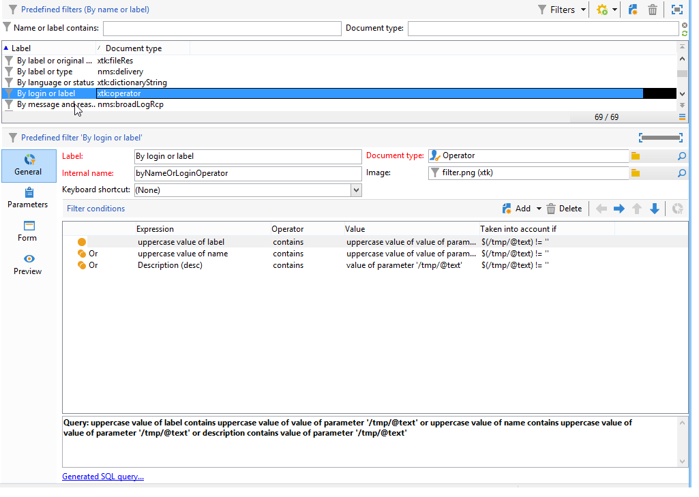
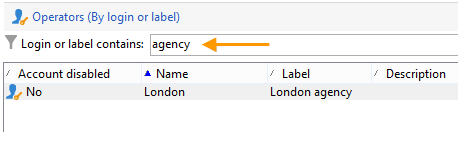

# Créer un filtre {#creating-a-filter}

Les filtres disponibles dans Adobe Campaign sont définis au travers de conditions de filtrage qui sont créées selon le même mode opératoire que les requêtes.

Le nœud **[!UICONTROL Administration > Paramétrage > Filtres prédéfinis]** contient tous les filtres utilisés dans les listes et vues d&#39;ensemble.

Par exemple, la liste des opérateurs peut être filtrée par **[!UICONTROL Compte actifs]** :

Le filtre correspondant contient la requête sur la valeur **[!UICONTROL Compte bloqué]** du schéma des **[!UICONTROL Opérateurs]** :

Pour la même liste, le filtre **[!UICONTROL Par login ou libellé]** permet de filtrer les données de la liste selon la valeur saisie dans le champ de filtrage :

Il est construit comme suit :

Pour correspondre aux critères de filtrage, le compte de l&#39;opérateur doit vérifier une des conditions suivantes :

* Son libellé contient les caractères renseignés dans le champ de saisie,
* Le nom de l&#39;opérateur contient les caractères renseignés dans le champ de saisie,
* Le contenu de la zone de description contient les caractères renseignés dans le champ de saisie.

>[!NOTE]
>
>La fonction **[!UICONTROL Upper]** permet de ne pas prendre en compte la casse des caractères (majuscules/minuscules).

La colonne **[!UICONTROL Pris en compte si]** permet de définir les critères d&#39;application de ces conditions de filtrage. Ici, les caractères **$(/tmp/@text)** représentent le contenu du champ de saisie associé au filtre :

Ici, **$(/tmp/@text)=&#39;agence&#39;**

L&#39;expression **$(/tmp/@text)!=&#39;&#39;** applique chaque condition lorsque le champ de saisie n&#39;est pas vide.
