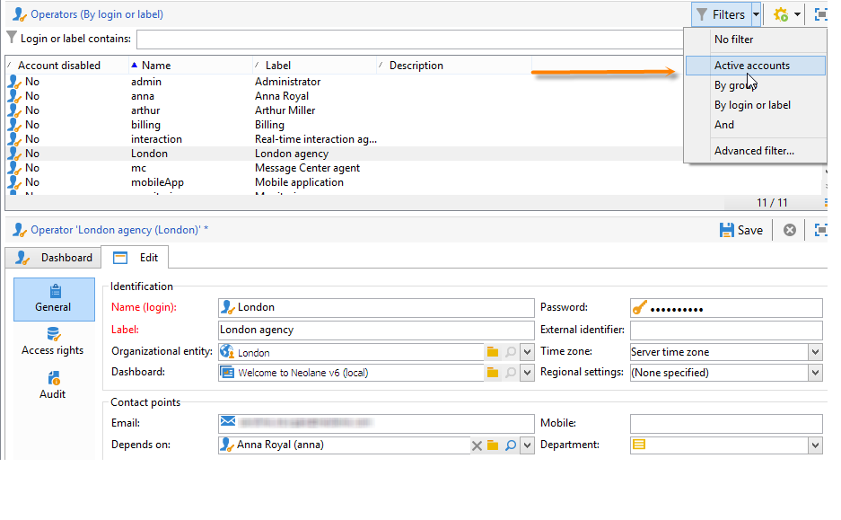

# Créer un filtre {#creating-a-filter}

Les filtres disponibles dans Adobe Campaign sont définis au travers de conditions de filtrage qui sont créées selon le même mode opératoire que lors de la création de requêtes dans le [Query editor](../../v8/start/query-editor.md).

Le nœud **[!UICONTROL Administration > Paramétrage > Filtres prédéfinis]** contient tous les filtres par défaut. Certaines d’entre elles sont utilisées dans les listes et les vues d’ensemble. En savoir plus sur les [filtres prédéfinis intégrés](../../v8/audiences/create-filters.md).

Par exemple, la liste des opérateurs peut être filtrée par **[!UICONTROL Compte actifs]** :

Le filtre correspondant contient la requête sur la valeur **[!UICONTROL Compte bloqué]** du schéma des **[!UICONTROL Opérateurs]** :

Pour la même liste, le filtre **[!UICONTROL Par login ou libellé]** permet de filtrer les données de la liste selon la valeur saisie dans le champ de filtrage :

Il est construit comme suit :

Pour correspondre aux critères de filtrage, le compte de l&#39;opérateur doit vérifier une des conditions suivantes :

* Son libellé contient les caractères renseignés dans le champ de saisie,
* Le nom de l&#39;opérateur contient les caractères renseignés dans le champ de saisie,
* Le contenu de la zone de description contient les caractères renseignés dans le champ de saisie.

>[!NOTE]
>
>La fonction **[!UICONTROL Upper]** permet de ne pas prendre en compte la casse des caractères (majuscules/minuscules).

La variable **[!UICONTROL Pris en compte si]** permet de définir les critères d&#39;application de ces conditions de filtrage. Ici, le **$(/tmp/@text)** les caractères représentent le contenu du champ de saisie associé au filtre :

Ici, **$(/tmp/@text)=&#39;agence&#39;**

L’expression **$(/tmp/@text)!=&#39;&#39;** applique chaque condition lorsque le champ d’entrée n’est pas vide.
