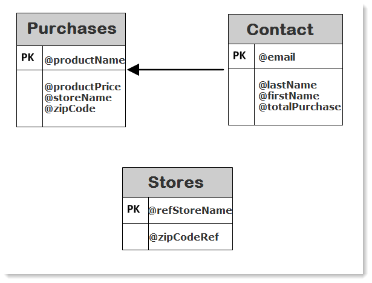
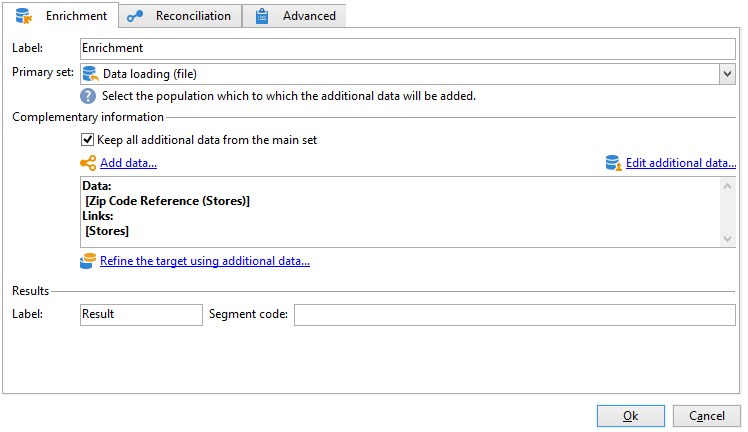
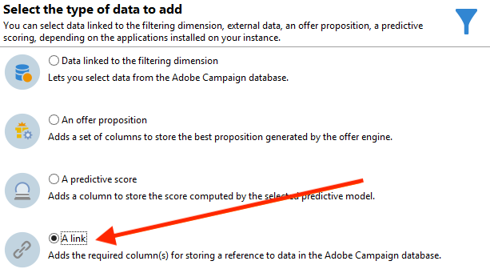
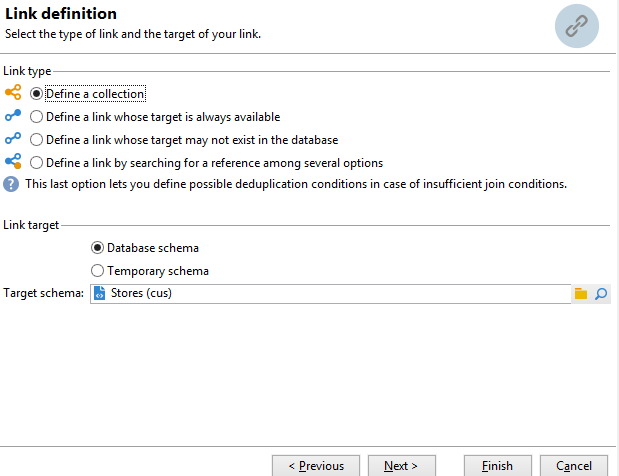
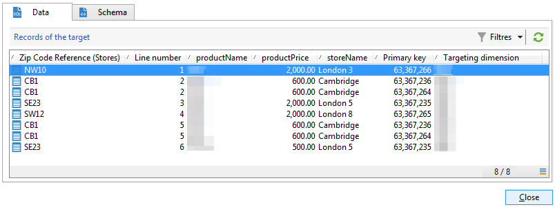
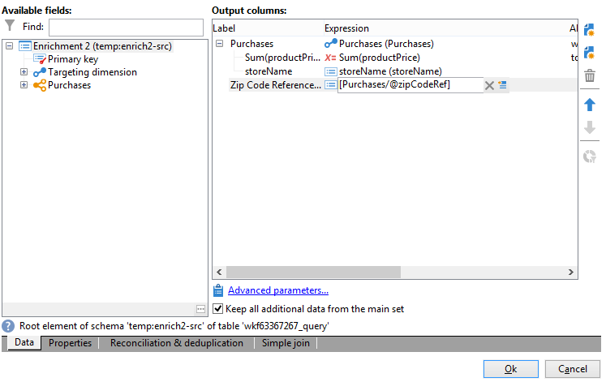

# Créer une liste récapitulative{#creating-a-summary-list}

Ce cas pratique détaille la création d&#39;un workflow permettant, à partir d&#39;une collecte de fichiers et suite à plusieurs enrichissements de données, de créer une liste récapitulative. L&#39;exemple est basé sur une liste de contacts ayant effectué des achats dans un magasin.


La structure de données suivante est utilisée :



Son objectif est le suivant :

* Utiliser les différentes options de l&#39;activité d&#39;enrichissement
* Mettre à jour des données en base suite à une réconciliation
* Créer une &quot;vue&quot; globale des données enrichies

Pour créer une liste récapitulative, vous devez procéder comme suit :

1. Collecter et charger un fichier &quot;Achats&quot; dans la table de travail du workflow
1. Enrichir les données importées en créant un lien vers une table de référence
1. Mettre à jour la table &quot;Achats&quot; avec les données enrichies
1. Enrichir les données &quot;Contacts&quot; avec un calcul d&#39;agrégat venant de la table &quot;Achats&quot;
1. Créer une liste récapitulative

## Étape 1 : Charger le fichier et réconcilier les données importées {#step-1--loading-the-file-and-reconciling-the-imported-data}

Les données à charger sont des données &quot;Achats&quot; de la forme suivante :

```
Product Name;Product price;Store
Computer;2000;London 3
Tablet;600;Cambridge
Computer;2000;London 5
Computer;2000;London 8
Tablet;600;Cambridge
Phone;500;London 5
```

Ces données sont contenues dans un fichier texte : &quot;Achats.txt&quot;.

1. Positionnez les activités **Collecteur de fichiers** et **Chargement(fichier)** dans le workflow.

   Le **Collecteur de fichiers** permet de collecter et d&#39;envoyer des fichiers sur le serveur Adobe Campaign.

   L&#39;activité **Chargement(fichier)** permet d&#39;alimenter la table de travail du workflow avec les données collectées.

   Pour plus d&#39;informations sur cette activité, referez-vous à la section  .

1. Configurez l’activité **Collecteur de fichiers** pour collecter des fichiers de type texte (&#42;.txt) dans le répertoire sélectionné.

   

   L&#39;activité **Collecteur de fichiers** permet de gérer l&#39;absence de fichier sur le répertoire source. Pour cela il faut cocher l&#39;option **[!UICONTROL Traiter l&#39;absence de fichier]**. Dans ce workflow, une activité **Attente** a été positionnée pour tenter une nouvelle collecte du fichier s&#39;il n&#39;est pas présent dans le répertoire mentionné.

1. Paramétrez l&#39;activité **Chargement (fichier)** en vous basant sur un fichier exemple ayant le même format que les données à importer.

   

   Cliquez sur le lien **[!UICONTROL Cliquez ici pour changer le format du fichier...]**, afin de renommer les colonnes avec les libellés et les noms internes de la table &quot;Achats&quot;.

   

Une fois les données importées, l&#39;enrichissement est effectué en créant un lien vers une table de référence correspondant au schéma &quot;Magasins&quot;.

Positionnez l&#39;activité d&#39;enrichissement puis configurez-la comme suit :

1. Sélectionnez l&#39;ensemble principal qui est constitué des données venant de l&#39;activité **Chargement (fichier)**.

   

1. Cliquez sur **[!UICONTROL Ajouter des données]** puis sélectionnez l&#39;option **[!UICONTROL Un lien]**.

   

1. Sélectionnez l&#39;option **[!UICONTROL Définir une collection]**.
1. Sélectionnez le schéma &quot;Magasins&quot; comme schéma cible.

   

Pour plus d&#39;informations sur les différents types de liens, voir la section [Enrichir/Modifier des données](targeting-workflows.md#enrich-and-modify-data).

Dans la fenêtre suivante, vous devez créer une condition de jointure en sélectionnant le champ source (dans l&#39;ensemble principal) et le champ cible (appartenant au schéma &quot;Magasins&quot;) afin de créer une réconciliation entre les données.


Suite à la création du lien, nous allons ajouter une colonne supplémentaire à la table de travail du workflow provenant du schéma &quot;Magasins&quot; : le champ &quot;ZipCode Reference&quot;.

1. Ouvrez l&#39;activité d&#39;enrichissement.
1. Cliquez sur **[!UICONTROL Editer les données additionnelles.]**
1. Ajoutez le champ &quot;Zip Code Reference&quot; dans les **[!UICONTROL Colonnes de sortie]**.


Les données de la table de travail du workflow après cet enrichissement sont les suivantes :



## Étape 2 : Écrire des données enrichies dans la table &#39;Achats&#39; {#step-2--writing-enriched-data-to-the--purchases--table}

Cette étape consiste à écrire dans la table &quot;Achats&quot; les données importées et enrichies. Une activité **Mise à jour de données** est nécessaire pour réaliser cette action.

Une réconciliation entre les données de la table de travail du workflow et la dimension de ciblage **Achats** doit être effectuée avant la mise à jour des données dans la table **Achats**.

1. Cliquez sur l&#39;onglet **[!UICONTROL Réconciliation]** de l&#39;activité d&#39;enrichissement.
1. Sélectionnez la dimension de ciblage, dans notre cas le schéma &quot;Achats&quot;.
1. Sélectionnez une &quot;expression source&quot; pour les données de la table du workflow (ici le champ &quot;NomMag&quot;).
1. Sélectionnez une &quot;expression destination&quot; pour les données de la table &quot;Achats&quot; (ici le champ &quot;NomMag&quot;).
1. Cochez l&#39;option **[!UICONTROL Conserver les données non rapprochées de la table de travail]**.


Dans l&#39;activité **Mise à jour de données**, la configuration suivante est nécessaire :

1. Sélectionnez l&#39;option **[!UICONTROL Ajouter ou mettre à jour]** dans le champ **[!UICONTROL Type d&#39;opération]** afin de ne pas créer de nouveaux enregistrements à chaque collecte du fichier.
1. Sélectionnez la valeur **[!UICONTROL En utilisant directement la dimension de ciblage]** pour l&#39;option **[!UICONTROL Identification des enregistrements]**.
1. Sélectionnez le schéma &quot;Achats&quot; comme **[!UICONTROL Type de document]**.
1. Indiquez à Adobe Campaign la liste des champs à mettre à jour. Dans la colonne **[!UICONTROL Destination]**, les champs du schéma &quot;Achats&quot; doivent être définis. La colonne **[!UICONTROL Expression]** permet de sélectionner les champs de la table de travail du workflow afin de réaliser un mapping.
1. Cliquez sur l&#39;option **[!UICONTROL Générer une transition sortante.]**


## Étape 3 : Enrichissement des données &#39;Contacts&#39; {#step-3--enriching--contact--data-}

Le schéma &quot;Contacts&quot; est relié par un lien physique au schéma &quot;Achats&quot;. Il est donc possible d&#39;utiliser une autre option de l&#39;activité &quot;Enrichissement&quot; : l&#39;ajout de données liées à la dimension de filtrage.

L&#39;objectif de ce deuxième enrichissement est de créer un agrégat sur le schéma des achats pour calculer le montant total des achats pour chaque contact identifié.

1. Positionnez une activité **Requête** permettant de récupérer l&#39;intégralité des **Contacts** stockés.
1. Positionnez une activité **Enrichissement** puis sélectionnez l&#39;ensemble principal résultant de la requête précédente.
1. Cliquez sur **[!UICONTROL Ajouter des données]**.
1. Cliquez sur l&#39;option **[!UICONTROL Données liées à la dimension de filtrage]**.
1. Cliquez sur **[!UICONTROL Données liées à la dimension de filtrage]** dans la fenêtre **[!UICONTROL Choix des données à ajouter]**.
1. Sélectionnez le noeud **[!UICONTROL Achats]** puis cliquez sur **[!UICONTROL Suivant]**.

   

1. Modifiez le champ **[!UICONTROL Données collectées]** en sélectionnant l&#39;option **[!UICONTROL Agrégats]**.

   

1. Cliquez sur **[!UICONTROL Suivant]**.
1. Ajoutez l&#39;expression suivante pour calculer la somme des achats pour chaque contact : &quot;Sum(@prixproduit)&quot;.

   

Pour préparer la liste récapitulative, il est nécessaire d&#39;ajouter des champs provenant du schéma &quot;Achats&quot; ainsi que du premier enrichissement : le champ &quot;ZipCode Reference&quot;.

1. Cliquez sur le lien **[!UICONTROL Éditer les données additionnelles...]** dans l&#39;activité d&#39;enrichissement.
1. Ajoutez les champs &quot;Achats / Nom Boutique&quot; et &quot;Achats / Zip Code Reference&quot;.

   

1. Cliquez sur l&#39;onglet **[!UICONTROL Propriétés]**.
1. Modifiez le deuxième lien pour ne créer qu&#39;une seule ligne.

## Étape 4 : Créer et alimenter une liste récapitulative {#step-4--creating-and-adding-to-a-summary-list}

La dernière étape consiste à écrire toutes les données enrichies dans une liste.

1. Placez une activité **Mise à jour de liste** dans le workflow. Cette activité doit être reliée à la transition sortante de la deuxième activité d&#39;enrichissement.
1. Sélectionnez l&#39;option **[!UICONTROL Créer la liste si besoin (Nom calculé)]**.
1. Sélectionnez une valeur pour le nom calculé. Le libellé choisi pour la liste est la date courante : &lt;%= formatDate(new Date(), &quot;%2D/%2M/%2Y&quot;) %>.

Une fois le workflow exécuté, la liste contient :

* une liste des contacts,
* une colonne &quot;Somme des achats&quot;,
* une colonne &quot;Nom de boutique&quot;,
* une colonne &quot;Zip Code reference&quot; remplie pour les magasins connus dans le schéma de référence des magasins.


