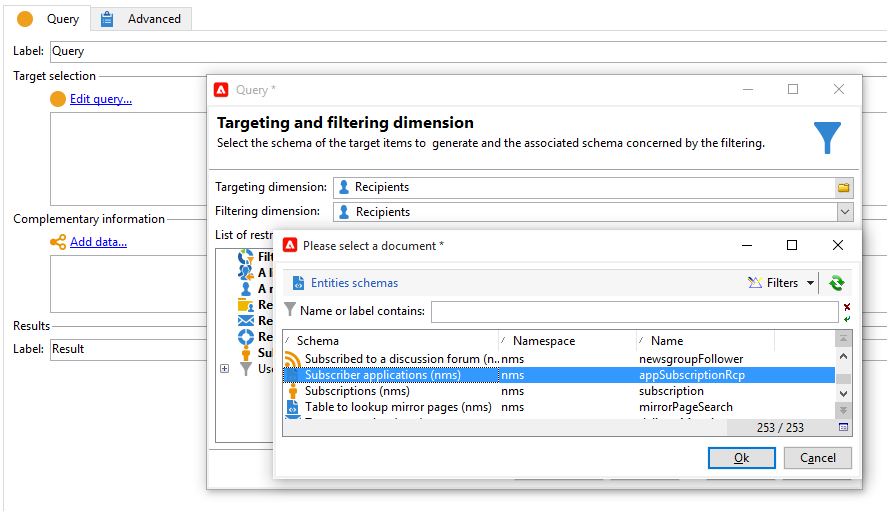
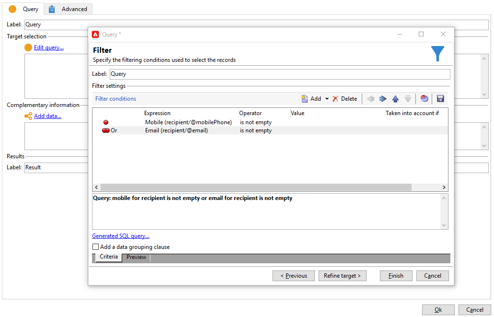
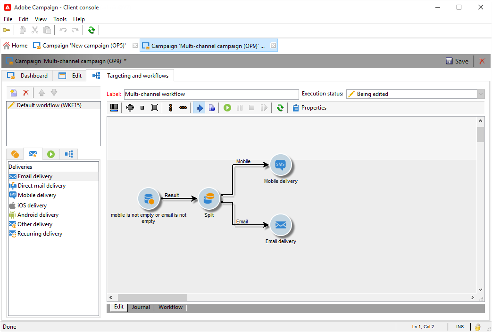
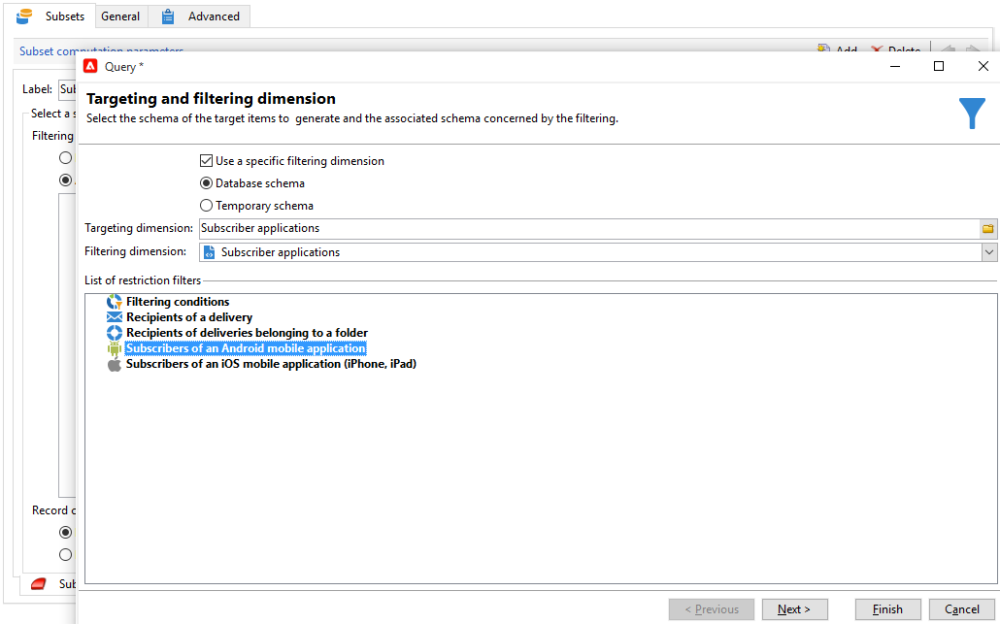
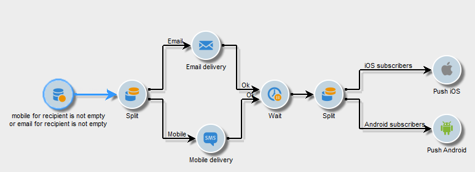

# Diffusions cross-canal{#cross-channel-deliveries}

Les diffusions cross-canal sont disponibles dans l&#39;onglet **[!UICONTROL Diffusions]** des activités d&#39;un [workflow de campagne](campaign-workflows.md).

Sélectionnez le modèle sur lequel vous souhaitez baser votre diffusion et définissez son contenu.

Vous pouvez définir la cible de votre diffusion en amont du workflow via les différentes activités de ciblages.

Dans l&#39;exemple ci-dessous, nous allons créer un workflow permettant d&#39;envoyer un e-mail ou un SMS aux abonnés aux notifications push, suivi d&#39;une notification push une semaine plus tard. Pour cela :

1. Créez une campagne.
1. Dans l&#39;onglet **[!UICONTROL Ciblage et workflows]** de votre campagne, ajoutez une activité **[!UICONTROL Requête]**.
1. Configurez votre requête : sélectionnez les destinataires abonnés aux notifications push comme dimension cible.

   >[!NOTE]
   >
   >Pour les notifications push, utilisez la dimension cible **applications abonnées**.

   

1. Ajoutez les conditions de filtre à votre requête. Ici, nous allons sélectionner les destinataires ayant un numéro de mobile ou une adresse e-mail.

   

1. Ajoutez une activité de **[!UICONTROL Partage]** à votre workflow pour diviser les destinataires ayant un numéro de mobile et ceux ayant une adresse email.
1. Dans l&#39;onglet **[!UICONTROL Diffusion]**, sélectionnez une diffusion pour chacune de vos cibles.

   Pour créer votre diffusion, procédez de la même manière qu’avec un assistant de diffusion classique en double-cliquant sur l’activité diffusion de votre workflow.

   

1. Pour éviter que les destinataires ne reçoivent trop de diffusion à la fois, ajoutez et configurez une activité **[!UICONTROL Attente]**.
1. Ajoutez une activité **[!UICONTROL Partage]** pour diviser les abonnés aux applications mobiles iOS ou Android.

   Sélectionnez un service pour chacun des systèmes d&#39;exploitation.

   

1. Sélectionnez et configurez une diffusion pour application mobile pour chacun des systèmes d’exploitation.

   
