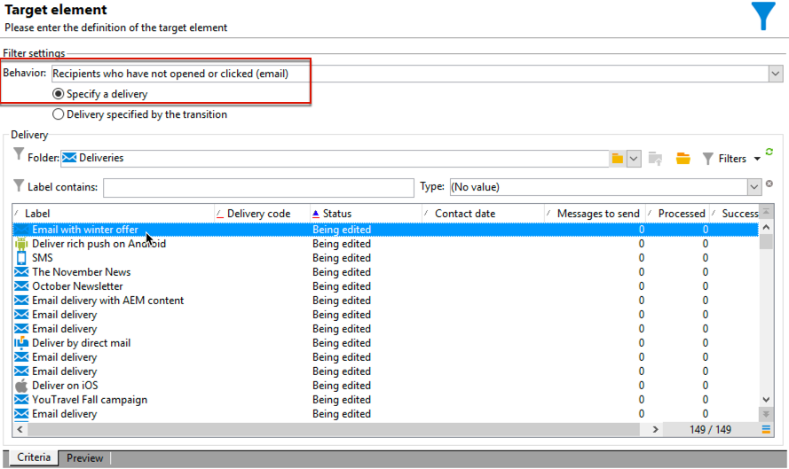

# Workflow de diffusion cross-canal{#cross-channel-delivery-workflow}

Ce cas pratique présente un exemple impliquant un workflow de diffusion cross-canal. Le concept général des diffusions cross-canal est présenté dans [cette section](cross-channel-deliveries.md).

L&#39;objectif est de segmenter une audience des destinataires de votre base de données en différents groupes dans le but d&#39;envoyer un email à un groupe et un SMS à un autre.

Les principales étapes d&#39;implémentation pour ce cas pratique sont les suivantes :

1. Création d&#39;une activité **[!UICONTROL Requête]** pour cibler votre audience
1. Création d&#39;une **[!UICONTROL diffusion Email]** contenant un lien vers une offre
1. Utilisation d&#39;une activité **[!UICONTROL Partage]** pour :

   * envoyer un autre email aux destinataires n&#39;ayant pas ouvert le premier email ;
   * envoyer un SMS aux destinataires ayant ouvert l&#39;email, mais n&#39;ayant pas cliqué sur le lien vers l&#39;offre ;
   * ajouter à la base de données les destinataires ayant ouvert l&#39;email et cliqué sur le lien.

## Étape 1 : créer l’audience {#step-1--build-the-audience}

Pour définir votre cible, créez une requête afin d&#39;identifier les destinataires.

1. Créez une campagne. En savoir plus sur [cette page](../campaigns/marketing-campaign-create.md).
1. Dans l&#39;onglet **[!UICONTROL Ciblages et workflows]** de la campagne, ajoutez une activité **Requête** à votre workflow. Pour plus d’informations sur cette activité, consultez [cette section](query.md).
1. Définissez les destinataires qui recevront vos diffusions. Par exemple, sélectionnez les membres &quot;Gold&quot; en tant que dimension cible.
1. Ajoutez des conditions de filtrage à votre requête. Dans cet exemple, sélectionnez les destinataires disposant d&#39;une adresse email et d&#39;un numéro de téléphone portable.

   

1. Enregistrez vos modifications.

## Étape 2 : créer un e-mail comprenant une offre {#step-2--create-an-email-including-an-offer}

1. Créez une diffusion e-mail.
1. Concevez le message et insérez un lien comprenant une offre dans le contenu.

   

   Pour plus d’informations sur l’intégration d’une offre dans le corps d’un message, consultez [cette page](../../v8/send/email.md).

1. Enregistrez vos modifications.
1. Cliquez avec le bouton droit sur l&#39;activité **[!UICONTROL Diffusion Email]** pour l&#39;ouvrir.
1. Sélectionnez l&#39;option **[!UICONTROL Générer une transition sortante]** pour récupérer la population et les logs de tracking.

   

   Vous pourrez ainsi utiliser ces informations pour envoyer une autre diffusion en fonction du comportement des destinataires lors de la réception du premier email.

1. Ajoutez une activité **[!UICONTROL Attente]** afin de laisser quelques jours aux destinataires pour ouvrir l&#39;email.

   

## Étape 3 : segmenter l’audience obtenue {#step-3--segment-the-resulting-audience}

Une fois votre cible identifiée et votre première diffusion créée, vous devez segmenter la cible en différentes populations à l&#39;aide de conditions de filtrage.

1. Ajoutez une activité **Partage** au workflow et ouvrez-la. Pour plus d’informations sur cette activité, consultez [cette section](split.md).
1. Créez trois segments à partir de la population calculée en amont dans la requête.

   

1. Pour le premier sous-ensemble, sélectionnez l&#39;option **[!UICONTROL Ajouter une condition de filtrage sur la population entrante]** et cliquez sur **[!UICONTROL Editer]**.

   

1. Sélectionnez **[!UICONTROL Destinataires d&#39;une diffusion]** en tant que filtre de restriction et cliquez sur **[!UICONTROL Suivant]**.

   

1. Dans les paramètres des filtres, sélectionnez **[!UICONTROL Les destinataires n&#39;ayant ni ouvert ni cliqué (email)]** dans la liste déroulante **[!UICONTROL Comportement]** et choisissez l&#39;email comprenant l&#39;offre à envoyer depuis la liste des destinataires. Cliquez sur **[!UICONTROL Terminer]**.

   

1. Procédez de la même manière pour le deuxième sous-ensemble et sélectionnez **[!UICONTROL Les destinataires n&#39;ayant pas cliqué (email)]** dans la liste déroulante **[!UICONTROL Comportement]**.

   

1. Pour le troisième sous-ensemble, après avoir sélectionné **[!UICONTROL Ajouter une condition de filtrage sur la population entrante]** et cliqué sur **[!UICONTROL Editer]**, sélectionnez l&#39;option **[!UICONTROL Utiliser une dimension de filtrage spécifique]**.
1. Sélectionnez **[!UICONTROL Log de tracking d&#39;un destinataire]** dans la liste déroulante **[!UICONTROL Dimension de filtrage]**, mettez en surbrillance **[!UICONTROL Critères de filtrage]** dans **[!UICONTROL Liste des filtres de restrictions]**, puis cliquez sur **[!UICONTROL Suivant]**.

   

1. Sélectionnez les conditions de filtres suivants :

   

1. Cliquez sur **[!UICONTROL Terminer]** pour enregistrer vos modifications.

## Étape 4 : finaliser le workflow {#step-4--finalize-the-workflow}

1. Ajoutez les activités adéquates à votre workflow après les trois sous-ensembles issus de l&#39;activité **[!UICONTROL Partage]** :

   * Ajoutez une activité **[!UICONTROL Diffusion Email]** pour envoyer un email de rappel au premier sous-ensemble.
   * Ajoutez une activité **[!UICONTROL Diffusion mobile]** pour envoyer un SMS au deuxième sous-ensemble.
   * Ajoutez une activité **[!UICONTROL Mise à jour des listes]** pour ajouter les destinataires correspondants à la base de données.

1. Double-cliquez sur les activités de diffusion de votre workflow pour les modifier.
1. Double-cliquez sur l’activité **[!UICONTROL Mise à jour des listes]** et sélectionnez l’option **[!UICONTROL Générer une transition sortante]**.
1. Cliquez sur le bouton **Démarrer** de la barre d&#39;actions pour exécuter le workflow.

La population ciblée par l&#39;activité **Requête** sera segmentée pour recevoir une diffusion email ou SMS selon le comportement des destinataires. La population restante sera ajoutée à la base de données à l&#39;aide de l&#39;activité **[!UICONTROL Mise à jour des listes]**.
