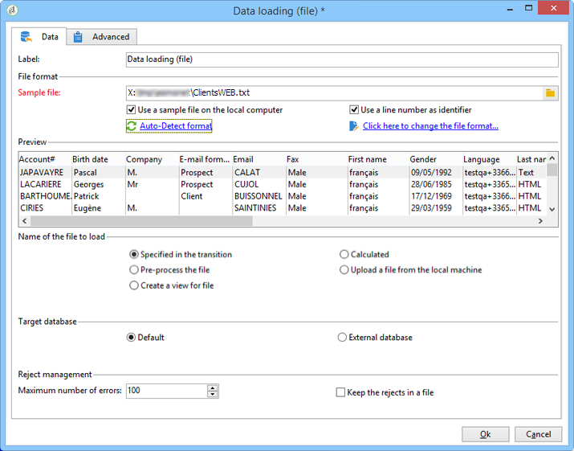
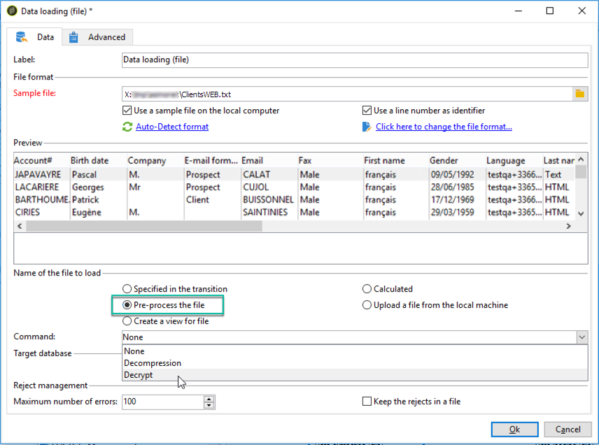
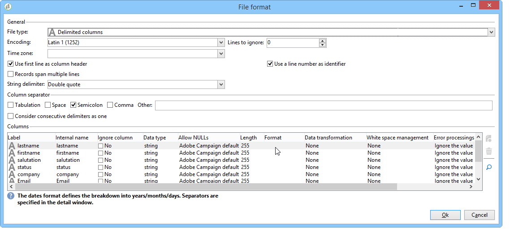
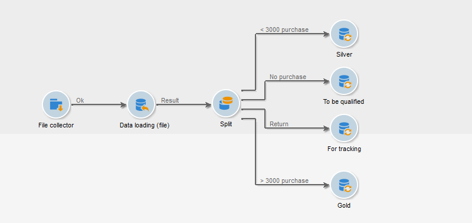
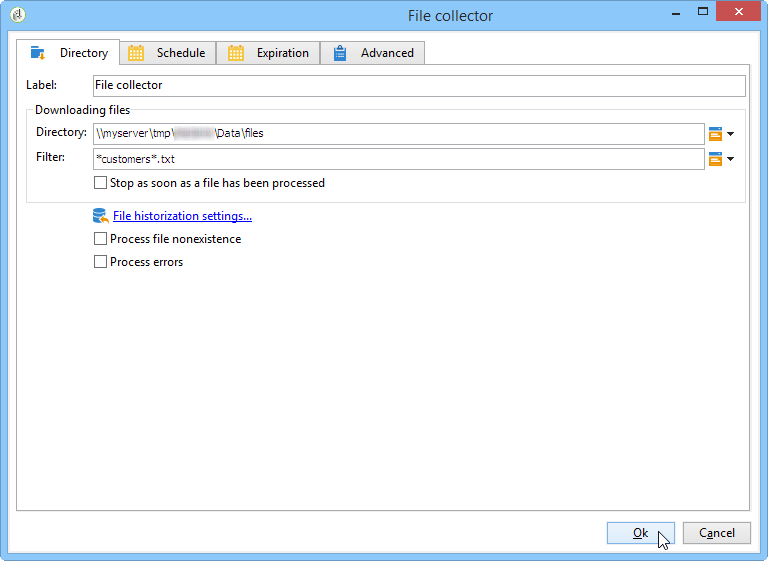
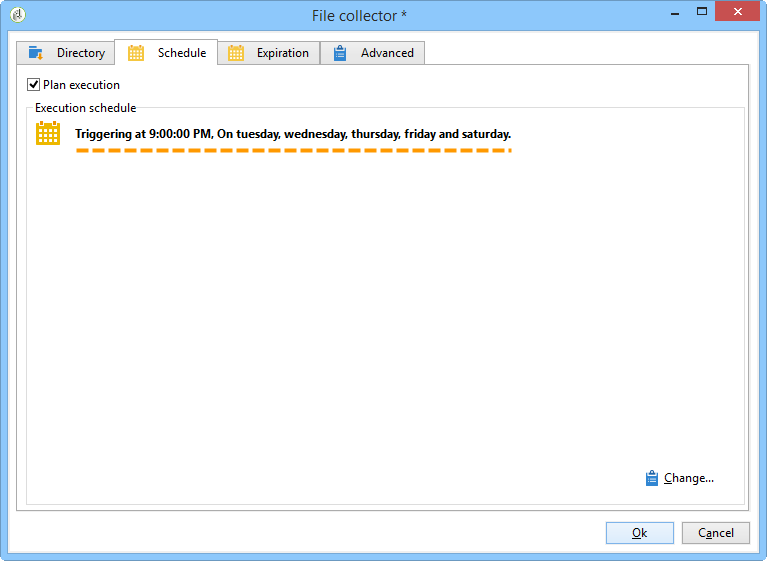
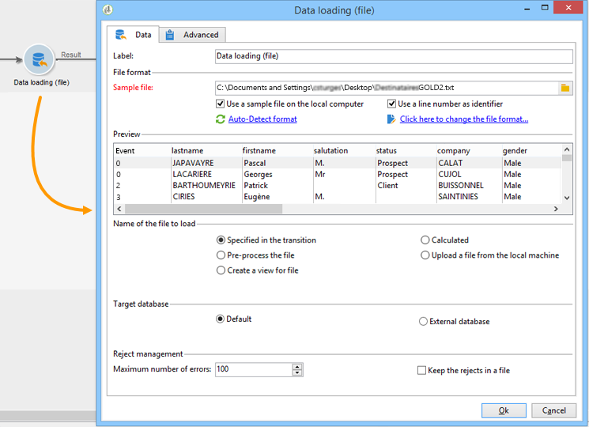
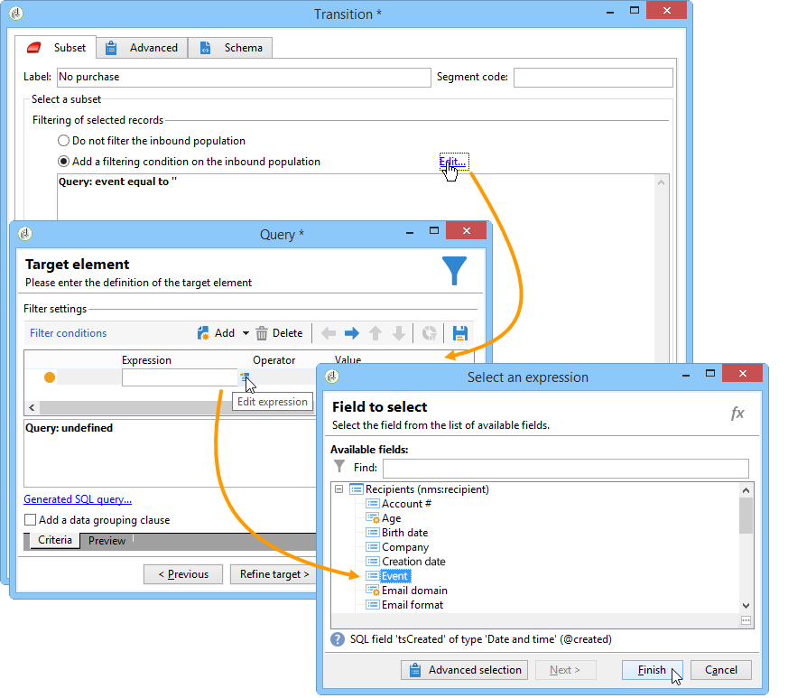
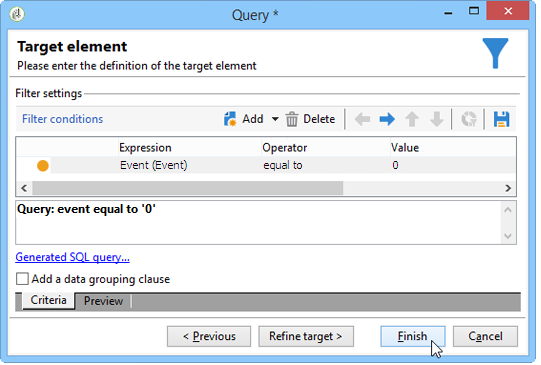
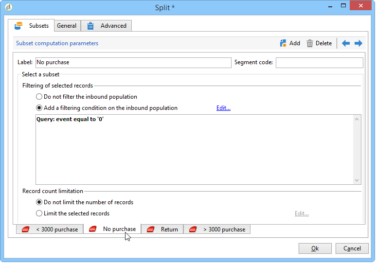

# Chargement (fichier){#data-loading-file}

## Utilisation {#use}

L’activité **[!UICONTROL Chargement (fichier)]** vous permet d’accéder directement à une source de données externes et de l’utiliser dans Adobe Campaign. En effet, toutes les données requises pour les opérations de ciblage ne se trouvent pas toujours dans la base de données Adobe Campaign : elles peuvent provenir de fichiers externes.

Le fichier à charger peut être spécifié par la transition ou calculé lors de l&#39;exécution de cette activité. Par exemple, il peut s’agir de la liste des 10 produits préférés d’un client dont les achats sont gérés dans une base de données externe.

La section supérieure de la fenêtre de configuration de cette activité permet de définir le format du fichier. Pour ce faire, utilisez un exemple de fichier ayant le même format que celui à importer. Ce fichier peut être stocké localement ou sur le serveur.

>[!CAUTION]
>
>Seuls les fichiers à structure « plate » sont pris en charge (formats .csv, .txt, etc.). Il n’est pas recommandé d’utiliser le format XML. Avec la console cliente, vous pouvez charger des fichiers jusqu’à une taille maximale de 150 Mo. Dans l’interface d’utilisation web, l’activité Chargement de fichier est limitée à 50 Mo. [En savoir plus](https://experienceleague.adobe.com/docs/campaign-web/v8/wf/design-workflows/load-file.html?lang=fr){target="_blank"}

Vous pouvez définir un pré-traitement à exécuter lors de l’import du fichier, par exemple pour ne pas avoir à décompresser le fichier sur le serveur (et donc réserver de la place pour le fichier décompressé), mais faire en sorte que la décompression soit incluse dans le traitement du fichier. Sélectionnez l’option **[!UICONTROL Inclure un pré-traitement du fichier]** et choisissez l’une des trois options suivantes : **[!UICONTROL Aucun]**, **[!UICONTROL Décompression]** (zcat) ou **[!UICONTROL Déchiffrer]** (gpg).

>[!IMPORTANT]
>
>Vous ne pouvez pas décompresser les fichiers compressés d’une taille supérieure à 4 Go.

## Définir le format du fichier {#defining-the-file-format}

Lorsque vous chargez un fichier, le format des colonnes est automatiquement détecté avec les paramètres par défaut pour chaque type de données. Vous pouvez modifier ces paramètres par défaut afin de spécifier des traitements particuliers à appliquer à vos données, notamment en cas d’erreur ou de valeur vide.

Pour cela, sélectionnez **[!UICONTROL Cliquez ici pour changer le format du fichier...]** dans la fenêtre principale de l&#39;activité **[!UICONTROL Chargement (fichier)]**. La fenêtre Détails du format s’ouvre alors.

Vous pouvez alors modifier le formatage général du fichier ainsi que le formatage de chaque colonne.

Le formatage général du fichier permet de définir la manière dont seront reconnues les colonnes (encodage du fichier, séparateurs utilisés, etc.)

Le formatage des colonnes permet de définir le traitement des valeurs de chaque colonne :

>[!NOTE]
>
>Vous pouvez ajouter autant de colonnes que vous le souhaitez. La longueur maximale des valeurs de chaque colonne est déterminée par le type de données choisi.

* **[!UICONTROL Ignorer la colonne]** : permet de ne pas traiter cette colonne lors du chargement des données.
* **[!UICONTROL Type de données]** : permet de spécifier le type de données attendu dans la colonne.
* **[!UICONTROL Utilisation des NULL]** : permet d&#39;indiquer comment gérer les valeurs vides.

   * **[!UICONTROL Défaut Adobe Campaign]** : génère une erreur pour les champs numériques uniquement, sinon insère la valeur NULL.
   * **[!UICONTROL Valeur vide autorisée]** : autorise les valeurs vides. La valeur NULL est alors insérée.
   * **[!UICONTROL Toujours renseignée]** : génère une erreur en cas de valeur vide.

* **[!UICONTROL Longueur]** : permet de spécifier le nombre maximal de caractères pour les données de type **chaîne**.
* **[!UICONTROL Format]** : permet de définir le format des heures et des dates.
* **[!UICONTROL Mise en forme]** : permet de définir si un traitement au niveau de la casse doit être appliqué sur une **chaîne**.

   * **[!UICONTROL Aucune]** : la chaîne importée n&#39;est pas modifiée.
   * **[!UICONTROL Première lettre en majuscule]** : la première lettre de chaque mot de la chaîne est passée en majuscule.
   * **[!UICONTROL Majuscules]** : tous les caractères de la chaîne sont passés en majuscule.
   * **[!UICONTROL Minuscules]** : tous les caractères de la chaîne sont passés en minuscule.

* **[!UICONTROL Gestion des espaces]** : permet d’indiquer si certains espaces doivent être ignorés dans une chaîne. La valeur **[!UICONTROL Ignorer les espaces]** permet d’ignorer les espaces au début et à la fin d’une chaîne seulement.
* **[!UICONTROL Traitements d&#39;erreur]** : permet de définir le comportement en cas d&#39;erreur.

   * **[!UICONTROL Ignorer la valeur]** : la valeur est ignorée. Un avertissement est généré dans le log d&#39;exécution du workflow.
   * **[!UICONTROL Rejeter la ligne]** : la ligne entière n&#39;est pas traitée.
   * **[!UICONTROL Utiliser une valeur par défaut en cas d&#39;erreur]** : remplace la valeur causant l&#39;erreur par une valeur par défaut, définie dans le champ **[!UICONTROL Valeur par défaut]**.
   * **[!UICONTROL Rejeter la ligne en l’absence de valeur de remapping]** : la ligne entière n’est pas traitée sauf si un mapping a été défini pour la valeur en erreur (voir l’option **[!UICONTROL Mapping]** ci-dessous).
   * **[!UICONTROL Utiliser une valeur par défaut en cas d’absence de remapping]** : remplace la valeur à l’origine de l’erreur par une valeur par défaut, définie dans le champ **[!UICONTROL Valeur par défaut]**, sauf si un mapping a été défini pour la valeur en erreur (voir l’option **[!UICONTROL Mapping]** ci-dessous).

* **[!UICONTROL Valeur par défaut]** : permet de spécifier la valeur par défaut en fonction du choix concernant le traitement des erreurs.
* **[!UICONTROL Mapping]** : ce champ n&#39;est disponible que dans la configuration des détails d&#39;une colonne (accessible via un double-clic ou via les options sur la droite de la liste des colonnes). Cela transforme certaines valeurs lors de l’importation. Par exemple, vous pouvez transformer « trois » en « 3 ».

## Exemple : collecter des données et les charger dans la base {#example--collecting-data-and-loading-it-in-the-database}

L&#39;exemple suivant permet de collecter un fichier sur le serveur tous les jours, de charger son contenu et de mettre à jour les données de la base en fonction des informations qu&#39;il contient. Le dossier à collecter contient des informations sur les clients qui ont pu effectuer des achats (pour plus ou moins de 3 000 euros), demander un remboursement sur un achat ou visiter la boutique sans rien acheter. En fonction de ces informations, divers processus seront appliqués à leur profil dans la base de données.

1. Le collecteur de fichier est utilisé pour récupérer les fichiers stockés dans un répertoire, selon la fréquence indiquée.

   L’onglet **[!UICONTROL Répertoire]** contient des informations sur le ou les fichiers à récupérer. Dans notre exemple, tous les fichiers au format texte dont les noms contiennent le mot « clients » et qui sont stockés dans le répertoire tmp/Adobe/Data/files du serveur seront récupérés.

   L’utilisation du **[!UICONTROL Collecteur de fichiers]** est détaillée dans la section [Collecteur de fichiers](file-collector.md).

   

   L&#39;onglet **[!UICONTROL Planning]** permet de planifier l&#39;exécution du collecteur, c&#39;est-à-dire d&#39;indiquer à quelle fréquence la présence de ces fichiers sera vérifiée.

   Ici, nous choisirons de déclencher le collecteur tous les jours ouvrés à 21 heures.

   

   Pour cela, cliquez sur le bouton **[!UICONTROL Changer...]** situé dans la section inférieure droite de l&#39;éditeur et paramétrez le planning.

   Pour plus d&#39;informations, consultez la section [Planificateur](scheduler.md).

1. Configurez ensuite l’activité Chargement (fichier) pour indiquer comment le(s) fichier(s) collecté(s) doit(doivent) être lu(s). Pour ce faire, sélectionnez un exemple de fichier ayant la même structure que les fichiers à charger.

   

   Ici, le fichier contient cinq colonnes :

   * la première colonne contient un code correspondant à l&#39;événement : achat (d&#39;un montant supérieur ou inférieur à 3000 euros), sans achat ou retour d&#39;un ou plusieurs articles.
   * les quatre colonnes suivantes contiennent le prénom, le nom, l&#39;email et le numéro de compte du client.

   La configuration du format du fichier à charger correspond à celle définie lors d’un import de données dans Adobe Campaign.

1. Dans l&#39;activité de partage, indiquez les sous-ensembles à créer, en fonction de la valeur de la colonne **Evénement**.

   Le fonctionnement de l&#39;activité de partage est présenté dans cette section.

   

   Pour chaque sous-ensemble, indiquez une des valeurs de la colonne **Evénement**.

   

   Ainsi, l&#39;activité de **[!UICONTROL Partage]** contiendra les informations suivantes :

   

1. Indiquez ensuite les traitements à effectuer pour chaque type de population. Dans notre exemple, nous allons **[!UICONTROL Mettre à jour les données]** dans la base de données. Pour ce faire, placez une activité **[!UICONTROL Mettre à jour les données]** à la fin de chaque transition sortante à partir de l’activité de partage.

   L&#39;activité **[!UICONTROL Mettre à jour les données]** est présentée dans la section [Mettre à jour les données](update-data.md).
