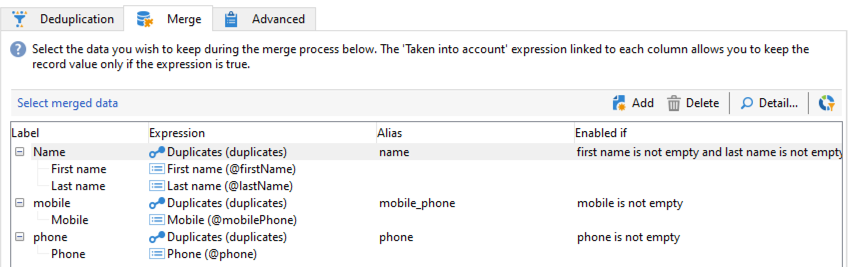

# Utiliser la fonctionnalité de fusion de l’activité de déduplication {#deduplication-merge}

## À propos de ce cas d&#39;utilisation {#about-this-use-case}

Ce cas d’utilisation décrit l’utilisation de la fonctionnalité **[!UICONTROL Fusion]** dans l’activité **[!UICONTROL Déduplication]**.

Pour plus d’informations sur cette fonctionnalité, consultez [cette section](deduplication.md#merging-fields-into-single-record).

L&#39;activité **[!UICONTROL Déduplication]** est utilisée pour supprimer des lignes en double d&#39;un jeu de données. Dans ce cas pratique, les données présentées ci-dessous sont dupliquées en fonction du champ Email.

| Date de la dernière modification | Prénom | Nom | Email | Téléphone mobile | Phone |
|-----|------------|-----------|-------|--------------|------|
| 5/19/2020 | Robert | Tisner | bob@mycompany.com | 444-444-444 | 777-777-7777 |
| 7/22/2020 | Bobby | Tisner | bob@mycompany.com | | 777-777-7777 |
| 10/03/2020 | Bob |  | bob@mycompany.com | | 888-888-8888 |

Avec la fonctionnalité **[!UICONTROL Fusion]** de l&#39;activité Déduplication, vous pouvez configurer un jeu de règles pour que la déduplication définisse un groupe de champs à fusionner dans un seul enregistrement de données obtenu. Par exemple, avec un ensemble d’enregistrements en doublon, vous pouvez choisir de conserver le numéro de téléphone le plus ancien ou le nom le plus récent.

## Activation de la fonctionnalité Fusion {#activating-merge}

Pour activer la fonctionnalité de fusion, vous devez d&#39;abord configurer l&#39;activité **[!UICONTROL Déduplication]**. Pour ce faire, procédez comme suit :

1. Ouvrez l’activité, puis cliquez sur le lien **[Editer la configuration]**.

1. Sélectionnez le champ de réconciliation à utiliser pour la déduplication, puis cliquez sur **[!UICONTROL Suivant]**. Dans cet exemple, nous voulons dédupliquer en fonction du champ de l&#39;email.

   

1. Cliquez sur le lien **[!UICONTROL Paramètres avancés]**, puis activez les options **[!UICONTROL Fusionner les enregistrements]** et **[!UICONTROL Utiliser plusieurs critères de fusion des enregistrements]**.

   

1. L&#39;onglet **[!UICONTROL Fusion]** est ajouté à l&#39;écran de configuration de **[!UICONTROL Déduplication]**. Cet onglet permet de spécifier les données à fusionner lors de l&#39;exécution de la déduplication.

## Configuration des champs à fusionner {#configuring-rules}

Voici les règles à utiliser pour fusionner les données en un seul enregistrement :

* Conserver le nom le plus récent (champs de prénom et de nom),
* Conserver le téléphone portable le plus récent,
* Conserver le numéro de téléphone le plus ancien,
* Tous les champs d’un groupe doivent être non nuls pour être éligibles à l’enregistrement final.

Pour configurer ces règles, procédez comme suit :

1. Ouvrez l&#39;onglet **[!UICONTROL Fusion]**, puis cliquez sur le bouton **[!UICONTROL Ajouter]**.

   

1. Indiquez l&#39;identifiant et le libellé du groupe de champs à fusionner.

   

1. Indiquez les conditions de sélection des enregistrements à prendre en compte.

   

1. Triez la date de la dernière modification afin de sélectionner le nom le plus récent.

   

1. Sélectionnez les champs à fusionner. Dans cet exemple, nous voulons conserver les champs de prénom et de nom.

   

1. Les champs sont ajoutés au jeu de données à fusionner et un nouvel élément est ajouté au schéma de workflow.

   Répétez ces étapes pour configurer les champs de téléphone et de téléphone mobile.

   

   

## Résultats {#results}

Après avoir configuré ces règles, les données suivantes sont reçues à la fin de l&#39;activité **[!UICONTROL Déduplication]**.

| Date de modification | Prénom | Nom | Email | Téléphone mobile | Phone |
|-----|------------|-----------|-------|--------------|------|
| 5/19/2020 | Robert | Tisner | bob@mycompany.com | 444-444-444 | 777-777-7777 |
| 7/22/2020 | Bobby | Tisner | bob@mycompany.com | | 777-777-7777 |
| 10/03/2020 | Bob |  | bob@mycompany.com | | 888-888-8888 |

Le résultat est fusionné à partir des trois enregistrements selon les règles configurées précédemment. Après comparaison, il est conclu que le nom et le téléphone mobile les plus récents sont utilisés, ainsi que le numéro de téléphone original.

| Prénom | Nom | Email | Téléphone mobile | Phone |
|------------|-----------|-------|--------------|------|
| Bobby | Tisner | bob@mycompany.com | 444-444-4444 | 888-888-8888 |

>[!NOTE]
>
> Notez que le prénom qui a été fusionné est &quot;Bobby&quot;, car nous avons configuré une règle &quot;Nom&quot; composée à la fois du prénom et des derniers champs.
>
>Par conséquent, &quot;Bob&quot; (prénom le plus récent) n’a pas pu être pris en compte car le champ de nom associé était vide. La combinaison la plus récente de prénom et nom a été fusionnée dans l’enregistrement final.
