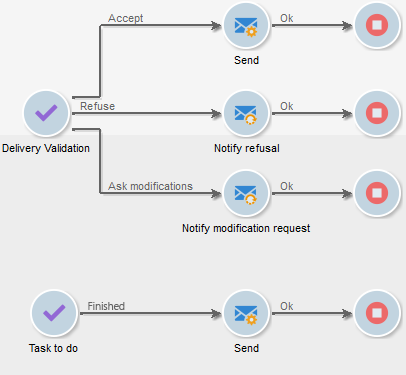
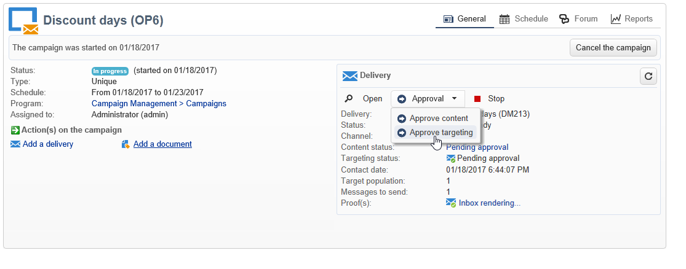
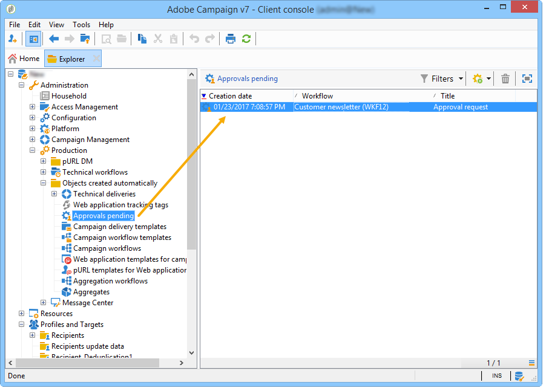
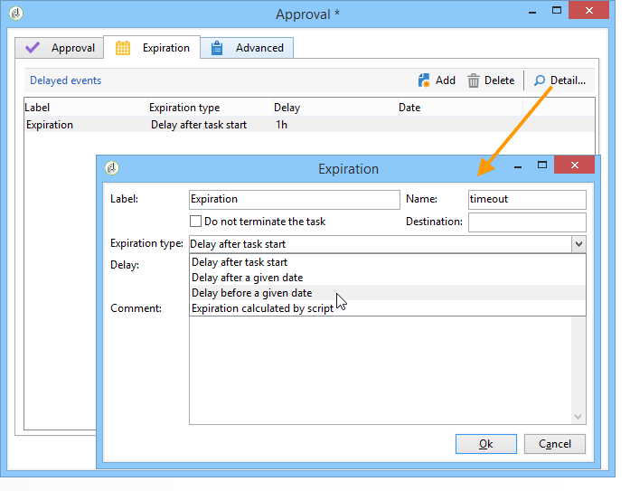

# Définition des validations {#defining-approvals}


Les validations permettent à des opérateurs de prendre des décisions à certaines étapes d&#39;un workflow ou de confirmer la poursuite d&#39;un traitement.

Un message est envoyé à un groupe d’opérateurs et le workflow attend une réponse avant de reprendre. Le workflow n’est pas arrêté et d’autres opérations peuvent avoir lieu. Par exemple, plusieurs approbations simultanées peuvent être en attente.

Une validation peut comporter plusieurs options au choix de l&#39;opérateur. Cependant, il est possible de limiter le nombre de choix à un seul afin de soumettre une tâche à effectuer à un opérateur ou une opératrice, comme effectuer un ciblage. L&#39;opérateur peut alors répondre une fois la tâche effectuée (puis le processus reprend). L’exemple suivant illustre ces types de validations :



Dans les opérations, toutes les étapes qui nécessitent une validation fonctionnent sur le même principe.



Pour répondre, l’opérateur dispose de deux modes : valider via la page web dont l’URL est fournie dans l’e-mail envoyé, ou valider directement depuis la console.

>[!NOTE]
>
>Une fois la réponse enregistrée, elle ne peut plus être modifiée.

## Validations par e-mail {#sending-emails}

Il est possible de recevoir un message de validation contenant un lien vers une page Web à partir de laquelle il est possible de répondre. Pour que l’opérateur ciblé puisse recevoir un e-mail de validation, son adresse e-mail doit être renseignée. Si ce n’est pas le cas, l’opérateur doit utiliser la console pour répondre.

Les e-mails de validation sont envoyés en continu. Le modèle de diffusion par défaut est **[!UICONTROL notifyAssignee]** : il est enregistré dans le dossier **[!UICONTROL Administration > Gestion de campagne > Modèles des diffusions techniques]**. Ce scénario peut être personnalisé. Il est également recommandé de faire une copie et de modifier les modèles pour chaque activité.

Les diffusions créées depuis ce modèle sont stockées dans le dossier **[!UICONTROL Administration > Exploitation > Objets créés automatiquement > Diffusions techniques > Notifications de workflow]**.

## Validation depuis la console {#approval-via-the-console}

Dans les opérations, les éléments à valider sont affichés dans le tableau de bord de l&#39;opération.

Pour les workflows techniques, les tâches que l&#39;utilisateur peut valider sont accessibles depuis l&#39;arborescence en sélectionnant le dossier **[!UICONTROL Administration > Exploitation > Objets créés automatiquement > Validations en attente]**.



## Groupes {#groups}

Une validation est assignée à un groupe d&#39;opérateurs, un opérateur unique ou un ensemble d&#39;opérateurs sélectionnés au travers d&#39;une condition de filtrage.

1. Pour la forme la plus simple de validation, la tâche est terminée dès qu&#39;un opérateur répond. Tout autre exploitant qui tente de répondre sera avisé que quelqu&#39;un l&#39;a déjà fait.
1. Pour les validations multiples, voir la section [Validation multiple](#multiple-approval).

Les groupes d&#39;opérateurs pour les approbations devraient être désignés comme des rôles ou des fonctions plutôt que comme des personnes nommées. Par exemple, un groupe « Budget de campagne » est préférable au « Groupe de Harry ». Nous vous recommandons d&#39;avoir au moins deux personnes dans un groupe qui peuvent approuver une tâche. De cette façon, si l&#39;un est absent, l&#39;autre peut répondre.

## Expirations {#expirations}

Les expirations sont des transitions spécifiques utilisées dans différents types d&#39;activité, et en particulier dans les validations. Vous pouvez utiliser une expiration pour déclencher une action après un certain temps sans réponse. Les expirations peuvent également être utilisées, par exemple, pour continuer le workflow et affecter une validation à un autre groupe.

Le deuxième onglet des propriétés de validation de l&#39;activité permet de définir une ou plusieurs expirations. En fait, vous pouvez définir plusieurs types d’expiration.



Pour ajouter une nouvelle expiration, cliquez sur **[!UICONTROL Ajouter]**. Une transition est ajoutée à chacune des expirations créées. Vous pouvez ainsi :

* soit modifier les paramètres usuels directement depuis la liste en cliquant sur une cellule (ou en appuyant sur la touche F2),
* soit éditer l&#39;expiration en cliquant sur le bouton **[!UICONTROL Détail...]**.

>[!NOTE]
>
>Il n&#39;est pas nécessaire d&#39;ordonner les expirations, elles seront traitées par ordre chronologique.

L’option **[!UICONTROL Ne pas terminer la tâche]** laisse la validation active une fois le délai expiré. Ce mode permet de gérer les rappels tout en laissant la validation active : les opérateurs peuvent toujours répondre. Cette option est désactivée par défaut, ce qui signifie que la tâche est considérée comme terminée à l’expiration et que les opérateurs ne peuvent plus répondre.

Vous pouvez créer quatre types d&#39;expirations :

* **Délai après le début de la tâche**: l&#39;expiration est calculée en ajoutant une durée que vous spécifiez à la date d&#39;activation de la validation.
* **Délai après une date donnée** : l&#39;expiration est calculée en ajoutant une durée à une date que vous spécifiez.
* **Délai avant une date donnée** : l&#39;expiration est calculée en soustrayant une durée à une date que vous spécifiez.
* **Expiration calculée par script** : l&#39;expiration est calculée à partir d&#39;un script JavaScript.

  L&#39;exemple suivant calcule une expiration 24 heures avant la date de démarrage d&#39;une diffusion (identifiée par **vars.deliveryId**) :

  ```
  var delivery = nms.delivery.get(vars.deliveryId)
  var expiration = delivery.scheduling.contactDate
  var oneDay = 1000*60*60*24
  expiration.setTime(expiration.getTime() - oneDay)
  return expiration
  ```

## Validation multiple {#multiple-approval}

La validation multiple est un mécanisme qui permet à tous les opérateurs de validation de répondre. Une transition est activée pour chaque réponse.

Les validations multiples sont utiles pour les mécanismes de vote ou d&#39;enquête. Vous pouvez comptabiliser les réponses et traiter leur résultat après une période donnée en ajoutant une date limite.

## Droits requis {#required-rights}

Les opérateurs d&#39;un groupe doivent avoir au minimum les droits suivants pour répondre à une demande de validation :

* Droit en lecture sur le workflow.
* Droit en lecture et en écriture sur le dossier des tâches à valider.

Le groupe &#39;Exécution du workflow&#39; dispose de ces droits. Un opérateur ajouté à ce groupe a les droits de répondre à une demande de validation.
